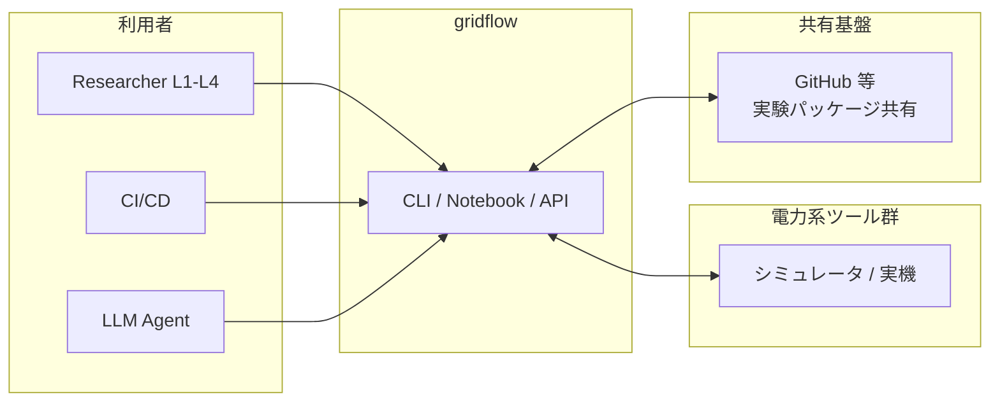
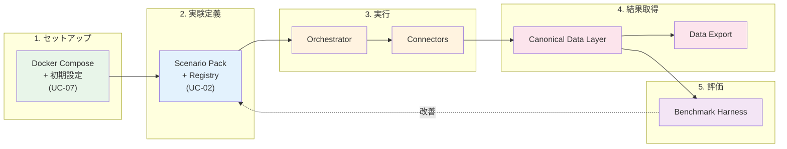
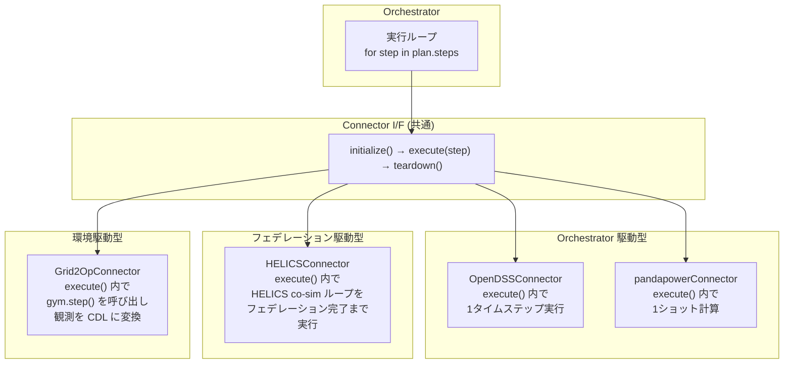
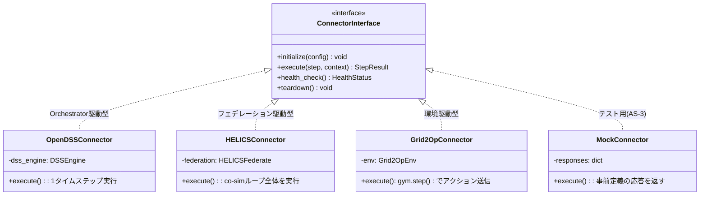

# 3. 静的ビュー

## 3.1 ブロック図（システムコンテキスト・サブシステム分割）

### 3.1.1 システムコンテキスト図

gridflow を一つの箱として見たとき、外から何がつながるかを示す。



gridflow は 3 種類のアクターから CLI/Notebook/API 経由で操作される。外部の電力系ツール群（シミュレータおよび将来の実機）とは Connector を介して双方向にやりとりする。

---

### 3.1.2 概念アーキテクチャ — E2E 研究ループとの対応

#### gridflow が解決する問題

電力系研究の現場では、理論よりも先に以下の実験運用コストが重い:

- 環境構築（ツールのインストール・設定）
- ツール間のデータ変換
- 実験条件の再現性崩壊（卒業とともに実験が失われる）
- 比較評価の不統一
- 結果整理の手作業

gridflow はこれらの運用コストを圧縮する。そのために、研究の一連の流れ（E2E 研究ループ）に対応するコンポーネントを提供する。

#### Scenario Pack — gridflow の中心概念

gridflow の設計は **Scenario Pack** という概念を中心に組み立てられている。

**Scenario Pack とは:** 実験 1 件を丸ごとパッケージ化したもの。以下を含む:

- **対象ネットワーク** — どの系統で実験するか（IEEE 13バス等）
- **時系列データ** — 負荷プロファイル、PV 出力パターン等
- **実行対象設定** — どのツール（OpenDSS, pandapower 等）をどう使うか
- **評価指標** — 何を測るか（電圧逸脱率、ENS、CO2 等）
- **乱数 seed** — 再現性の保証
- **期待出力** — 回帰テスト用の正解データ

**なぜ Scenario Pack が必要か:**

- 実験が「コード + 手作業」ではなく「パッケージ」になることで、**再現性が制度として保証される**
- パッケージ化されているので、**共同研究者への受け渡し**が容易になる
- パラメータを変えるだけで新しい実験バリアントが作れるので、**比較実験のイテレーションが速い**

#### E2E 研究ループとコンポーネントの対応

**E2E 研究ループ:**
```
1. 環境セットアップ → 2. 実験定義 → 3. 実行 → 4. 結果取得 → 5. 評価 → 6. 改善 → (2 に戻る)
```

**gridflow コンポーネントとの対応:**



| ループステップ | gridflow コンポーネント | 主な責務 |
|---|---|---|
| 1. セットアップ | Docker Compose + 初期設定 | `docker compose up` で環境構築。< 30 分（QA-1） |
| 2. 実験定義 | **Scenario Pack + Registry** | 実験をパッケージとして定義・登録・バージョン管理 |
| 3. 実行 | **Orchestrator + Connectors** | Scenario Pack に基づき、外部ツールを統合実行 |
| 4. 結果取得 | **Canonical Data Layer + Export** | ツール非依存の共通データ形式で結果を格納・出力 |
| 5. 評価 | **Benchmark Harness** | 定量的評価指標で採点・複数実験を比較 |
| 6. 改善 | Scenario Pack の変更 → 再実行 | パラメータ変更（L1）またはアルゴリズム変更（L2+） |

> **設計判断:** gridflow は研究ループの「2〜5」を自動化し、「6→2」のイテレーションを高速にする。ループの外側（1. セットアップ）は Docker に委任し、gridflow 自身は環境に依存しない。これにより QA-7（ポータビリティ）を実現する。

このコンポーネント群の間に流れるのは 2 種類の情報である:

- **制御フロー** — ユーザー操作 → Orchestrator → Connector の指示系統
- **データフロー** — Connector → CDL → Benchmark → Export の結果系統

この 2 つの流れが交差しないよう分離することが、Clean Architecture（AS-2）の核心である。

---

### 3.1.3 外部システム分析と Connector 設計判断

3.1.2 の「3. 実行」で Connector が外部ツールとやりとりすると述べた。ここでは各ツールの特性を分析し、**なぜ単一の Connector インターフェースで統一できるのか**を示す。

#### 外部ツールの特性分析

| ツール | 役割 | 計算モデル | 入力 | 出力 | 時間の扱い |
|---|---|---|---|---|---|
| **OpenDSS** | 配電系統解析 | 1 系統の潮流計算・準定常時系列 | ネットワーク定義 + 負荷/DER プロファイル | 電圧・電流・潮流結果 | 離散タイムステップ（Orchestrator が制御） |
| **pandapower** | 潮流計算（軽量） | スクリプト言語ベースの定常計算 | ネットワーク + 負荷 | 電圧・潮流 | ステップなし（1 ショット） |
| **HELICS** | co-simulation 連成 | 複数シミュレータの時間同期フェデレーション | フェデレーション設定 + 各シミュレータの入出力 | 連成結果 | HELICS 自身が時間管理 |
| **Grid2Op** | 逐次運用 RL 環境 | gym-like step API | アクション（開閉器操作等） | 観測 + 報酬 | ステップ駆動（gym 的） |
| **実機 SCADA** | 実系統制御（将来） | リアルタイム計測/制御 | 制御指令 | 計測データ | リアルタイム |

#### 共通性の発見

一見異なるが、全ツールに共通する操作パターンがある:

```
1. 初期化（接続確立・設定ロード）
2. ステップ実行（入力を渡して結果を受け取る）
3. 終了処理（接続切断・リソース解放）
```

相違点は **ステップ実行の粒度と時間管理の主体** である:

| パターン | 時間管理の主体 | 該当ツール |
|---|---|---|
| **Orchestrator 駆動** | Orchestrator がタイムステップを制御し、Connector に 1 ステップ分の実行を指示 | OpenDSS, pandapower |
| **フェデレーション駆動** | 外部の時間同期機構（HELICS）が複数 Connector を協調制御 | HELICS |
| **環境駆動** | 外部環境（Grid2Op, 実機）がステップを刻み、Connector はアクションを送って観測を受け取る | Grid2Op, 実機 SCADA |

#### 設計判断: Connector インターフェースの統一

**判断:** 時間管理の違いは Connector 実装の内部で吸収し、Orchestrator から見た Connector インターフェースは統一する。

**代替案と比較:**

| 案 | 内容 | 長所 | 短所 |
|---|---|---|---|
| **A. ツールごとに個別 I/F** | OpenDSS 用、HELICS 用、Grid2Op 用に別々のインターフェース | ツール固有の最適化が可能 | Orchestrator が全 I/F を知る必要あり。ツール追加のたびに Orchestrator を変更 |
| **B. 統一 I/F（採用）** | 全 Connector が `initialize → execute → teardown` の共通 I/F を実装 | Orchestrator は I/F だけ知ればよい。ツール追加が Connector 実装の追加だけで完結 | 個別最適化が制限される可能性 |
| **C. 抽象レイヤー + 特殊化** | 共通 I/F + ツール固有の拡張メソッド | 両方のメリット | 複雑。CON-3（1人+AI 開発）に合わない |

**B を選んだ理由:**
1. AS-4（シミュレータと実系統の非区別）が自然に実現される
2. AS-2（DI）によりテスト時のモック差替えが容易（AS-3: TDD）
3. AC-1（Wrapper → Hybrid → Full）の段階移行で、Connector を入れ替えるだけで済む
4. CON-3（1人+AI 開発）で複雑な抽象化を維持するコストが高い

**時間管理の違いへの対処:**



> 時間管理の違いは `execute()` の**内部実装**で吸収される。Orchestrator は「ステップを渡して結果を受け取る」だけであり、その内側で何が起きているかを知る必要がない。

---

### 3.1.4 サブシステム分割 — Clean Architecture レイヤーへのマッピング

3.1.2 で示した概念コンポーネントを、AS-2（Clean Architecture）の依存方向規則に従って 4 層に配置する。

**設計判断:** なぜ Clean Architecture か?

| 案 | 内容 | 判定 |
|---|---|---|
| レイヤードアーキテクチャ（従来型） | UI → Business → Data の 3 層 | Data 層への依存がドメインロジックに侵入する。Connector 差替えが困難 |
| **Clean Architecture（採用）** | 依存方向を内側に統一。外側は交換可能 | Connector・DB・UI を自由に差替え可能。AS-4、AC-1 と整合 |
| マイクロサービス | 各コンポーネントを独立サービス化 | CON-3（1人+AI 開発）に合わない。過剰な複雑さ |

**4 層構造と 3.1.2 コンポーネントの対応:**

```
┌─────────────────────────────────────────────────────────────────┐
│  Frameworks & Drivers（最外層）                                    │
│  Docker, FileSystem, 外部シミュレータ/実機                         │
│  ※ gridflow のコードではない。gridflow が利用する外部環境            │
├─────────────────────────────────────────────────────────────────┤
│  Interface Adapters（アダプタ層）                                  │
│                                                                   │
│  ┌──────────┐  ┌─────────────┐  ┌──────────────┐               │
│  │ CLI      │  │ Notebook    │  │ Data Export   │  ← 入力/出力  │
│  │          │  │ Bridge      │  │ (CSV/JSON/    │    の窓口     │
│  │          │  │             │  │  Parquet)     │               │
│  └──────────┘  └─────────────┘  └──────────────┘               │
│  ┌──────────────────────────────────────────────┐               │
│  │ Connector Implementations                     │  ← 外部ツール│
│  │ OpenDSS | HELICS | pandapower | Mock | ...    │    との接続   │
│  └──────────────────────────────────────────────┘               │
├─────────────────────────────────────────────────────────────────┤
│  Use Cases（ユースケース層）                                       │
│                                                                   │
│  ┌─────────────┐  ┌──────────┐  ┌──────────────┐               │
│  │ Orchestrator │  │ Benchmark│  │ Scenario     │               │
│  │ 実行制御     │  │ Harness  │  │ Registry     │               │
│  │ 時間同期     │  │ 評価比較  │  │ 登録/検索    │               │
│  └─────────────┘  └──────────┘  └──────────────┘               │
│  ┌──────────────┐  ┌────────────────┐                          │
│  │ Observability │  │ Plugin Registry │ ← L2 拡張点              │
│  │ ログ/トレース │  │                 │                          │
│  └──────────────┘  └────────────────┘                          │
├─────────────────────────────────────────────────────────────────┤
│  Entities（ドメインモデル層 = CDL）                                 │
│                                                                   │
│  ┌───────────┐ ┌───────┐ ┌────────────┐ ┌───────┐             │
│  │ Topology  │ │ Asset │ │ TimeSeries │ │ Event │             │
│  │ 系統構成   │ │ 設備  │ │ 時系列     │ │ 操作  │             │
│  └───────────┘ └───────┘ └────────────┘ └───────┘             │
│  ┌────────────┐ ┌──────────────────┐ ┌──────────────┐         │
│  │ Metric     │ │ ExperimentMetadata│ │ ScenarioPack │         │
│  │ 評価指標   │ │ 実験メタデータ     │ │ 実験定義     │         │
│  └────────────┘ └──────────────────┘ └──────────────┘         │
│  ※ 外部依存なし。CIM (IEC 61970) と対応関係 (AC-7)                │
└─────────────────────────────────────────────────────────────────┘

依存方向: 外側 → 内側 のみ（逆方向の依存は禁止）
```

**依存規則:**
- Entities は何にも依存しない（外部依存のないデータクラス）
- Use Cases は Entities にのみ依存する。外部ツール・DB・UI を知らない
- Interface Adapters は Use Cases と Entities に依存する。外部の詳細を変換する
- Frameworks & Drivers は全層に依存できるが、gridflow が直接制御するコードではない

**3.1.2 からの対応関係:**

| 3.1.2 の概念コンポーネント | Clean Architecture 層 | 根拠 |
|---|---|---|
| Scenario Pack + Registry | Entities + Use Cases | Pack のデータ構造は Entities、管理ロジックは Use Cases |
| Orchestrator | Use Cases | 実行制御のビジネスロジック。外部ツールは Connector I/F 越しに呼ぶ |
| Connectors | Interface Adapters | 外部ツールの詳細を隠蔽し、CDL 形式に変換する |
| Canonical Data Layer | Entities (データモデル) + Interface Adapters (永続化) | データ構造は Entities、ファイル I/O は Adapters |
| Data Export | Interface Adapters | CDL → CSV/JSON/Parquet の変換 |
| Benchmark Harness | Use Cases | 評価ロジック。Entities の Metric を入出力する |
| CLI / Notebook | Interface Adapters | ユーザーの操作を Use Cases に変換する窓口 |

---

## 3.2 クラス図（主要インターフェースと設計判断）

3.1.4 のレイヤー構造を、主要なインターフェースとクラスに落とし込む。全クラスを列挙するのではなく、**アーキテクチャ判断が表れるインターフェース境界**に絞って示す。

### 3.2.1 核心のインターフェース境界

gridflow のアーキテクチャを特徴づけるインターフェースは 3 つある:

```
① ConnectorInterface  — Orchestrator と外部ツールの境界（AS-4 の要）
② CanonicalDataLayer  — 実行結果の格納・取得の境界（データフローの中心）
③ MetricCalculator    — 評価指標算出の拡張点（L2 Plugin の要）
```



```mermaid
classDiagram
    class ConnectorInterface {
        <<interface>>
        +initialize(config: dict) void
        +execute(step: ExecutionStep, context: ExecutionContext) StepResult
        +health_check() HealthStatus
        +teardown() void
    }

    class CanonicalDataLayer {
        <<interface>>
        +store_result(experiment_id: str, data: CanonicalData) void
        +get_result(experiment_id: str) CanonicalData
        +list_experiments() list~ExperimentMetadata~
        +export(experiment_id: str, format: ExportFormat) Path
        +store_intermediate(experiment_id: str, step: str, data: CanonicalData) void
        +get_intermediate(experiment_id: str) CanonicalData
    }

    class MetricCalculator {
        <<interface>>
        +calculate(data: CanonicalData) Metric
    }

    class Orchestrator {
        +run(scenario_pack_id: str, options: RunOptions) RunResult
        +run_from_step(scenario_pack_id: str, step: str) RunResult
    }

    class ScenarioRegistry {
        +load(scenario_pack_id: str) ScenarioPack
        +register(pack: ScenarioPack) str
        +validate(pack: ScenarioPack) ValidationResult
        +list() list~ScenarioPackMeta~
        +clone(source_id: str, new_name: str) ScenarioPack
    }

    class Bootstrap {
        +detect_first_run() bool
        +setup() void
        +download_samples() void
    }

    class BenchmarkHarness {
        +run(experiment_ids: list, metrics: list) BenchmarkResult
        +compare(experiment_ids: list) ComparisonTable
    }

    Orchestrator ..> ConnectorInterface : uses ①
    Orchestrator ..> CanonicalDataLayer : stores results ②
    Orchestrator ..> ScenarioRegistry : loads pack
    BenchmarkHarness ..> CanonicalDataLayer : reads results ②
    BenchmarkHarness ..> MetricCalculator : evaluates ③
    Bootstrap ..> ScenarioRegistry : registers samples
    Bootstrap ..> ConnectorInterface : health check

    note for ConnectorInterface "AS-4: シミュレータも実機も\n同一インターフェース\n\n3.1.3 の設計判断で統一を決定"
    note for CanonicalDataLayer "P0: ファイルシステム実装\n将来: DB 実装に差替え可能\n(Repository パターン)\n\nstore/get_intermediate は\nAC-5 (cache/resume) の拡張点"
    note for MetricCalculator "FR-06 L2: 研究者が\nカスタム指標を追加可能\n(Strategy パターン)"
    note for ScenarioRegistry "validate() で Connector\n互換性もチェック"
```

> **① ConnectorInterface** が最も重要な設計判断。3.1.3 で分析した通り、時間管理の違いを `execute()` 内部に封じ込める。
>
> **② CanonicalDataLayer** は Repository パターン。永続化の詳細（ファイル/DB）を隠蔽し、P0 → 将来の差替えを保証する。
>
> **③ MetricCalculator** は Strategy パターン。組込み指標（VoltageViolation, ENS 等）とカスタム指標を同じ I/F で扱い、L2 研究者が `calculate()` を実装するだけで独自評価指標を追加できる。

### 3.2.2 Connector 実装の分類

3.1.3 の時間管理パターン別に、代表的な実装クラスを示す。



### 3.2.3 ドメインモデル（Entities 層 = CDL）

Entities 層は外部依存のないデータクラスで構成される。電力系研究者の語彙（AS-1: Ubiquitous Language）をそのままクラス名にする。

```
ScenarioPack ─── 実験定義の全体
  ├── Topology ─── 系統構成（Bus, Line, Transformer, Switch）
  ├── Asset ────── 設備（PV, BESS, Load, Generator）
  ├── TimeSeries ─ 時系列データ（負荷プロファイル, PV出力等）
  └── metadata ─── 拡張可能メタデータ（AC-3: 教育用途等）

実行結果
  ├── ExperimentMetadata ─ 実行条件（seed, 日時, Connector バージョン）
  ├── Event ───────────── 実行中のイベント（操作, 障害, 状態変化）
  ├── TimeSeries ──────── 出力時系列（電圧, 電流, SoC 等）
  └── Metric ──────────── 評価指標値（VoltageViolation, ENS, CO2 等）
```

> **CIM (IEC 61970) との関係 (AC-7):** Topology と Asset は CIM のクラス構造（ConnectivityNode, ConductingEquipment 等）と対応関係を持つよう設計する。完全準拠ではなく、双方向マッピングが可能な粒度を目標とする。

### 3.2.4 UX 層の構造

CLI コマンド体系は UC-01〜UC-10 と 1:1 で対応する:

| CLI コマンド | 対応 UC | Use Cases 層の呼出先 |
|---|---|---|
| `gridflow run` | UC-01 | Orchestrator.run() |
| `gridflow scenario create/list/clone/validate/register` | UC-02 | ScenarioRegistry |
| `gridflow benchmark run/export` | UC-03 | BenchmarkHarness |
| `gridflow status` / `docker compose up/down` | UC-04 | Orchestrator.status() |
| `gridflow logs/trace/metrics` | UC-05 | Observability |
| `gridflow debug` | UC-06 | Orchestrator + CDL |
| `gridflow install` / `docker compose up`（初回） | UC-07 | 初期設定 |
| `gridflow update/uninstall` | UC-08 | バージョン管理 |
| `gridflow results list/show/plot/export` | UC-09 | CDL + DataExport |
| （LLM が上記を組合せ） | UC-10 | 全 Use Cases |

NotebookBridge は同じ Use Cases 層をプログラミング API として公開する。CLI と Notebook は同じ Use Cases のインターフェースの異なる窓口であり、ロジックの重複はない。

---

## 3.3 配置図（Docker コンテナ・ホスト環境の物理配置）

### 設計判断: なぜ Docker Compose か

| 案 | 内容 | 判定 |
|---|---|---|
| ネイティブインストール | ホスト OS に直接インストール | OS・アーキテクチャごとの環境差異が再現性を破壊（QA-3）。セットアップ手順が複雑化（QA-1） |
| **Docker Compose（採用）** | 全コンポーネントをコンテナで提供 | `docker compose up` で環境差異を排除。マルチアーキ対応（CON-4）。セットアップ < 30分（QA-1） |
| Kubernetes | コンテナオーケストレーション | CON-3（1人+AI 開発）に合わない。研究室の 1 台のマシンに過剰 |

### 配置構成

```
┌─────────────────────────────────────────────────────────┐
│  ホスト OS（Windows / macOS / Linux）                      │
│  Docker Desktop                                           │
│                                                           │
│  ┌─────────────────────────────────────────────────────┐ │
│  │  Docker Compose ネットワーク                          │ │
│  │                                                       │ │
│  │  ┌───────────────────────────────────┐               │ │
│  │  │  gridflow コアコンテナ              │               │ │
│  │  │  ┌──────────┐ ┌──────────────┐   │               │ │
│  │  │  │ CLI      │ │ Orchestrator │   │               │ │
│  │  │  └──────────┘ └──────────────┘   │               │ │
│  │  │  ┌──────────┐ ┌──────────────┐   │               │ │
│  │  │  │ Scenario │ │ Benchmark    │   │               │ │
│  │  │  │ Registry │ │ Harness      │   │               │ │
│  │  │  └──────────┘ └──────────────┘   │               │ │
│  │  │  ┌──────────────────────────┐    │               │ │
│  │  │  │ CDL + Observability      │    │               │ │
│  │  │  └──────────────────────────┘    │               │ │
│  │  └───────────────────────────────────┘               │ │
│  │           │ Connector I/F                              │ │
│  │  ┌────────┴──────────────────────────────────┐       │ │
│  │  │  外部ツールコンテナ群（必要に応じて起動）      │       │ │
│  │  │  ┌──────────┐ ┌──────────┐ ┌──────────┐ │       │ │
│  │  │  │ OpenDSS  │ │ HELICS   │ │ Grid2Op  │ │       │ │
│  │  │  │(dss-ext) │ │          │ │          │ │       │ │
│  │  │  └──────────┘ └──────────┘ └──────────┘ │       │ │
│  │  └───────────────────────────────────────────┘       │ │
│  │                                                       │ │
│  │  ┌───────────────────────────────────────────┐       │ │
│  │  │  データボリューム（永続化）                   │       │ │
│  │  │  scenarios/  results/  logs/               │       │ │
│  │  └───────────────────────────────────────────┘       │ │
│  └─────────────────────────────────────────────────────┘ │
│                                                           │
│  ┌───────────────────────┐                               │
│  │  Notebook（ホスト側）   │                               │
│  │  Jupyter / スクリプト   │──── API 経由で接続            │
│  └───────────────────────┘                               │
└─────────────────────────────────────────────────────────┘
```

### コンテナ分離の方針

| コンテナ | 内容 | 分離理由 |
|---|---|---|
| **gridflow コア** | CLI, Orchestrator, Registry, Harness, CDL, Observability | 単一コンテナで起動の単純さを優先（CON-3）。内部はプロセス分離ではなくモジュール分離 |
| **外部ツール** | OpenDSS, HELICS, Grid2Op 等 | ツールごとに異なる依存関係・OS 要件を隔離。Connector I/F 経由で通信 |
| **データボリューム** | Scenario Pack, 実験結果, ログ | コンテナのライフサイクルと独立してデータを永続化 |

> **Notebook はコンテナ外:** ユーザーのホスト環境で動作する Notebook から API 経由で gridflow コアコンテナに接続する。Notebook 自体をコンテナ化しない理由は、研究者が自分の環境（既存の仮想環境・ライブラリ）を使いたいため。

### 通信方式

| 通信 | 方式 | 理由 |
|---|---|---|
| CLI → コア | コンテナ内プロセス呼出し | 同一コンテナ内。オーバーヘッドなし |
| Notebook → コア | HTTP API（localhost） | コンテナ外 → コンテナ内。Docker ポートマッピング |
| コア → 外部ツール | Connector 実装依存 | インプロセス呼出し（dss-python）/ サブプロセス / コンテナ間通信 |
| データ永続化 | ファイルシステム（ボリュームマウント） | P0 はファイルベース。将来 DB に差替え可能（Repository パターン） |
