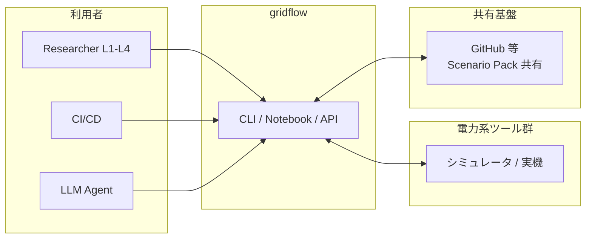
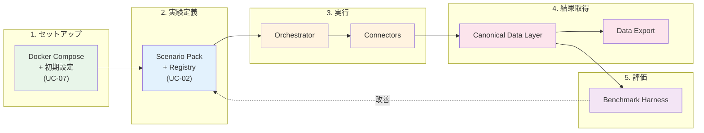

# 3. 静的ビュー

## 3.1 ブロック図（システムコンテキスト・サブシステム分割）

### 3.1.1 システムコンテキスト図

gridflow を一つの箱として見たとき、外から何がつながるかを示す。



gridflow は 3 種類のアクターから CLI/Notebook/API 経由で操作される。外部の電力系ツール群（シミュレータおよび将来の実機）とは Connector を介して双方向にやりとりする。Scenario Pack は GitHub 等を通じて共有される。

---

### 3.1.2 概念アーキテクチャ — E2E 研究ループとの対応

gridflow の存在意義は計画書セクション 0 の **E2E 研究ループの高速化**である。ここでは gridflow の主要コンポーネントがこのループのどこを担うかを示す。

**E2E 研究ループ:**
```
1. 環境セットアップ → 2. 実験定義 → 3. 実行 → 4. 結果取得 → 5. 評価 → 6. 改善 → (2 に戻る)
```

**gridflow コンポーネントとの対応:**



| ループステップ | gridflow コンポーネント | 主な責務 |
|---|---|---|
| 1. セットアップ | Docker Compose + 初期設定 | `docker compose up` で環境構築。< 30 分（QA-1） |
| 2. 実験定義 | **Scenario Pack + Registry** | 実験をパッケージとして定義・登録・バージョン管理 |
| 3. 実行 | **Orchestrator + Connectors** | Scenario Pack に基づき、外部ツールを統合実行 |
| 4. 結果取得 | **Canonical Data Layer + Export** | ツール非依存の共通データ形式で結果を格納・出力 |
| 5. 評価 | **Benchmark Harness** | 定量的評価指標で採点・複数実験を比較 |
| 6. 改善 | Scenario Pack の変更 → 再実行 | パラメータ変更（L1）またはアルゴリズム変更（L2+） |

> **設計判断:** gridflow は研究ループの「2〜5」を自動化し、「6→2」のイテレーションを高速にする。ループの外側（1. セットアップ）は Docker に委任し、gridflow 自身は環境に依存しない。これにより QA-7（ポータビリティ）を実現する。

このコンポーネント群の間に流れるのは 2 種類の情報である:

- **制御フロー** — ユーザー操作 → Orchestrator → Connector の指示系統
- **データフロー** — Connector → CDL → Benchmark → Export の結果系統

この 2 つの流れが交差しないよう分離することが、Clean Architecture（AS-2）の核心である。
