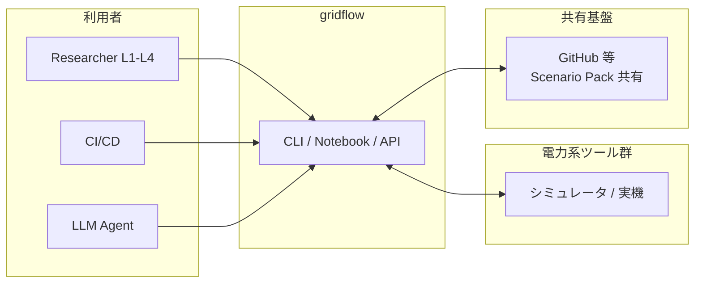
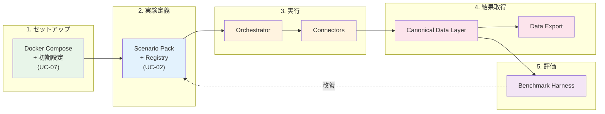
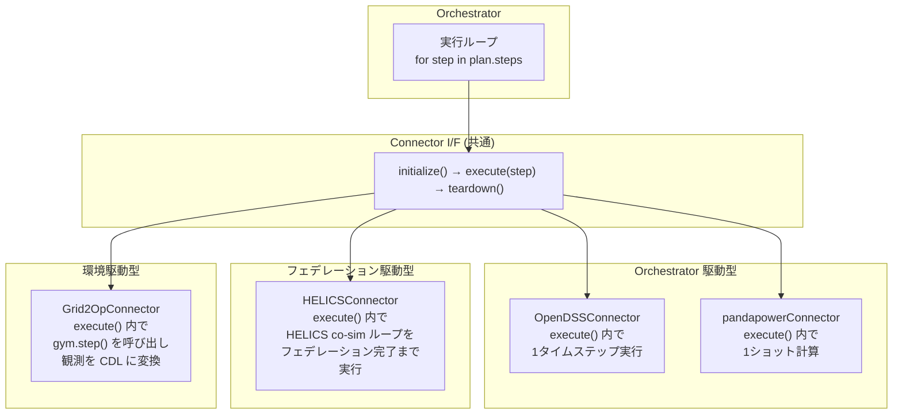

# 3. 静的ビュー

## 3.1 ブロック図（システムコンテキスト・サブシステム分割）

### 3.1.1 システムコンテキスト図

gridflow を一つの箱として見たとき、外から何がつながるかを示す。



gridflow は 3 種類のアクターから CLI/Notebook/API 経由で操作される。外部の電力系ツール群（シミュレータおよび将来の実機）とは Connector を介して双方向にやりとりする。Scenario Pack は GitHub 等を通じて共有される。

---

### 3.1.2 概念アーキテクチャ — E2E 研究ループとの対応

gridflow の存在意義は計画書セクション 0 の **E2E 研究ループの高速化**である。ここでは gridflow の主要コンポーネントがこのループのどこを担うかを示す。

**E2E 研究ループ:**
```
1. 環境セットアップ → 2. 実験定義 → 3. 実行 → 4. 結果取得 → 5. 評価 → 6. 改善 → (2 に戻る)
```

**gridflow コンポーネントとの対応:**



| ループステップ | gridflow コンポーネント | 主な責務 |
|---|---|---|
| 1. セットアップ | Docker Compose + 初期設定 | `docker compose up` で環境構築。< 30 分（QA-1） |
| 2. 実験定義 | **Scenario Pack + Registry** | 実験をパッケージとして定義・登録・バージョン管理 |
| 3. 実行 | **Orchestrator + Connectors** | Scenario Pack に基づき、外部ツールを統合実行 |
| 4. 結果取得 | **Canonical Data Layer + Export** | ツール非依存の共通データ形式で結果を格納・出力 |
| 5. 評価 | **Benchmark Harness** | 定量的評価指標で採点・複数実験を比較 |
| 6. 改善 | Scenario Pack の変更 → 再実行 | パラメータ変更（L1）またはアルゴリズム変更（L2+） |

> **設計判断:** gridflow は研究ループの「2〜5」を自動化し、「6→2」のイテレーションを高速にする。ループの外側（1. セットアップ）は Docker に委任し、gridflow 自身は環境に依存しない。これにより QA-7（ポータビリティ）を実現する。

このコンポーネント群の間に流れるのは 2 種類の情報である:

- **制御フロー** — ユーザー操作 → Orchestrator → Connector の指示系統
- **データフロー** — Connector → CDL → Benchmark → Export の結果系統

この 2 つの流れが交差しないよう分離することが、Clean Architecture（AS-2）の核心である。

---

### 3.1.3 外部システム分析と Connector 設計判断

3.1.2 の「3. 実行」で Connector が外部ツールとやりとりすると述べた。ここでは各ツールの特性を分析し、**なぜ単一の Connector インターフェースで統一できるのか**を示す。

#### 外部ツールの特性分析

| ツール | 役割 | 計算モデル | 入力 | 出力 | 時間の扱い |
|---|---|---|---|---|---|
| **OpenDSS** | 配電系統解析 | 1 系統の潮流計算・準定常時系列 | ネットワーク定義 + 負荷/DER プロファイル | 電圧・電流・潮流結果 | 離散タイムステップ（Orchestrator が制御） |
| **pandapower** | 潮流計算（軽量） | Pure Python の定常計算 | ネットワーク + 負荷 | 電圧・潮流 | ステップなし（1 ショット） |
| **HELICS** | co-simulation 連成 | 複数シミュレータの時間同期フェデレーション | フェデレーション設定 + 各シミュレータの入出力 | 連成結果 | HELICS 自身が時間管理 |
| **Grid2Op** | 逐次運用 RL 環境 | gym-like step API | アクション（開閉器操作等） | 観測 + 報酬 | ステップ駆動（gym 的） |
| **実機 SCADA** | 実系統制御（将来） | リアルタイム計測/制御 | 制御指令 | 計測データ | リアルタイム |

#### 共通性の発見

一見異なるが、全ツールに共通する操作パターンがある:

```
1. 初期化（接続確立・設定ロード）
2. ステップ実行（入力を渡して結果を受け取る）
3. 終了処理（接続切断・リソース解放）
```

相違点は **ステップ実行の粒度と時間管理の主体** である:

| パターン | 時間管理の主体 | 該当ツール |
|---|---|---|
| **Orchestrator 駆動** | Orchestrator がタイムステップを制御し、Connector に 1 ステップ分の実行を指示 | OpenDSS, pandapower |
| **フェデレーション駆動** | 外部の時間同期機構（HELICS）が複数 Connector を協調制御 | HELICS |
| **環境駆動** | 外部環境（Grid2Op, 実機）がステップを刻み、Connector はアクションを送って観測を受け取る | Grid2Op, 実機 SCADA |

#### 設計判断: Connector インターフェースの統一

**判断:** 時間管理の違いは Connector 実装の内部で吸収し、Orchestrator から見た Connector インターフェースは統一する。

**代替案と比較:**

| 案 | 内容 | 長所 | 短所 |
|---|---|---|---|
| **A. ツールごとに個別 I/F** | OpenDSS 用、HELICS 用、Grid2Op 用に別々のインターフェース | ツール固有の最適化が可能 | Orchestrator が全 I/F を知る必要あり。ツール追加のたびに Orchestrator を変更 |
| **B. 統一 I/F（採用）** | 全 Connector が `initialize → execute → teardown` の共通 I/F を実装 | Orchestrator は I/F だけ知ればよい。ツール追加が Connector 実装の追加だけで完結 | 個別最適化が制限される可能性 |
| **C. 抽象レイヤー + 特殊化** | 共通 I/F + ツール固有の拡張メソッド | 両方のメリット | 複雑。CON-3（1人+AI 開発）に合わない |

**B を選んだ理由:**
1. AS-4（シミュレータと実系統の非区別）が自然に実現される
2. AS-2（DI）によりテスト時のモック差替えが容易（AS-3: TDD）
3. AC-1（Wrapper → Hybrid → Full）の段階移行で、Connector を入れ替えるだけで済む
4. CON-3（1人+AI 開発）で複雑な抽象化を維持するコストが高い

**時間管理の違いへの対処:**



> 時間管理の違いは `execute()` の**内部実装**で吸収される。Orchestrator は「ステップを渡して結果を受け取る」だけであり、その内側で何が起きているかを知る必要がない。
