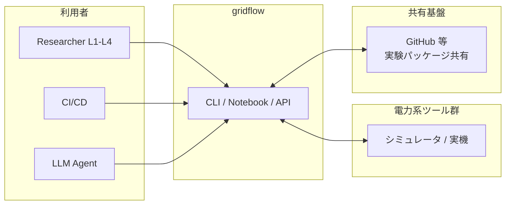
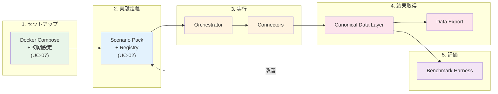
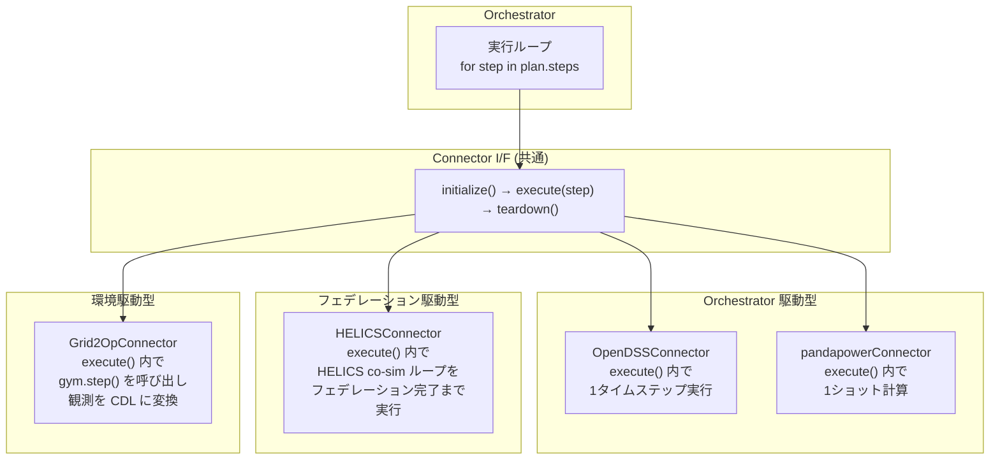

# 3. 静的ビュー

## 3.1 ブロック図（システムコンテキスト・サブシステム分割）

### 3.1.1 システムコンテキスト図

gridflow を一つの箱として見たとき、外から何がつながるかを示す。



gridflow は 3 種類のアクターから CLI/Notebook/API 経由で操作される。外部の電力系ツール群（シミュレータおよび将来の実機）とは Connector を介して双方向にやりとりする。

---

### 3.1.2 概念アーキテクチャ — E2E 研究ループとの対応

#### gridflow が解決する問題

電力系研究の現場では、理論よりも先に以下の実験運用コストが重い:

- 環境構築（ツールのインストール・設定）
- ツール間のデータ変換
- 実験条件の再現性崩壊（卒業とともに実験が失われる）
- 比較評価の不統一
- 結果整理の手作業

gridflow はこれらの運用コストを圧縮する。そのために、研究の一連の流れ（E2E 研究ループ）に対応するコンポーネントを提供する。

#### Scenario Pack — gridflow の中心概念

gridflow の設計は **Scenario Pack** という概念を中心に組み立てられている。

**Scenario Pack とは:** 実験 1 件を丸ごとパッケージ化したもの。以下を含む:

- **対象ネットワーク** — どの系統で実験するか（IEEE 13バス等）
- **時系列データ** — 負荷プロファイル、PV 出力パターン等
- **実行対象設定** — どのツール（OpenDSS, pandapower 等）をどう使うか
- **評価指標** — 何を測るか（電圧逸脱率、ENS、CO2 等）
- **乱数 seed** — 再現性の保証
- **期待出力** — 回帰テスト用の正解データ
- **可視化テンプレート** — 結果の標準的な図表化定義

**なぜ Scenario Pack が必要か:**

- 実験が「コード + 手作業」ではなく「パッケージ」になることで、**再現性が制度として保証される**
- パッケージ化されているので、**共同研究者への受け渡し**が容易になる
- パラメータを変えるだけで新しい実験バリアントが作れるので、**比較実験のイテレーションが速い**

#### E2E 研究ループとコンポーネントの対応

**E2E 研究ループ:**
```
1. 環境セットアップ → 2. 実験定義 → 3. 実行 → 4. 結果取得 → 5. 評価 → 6. 改善 → (2 に戻る)
```

**gridflow コンポーネントとの対応:**



| ループステップ | gridflow コンポーネント | 主な責務 |
|---|---|---|
| 1. セットアップ | Docker Compose + 初期設定 | `docker compose up` で環境構築。< 30 分（QA-1） |
| 2. 実験定義 | **Scenario Pack + Registry** | 実験をパッケージとして定義・登録・バージョン管理 |
| 3. 実行 | **Orchestrator + Connectors** | Scenario Pack に基づき、外部ツールを統合実行 |
| 4. 結果取得 | **Canonical Data Layer + Export** | ツール非依存の共通データ形式で結果を格納・出力 |
| 5. 評価 | **Benchmark Harness** | 定量的評価指標で採点・複数実験を比較 |
| 6. 改善 | Scenario Pack の変更 → 再実行 | パラメータ変更（L1）またはアルゴリズム変更（L2+） |

> **設計判断:** gridflow は研究ループの「2〜5」を自動化し、「6→2」のイテレーションを高速にする。ループの外側（1. セットアップ）は Docker に委任し、gridflow 自身は環境に依存しない。これにより QA-7（ポータビリティ）を実現する。

このコンポーネント群の間に流れるのは 2 種類の情報である:

- **制御フロー** — ユーザー操作 → Orchestrator → Connector の指示系統
- **データフロー** — Connector → CDL → Benchmark → Export の結果系統

この 2 つの流れが交差しないよう分離することが、Clean Architecture（AS-2）の核心である。

---

### 3.1.3 外部システム分析と Connector 設計判断

3.1.2 の「3. 実行」で Connector が外部ツールとやりとりすると述べた。ここでは各ツールの特性を分析し、**なぜ単一の Connector インターフェースで統一できるのか**を示す。

#### 外部ツールの特性分析

| ツール | 役割 | 計算モデル | 入力 | 出力 | 時間の扱い |
|---|---|---|---|---|---|
| **OpenDSS** | 配電系統解析 | 1 系統の潮流計算・準定常時系列 | ネットワーク定義 + 負荷/DER プロファイル | 電圧・電流・潮流結果 | 離散タイムステップ（Orchestrator が制御） |
| **pandapower** | 潮流計算（軽量） | スクリプト言語ベースの定常計算 | ネットワーク + 負荷 | 電圧・潮流 | ステップなし（1 ショット） |
| **HELICS** | co-simulation 連成 | 複数シミュレータの時間同期フェデレーション | フェデレーション設定 + 各シミュレータの入出力 | 連成結果 | HELICS 自身が時間管理 |
| **Grid2Op** | 逐次運用 RL 環境 | gym-like step API | アクション（開閉器操作等） | 観測 + 報酬 | ステップ駆動（gym 的） |
| **実機 SCADA** | 実系統制御（将来） | リアルタイム計測/制御 | 制御指令 | 計測データ | リアルタイム |

#### 共通性の発見

一見異なるが、全ツールに共通する操作パターンがある:

```
1. 初期化（接続確立・設定ロード）
2. ステップ実行（入力を渡して結果を受け取る）
3. 終了処理（接続切断・リソース解放）
```

相違点は **ステップ実行の粒度と時間管理の主体** である:

| パターン | 時間管理の主体 | 該当ツール |
|---|---|---|
| **Orchestrator 駆動** | Orchestrator がタイムステップを制御し、Connector に 1 ステップ分の実行を指示 | OpenDSS, pandapower |
| **フェデレーション駆動** | 外部の時間同期機構（HELICS）が複数 Connector を協調制御 | HELICS |
| **環境駆動** | 外部環境（Grid2Op, 実機）がステップを刻み、Connector はアクションを送って観測を受け取る | Grid2Op, 実機 SCADA |

#### 設計判断: Connector インターフェースの統一

**判断:** 時間管理の違いは Connector 実装の内部で吸収し、Orchestrator から見た Connector インターフェースは統一する。

**代替案と比較:**

| 案 | 内容 | 長所 | 短所 |
|---|---|---|---|
| **A. ツールごとに個別 I/F** | OpenDSS 用、HELICS 用、Grid2Op 用に別々のインターフェース | ツール固有の最適化が可能 | Orchestrator が全 I/F を知る必要あり。ツール追加のたびに Orchestrator を変更 |
| **B. 統一 I/F（採用）** | 全 Connector が `initialize → execute → teardown` の共通 I/F を実装 | Orchestrator は I/F だけ知ればよい。ツール追加が Connector 実装の追加だけで完結 | 個別最適化が制限される可能性 |
| **C. 抽象レイヤー + 特殊化** | 共通 I/F + ツール固有の拡張メソッド | 両方のメリット | 複雑。CON-3（1人+AI 開発）に合わない |

**B を選んだ理由:**
1. AS-4（シミュレータと実系統の非区別）が自然に実現される
2. AS-2（DI）によりテスト時のモック差替えが容易（AS-3: TDD）
3. AC-1（Wrapper → Hybrid → Full）の段階移行で、Connector を入れ替えるだけで済む
4. CON-3（1人+AI 開発）で複雑な抽象化を維持するコストが高い

**時間管理の違いへの対処:**



> 時間管理の違いは `execute()` の**内部実装**で吸収される。Orchestrator は「ステップを渡して結果を受け取る」だけであり、その内側で何が起きているかを知る必要がない。

---

### 3.1.4 サブシステム分割 — Clean Architecture レイヤーへのマッピング

3.1.2 で示した概念コンポーネントを、AS-2（Clean Architecture）の依存方向規則に従って 4 層に配置する。

**設計判断:** なぜ Clean Architecture か?

| 案 | 内容 | 判定 |
|---|---|---|
| レイヤードアーキテクチャ（従来型） | UI → Business → Data の 3 層 | Data 層への依存がドメインロジックに侵入する。Connector 差替えが困難 |
| **Clean Architecture（採用）** | 依存方向を内側に統一。外側は交換可能 | Connector・DB・UI を自由に差替え可能。AS-4、AC-1 と整合 |
| マイクロサービス | 各コンポーネントを独立サービス化 | CON-3（1人+AI 開発）に合わない。過剰な複雑さ |

**4 層構造と 3.1.2 コンポーネントの対応:**

```
┌─────────────────────────────────────────────────────────────────┐
│  Frameworks & Drivers（最外層）                                    │
│  Docker, FileSystem, 外部シミュレータ/実機                         │
│  ※ gridflow のコードではない。gridflow が利用する外部環境            │
├─────────────────────────────────────────────────────────────────┤
│  Interface Adapters（アダプタ層）                                  │
│                                                                   │
│  ┌──────────┐  ┌─────────────┐  ┌──────────────┐               │
│  │ CLI      │  │ Notebook    │  │ Data Export   │  ← 入力/出力  │
│  │          │  │ Bridge      │  │ (CSV/JSON/    │    の窓口     │
│  │          │  │             │  │  Parquet)     │               │
│  └──────────┘  └─────────────┘  └──────────────┘               │
│  ┌──────────────────────────────────────────────┐               │
│  │ Connector Implementations                     │  ← 外部ツール│
│  │ OpenDSS | HELICS | pandapower | Mock | ...    │    との接続   │
│  └──────────────────────────────────────────────┘               │
├─────────────────────────────────────────────────────────────────┤
│  Use Cases（ユースケース層）                                       │
│                                                                   │
│  ┌─────────────┐  ┌──────────┐  ┌──────────────┐               │
│  │ Orchestrator │  │ Benchmark│  │ Scenario     │               │
│  │ 実行制御     │  │ Harness  │  │ Registry     │               │
│  │ 時間同期     │  │ 評価比較  │  │ 登録/検索    │               │
│  └─────────────┘  └──────────┘  └──────────────┘               │
│  ┌──────────────┐  ┌────────────────┐                          │
│  │ Observability │  │ Plugin Registry │ ← L2 拡張点              │
│  │ ログ/トレース │  │                 │                          │
│  └──────────────┘  └────────────────┘                          │
├─────────────────────────────────────────────────────────────────┤
│  Entities（ドメインモデル層 = CDL）                                 │
│                                                                   │
│  ┌───────────┐ ┌───────┐ ┌────────────┐ ┌───────┐             │
│  │ Topology  │ │ Asset │ │ TimeSeries │ │ Event │             │
│  │ 系統構成   │ │ 設備  │ │ 時系列     │ │ 操作  │             │
│  └───────────┘ └───────┘ └────────────┘ └───────┘             │
│  ┌────────────┐ ┌──────────────────┐ ┌──────────────┐         │
│  │ Metric     │ │ ExperimentMetadata│ │ ScenarioPack │         │
│  │ 評価指標   │ │ 実験メタデータ     │ │ 実験定義     │         │
│  └────────────┘ └──────────────────┘ └──────────────┘         │
│  ※ 外部依存なし。CIM (IEC 61970) と対応関係 (AC-7)                │
└─────────────────────────────────────────────────────────────────┘

依存方向: 外側 → 内側 のみ（逆方向の依存は禁止）
```

**依存規則:**
- Entities は何にも依存しない（外部依存のないデータクラス）
- Use Cases は Entities にのみ依存する。外部ツール・DB・UI を知らない
- Interface Adapters は Use Cases と Entities に依存する。外部の詳細を変換する
- Frameworks & Drivers は全層に依存できるが、gridflow が直接制御するコードではない

**3.1.2 からの対応関係:**

| 3.1.2 の概念コンポーネント | Clean Architecture 層 | 根拠 |
|---|---|---|
| Scenario Pack + Registry | Entities + Use Cases | Pack のデータ構造は Entities、管理ロジックは Use Cases |
| Orchestrator | Use Cases | 実行制御のビジネスロジック。外部ツールは Connector I/F 越しに呼ぶ |
| Connectors | Interface Adapters | 外部ツールの詳細を隠蔽し、CDL 形式に変換する |
| Canonical Data Layer | Entities (データモデル) + Interface Adapters (永続化) | データ構造は Entities、ファイル I/O は Adapters |
| Data Export | Interface Adapters | CDL → CSV/JSON/Parquet の変換 |
| Benchmark Harness | Use Cases | 評価ロジック。Entities の Metric を入出力する |
| CLI / Notebook | Interface Adapters | ユーザーの操作を Use Cases に変換する窓口 |

---

### 3.1.5 Bounded Context Map（DDD: AS-1）

3.1.4 の Clean Architecture レイヤーを横断する形で、DDD の Bounded Context 間の関係を示す。

```
┌─────────────────────────────────────────────────────────────┐
│                    Experiment Domain                         │
│               （Entities 層 = 共有カーネル）                    │
│  Topology, Asset, TimeSeries, Event, Metric, ScenarioPack   │
│  ※ 全コンテキストがこのドメインモデルを共有する                  │
└──────────────────────┬──────────────────────────────────────┘
                       │ 依存
        ┌──────────────┼──────────────┬──────────────┐
        ↓              ↓              ↓              ↓
┌──────────────┐┌──────────────┐┌──────────────┐┌──────────────┐┌──────────────┐
│ Orchestration ││  Evaluation  ││  Scenario    ││ Observability││  Lifecycle   │
│              ││              ││  Management  ││              ││  Management  │
│ 実行制御      ││ 評価・比較    ││ Pack管理     ││ ログ・トレース││ Installer    │
│              ││              ││              ││              ││ Migrator     │
│ Supplier     ││ Consumer     ││ Consumer     ││ Consumer     ││ Consumer     │
└──────┬───────┘└──────────────┘└──────────────┘└──────────────┘└──────────────┘
       │ Supplier (I/F 定義側)
       ↓
┌──────────────┐┌──────────────┐┌──────────────┐
│  Connectors  ││     UX       ││ DataExporter  │
│              ││              ││              │
│ 外部システム  ││ CLI/Notebook ││ CSV/JSON/    │
│ 接続         ││              ││ Parquet      │
│              ││              ││              │
│ Consumer     ││ Consumer     ││ Consumer     │
└──────┬───────┘└──────────────┘└──────────────┘
       │ Anti-Corruption Layer (DataTranslator)
       ↓
┌──────────────────────────────────────────────┐
│            External Systems                   │
│  OpenDSS / HELICS / pandapower / SCADA / ... │
└──────────────────────────────────────────────┘
```

**コンテキスト間の関係パターン:**

| 上流コンテキスト | 下流コンテキスト | 関係パターン | 説明 |
|---|---|---|---|
| Experiment Domain | Orchestration, Evaluation, Scenario Management, Observability | **Shared Kernel** | 全コンテキストが Entities 層のドメインモデルを共有する。ドメインモデルの変更は全コンテキストに波及するため、慎重に管理（感度点: 6.2） |
| Orchestration | Connectors | **Supplier-Consumer** | Orchestration が ConnectorInterface を定義する（Supplier/上流）。各 Connector がそれに準拠して実装する（Consumer/下流） |
| Connectors | External Systems | **Anti-Corruption Layer** | 外部システムのデータモデルを CDL に変換する DataTranslator を Connector 内部に持つ |
| Orchestration | UX, Data Export | **Conformist** | UX と Data Export は Orchestration/CDL のインターフェースにそのまま準拠する |

---

## 3.2 クラス図（主要インターフェースと設計判断）

3.1.4 のレイヤー構造を、主要なインターフェースとクラスに落とし込む。全クラスを列挙するのではなく、**アーキテクチャ判断が表れるインターフェース境界**に絞って示す。

### 3.2.1 核心のインターフェース境界

gridflow のアーキテクチャを特徴づけるインターフェースは 3 つある:

```
① ConnectorInterface  — Orchestrator と外部ツールの境界（AS-4 の要）
② CanonicalDataLayer  — 実行結果の格納・取得の境界（データフローの中心）
③ MetricCalculator    — 評価指標算出の拡張点（L2 Plugin の要）
```



```mermaid
classDiagram
    class ConnectorInterface {
        <<Protocol>>
        +initialize(config: dict) None
        +execute(step: ExecutionStep, context: ExecutionContext) StepResult
        +health_check() HealthStatus
        +teardown() None
    }

    class DataTranslator {
        <<Protocol>>
        +to_canonical(raw_data: Any) CanonicalData
        +from_canonical(data: CanonicalData) Any
    }

    class CanonicalDataLayer {
        <<Protocol>>
        +store_result(experiment_id: str, data: CanonicalData) None
        +get_result(experiment_id: str) CanonicalData
        +list_experiments() list~ExperimentMetadata~
        +store_intermediate(experiment_id: str, step: str, data: CanonicalData) None
        +get_intermediate(experiment_id: str) CanonicalData
    }

    class DataExporter {
        <<Protocol>>
        +export(experiment_id: str, format: ExportFormat) Path
    }

    class CsvExporter {
        +export(experiment_id: str, format: ExportFormat) Path
    }

    class PaperExporter {
        +export(experiment_id: str, format: ExportFormat) Path
        +export_latex_table(experiment_ids: list) str
        +export_plot_data(experiment_id: str, metric: str) Path
    }

    DataExporter <|.. CsvExporter
    DataExporter <|.. PaperExporter

    note for PaperExporter "AS-5: 論文用エクスポート\nLaTeX表・matplotlib用データ\nBenchmark比較結果→論文表"

    class MetricCalculator {
        <<Protocol>>
        +calculate(data: CanonicalData) Metric
    }

    class Orchestrator {
        +run(scenario_pack_id: str, options: RunOptions) RunResult
        +run_from_step(scenario_pack_id: str, step: str) RunResult
        +status() OrchestratorStatus
    }

    class ExecutionPlanBuilder {
        +build(pack: ScenarioPack) ExecutionPlan
        +validate(pack: ScenarioPack) ValidationResult
    }

    class ConnectorLifecycleManager {
        +initialize_all(plan: ExecutionPlan) None
        +health_check_all() dict~str, HealthStatus~
        +teardown_all() None
    }

    class StepExecutor {
        +execute_plan(plan: ExecutionPlan, context: ExecutionContext) list~StepResult~
    }

    class ScenarioRegistry {
        <<Protocol>>
        +load(scenario_pack_id: str) ScenarioPack
        +register(pack: ScenarioPack) str
        +validate(pack: ScenarioPack) ValidationResult
        +list() list~ScenarioPackMeta~
        +clone(source_id: str, new_name: str) ScenarioPack
    }

    class Installer {
        +detect_first_run() bool
        +setup() None
        +download_samples() None
    }

    class Migrator {
        +migrate(from_ver: str, to_ver: str) MigrationResult
        +backup() BackupHandle
        +rollback(handle: BackupHandle) None
    }

    class BenchmarkHarness {
        +run(experiment_ids: list, metrics: list) BenchmarkResult
        +compare(experiment_ids: list) ComparisonTable
    }

    Orchestrator --> ExecutionPlanBuilder : plan生成を委譲
    Orchestrator --> ConnectorLifecycleManager : Connector管理を委譲
    Orchestrator --> StepExecutor : ステップ実行を委譲
    Orchestrator ..> ScenarioRegistry : loads pack
    StepExecutor ..> ConnectorInterface : uses ①
    StepExecutor ..> CanonicalDataLayer : stores results ②
    ConnectorInterface ..> DataTranslator : uses ④
    BenchmarkHarness ..> CanonicalDataLayer : reads results ②
    BenchmarkHarness ..> MetricCalculator : evaluates ③
    Installer ..> ScenarioRegistry : registers samples
    ConnectorLifecycleManager ..> ConnectorInterface : manages
```

> **4つのインターフェース境界:**
>
> **① ConnectorInterface** — 最も重要な設計判断（3.1.3）。AS-4 の要。
>
> **② CanonicalDataLayer** — 純粋な Repository（store/get のみ）。`export` は ④ DataExporter に分離。
>
> **③ MetricCalculator** — Strategy パターン。L2 Plugin の拡張点。
>
> **④ DataTranslator** — Anti-Corruption Layer を明示化。各 Connector が外部データ → CDL 変換を DataTranslator に委譲。変換ロジックが Connector のプロトコル通信ロジックと分離され、個別にテスト可能。

**Orchestrator の分解（設計レビュー #4 対応）:**

| 元の責務 | 分離先 | 根拠 |
|---|---|---|
| Scenario Pack の検証・実行計画生成 | **ExecutionPlanBuilder** | 入力の解析と出力のフォーマッティングは実行制御と独立してテスト可能 |
| Connector の初期化・終了・ヘルスチェック | **ConnectorLifecycleManager** | ライフサイクル管理は実行ロジックと直交する責務 |
| ステップの順次/並列実行・結果格納 | **StepExecutor** | 実行ループは将来の並列 Scheduler 化（AC-5）の変更点。分離することで Scheduler 差替えが容易 |
| 全体の調整 | **Orchestrator** | 上記 3 つのコラボレーターを調整するだけ。公開 I/F は `run()` と `run_from_step()` のまま |

**Bootstrap の分割（設計レビュー #5 対応）:**

| 元の責務 | 分離先 | 根拠 |
|---|---|---|
| 初回起動検知・セットアップ・サンプルDL | **Installer** | UC-07 のフロー。失敗してもデータ損失リスクなし |
| マイグレーション・バックアップ・ロールバック | **Migrator** | UC-08 のフロー。all-or-nothing のトランザクション要件あり。リスクプロファイルが根本的に異なる |

### 3.2.2 Connector 実装の分類

3.1.3 の時間管理パターン別に、代表的な実装クラスを示す。


### 3.2.3 ドメインモデル（Entities 層 = CDL）

Entities 層は外部依存のないデータクラスで構成される。電力系研究者の語彙（AS-1: Ubiquitous Language）をそのままクラス名にする。

```
ScenarioPack ─── 実験定義の全体
  ├── Topology ─── 系統構成（Bus, Line, Transformer, Switch）
  ├── Asset ────── 設備（PV, BESS, Load, Generator）
  ├── TimeSeries ─ 時系列データ（負荷プロファイル, PV出力等）
  ├── baseline ─── ベースライン Pack かどうかのフラグ（AS-5）
  ├── citation ─── この Pack を引用する際の情報（AS-5）
  └── metadata ─── 拡張可能メタデータ（AC-3: 教育用途等）

実行結果
  ├── ExperimentMetadata ─ 実行条件（seed, 日時, Connector バージョン）
  ├── Event ───────────── 実行中のイベント（操作, 障害, 状態変化）
  ├── TimeSeries ──────── 出力時系列（電圧, 電流, SoC 等）
  └── Metric ──────────── 評価指標値（VoltageViolation, ENS, CO2 等）
```

> **CIM (IEC 61970) との関係 (AC-7):** Topology と Asset は CIM のクラス構造（ConnectivityNode, ConductingEquipment 等）と対応関係を持つよう設計する。完全準拠ではなく、双方向マッピングが可能な粒度を目標とする。

### 3.2.4 UX 層の構造

CLI コマンド体系は UC-01〜UC-10 と 1:1 で対応する:

| CLI コマンド | 対応 UC | Use Cases 層の呼出先 |
|---|---|---|
| `gridflow run` | UC-01 | Orchestrator.run() |
| `gridflow scenario create/list/clone/validate/register` | UC-02 | ScenarioRegistry |
| `gridflow benchmark run/export` | UC-03 | BenchmarkHarness |
| `gridflow status` / `docker compose up/down` | UC-04 | Orchestrator.status() |
| `gridflow logs/trace/metrics` | UC-05 | Observability |
| `gridflow debug` | UC-06 | Orchestrator + CDL |
| `gridflow install` / `docker compose up`（初回） | UC-07 | 初期設定 |
| `gridflow update/uninstall` | UC-08 | バージョン管理 |
| `gridflow results list/show/plot/export` | UC-09 | CDL + DataExport |
| （LLM が上記を組合せ） | UC-10 | 全 Use Cases |

NotebookBridge は同じ Use Cases 層をプログラミング API として公開する。CLI と Notebook は同じ Use Cases のインターフェースの異なる窓口であり、ロジックの重複はない。

---

## 3.3 配置図（Docker コンテナ・ホスト環境の物理配置）

### 設計判断: なぜ Docker Compose か

| 案 | 内容 | 判定 |
|---|---|---|
| ネイティブインストール | ホスト OS に直接インストール | OS・アーキテクチャごとの環境差異が再現性を破壊（QA-3）。セットアップ手順が複雑化（QA-1） |
| **Docker Compose（採用）** | 全コンポーネントをコンテナで提供 | `docker compose up` で環境差異を排除。マルチアーキ対応（CON-4）。セットアップ < 30分（QA-1） |
| Kubernetes | コンテナオーケストレーション | CON-3（1人+AI 開発）に合わない。研究室の 1 台のマシンに過剰 |

### 配置構成

```
┌─────────────────────────────────────────────────────────┐
│  ホスト OS（Windows / macOS / Linux）                      │
│  Docker Desktop                                           │
│                                                           │
│  ┌─────────────────────────────────────────────────────┐ │
│  │  Docker Compose ネットワーク                          │ │
│  │                                                       │ │
│  │  ┌───────────────────────────────────┐               │ │
│  │  │  gridflow コアコンテナ              │               │ │
│  │  │  ┌──────────┐ ┌──────────────┐   │               │ │
│  │  │  │ CLI      │ │ Orchestrator │   │               │ │
│  │  │  └──────────┘ └──────────────┘   │               │ │
│  │  │  ┌──────────┐ ┌──────────────┐   │               │ │
│  │  │  │ Scenario │ │ Benchmark    │   │               │ │
│  │  │  │ Registry │ │ Harness      │   │               │ │
│  │  │  └──────────┘ └──────────────┘   │               │ │
│  │  │  ┌──────────────────────────┐    │               │ │
│  │  │  │ CDL + Observability      │    │               │ │
│  │  │  └──────────────────────────┘    │               │ │
│  │  └───────────────────────────────────┘               │ │
│  │           │ Connector I/F                              │ │
│  │  ┌────────┴──────────────────────────────────┐       │ │
│  │  │  外部ツールコンテナ群（必要に応じて起動）      │       │ │
│  │  │  ┌──────────┐ ┌──────────┐ ┌──────────┐ │       │ │
│  │  │  │ OpenDSS  │ │ HELICS   │ │ Grid2Op  │ │       │ │
│  │  │  │(dss-ext) │ │          │ │          │ │       │ │
│  │  │  └──────────┘ └──────────┘ └──────────┘ │       │ │
│  │  └───────────────────────────────────────────┘       │ │
│  │                                                       │ │
│  │  ┌───────────────────────────────────────────┐       │ │
│  │  │  データボリューム（永続化）                   │       │ │
│  │  │  scenarios/  results/  logs/               │       │ │
│  │  └───────────────────────────────────────────┘       │ │
│  └─────────────────────────────────────────────────────┘ │
│                                                           │
│  ┌───────────────────────┐                               │
│  │  Notebook（ホスト側）   │                               │
│  │  Jupyter / スクリプト   │──── API 経由で接続            │
│  └───────────────────────┘                               │
└─────────────────────────────────────────────────────────┘
```

### コンテナ分離の方針

| コンテナ | 内容 | 分離理由 |
|---|---|---|
| **gridflow コア** | CLI, Orchestrator, Registry, Harness, CDL, Observability | 単一コンテナで起動の単純さを優先（CON-3）。内部はプロセス分離ではなくモジュール分離 |
| **外部ツール** | OpenDSS, HELICS, Grid2Op 等 | ツールごとに異なる依存関係・OS 要件を隔離。Connector I/F 経由で通信 |
| **データボリューム** | Scenario Pack, 実験結果, ログ | コンテナのライフサイクルと独立してデータを永続化 |

> **Notebook はコンテナ外:** ユーザーのホスト環境で動作する Notebook から API 経由で gridflow コアコンテナに接続する。Notebook 自体をコンテナ化しない理由は、研究者が自分の環境（既存の仮想環境・ライブラリ）を使いたいため。

### 通信方式

| 通信 | 方式 | 理由 |
|---|---|---|
| CLI → コア | コンテナ内プロセス呼出し | 同一コンテナ内。オーバーヘッドなし |
| Notebook → コア | HTTP API（localhost） | コンテナ外 → コンテナ内。Docker ポートマッピング |
| コア → 外部ツール | Connector 実装依存 | インプロセス呼出し（dss-python）/ サブプロセス / コンテナ間通信 |
| データ永続化 | ファイルシステム（ボリュームマウント） | P0 はファイルベース。将来 DB に差替え可能（Repository パターン） |

---

## 3.4 プロセスビュー（実行時のプロセス・スレッド構造）

### 3.4.1 ボトルネック分析

QA-10（性能効率）を達成するために、実験実行（UC-01）のどこで時間・メモリが消費されるかを分析する。

#### 実験実行の時間消費の内訳

UC-01 のシーケンス図（4.3.1）を基に、各フェーズの計算量を分析する。

```
実験実行の時間 = (1) Pack ロード + (2) 検証 + (3) Connector 初期化
               + (4) ステップ実行 × N + (5) CDL 格納 × N + (6) ログ記録 × N
               + (7) 終了処理
```

| フェーズ | 何が支配的か | 典型的な所要時間 | gridflow の制御可能性 |
|---|---|---|---|
| (1) Pack ロード | ファイル I/O | ms 〜 s | 制御可能（データ構造設計） |
| (2) 検証 | スキーマ検査 | ms | 制御可能 |
| (3) Connector 初期化 | 外部ツール起動 | s 〜 10s | 一部制御不能（外部ツール依存） |
| **(4) ステップ実行** | **外部ツールの計算** | **s 〜 h** | **制御不能（外部ツール依存）** |
| (5) CDL 格納 | シリアライゼーション + I/O | ms 〜 s/ステップ | 制御可能 |
| (6) ログ記録 | I/O | μs 〜 ms/ステップ | 制御可能 |
| (7) 終了処理 | Connector teardown | ms 〜 s | 制御可能 |

**結論: (4) ステップ実行が支配的。** gridflow のオーバーヘッド (1)(2)(3)(5)(6)(7) は合計数秒〜数十秒であり、通常は (4) の 5% 以下（QA-10）。

#### gridflow がボトルネックになり得るケース

| ケース | 原因 | 発生条件 | 対策 |
|---|---|---|---|
| **A. 大量データの CDL 格納** | 大規模系統 × 長時間の結果をメモリ保持 | 数千ノード × 数万ステップ | ストリーミング書込み（ステップ毎に flush） |
| **B. batch 直列ボトルネック** | 数百バリエーションを直列実行 | パラメータスイープ | 並列 Scheduler（将来拡張） |
| **C. Connector 初期化の繰返し** | batch で毎回初期化・破棄 | 多数バリエーション | Connector プール（再利用） |
| **D. ログ I/O 過多** | 高頻度ステップで同期書込み | リアルタイム co-simulation | 非同期ログ（バッファリング） |

#### メモリ消費の分析

| コンポーネント | 保持対象 | 規模依存性 | 対策 |
|---|---|---|---|
| ScenarioPack | 系統定義 + 時系列 | 系統規模に比例 | 時系列はファイル参照で保持。必要時にストリーム読込み |
| CDL（実行中） | ステップ結果 | ステップ数 × 出力サイズ | ステップ毎にファイルに flush。全結果をメモリ保持しない |
| Connector | 外部ツールの状態 | 外部ツール依存 | gridflow では制御不能。プロセス分離で隔離可能 |
| Observability | ログバッファ | ステップ数に比例 | リングバッファ or 非同期フラッシュ |

### 3.4.2 プロセス・スレッド構造

#### P0: シングルプロセス + 外部プロセス委譲

```
┌──────────────────────────────────────────────────────┐
│  gridflow コアプロセス（シングルプロセス）               │
│                                                        │
│  メインスレッド                                         │
│  ┌──────────┐  ┌──────────┐  ┌──────────────────┐   │
│  │ CLI      │→ │ Orch-    │→ │ Scheduler        │   │
│  │          │  │ estrator │  │ (Sequential)     │   │
│  └──────────┘  └──────────┘  └────────┬──────────┘   │
│                                        │               │
│  バックグラウンドスレッド                 │               │
│  ┌───────────┐  ┌───────────┐         │               │
│  │ CDL I/O   │  │ Logger    │←────────┤               │
│  │ (非同期   │  │ (非同期   │  結果/ログを              │
│  │  書込み)  │  │  書込み)  │  キュー経由で委譲          │
│  └───────────┘  └───────────┘                          │
│                                        │               │
├── Connector 実行（3パターン）─────────────┘───────────────┤
│                                                        │
│  パターン1: インプロセス（同一プロセス内で直接呼出し）     │
│  パターン2: サブプロセス（子プロセスとして起動）          │
│  パターン3: コンテナ間通信（Docker 経由で別コンテナ呼出し）│
└──────────────────────────────────────────────────────┘
```

**設計判断: なぜシングルプロセスか**

| 案 | 内容 | 判定 |
|---|---|---|
| **シングルプロセス（採用）** | コアは 1 プロセス。I/O とログは別スレッド。重い計算は外部ツールに委譲 | CON-3 で最もシンプル。ボトルネックが外部ツール側なのでコア並列化は不要 |
| マルチプロセス | Orchestrator, CDL, Logger を別プロセスに分離 | プロセス間通信の複雑さが増す。ボトルネックがコアにない段階では過剰 |
| 非同期イベントループ | 非同期 I/O で全て単一スレッド | Connector がブロッキング呼出しの場合に対応できない |

#### スレッド構成

| スレッド | 役割 | ブロッキング | 備考 |
|---|---|---|---|
| **メインスレッド** | CLI、Orchestrator、Scheduler の実行ループ | あり（Connector.execute() 待ち） | P0 はここで直列実行 |
| **CDL I/O スレッド** | ステップ結果のファイル書込み | あり（ファイル I/O） | キューで受け取り非同期書込み。ケース A の対策 |
| **Logger スレッド** | 構造化ログの非同期書込み | あり（ファイル I/O） | バッファフラッシュ。ケース D の対策 |

> **メインスレッドが Connector.execute() でブロックする**のは意図的。外部ツールの完了を待つ間、gridflow は CPU を消費しない。並列化が必要なのは batch 実行レベルであり、将来の並列 Scheduler が担う。

#### 将来の拡張: 並列 Scheduler（ケース B の対策）

```
Scheduler (並列)
  ├── Worker 1 ── Connector instance 1 ── 外部ツール 1
  ├── Worker 2 ── Connector instance 2 ── 外部ツール 2
  └── Worker N ── Connector instance N ── 外部ツール N
```

- Worker はプロセスまたはスレッド（言語選択に依存: ADR-001）
- Connector はワーカーごとに独立インスタンス（ケース C: Connector プール）
- CDL への書込みはスレッドセーフなキュー経由

### 3.4.3 言語選択への示唆（ADR-001 の判断材料）

ボトルネック分析の結果、言語選択に関する示唆:

| 観点 | 分析結果 | 言語選択への影響 |
|---|---|---|
| CPU バウンド | gridflow コアは CPU バウンドではない。重い計算は外部ツールが担う | コアに高速言語を使う性能上の動機は薄い |
| I/O バウンド | CDL・ログ書込みが I/O バウンド。非同期 I/O で対応可能 | どの言語でも対応可能 |
| メモリ効率 | ストリーミング設計で対応可能。GC pause が問題になるリアルタイム制約なし | GC あり言語でも問題なし |
| 並列実行 | プロセスレベル並列で十分 | GIL 影響はプロセス並列で回避可能 |
| Connector | 外部ツールのバインディングが存在する言語が有利 | エコシステム依存（CON-1 で保留） |
| L2 Plugin | 研究者が記述。アクセスしやすい言語が必要 | 研究者層の言語スキルに依存 |

> **結論:** gridflow コアのボトルネックは外部ツール側にあり、コアの言語高速化の全体性能への寄与は限定的。言語選択は性能よりも**外部ツールのエコシステム適合性**と**L2 Plugin の記述容易性**で決まる可能性が高い。最終判断は ADR-001 で記録する。

---

## 3.5 拡張性戦略 — Plugin API とカスタムレイヤー（L1-L4）

### 3.5.1 なぜユーザーが簡単に拡張できる必要があるか

gridflow の価値は「研究の回し方を高速化する」（BG-1）ことだが、研究者が本当にやりたいのは**自分の新しいアイデア（制御法、最適化手法、評価指標）を既存手法と比較すること**である。

もし gridflow の拡張にフレームワークの深い知識が必要だと、研究者は「gridflow を学ぶコスト」と「自前でスクリプトを書くコスト」を天秤にかけ、後者を選ぶ。**拡張の敷居が導入の敷居を決める。**

目標: **L2 研究者（修士レベル）が、gridflow の内部構造を知らなくても、100 行以下のコードで独自アルゴリズムを統合できる**（QA-4）。

### 3.5.2 カスタムレイヤーの設計 — 何を見せて何を隠すか

| レベル | 研究者が見えるもの | 研究者から隠されるもの | 拡張ポイント |
|---|---|---|---|
| **L1: 設定変更** | Scenario Pack の YAML/JSON ファイル | コード全て | パラメータ値（負荷量、DER 容量、期間、seed 等） |
| **L2: Plugin API** | 定義済みインターフェース（関数シグネチャ） | Orchestrator 内部、Connector 実装、CDL 永続化 | `MetricCalculator.calculate()`、カスタム制御関数、前処理/後処理フック |
| **L3: モジュール拡張** | Connector インターフェース全体 | コアの実行制御ロジック | 新しい Connector 実装の追加 |
| **L4: ソース改変** | 全ソースコード | なし | 任意 |

> **設計判断:** L1 と L2 の間に最大の敷居差がある。L1（設定変更）は YAML 編集だけなので誰でもできる。L2（Plugin API）はコードを書く必要があるが、**書くべきコードの量と知るべき概念を最小化する**ことで敷居を下げる。

### 3.5.3 L2 Plugin API の設計詳細

L2 研究者が書くコードの例を示し、なぜ少ないコードで統合できるかを分析する。

#### 例1: カスタム評価指標

研究者が「PV 自家消費率」という独自指標を追加する場合:

```
# 研究者が書くコード（これだけ）
class PVSelfConsumptionCalculator:
    def calculate(self, data):
        pv_generation = data.get_timeseries("pv", "active_power")
        load = data.get_timeseries("load", "active_power")
        self_consumed = min(pv_generation, load)  # 各時刻で
        return Metric(
            name="pv_self_consumption_ratio",
            value=sum(self_consumed) / sum(pv_generation),
            unit="%"
        )
```

```
# gridflow の Scenario Pack YAML に追加（これだけ）
evaluation_metrics:
  - voltage_violation      # 組込み指標
  - ens                    # 組込み指標
  - pv_self_consumption    # ← 研究者のカスタム指標
```

**なぜこれだけで動くか — アーキテクチャ上の理由:**

1. **Strategy パターン（2.4.1）:** `MetricCalculator` インターフェースが 1 メソッド（`calculate`）しかない。研究者はこのシグネチャに合わせるだけ
2. **DI（AS-2）:** BenchmarkHarness は `MetricCalculator` インターフェースに依存し、具体実装を知らない。Plugin Registry に登録するだけで BenchmarkHarness が自動的に呼び出す
3. **CDL（Entities 層）:** `data.get_timeseries()` が CDL のドメインモデルへのアクセスを提供。研究者は CDL の内部構造（ファイル? DB?）を知る必要がない
4. **Ubiquitous Language（AS-1）:** `Metric`, `TimeSeries`, `active_power` 等のクラス名・変数名が電力系研究者にとって自然な語彙

#### 例2: カスタム制御アルゴリズム

研究者が独自の BESS 充放電制御を Scenario に組み込む場合:

```
# 研究者が書くコード
class MyBESSController:
    def control(self, state, timestep):
        soc = state.get("bess_soc")
        price = state.get("electricity_price")
        if price > threshold and soc > 0.2:
            return {"bess_power": -max_discharge}  # 放電
        else:
            return {"bess_power": max_charge}       # 充電
```

```
# Scenario Pack YAML
plugins:
  controllers:
    - class: MyBESSController
      target: bess_1
```

**なぜこれだけで動くか:**

1. **Plugin Registry:** Orchestrator が `plugins.controllers` を読み取り、該当する ExecutionStep で自動的に `control()` を呼び出す
2. **state/action の抽象化:** 研究者が受け取る `state` と返す `action` は CDL のドメイン語彙で表現される。Connector 固有のデータ形式は Orchestrator が変換する
3. **Scenario Pack で宣言的に統合:** コードを書いたら YAML に 3 行追加するだけ。Orchestrator への手動配線は不要

### 3.5.4 L2 の敷居を下げるための設計原則

| 原則 | 実現方法 | 対応する AS/パターン |
|---|---|---|
| **最小インターフェース** | Plugin が実装するメソッドは 1〜2 個（`calculate`, `control`）。継承階層なし | Strategy パターン |
| **宣言的統合** | Plugin のコードを書いたら、YAML に登録するだけで動く。配線コード不要 | DI（AS-2）+ Plugin Registry |
| **ドメイン語彙でのアクセス** | `data.get_timeseries("pv", "active_power")` のようにドメイン用語でデータにアクセス | Ubiquitous Language（AS-1）|
| **内部の隠蔽** | Plugin から見えるのは CDL のデータと Plugin インターフェースだけ。Orchestrator, Connector, ファイル I/O は見えない | Clean Architecture（AS-2）依存方向規則 |
| **即座の検証** | `gridflow scenario validate` でPlugin の型チェック・エラー検出。実行前に問題を発見 | Fail-fast |
| **サンプルからの複製** | `gridflow scenario clone` で既存の動くサンプルを複製し、Plugin 部分だけ差し替える | QA-5（ワークフロー効率）|

> **設計判断:** L2 Plugin API の設計は、**研究者が知るべき概念の数**を最小化することに注力する。研究者が知るべきは (a) Plugin インターフェース（1-2 メソッド）、(b) CDL のドメインモデル（Topology, Asset, TimeSeries 等）、(c) Scenario Pack の YAML 構造の 3 つだけである。gridflow の内部アーキテクチャ（Orchestrator, Connector, Scheduler, Clean Architecture 等）は一切知る必要がない。
