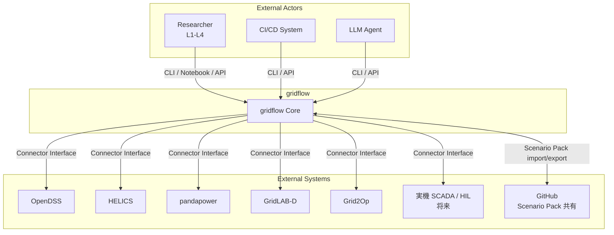
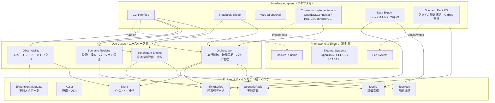
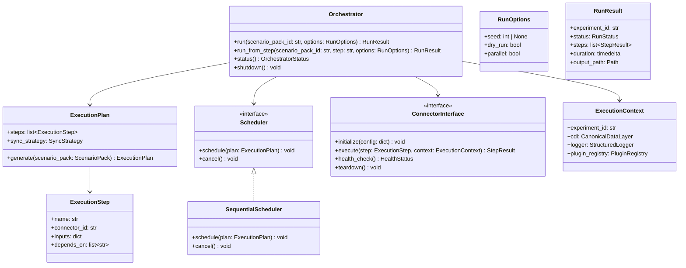
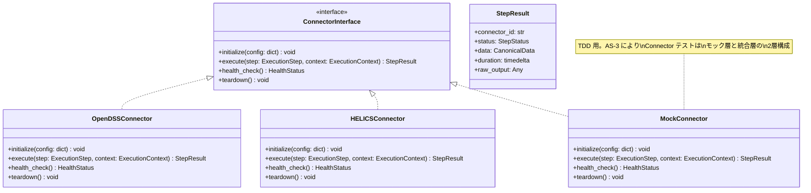
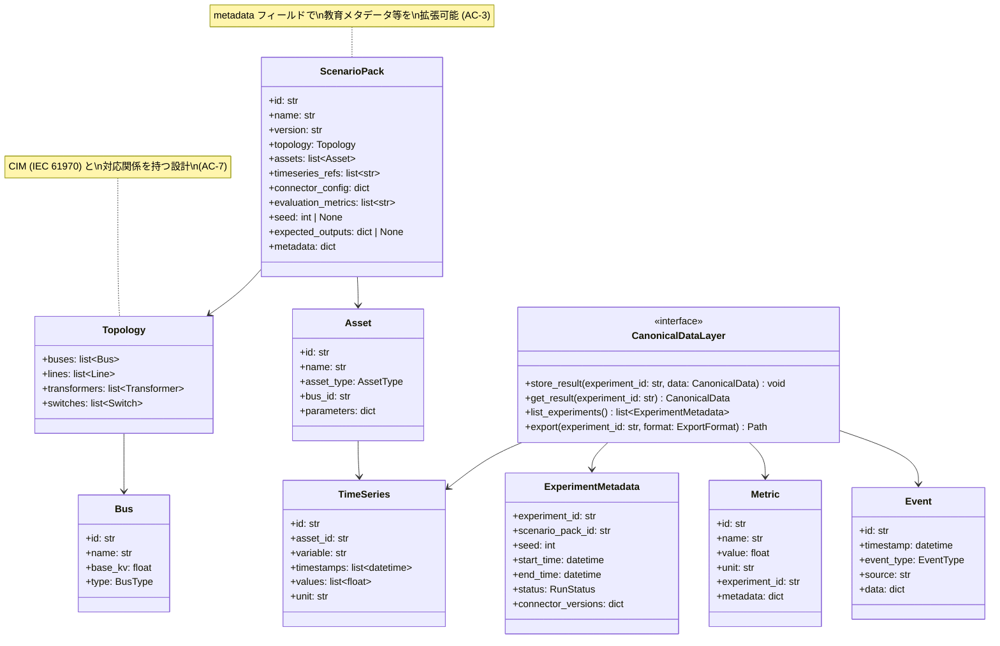
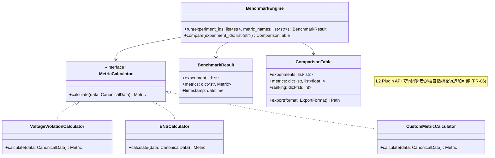
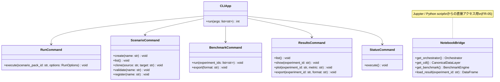

# 3. 静的ビュー

## 3.1 ブロック図（システムコンテキスト・サブシステム分割）

### 3.1.1 システムコンテキスト図

gridflow と外部システム・アクターの境界を示す。

> **注:** Connector Interface はシミュレータ/実機を区別しない（AS-4）。全ての外部システムは同一インターフェースの異なる実装として接続される。

### 3.1.2 サブシステム分割（Clean Architecture レイヤー）

AS-2（Clean Architecture）に基づき、依存方向を「外側 → 内側」に統一する。AS-1（DDD）に基づき、各サブシステムは Bounded Context を形成する。

### 3.1.3 Bounded Context の対応関係

| Bounded Context | Clean Architecture レイヤー | 責務 | 対応 FR |
|---|---|---|---|
| **Experiment Domain** | Entities | 電力系統実験のドメインモデル（Topology, Asset, TimeSeries, Event, Metric, ExperimentMetadata, ScenarioPack） | FR-01, FR-03 |
| **Orchestration** | Use Cases | 実験の実行制御。Scenario Pack のロード、Connector の初期化、ステップ実行、時間同期、結果収集 | FR-02 |
| **Evaluation** | Use Cases | 実験結果の評価。評価指標の算出、複数実験の比較、レポート生成 | FR-04 |
| **Scenario Management** | Use Cases | Scenario Pack の登録・検索・バージョン管理 | FR-01 |
| **Observability** | Use Cases | 実行ログ、トレース、KPI メトリクスの収集・提供 | QA-8 |
| **Connectors** | Interface Adapters | 外部システム（シミュレータ/実機）との接続。各 Connector が Orchestration の定義するインターフェースを実装 | FR-07 |
| **UX** | Interface Adapters | CLI、Notebook Bridge、Web UI。Use Cases 層を呼び出す窓口 | FR-05 |
| **Data Export** | Interface Adapters | CDL のデータを CSV/JSON/Parquet に変換して出力 | FR-03 |
| **Plugin System** | 横断 (Use Cases + Interface Adapters) | L1-L4 カスタムレイヤー。L1: Scenario Pack のパラメータ変更、L2: Use Cases 層への Plugin 注入、L3: Connector 追加、L4: ソース改変 | FR-06 |

---

## 3.2 クラス図（主要モジュールの内部構造・インターフェース）

### 3.2.1 Core Runtime（Orchestration Bounded Context）

> **設計ポイント:**
> - `ConnectorInterface` は AS-4 により、シミュレータ/実機を区別しない
> - `Scheduler` はインターフェース（AS-2: DI）。P0 は `SequentialScheduler`、将来の並列実行は別実装で差替え
> - `ExecutionContext` に `PluginRegistry` を含め、L2 プラグインが実行時に呼び出される（FR-06）
> - `run_from_step` は AC-5（cache/resume）の拡張ポイント

### 3.2.2 Connectors（Connector Bounded Context）

> **設計ポイント:**
> - 全 Connector が同一インターフェースを実装（AS-2, AS-4）
> - `MockConnector` は AS-3（TDD）のためのテストダブル
> - `StepResult.data` は `CanonicalData` 型（Entities 層）を返す。Connector 内部で外部フォーマット → CDL 変換を行う
> - 将来の実機 Connector（SCADA, HIL）も同一インターフェースで追加可能

### 3.2.3 Data Model（Experiment Domain Bounded Context = CDL）

> **設計ポイント:**
> - Entities 層は外部依存なし（AS-2）。Pure Python のデータクラス
> - `Topology`, `Asset` は CIM (IEC 61970) と対応関係を持つ（AC-7）
> - `ScenarioPack.metadata` は拡張可能な dict で、教育メタデータ（AC-3）や将来の追加属性に対応
> - `CanonicalDataLayer` はインターフェース。P0 はファイルシステム実装、将来は DB 実装に差替え可能

### 3.2.4 Evaluation（Evaluation Bounded Context）

### 3.2.5 UX（UX Bounded Context）

---

## 3.3 配置図（Docker コンテナ・ホスト環境の物理配置）

> **注:** 配置図は Round 3 で作成する。Docker Compose 構成、コンテナ間通信、データボリュームの配置を、シーケンス図で明らかになるプロセス間通信を反映して記述する予定。
