# 4. 動的ビュー

## 4.1 ユースケース図

### アクター定義

| アクター | 説明 | カスタムレイヤー |
|---|---|---|
| Researcher (L1) | 初心者・学部生。YAML/JSON のパラメータ変更で実験を行う | L1: 設定変更 |
| Researcher (L2) | 修士・標準的な研究者。Plugin API に関数/クラスを実装する | L2: Plugin API |
| Researcher (L3) | 上級研究者。新しい Connector やモジュールを追加する | L3: モジュール拡張 |
| Researcher (L4) | 開発者・共同研究者。OSS フォークして自由に改変する | L4: ソース改変 |
| CI/CD System | GitHub Actions 等の自動化システム。テスト・ベンチマークを自動実行する | — |
| LLM Agent | Claude 等の AI エージェント。研究者の指示を受けて実験を計画・実行・分析する | — |

> **注:** 学生・教員は独立したアクターとして定義せず、L1〜L4 の研究者レベルに包含する（AC-3: 教育は教員パートナーに委ねる方針のため）。以下のユースケース図では、L1〜L4 の研究者を区別せず「Researcher」として表記する。各ユースケースシナリオ（4.2）で、どのレベルの研究者が主アクターかを明示する。

### 4.1.1 全体ユースケース図

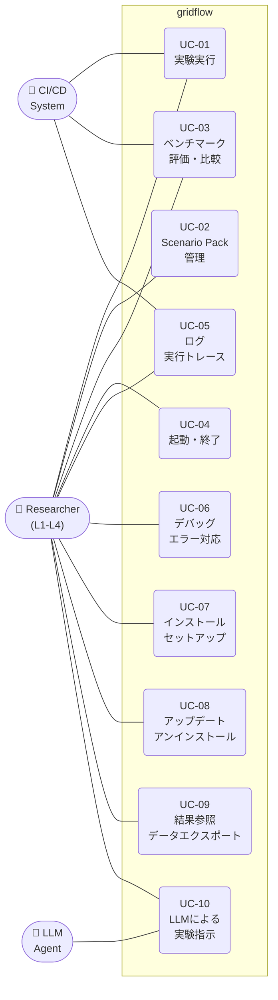

> **ユースケース図の分析:**
> - Researcher は全 10 UC にアクセスする唯一の完全アクター。これは gridflow が CLI ファーストのツールであり、全操作が研究者の手元で完結することを反映している
> - CI/CD System は実験実行・評価・ログの 3 UC のみ。自動化に必要な最小限の操作に限定しており、セットアップや Scenario Pack 管理は人間が行う設計判断
> - LLM Agent は UC-10 のみに接続。LLM は既存 UC を間接的に（UC-10 経由で）呼び出すため、gridflow 内部に LLM 固有コードは不要（QA-9）

### 4.1.2 ユースケース間の関係

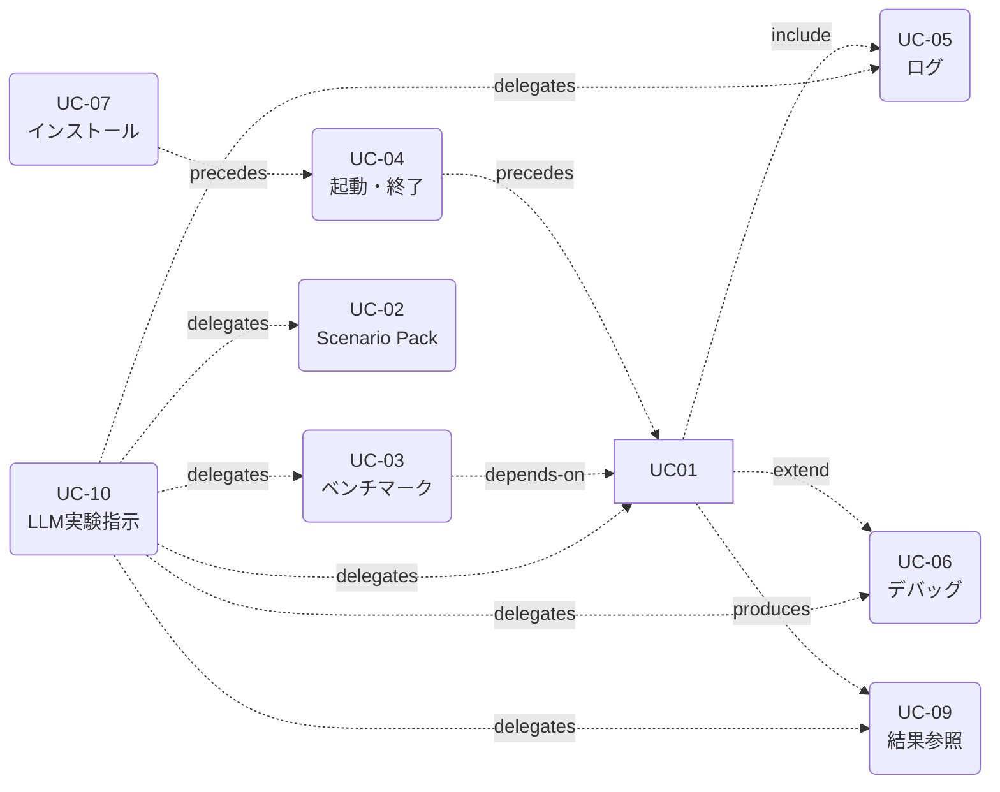

| 関係 | 意味 |
|---|---|
| UC-07 precedes UC-04 | インストール完了が環境起動の前提 |
| UC-04 precedes UC-01 | 環境起動が実験実行の前提条件（UC-01 が UC-04 をトリガーするわけではない） |
| UC-01 include UC-05 | 実験実行中にログが自動出力される |
| UC-01 extend UC-06 | 実験実行中にエラーが発生した場合にデバッグフローに分岐 |
| UC-01 produces UC-09 | 実験実行の結果が結果参照の入力になる |
| UC-03 depends-on UC-01 | ベンチマーク評価には実験実行結果が必要（事前に UC-01 が完了していること。UC-03 が UC-01 をトリガーするわけではない） |
| UC-10 delegates to UC-01,02,03,05,06,09 | LLM が既存ユースケースを組み合わせて実験を遂行する（UC-05 でログ参照、UC-06 でエラー分析を含む） |

> **関係図の分析:** UC-01（実験実行）が最も多くの関係を持つ中心 UC であり、アーキテクチャの設計はこのフローを軸に組み立てられている。UC-10 は 6 つの UC（UC-01,02,03,05,06,09）に委譲するが、新しい機能を追加しない — gridflow の LLM 対応コストが最小であることを示す構造上の判断。

### 4.1.3 起動・終了

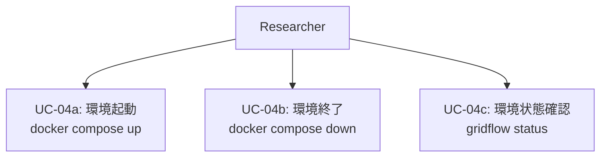

### 4.1.4 ログ・実行トレース

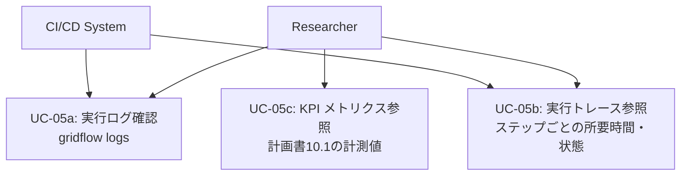

### 4.1.5 デバッグ・エラー対応

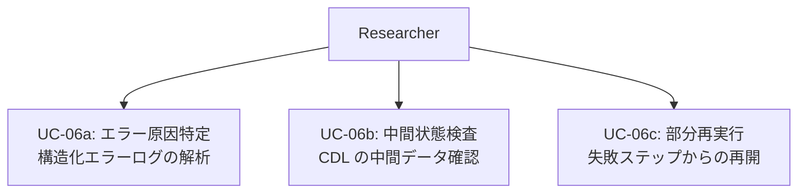

---

## 4.2 ユースケースシナリオ

### UC-01: 実験実行

| 項目 | 内容 |
|---|---|
| **主アクター** | Researcher (L1〜L4)、CI/CD System |
| **目的** | Scenario Pack に定義された実験を外部システム（シミュレータまたは実機）で実行し、結果を CDL に格納する |
| **事前条件** | 環境が起動済み（UC-04a）。Scenario Pack が Registry に登録済み（UC-02） |
| **トリガー** | `gridflow run <scenario-pack>` コマンドの実行 |
| **関連 FR** | FR-01, FR-02, FR-03, FR-05, FR-06, FR-07 |
| **関連 QA** | QA-2（初回利用効率）, QA-3（再現性）, QA-4（拡張性）, QA-5（ワークフロー効率）, QA-8（可観測性） |

**基本フロー:**
1. ユーザーが CLI で `gridflow run <scenario-pack>` を実行する
2. Orchestrator が Scenario Registry から指定の Scenario Pack をロードする
3. Orchestrator が Scenario Pack の設定を検証する（ネットワーク定義、実行対象設定、seed 等）
4. Orchestrator が必要な Connector を初期化する（Docker コンテナの起動等、Connector 実装依存の初期化を含む）
5. Orchestrator が実行計画（ステップ順序・時間同期方式）を生成する
6. Orchestrator が各ステップを順次/並列に実行する
   - 各 Connector が外部システム（シミュレータ/実機）を呼び出し、結果を CDL 形式に変換する
   - L2+ 研究者が Plugin API で登録したカスタムロジック（制御アルゴリズム等）がステップ内で呼び出される（FR-06）
   - 各ステップの開始・終了・所要時間がログに記録される（QA-8）
7. 全ステップ完了後、結果が CDL に格納される
8. 実行サマリ（成功/失敗、所要時間、出力ファイルパス）が CLI に表示される

**代替フロー:**
- **3a.** 検証エラー: Scenario Pack の設定不備を報告し、実行を中断する。エラーメッセージに原因と対処を含める（QA-9）
- **4a.** Connector 初期化失敗: Docker イメージ未取得、接続先未応答等。エラーを報告し、セットアップ手順を案内する
- **6a.** ステップ実行エラー: UC-06（デバッグ・エラー対応）に分岐。エラー発生ステップと中間状態をログに記録する

**事後条件:**
- 結果が CDL に格納されている
- 実行ログが構造化形式で保存されている
- 同一の Scenario Pack・seed で再実行した場合、同一の結果が得られる（QA-3）

---

### UC-02: Scenario Pack 管理

| 項目 | 内容 |
|---|---|
| **主アクター** | Researcher (L1: パラメータ変更、L2+: 新規作成) |
| **目的** | Scenario Pack を作成・登録・検索・バージョン管理する |
| **事前条件** | 環境が起動済み（UC-04a） |
| **トリガー** | `gridflow scenario <subcommand>` コマンドの実行 |
| **関連 FR** | FR-01, FR-03, FR-05, FR-06, FR-07（validate 時に Connector 互換性をチェックするため） |
| **関連 QA** | QA-3（再現性）, QA-4（拡張性）, QA-5（ワークフロー効率） |

**基本フロー（新規作成）:**
1. ユーザーが `gridflow scenario create <name>` を実行する
2. テンプレートから Scenario Pack のスケルトンが生成される
3. ユーザーがネットワーク定義・時系列データ・実行対象設定・評価指標を編集する
   - L1: YAML/JSON のパラメータ変更のみ
   - L2+: Plugin API でカスタムロジックを追加
4. ユーザーが `gridflow scenario validate <name>` で検証する
5. ユーザーが `gridflow scenario register <name>` で Registry に登録する

**基本フロー（既存 Pack の利用）:**
1. ユーザーが `gridflow scenario list` で Registry から検索する
2. ユーザーが `gridflow scenario clone <name> <new-name>` で複製する
3. パラメータを変更して新しいバリアントとして登録する

**代替フロー:**
- **4a.** 検証エラー: 不足フィールドや不整合を報告する
- **5a.** 名前重複: バージョニングを提案する

**事後条件:**
- Scenario Pack が Registry に登録され、バージョン管理されている
- 登録された Pack は `gridflow run` で実行可能

---

### UC-03: ベンチマーク評価・比較

| 項目 | 内容 |
|---|---|
| **主アクター** | Researcher (L1〜L4)、CI/CD System |
| **目的** | 複数の実験結果を定量的な評価指標で比較する |
| **事前条件** | 比較対象の実験結果が CDL に格納済み |
| **トリガー** | `gridflow benchmark <subcommand>` コマンドの実行 |
| **関連 FR** | FR-01, FR-03, FR-04, FR-05, FR-06 |
| **関連 QA** | QA-5（ワークフロー効率）, QA-6（データエクスポート容易性） |

**基本フロー:**
1. ユーザーが `gridflow benchmark run <experiment-ids>` を実行する
2. Benchmark Harness が CDL から対象実験の結果を取得する
3. Scenario Pack に定義された評価指標（電圧逸脱率、ENS、CO2 等）を算出する。L2 研究者がカスタム指標を追加している場合、それも同時に算出される（FR-06: MetricCalculator の Strategy パターン）
4. 複数実験間の比較表・ランキングを生成する
5. 結果をレポート形式（表・図）で出力する
6. ユーザーが `gridflow benchmark export <format>` でデータをエクスポートする（CSV/JSON/Parquet）

**代替フロー:**
- **2a.** 実験結果未完了: 未完了の実験があれば、先に実験実行（UC-01）を促す
- **3a.** 評価指標未定義: Scenario Pack に指標定義がない場合、デフォルト指標セットを提案する

**事後条件:**
- 比較結果が構造化データとして出力されている
- エクスポートデータは 3 ステップ以内で論文図表に変換可能（QA-6）

---

### UC-04: 起動・終了

| 項目 | 内容 |
|---|---|
| **主アクター** | Researcher |
| **目的** | gridflow の実行環境を起動・終了・状態確認する |
| **事前条件** | Docker Desktop がインストール済み |
| **トリガー** | `docker compose up` / `docker compose down` / `gridflow status` |
| **関連 FR** | FR-02, FR-05 |
| **関連 QA** | QA-1（導入容易性）, QA-2（初回利用効率）, QA-7（ポータビリティ） |

**基本フロー（起動）:**
1. ユーザーが `docker compose up` を実行する
2. Docker Compose が gridflow コアコンテナを起動する
3. Orchestrator が初期化される（設定読み込み、Registry 接続、ヘルスチェック）
4. 起動完了メッセージが表示される（起動時間、利用可能な Connector 一覧）

**基本フロー（終了）:**
1. ユーザーが `docker compose down` を実行する
2. 実行中の実験があれば、中断確認を表示する
3. Orchestrator がグレースフルシャットダウンを実行する（中間状態の保存）
4. 全コンテナが停止する

**基本フロー（状態確認）:**
1. ユーザーが `gridflow status` を実行する
2. 各コンポーネントの状態（Orchestrator、Connector、Registry）が表示される
3. 実行中の実験があれば進捗が表示される

**代替フロー:**
- **2a.** Docker Desktop 未起動: エラーメッセージに Docker Desktop の起動手順を含める（QA-9）
- **3a.** Connector 起動失敗: 起動に失敗した Connector を報告し、他の機能は使用可能であることを案内する

**事後条件:**
- 起動: Orchestrator が稼働し、CLI コマンドを受け付け可能
- 終了: 全コンテナが停止し、中間状態が保存されている

---

### UC-05: ログ・実行トレース

| 項目 | 内容 |
|---|---|
| **主アクター** | Researcher、CI/CD System |
| **目的** | 実行ログの確認、パイプラインの実行トレース参照、KPI メトリクスの確認 |
| **事前条件** | 環境が起動済み。参照対象の実行記録が存在する |
| **トリガー** | `gridflow logs` / `gridflow trace` / `gridflow metrics` |
| **関連 FR** | FR-02, FR-03, FR-05 |
| **関連 QA** | QA-8（可観測性）, QA-9（LLM 親和性） |

**基本フロー（ログ確認）:**
1. ユーザーが `gridflow logs [--experiment <id>] [--level <level>]` を実行する
2. 構造化ログが表示される（タイムスタンプ、コンポーネント、レベル、メッセージ）
3. フィルタリング・検索が可能

**基本フロー（実行トレース）:**
1. ユーザーが `gridflow trace <experiment-id>` を実行する
2. 実行パイプラインの各ステップが時系列で表示される
   - ステップ名、開始/終了時刻、所要時間、状態（成功/失敗/スキップ）
3. ボトルネックとなったステップがハイライトされる

**基本フロー（KPI メトリクス）:**
1. ユーザーが `gridflow metrics` を実行する
2. 計画書 10.1 の KPI に対応する計測値が表示される
   - セットアップからの経過時間、コマンド実行回数、実験成功率等

**事後条件:**
- ログ・トレース・メトリクスが構造化された形式で参照可能
- CI/CD System が自動で取得可能（JSON 出力対応）

---

### UC-06: デバッグ・エラー対応

| 項目 | 内容 |
|---|---|
| **主アクター** | Researcher (L1〜L4) |
| **目的** | 実験実行中のエラーの原因を特定し、対処する |
| **事前条件** | 実験実行（UC-01）でエラーが発生した |
| **トリガー** | UC-01 のエラー発生 / `gridflow debug <experiment-id>` |
| **関連 FR** | FR-02, FR-03, FR-05 |
| **関連 QA** | QA-8（可観測性）, QA-9（LLM 親和性） |

**基本フロー:**
1. エラー発生時、Orchestrator がエラーの発生箇所（どのステップ・どの Connector）を特定する
2. 構造化エラーログが出力される（エラー種別、発生箇所、入力データ、スタックトレース）
3. ユーザーが `gridflow debug <experiment-id>` を実行する
4. エラー発生ステップの入出力データが CDL 経由で参照可能になる
5. ユーザーがエラー原因を特定する
   - L1: エラーメッセージの対処手順に従う
   - L2+: 中間データを Notebook で検査し、原因を分析する
6. 原因を修正後、`gridflow run --from-step <step> <scenario-pack>` で失敗箇所から再実行する

**代替フロー:**
- **2a.** Connector 内部エラー: 外部システムのエラーを gridflow 形式に変換し、元のエラーメッセージも保持する
- **5a.** LLM 支援: エラーログが構造化されており、LLM（Claude 等）にエラーログを渡して原因分析を依頼可能（QA-9）

**事後条件:**
- エラー原因が特定されている
- 修正後、失敗箇所から再実行可能（AC-5: cache/resume の設計配慮）

---

### UC-07: インストール・セットアップ

| 項目 | 内容 |
|---|---|
| **主アクター** | Researcher (L1〜L4) |
| **目的** | gridflow を初めて導入し、最初の実験が実行可能な状態にする |
| **事前条件** | Docker Desktop がインストール済み。ネットワーク接続あり |
| **トリガー** | ドキュメントのインストール手順に従う |
| **関連 FR** | FR-01, FR-02, FR-05, FR-07 |
| **関連 QA** | QA-1（導入容易性）, QA-2（初回利用効率）, QA-7（ポータビリティ）, QA-8（可観測性） |

**基本フロー:**
1. ユーザーが gridflow リポジトリを clone する
2. ユーザーが `docker compose up` を実行する（Docker イメージの pull を含む）
3. 初回起動時に自動セットアップが実行される
   - Orchestrator の初期設定
   - サンプル Scenario Pack のダウンロード・Registry への登録
   - Connector の動作確認（ヘルスチェック）
4. セットアップ完了メッセージが表示される（所要時間、次のステップの案内）
5. ユーザーが `gridflow run <sample-scenario>` でサンプル実験を実行する（QA-2: TTFS < 1時間）
6. セットアップ完了時刻が QA-8 のメトリクスとして記録される

**代替フロー:**
- **2a.** Docker イメージ pull 失敗: ネットワーク接続を確認するエラーメッセージを表示。オフラインインストール手順を案内
- **3a.** Connector ヘルスチェック失敗: 失敗した Connector を報告し、他の機能は使用可能であることを案内。個別の修正手順を表示
- **2b.** 開発者モード: ローカル環境への直接インストール（CON-2）。Docker なしで開発・テスト可能

**事後条件:**
- gridflow が起動し、CLI コマンドを受け付け可能
- サンプル Scenario Pack が Registry に登録済み
- セットアップ完了時間 < 30分（QA-1）

---

### UC-08: アップデート・アンインストール

| 項目 | 内容 |
|---|---|
| **主アクター** | Researcher (L1〜L4) |
| **目的** | gridflow のバージョン更新、または完全な削除を行う |
| **事前条件** | gridflow がインストール済み（UC-07 完了済み） |
| **トリガー** | `gridflow update` / `gridflow uninstall` |
| **関連 FR** | FR-01, FR-02, FR-05 |
| **関連 QA** | QA-1（導入容易性）, QA-3（再現性）, QA-7（ポータビリティ）, QA-8（可観測性） |

**基本フロー（アップデート）:**
1. ユーザーが `gridflow update` を実行する
2. 現在のバージョンと最新バージョンを比較・表示する
3. ユーザーがアップデートを承認する
4. Docker イメージの更新を実行する
5. 必要に応じてデータマイグレーションを実行する（Scenario Pack フォーマット変更等）
6. アップデート完了メッセージを表示する（変更内容サマリ）

**基本フロー（アンインストール）:**
1. ユーザーが `gridflow uninstall` を実行する
2. 削除対象を表示する（Docker イメージ、データボリューム、設定ファイル）
3. ユーザーデータ（Scenario Pack、実験結果）の保全について確認する
   - エクスポート → 削除 / データを残して環境のみ削除 / 完全削除
4. 承認後、選択に応じた削除を実行する
5. 削除完了メッセージを表示する

**代替フロー:**
- **5a.** マイグレーション失敗: ロールバック手順を案内し、旧バージョンに戻す
- **3a.** 実行中の実験がある場合: 実験完了を待つか中断するか確認する

**事後条件:**
- アップデート: 最新バージョンで動作。既存 Scenario Pack・実験結果が保持されている
- アンインストール: 選択に応じてデータが保全/削除されている

---

### UC-09: 結果参照・データエクスポート

| 項目 | 内容 |
|---|---|
| **主アクター** | Researcher (L1〜L4)（LLM Agent は UC-10 経由で間接的に利用） |
| **目的** | 実験結果を閲覧・可視化し、外部利用のためにエクスポートする |
| **事前条件** | 実験結果が CDL に格納済み（UC-01 完了後） |
| **トリガー** | `gridflow results <subcommand>` コマンドの実行 |
| **関連 FR** | FR-01, FR-03, FR-05（FR-04 のベンチマーク結果も CDL 経由で参照対象に含まれるが、UC-09 自体は評価を行わない） |
| **関連 QA** | QA-6（データエクスポート容易性）, QA-9（LLM 親和性） |

**基本フロー（結果参照）:**
1. ユーザーが `gridflow results list` で実験結果の一覧を表示する
2. ユーザーが `gridflow results show <experiment-id>` で結果のサマリを表示する
   - 実行日時、Scenario Pack 名、主要メトリクス、成否
3. ユーザーが `gridflow results plot <experiment-id> [--metric <name>]` で可視化する

**基本フロー（データエクスポート）:**
1. ユーザーが `gridflow results export <experiment-id> --format <csv|json|parquet>` を実行する
2. CDL から指定形式でデータをエクスポートする
3. 出力ファイルパスを表示する

**基本フロー（Notebook 連携）:**
1. ユーザーが Notebook から gridflow のプログラミング API を使って結果にアクセスする
2. CDL のデータをテーブル形式のデータ構造として取得し、自由に分析・可視化する

**代替フロー:**
- **1a.** 実験結果が存在しない: 実験実行（UC-01）を案内する

**事後条件:**
- エクスポートデータは 3 ステップ以内で論文図表に変換可能（QA-6）
- エクスポート形式は LLM が解析可能な構造化テキスト（QA-9）

---

### UC-10: LLM による実験指示

| 項目 | 内容 |
|---|---|
| **主アクター** | Researcher (L1〜L4)、LLM Agent |
| **目的** | 研究者が LLM に自然言語で実験を指示し、LLM が gridflow の操作を組み合わせて実験を遂行する |
| **事前条件** | 環境が起動済み（UC-04a）。LLM Agent が gridflow の CLI / API にアクセス可能 |
| **トリガー** | 研究者が LLM に実験を依頼する（チャット、スクリプト等） |
| **関連 FR** | FR-01, FR-02, FR-03, FR-04, FR-05, FR-06 |
| **関連 QA** | QA-2（初回利用効率）, QA-3（再現性）, QA-5（ワークフロー効率）, QA-8（可観測性）, QA-9（LLM 親和性） |

**基本フロー:**
1. 研究者が LLM に実験意図を伝える
   - 例:「IEEE 13バスフィーダーで PV 浸透率を 20%〜80% まで変えて voltage violation を比較して」
2. LLM が意図を解釈し、実行計画を生成する
   - Scenario Pack の選択/生成（UC-02 を委譲）
   - パラメータバリエーションの定義
   - 評価指標の選択
3. LLM が研究者に実行計画を確認する（安全弁）
4. 研究者が承認する
5. LLM が gridflow CLI / API を通じて実験を実行する
   - `gridflow scenario clone` → パラメータ変更 → `gridflow run`（UC-01 を委譲）
   - 複数バリエーションの batch 実行
6. LLM が結果を取得し、比較分析する（UC-09, UC-03 を委譲）
7. LLM が研究者に結果サマリ・考察を報告する

**代替フロー:**
- **2a.** 意図が曖昧: LLM が研究者に明確化を求める
- **4a.** 研究者が修正指示: LLM が計画を修正して再提示する
- **5a.** 実行エラー: LLM がエラーログを解析し（UC-06 + QA-9）、修正案を提示する

**事後条件:**
- 研究者の意図に沿った実験が実行され、結果が CDL に格納されている
- 実験の全過程（LLM の判断を含む）がログとして記録されている（QA-8）
- 研究者が結果を確認し、論文化可能な状態になっている

**設計上の重要事項:**
- UC-10 は新しい機能を作るのではなく、**既存の UC-01〜UC-09 を LLM が組み合わせて呼び出す**構成である
- gridflow が提供するのは、LLM が操作しやすいインターフェース（QA-9: 構造化 I/O、自己説明的エラー、Ubiquitous Language）
- 実験の「最終承認」は常に研究者が行う（LLM の自律実行は安全弁を通す）

---

## 4.3 シーケンス図

シーケンス図は静的ビュー（セクション 3）のコンポーネントをライフラインとして使用する。各 UC に対応するシーケンス図を以下に示す。

### 4.3.1 実験実行フロー（UC-01）

gridflow の最も中心的なフロー。制御フロー（左→右）とデータフロー（下方向）を示す。

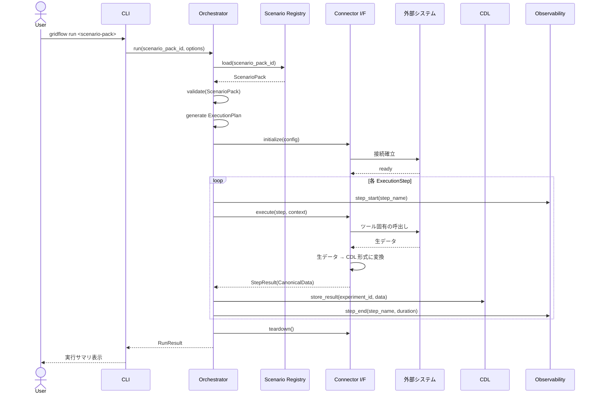

> **静的ビューとの対応:**
> - Orchestrator, Connector I/F, CDL は 3.2.1 のインターフェース境界 ①②
> - `生データ → CDL 形式に変換` は Anti-Corruption Layer（2.4.1）
> - Logger は Observability（QA-8）の具体化

### 4.3.2 Scenario Pack 管理フロー（UC-02）

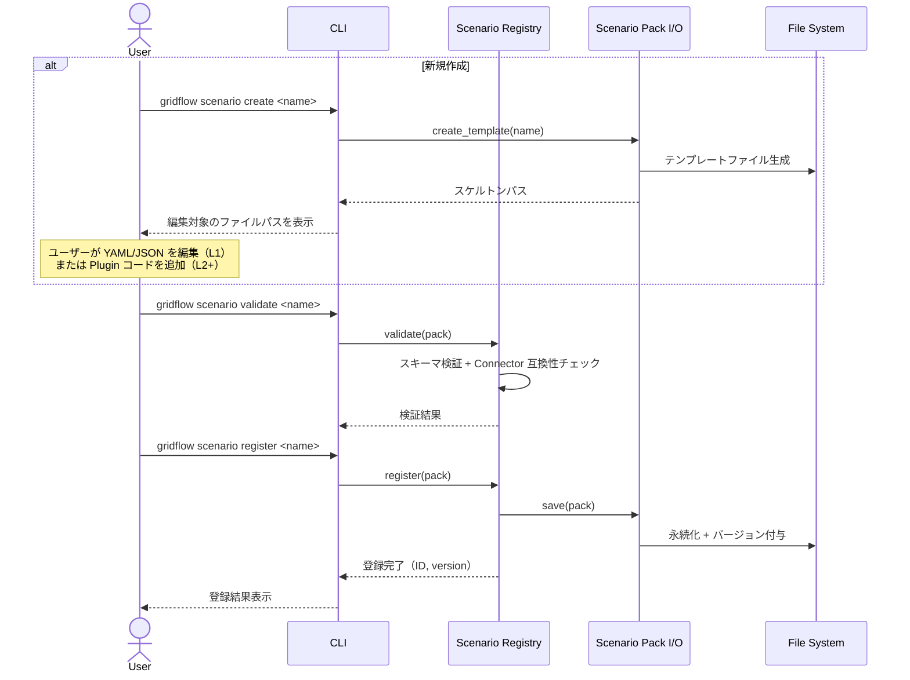

### 4.3.3 ベンチマーク評価フロー（UC-03）

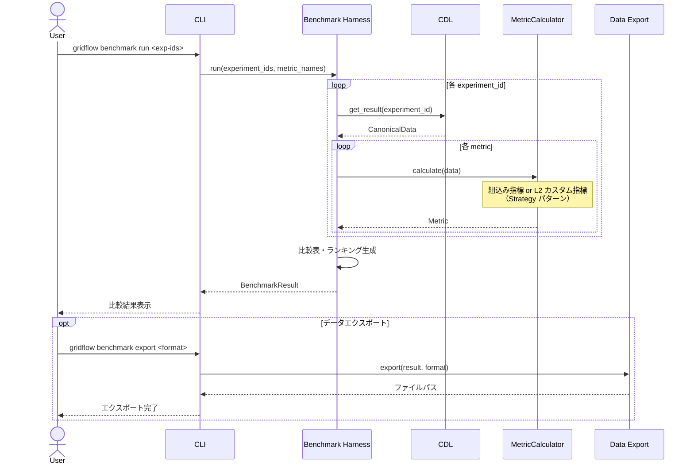

> **静的ビューとの対応:**
> - MetricCalculator は 3.2.1 のインターフェース境界 ③（Strategy パターン）
> - CDL は 3.2.1 のインターフェース境界 ②（Repository パターン）

### 4.3.4 起動・終了フロー（UC-04）

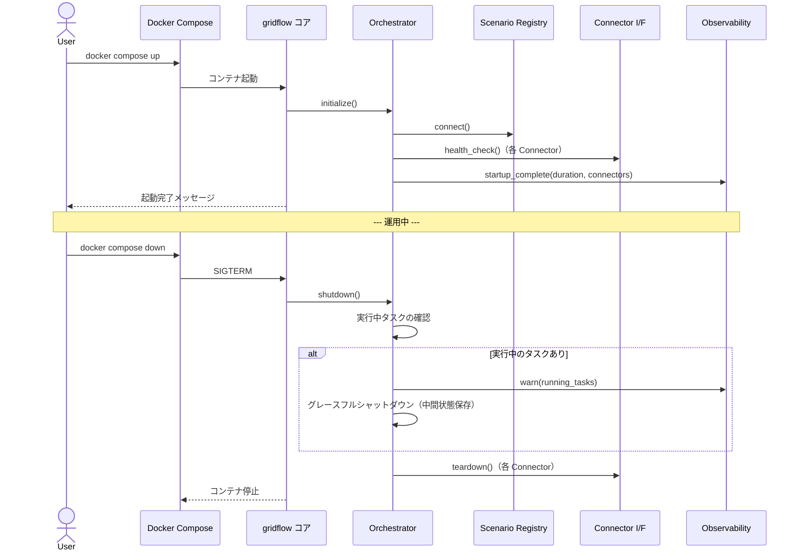

> **分析・設計判断:**
> - **グレースフルシャットダウン**を採用（即座のプロセス kill ではない）。中間状態を保存することで AC-5（cache/resume）への拡張パスを確保
> - **実行中タスクの検出**は Orchestrator が持つ ExecutionContext の状態で判断。外部ツール側の状態は Connector.teardown() に委任
> - Bootstrap（3.2.1）が起動・終了の両方を管理し、初回起動検知（UC-07）もここで行う

### 4.3.5 ログ確認フロー（UC-05）

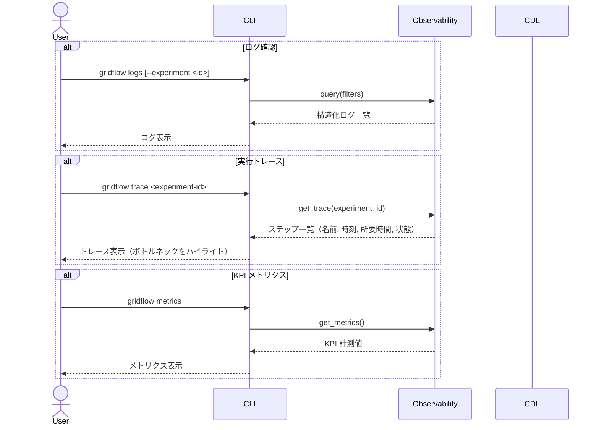

> **分析・設計判断:**
> - ログ・トレース・メトリクスの **3 モード分離**は、利用者の意図が異なるため。ログ＝何が起きたか、トレース＝どこが遅いか、メトリクス＝KPI を満たしているか
> - 全モードが **Observability** という単一のコンポーネントを経由する。これにより QA-8 の「全 KPI がシステム内在の計測機構で取得可能」が実現される
> - JSON 出力対応により CI/CD System と LLM Agent が構造化データとして取得可能（QA-9）

### 4.3.6 エラー発生時のデバッグフロー（UC-06）

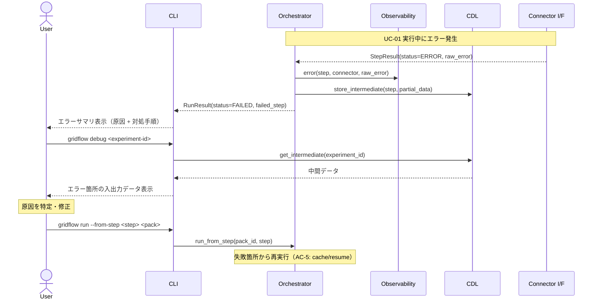

### 4.3.7 インストール・セットアップフロー（UC-07）

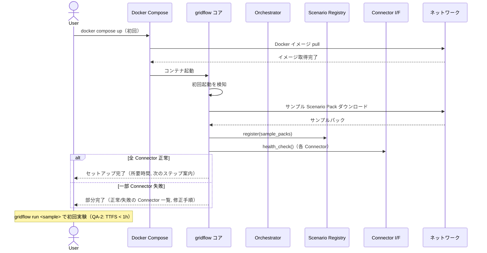

> **分析・設計判断:**
> - **初回起動検知**は Bootstrap が担う（3.2.1）。2 回目以降の起動では UC-04 に直行し、サンプル DL 等は実行しない
> - **部分完了の許容:** Connector ヘルスチェックが一部失敗しても、動作する Connector だけで利用可能とする。全 Connector 正常を前提にすると、未インストールのツールが1つあるだけで全機能が使えなくなる
> - **TTFS < 1h（QA-2）** はセットアップ完了後の最初の `gridflow run` までの時間。サンプル Scenario Pack が事前登録されるため、研究者は設定なしで即座に実行可能

### 4.3.8 アップデート・アンインストールフロー（UC-08）

UC-07（インストール）との違いを分析した上でフローを示す。

**UC-07 との差異分析:**

| 操作 | UC-07（インストール） | UC-08（アップデート） | UC-08（アンインストール） |
|---|---|---|---|
| データ状態 | なし（初回） | 既存データあり（Scenario Pack, 結果, ログ） | 既存データあり |
| 破壊リスク | なし | **マイグレーション失敗でデータ破損の可能性** | **意図しないデータ削除の可能性** |
| ロールバック | 不要 | **必要（旧バージョンに戻す手段）** | 不可逆（削除後は復元不可） |
| Connector 状態 | 初期化のみ | **既存 Connector との互換性検証が必要** | 切断のみ |

> **設計判断:** UC-08 は UC-07 の単純な逆操作ではない。既存データの保全とロールバック可能性が核心的な違いであり、独立したシーケンス図で扱う必要がある。

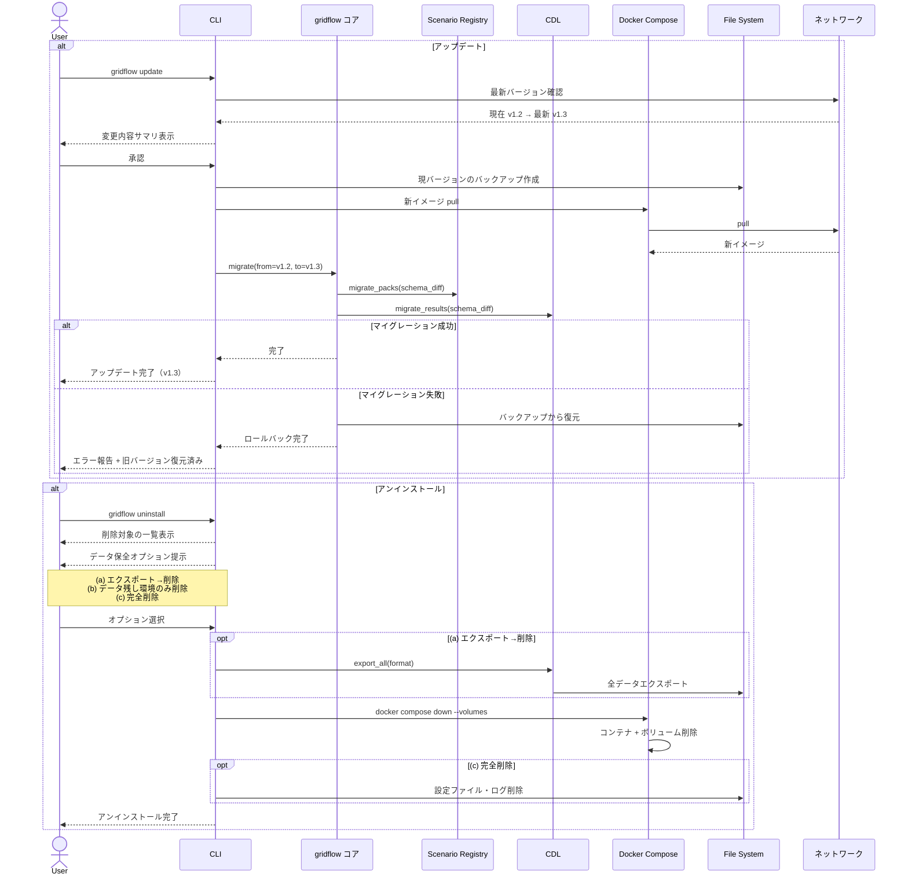

> **分析:**
> - **アップデート**の最重要設計判断は「バックアップ → マイグレーション → 失敗時ロールバック」の 3 段階。CDL と Registry の双方にスキーマ変更が波及するため、部分的な成功は許容しない（all-or-nothing）
> - **アンインストール**の最重要設計判断は「データ保全オプションの提示」。研究データの意図しない削除を防ぐため、デフォルトは (b) データ残しとする
> - いずれも UC-07 にはない「既存状態への配慮」が核心であり、Bootstrap（3.2.1）にマイグレーション責務を追加する必要がある

### 4.3.9 結果参照・データエクスポートフロー（UC-09）

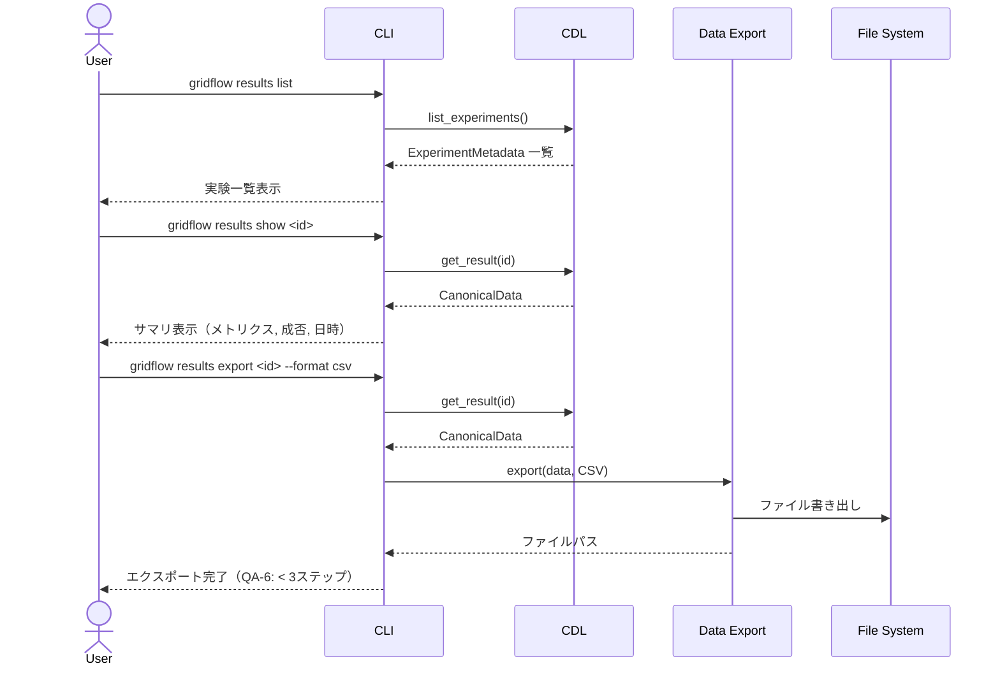

> **Notebook パス:** 上記は CLI 経由のフローを示す。Notebook からは NotebookBridge 経由で同じ CDL/Export を呼び出す（3.3 配置図: HTTP API 経由）。フローは CLI と同一のため図は省略。

> **分析・設計判断:**
> - **QA-6（< 3 ステップでエクスポート）** を実現するために、`gridflow results export` が 1 コマンドで CDL 読取り → 形式変換 → ファイル出力を完結させる
> - CLI と Notebook が**同じ Use Cases 層**を呼び出す設計（3.2.4）により、CLI でできることは必ず Notebook からもできる。これは研究者が CLI で素早く確認 → Notebook で深掘りするワークフロー（QA-5）を支える
> - エクスポート形式（CSV/JSON/Parquet）は Scenario Pack 内で指定可能にし、L1 研究者でも出力形式を変更できる

### 4.3.10 LLM による実験指示フロー（UC-10）

UC-10 は新しい機能を追加するのではなく、既存の UC を LLM Agent が組み合わせて呼び出すフローである。

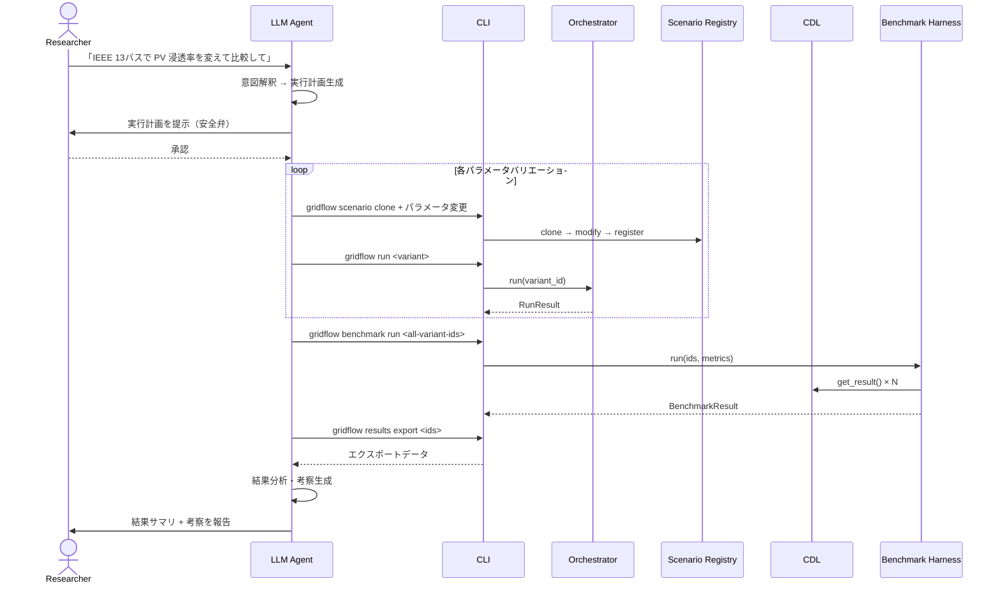

> **設計上の重要事項:** LLM Agent は gridflow の CLI/API を呼び出すだけであり、gridflow 内部に LLM 固有のコードは存在しない。QA-9（LLM 親和性）による構造化 I/O と自己説明的エラーが、LLM の操作を可能にする。
