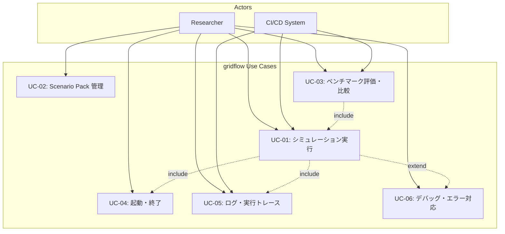
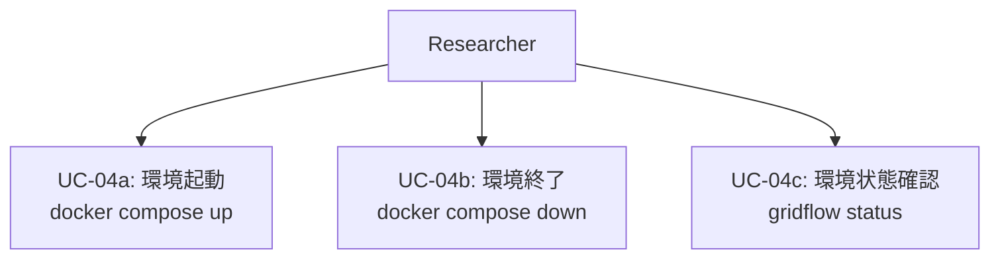
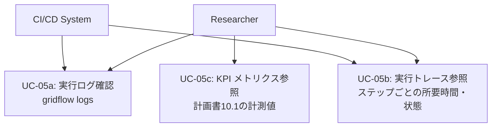
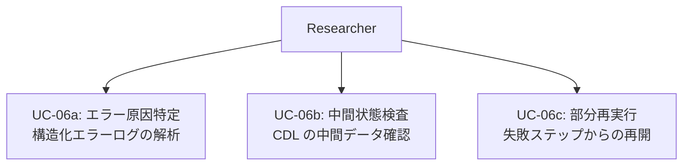

# 4. 動的ビュー

## 4.1 ユースケース図

### アクター定義

| アクター | 説明 | カスタムレイヤー |
|---|---|---|
| Researcher (L1) | 初心者・学部生。YAML/JSON のパラメータ変更で実験を行う | L1: 設定変更 |
| Researcher (L2) | 修士・標準的な研究者。Plugin API に Python 関数/クラスを実装する | L2: Plugin API |
| Researcher (L3) | 上級研究者。新しい Connector やモジュールを追加する | L3: モジュール拡張 |
| Researcher (L4) | 開発者・共同研究者。OSS フォークして自由に改変する | L4: ソース改変 |
| CI/CD System | GitHub Actions 等の自動化システム。テスト・ベンチマークを自動実行する | — |

> **注:** 以下のユースケース図では、L1〜L4 の研究者を区別せず「Researcher」として表記する。各ユースケースシナリオ（4.2）で、どのレベルの研究者が主アクターかを明示する。

### 4.1.1 全体ユースケース図

### 4.1.2 ユースケース間の関係

| 関係 | 意味 |
|---|---|
| UC-01 include UC-04 | シミュレーション実行には環境の起動が前提 |
| UC-01 include UC-05 | シミュレーション実行中にログが自動出力される |
| UC-01 extend UC-06 | シミュレーション実行中にエラーが発生した場合にデバッグフローに分岐 |
| UC-03 include UC-01 | ベンチマーク評価にはシミュレーション実行が必要 |

### 4.1.3 起動・終了

### 4.1.4 ログ・実行トレース

### 4.1.5 デバッグ・エラー対応

---

## 4.2 ユースケースシナリオ

### UC-01: シミュレーション実行

| 項目 | 内容 |
|---|---|
| **主アクター** | Researcher (L1〜L4)、CI/CD System |
| **目的** | Scenario Pack に定義された実験を実行し、結果を CDL に格納する |
| **事前条件** | 環境が起動済み（UC-04a）。Scenario Pack が Registry に登録済み（UC-02） |
| **トリガー** | `gridflow run <scenario-pack>` コマンドの実行 |
| **関連 FR** | FR-01, FR-02, FR-03, FR-07 |
| **関連 QA** | QA-3（再現性）, QA-5（ワークフロー効率）, QA-8（可観測性） |

**基本フロー:**
1. ユーザーが CLI で `gridflow run <scenario-pack>` を実行する
2. Orchestrator が Scenario Registry から指定の Scenario Pack をロードする
3. Orchestrator が Scenario Pack の設定を検証する（ネットワーク定義、実行対象設定、seed 等）
4. Orchestrator が必要な Connector を初期化する（Docker コンテナの起動等、Connector 実装依存の初期化を含む）
5. Orchestrator が実行計画（ステップ順序・時間同期方式）を生成する
6. Orchestrator が各ステップを順次/並列に実行する
   - 各 Connector が外部システム（シミュレータ/実機）を呼び出し、結果を CDL 形式に変換する
   - 各ステップの開始・終了・所要時間がログに記録される（QA-8）
7. 全ステップ完了後、結果が CDL に格納される
8. 実行サマリ（成功/失敗、所要時間、出力ファイルパス）が CLI に表示される

**代替フロー:**
- **3a.** 検証エラー: Scenario Pack の設定不備を報告し、実行を中断する。エラーメッセージに原因と対処を含める（QA-9）
- **4a.** Connector 初期化失敗: Docker イメージ未取得、接続先未応答等。エラーを報告し、セットアップ手順を案内する
- **6a.** ステップ実行エラー: UC-06（デバッグ・エラー対応）に分岐。エラー発生ステップと中間状態をログに記録する

**事後条件:**
- 結果が CDL に格納されている
- 実行ログが構造化形式で保存されている
- 同一の Scenario Pack・seed で再実行した場合、同一の結果が得られる（QA-3）

---

### UC-02: Scenario Pack 管理

| 項目 | 内容 |
|---|---|
| **主アクター** | Researcher (L1: パラメータ変更、L2+: 新規作成) |
| **目的** | Scenario Pack を作成・登録・検索・バージョン管理する |
| **事前条件** | 環境が起動済み（UC-04a） |
| **トリガー** | `gridflow scenario <subcommand>` コマンドの実行 |
| **関連 FR** | FR-01, FR-06 |
| **関連 QA** | QA-3（再現性）, QA-4（拡張性） |

**基本フロー（新規作成）:**
1. ユーザーが `gridflow scenario create <name>` を実行する
2. テンプレートから Scenario Pack のスケルトンが生成される
3. ユーザーがネットワーク定義・時系列データ・実行対象設定・評価指標を編集する
   - L1: YAML/JSON のパラメータ変更のみ
   - L2+: Plugin API でカスタムロジックを追加
4. ユーザーが `gridflow scenario validate <name>` で検証する
5. ユーザーが `gridflow scenario register <name>` で Registry に登録する

**基本フロー（既存 Pack の利用）:**
1. ユーザーが `gridflow scenario list` で Registry から検索する
2. ユーザーが `gridflow scenario clone <name> <new-name>` で複製する
3. パラメータを変更して新しいバリアントとして登録する

**代替フロー:**
- **4a.** 検証エラー: 不足フィールドや不整合を報告する
- **5a.** 名前重複: バージョニングを提案する

**事後条件:**
- Scenario Pack が Registry に登録され、バージョン管理されている
- 登録された Pack は `gridflow run` で実行可能

---

### UC-03: ベンチマーク評価・比較

| 項目 | 内容 |
|---|---|
| **主アクター** | Researcher (L1〜L4)、CI/CD System |
| **目的** | 複数の実験結果を定量的な評価指標で比較する |
| **事前条件** | 比較対象の実験結果が CDL に格納済み |
| **トリガー** | `gridflow benchmark <subcommand>` コマンドの実行 |
| **関連 FR** | FR-03, FR-04 |
| **関連 QA** | QA-5（ワークフロー効率）, QA-6（データエクスポート容易性） |

**基本フロー:**
1. ユーザーが `gridflow benchmark run <experiment-ids>` を実行する
2. Benchmark Harness が CDL から対象実験の結果を取得する
3. Scenario Pack に定義された評価指標（電圧逸脱率、ENS、CO2 等）を算出する
4. 複数実験間の比較表・ランキングを生成する
5. 結果をレポート形式（表・図）で出力する
6. ユーザーが `gridflow benchmark export <format>` でデータをエクスポートする（CSV/JSON/Parquet）

**代替フロー:**
- **2a.** 実験結果未完了: 未完了の実験があれば、先にシミュレーション実行（UC-01）を促す
- **3a.** 評価指標未定義: Scenario Pack に指標定義がない場合、デフォルト指標セットを提案する

**事後条件:**
- 比較結果が構造化データとして出力されている
- エクスポートデータは 3 ステップ以内で論文図表に変換可能（QA-6）

---

### UC-04: 起動・終了

| 項目 | 内容 |
|---|---|
| **主アクター** | Researcher |
| **目的** | gridflow の実行環境を起動・終了・状態確認する |
| **事前条件** | Docker Desktop がインストール済み |
| **トリガー** | `docker compose up` / `docker compose down` / `gridflow status` |
| **関連 FR** | FR-02 |
| **関連 QA** | QA-1（導入容易性）, QA-7（ポータビリティ） |

**基本フロー（起動）:**
1. ユーザーが `docker compose up` を実行する
2. Docker Compose が gridflow コアコンテナを起動する
3. Orchestrator が初期化される（設定読み込み、Registry 接続、ヘルスチェック）
4. 起動完了メッセージが表示される（起動時間、利用可能な Connector 一覧）

**基本フロー（終了）:**
1. ユーザーが `docker compose down` を実行する
2. 実行中のシミュレーションがあれば、中断確認を表示する
3. Orchestrator がグレースフルシャットダウンを実行する（中間状態の保存）
4. 全コンテナが停止する

**基本フロー（状態確認）:**
1. ユーザーが `gridflow status` を実行する
2. 各コンポーネントの状態（Orchestrator、Connector、Registry）が表示される
3. 実行中のシミュレーションがあれば進捗が表示される

**代替フロー:**
- **2a.** Docker Desktop 未起動: エラーメッセージに Docker Desktop の起動手順を含める（QA-9）
- **3a.** Connector 起動失敗: 起動に失敗した Connector を報告し、他の機能は使用可能であることを案内する

**事後条件:**
- 起動: Orchestrator が稼働し、CLI コマンドを受け付け可能
- 終了: 全コンテナが停止し、中間状態が保存されている

---

### UC-05: ログ・実行トレース

| 項目 | 内容 |
|---|---|
| **主アクター** | Researcher、CI/CD System |
| **目的** | 実行ログの確認、パイプラインの実行トレース参照、KPI メトリクスの確認 |
| **事前条件** | 環境が起動済み。参照対象の実行記録が存在する |
| **トリガー** | `gridflow logs` / `gridflow trace` / `gridflow metrics` |
| **関連 FR** | FR-02, FR-03 |
| **関連 QA** | QA-8（可観測性）, QA-9（LLM 親和性） |

**基本フロー（ログ確認）:**
1. ユーザーが `gridflow logs [--experiment <id>] [--level <level>]` を実行する
2. 構造化ログが表示される（タイムスタンプ、コンポーネント、レベル、メッセージ）
3. フィルタリング・検索が可能

**基本フロー（実行トレース）:**
1. ユーザーが `gridflow trace <experiment-id>` を実行する
2. 実行パイプラインの各ステップが時系列で表示される
   - ステップ名、開始/終了時刻、所要時間、状態（成功/失敗/スキップ）
3. ボトルネックとなったステップがハイライトされる

**基本フロー（KPI メトリクス）:**
1. ユーザーが `gridflow metrics` を実行する
2. 計画書 10.1 の KPI に対応する計測値が表示される
   - セットアップからの経過時間、コマンド実行回数、実験成功率等

**事後条件:**
- ログ・トレース・メトリクスが構造化された形式で参照可能
- CI/CD System が自動で取得可能（JSON 出力対応）

---

### UC-06: デバッグ・エラー対応

| 項目 | 内容 |
|---|---|
| **主アクター** | Researcher (L1〜L4) |
| **目的** | シミュレーション実行中のエラーの原因を特定し、対処する |
| **事前条件** | シミュレーション実行（UC-01）でエラーが発生した |
| **トリガー** | UC-01 のエラー発生 / `gridflow debug <experiment-id>` |
| **関連 FR** | FR-02, FR-03, FR-05 |
| **関連 QA** | QA-8（可観測性）, QA-9（LLM 親和性） |

**基本フロー:**
1. エラー発生時、Orchestrator がエラーの発生箇所（どのステップ・どの Connector）を特定する
2. 構造化エラーログが出力される（エラー種別、発生箇所、入力データ、スタックトレース）
3. ユーザーが `gridflow debug <experiment-id>` を実行する
4. エラー発生ステップの入出力データが CDL 経由で参照可能になる
5. ユーザーがエラー原因を特定する
   - L1: エラーメッセージの対処手順に従う
   - L2+: 中間データを Notebook で検査し、原因を分析する
6. 原因を修正後、`gridflow run --from-step <step> <scenario-pack>` で失敗箇所から再実行する

**代替フロー:**
- **2a.** Connector 内部エラー: 外部システムのエラーを gridflow 形式に変換し、元のエラーメッセージも保持する
- **5a.** LLM 支援: エラーログが構造化されており、LLM（Claude 等）にエラーログを渡して原因分析を依頼可能（QA-9）

**事後条件:**
- エラー原因が特定されている
- 修正後、失敗箇所から再実行可能（AC-5: cache/resume の設計配慮）
