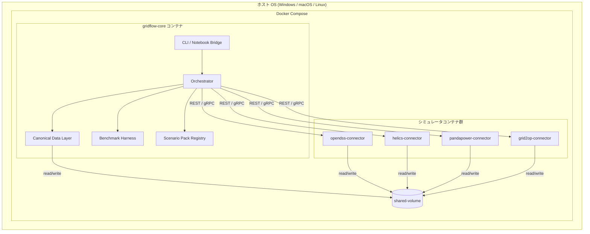
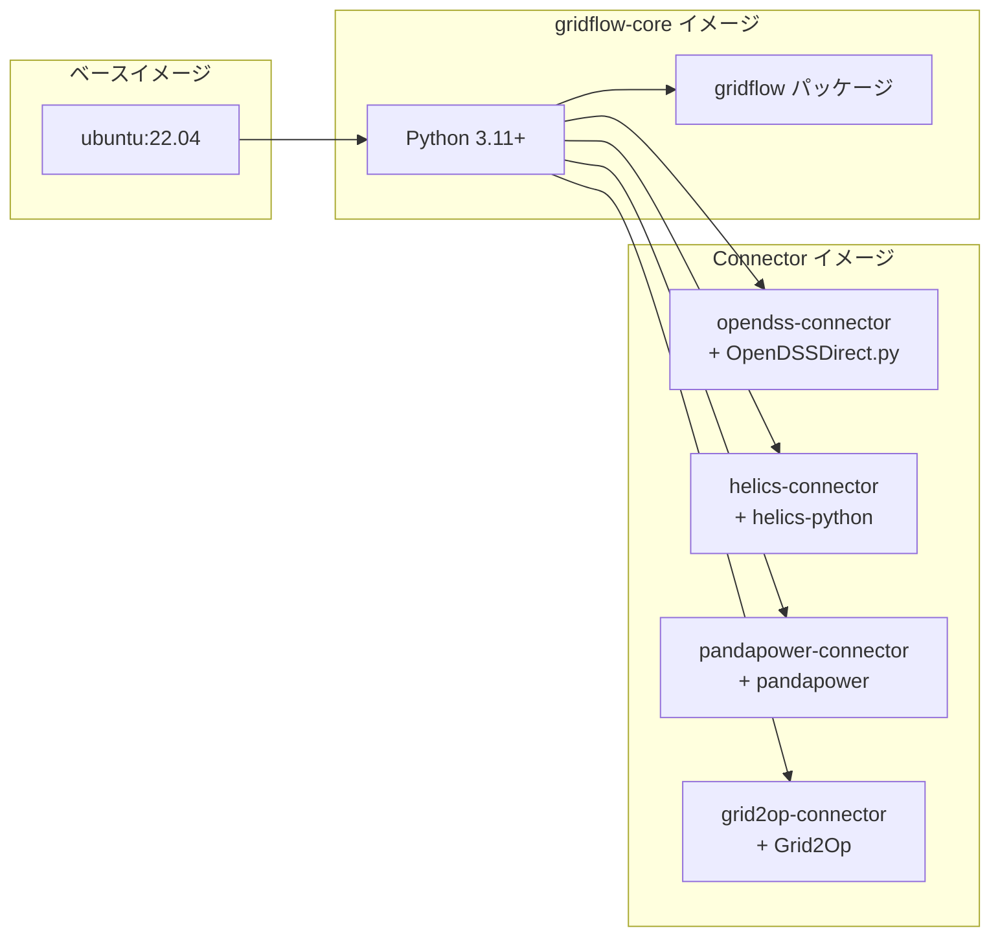
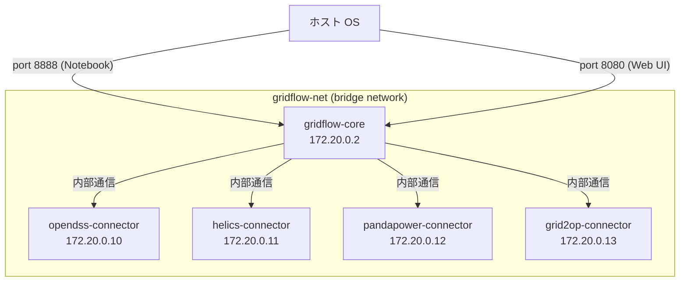
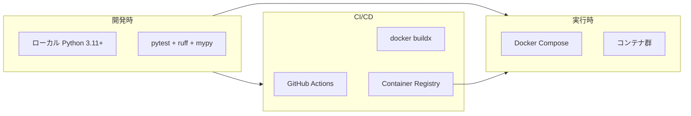

# 第2章 システム方式設計

本章では、gridflow のシステム全体構成、ハードウェア・ソフトウェア構成、ネットワーク構成、および開発・実行環境を定義する。

## 更新履歴

| 版数 | 日付 | 変更内容 |
|---|---|---|
| 0.1 | 2026-04-01 | 初版作成 |

---

## 2.1 システム全体構成

gridflow は Docker Compose を基盤とした複数コンテナ構成により、電力系統シミュレーションのワークフローを統合的に実行する。gridflow コアコンテナが Orchestrator として各シミュレータコンテナを管理する（`REQ-F-002`）。

### システム全体構成図



### コンテナ間の責務

| コンテナ | 責務 | 要件 |
|---|---|---|
| gridflow-core | CLI 受付、Orchestrator による実行制御、CDL 変換、Benchmark 採点、Registry 管理 | `REQ-F-001`〜`REQ-F-006` |
| opendss-connector | OpenDSS シミュレーション実行、結果の CDL 変換 | `REQ-F-007` (P0) |
| helics-connector | HELICS co-simulation フェデレーション参加 | `REQ-F-007` (P1) |
| pandapower-connector | pandapower 潮流計算実行 | `REQ-F-007` (P2) |
| grid2op-connector | Grid2Op 強化学習環境実行 | `REQ-F-007` (P2) |

---

## 2.2 ハードウェア・ソフトウェア構成

### ホスト環境要件

| 項目 | 要件 | 備考 |
|---|---|---|
| ホスト OS | Windows 10/11, macOS 12+, Linux (Ubuntu 22.04+) | `REQ-C-001` |
| Docker | Docker Desktop 4.x 以上 / Docker Engine 24+ | Docker Compose V2 必須 |
| CPU アーキテクチャ | AMD64 (x86_64), ARM64 (aarch64) | マルチアーキテクチャ対応 (`REQ-C-004`) |
| メモリ | 8 GB 以上推奨 | シミュレータコンテナ数に依存 |
| ディスク | 10 GB 以上の空き容量 | Docker イメージ + Scenario Pack データ |

### Docker イメージ構成



### ソフトウェアスタック

| レイヤー | 技術 | バージョン |
|---|---|---|
| 言語 | Python | 3.11+ |
| ベースイメージ | Ubuntu | 22.04 LTS |
| コンテナランタイム | Docker Engine | 24+ |
| オーケストレーション | Docker Compose | V2 |
| パッケージ管理 | pip / pyproject.toml | PEP 621 準拠 |
| 設定フォーマット | YAML | JSON Schema によるバリデーション |
| データフォーマット | CSV, JSON, Parquet | CDL エクスポート形式 (`REQ-F-003`) |

### マルチアーキテクチャ対応 (`REQ-C-004`)

- `docker buildx` による AMD64 + ARM64 マルチプラットフォームビルドを実施する
- CI パイプラインで両アーキテクチャ向けイメージを自動ビルド・プッシュする
- ARM64 (Apple Silicon) 環境での動作を CI で検証する

---

## 2.3 ネットワーク構成

### Docker 内部ネットワーク



### 通信方式

| 通信経路 | プロトコル | 用途 |
|---|---|---|
| ホスト → gridflow-core | TCP (port 8888) | Jupyter Notebook Bridge |
| ホスト → gridflow-core | TCP (port 8080) | Web UI（補助的可視化、P1 以降） |
| gridflow-core → Connector | REST API (HTTP) | コマンド発行・ステータス確認 (`REQ-F-007`) |
| gridflow-core ↔ Connector | 共有ボリューム | 大容量データ転送（CDL データ、シミュレーション結果） |
| Connector 間 (HELICS) | HELICS Broker (ZMQ) | co-simulation 時間同期・値交換 |

### ポートマッピング

| ホストポート | コンテナ | コンテナポート | 備考 |
|---|---|---|---|
| 8888 | gridflow-core | 8888 | Notebook Bridge |
| 8080 | gridflow-core | 8080 | Web UI（将来） |
| - | opendss-connector | 5001 | 内部通信のみ |
| - | helics-connector | 5002 | 内部通信のみ |
| - | pandapower-connector | 5003 | 内部通信のみ |
| - | grid2op-connector | 5004 | 内部通信のみ |

### セキュリティ方針 (`REQ-C-002`)

- シミュレータコンテナはホストネットワークに公開しない（Docker 内部ネットワークのみ）
- 共有ボリュームは gridflow-net 内のコンテナのみがアクセス可能
- コンテナは非 root ユーザーで実行する
- ホスト側の秘匿情報は Docker secrets または環境変数で注入する

---

## 2.4 開発・実行環境定義

### 開発環境

| 項目 | ツール | 用途 |
|---|---|---|
| 言語 | Python 3.11+ | 開発言語 |
| テスト | pytest | ユニットテスト・統合テスト |
| リンター | ruff | コードスタイル・静的解析 |
| 型チェック | mypy (strict mode) | 静的型検査 |
| フォーマッター | ruff format | コードフォーマット |
| パッケージ管理 | pip + pyproject.toml | 依存関係管理 |
| エディタ | 任意 (VS Code 推奨) | devcontainer 設定を提供 |

### 実行環境



### Docker Compose 構成例

```yaml
# docker-compose.yml (概要)
version: "3.9"
services:
  gridflow-core:
    build:
      context: .
      dockerfile: Dockerfile
    ports:
      - "8888:8888"
    volumes:
      - shared-data:/data
      - ./scenario-packs:/scenario-packs
    networks:
      - gridflow-net

  opendss-connector:
    build:
      context: ./connectors/opendss
    volumes:
      - shared-data:/data
    networks:
      - gridflow-net
    depends_on:
      - gridflow-core

volumes:
  shared-data:

networks:
  gridflow-net:
    driver: bridge
```

### CI パイプライン（GitHub Actions）

| ステージ | 実行内容 | トリガー |
|---|---|---|
| lint | ruff check + ruff format --check | push / PR |
| typecheck | mypy --strict | push / PR |
| test | pytest (ユニットテスト) | push / PR |
| integration | Docker Compose による統合テスト | PR (main ブランチ向け) |
| build | マルチアーキテクチャ Docker イメージビルド | main マージ時 |
| publish | Container Registry へプッシュ | タグ付与時 |

---

## 2.5 トレーサビリティ

| 要件 ID | 本章での対応箇所 |
|---|---|
| `REQ-F-002` | 2.1 Orchestrator によるコンテナ管理 |
| `REQ-C-001` | 2.2 ホスト環境要件（マルチ OS 対応） |
| `REQ-C-002` | 2.3 セキュリティ方針 |
| `REQ-C-004` | 2.2 マルチアーキテクチャ対応 |
