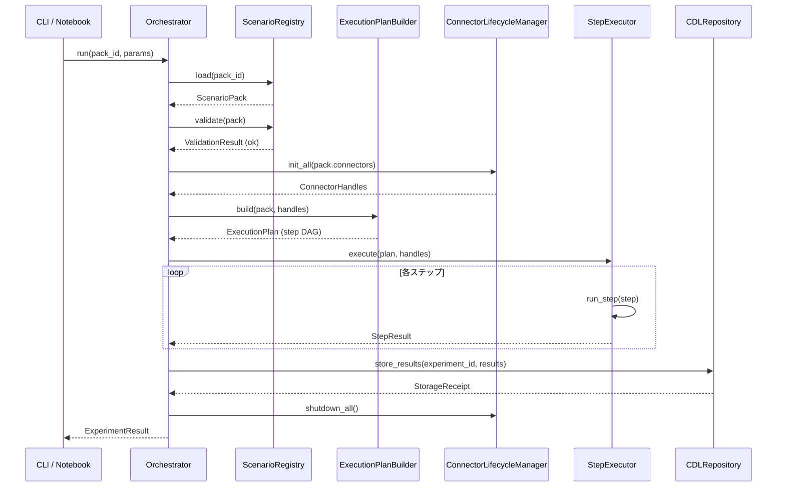
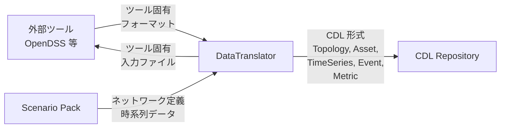
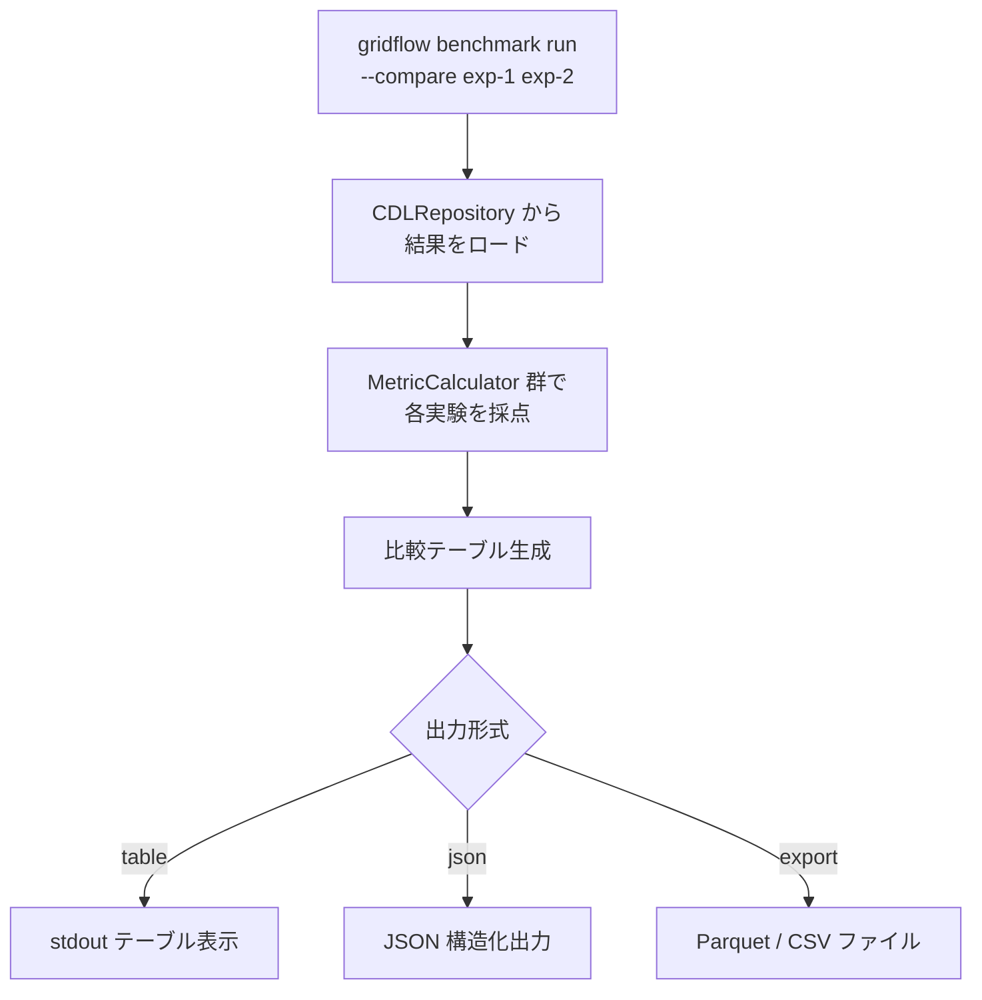
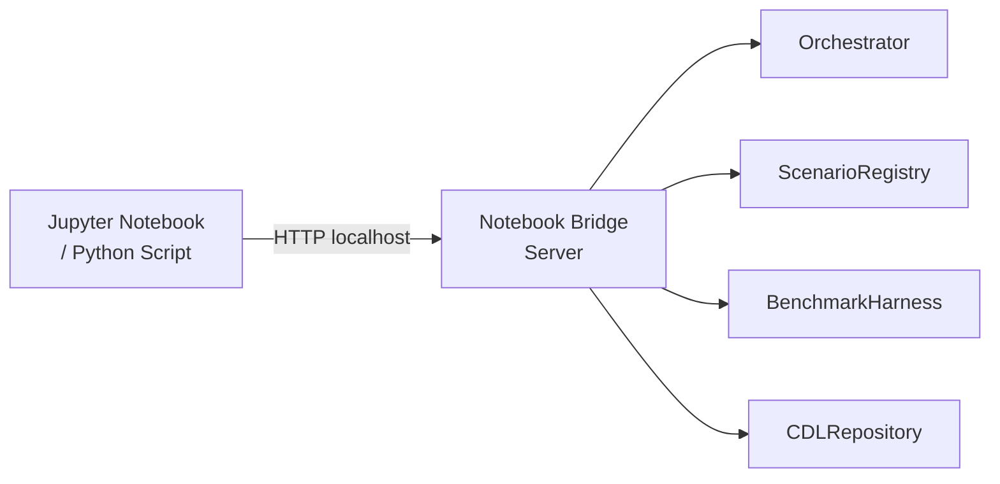

# 第3章 機能設計

本章では、gridflow の各機能コンポーネントの内部設計を示す。機能ごとに入出力仕様、内部フロー、主要な Protocol / クラス設計を定義し、要求 ID へのトレーサビリティを確保する。

## 更新履歴

| 版数 | 日付 | 変更内容 |
|---|---|---|
| 0.1 | 2026-04-01 | 初版作成 |

---

## 3.1 機能一覧

| # | 機能名 | 担当コンポーネント | 関連 UC | 関連要求 ID |
|---|---|---|---|---|
| F-01 | Scenario Pack 管理 | ScenarioRegistry | UC-02 | REQ-F-001 |
| F-02 | 実験実行（Orchestrator） | Orchestrator, ExecutionPlanBuilder, ConnectorLifecycleManager, StepExecutor | UC-01, UC-04 | REQ-F-002 |
| F-03 | Connector 連携 | ConnectorInterface 実装群, DataTranslator | UC-01 | REQ-F-007 |
| F-04 | Canonical Data Layer | CDL Repository, DataTranslator | UC-01, UC-09 | REQ-F-003 |
| F-05 | Benchmark Harness | BenchmarkHarness, MetricCalculator | UC-03 | REQ-F-004 |
| F-06 | CLI / Notebook Bridge | CLI（click/typer）, NotebookBridge | UC-05, UC-09, UC-10 | REQ-F-005 |
| F-07 | 段階的カスタムレイヤー | 全コンポーネント横断 | — | REQ-F-006 |

---

## 3.2 Scenario Pack 管理機能

**関連要求**: `REQ-F-001` / **関連 UC**: UC-02

### 3.2.1 機能概要

Scenario Pack は実験 1 件を再現可能な単位としてパッケージ化する。ScenarioRegistry が Pack のライフサイクル（作成 → バリデーション → 登録 → 検索 → クローン）を管理する。

### 3.2.2 サブ機能一覧

| サブ機能 | CLI コマンド | 入力 | 出力 | 説明 |
|---|---|---|---|---|
| 作成 | `gridflow scenario create` | Pack 名, テンプレート名（任意） | Pack ディレクトリ（scaffold） | テンプレートから Scenario Pack の雛形を生成する |
| 一覧 | `gridflow scenario list` | フィルタ条件（任意） | Pack 一覧（JSON / table） | 登録済み Pack を一覧表示する |
| クローン | `gridflow scenario clone` | 元 Pack ID, 新 Pack 名 | 複製された Pack ディレクトリ | 既存 Pack を複製し、パラメータ変更の起点とする |
| バリデーション | `gridflow scenario validate` | Pack パス | バリデーション結果（JSON） | Pack の構造・スキーマ整合性を検証する |
| 登録 | `gridflow scenario register` | Pack パス | 登録 ID | Registry へ Pack を登録しバージョン管理下に置く |

### 3.2.3 Scenario Pack 構造

```
scenario-pack/
  pack.yaml            # メタデータ（名前、バージョン、説明、seed、connector 指定）
  network/             # ネットワーク定義ファイル（.dss, .json 等）
  timeseries/          # 時系列データ（CSV/Parquet）
  config/              # シミュレータ設定ファイル
  metrics.yaml         # 評価指標定義
  expected/            # 期待出力（回帰テスト用）
  visualizations/      # 可視化テンプレート
```

### 3.2.4 ScenarioRegistry Protocol

```python
from typing import Protocol, Sequence
from pathlib import Path

class ScenarioRegistry(Protocol):
    """Scenario Pack のライフサイクル管理を行う Protocol。"""

    def create(self, name: str, *, template: str | None = None) -> Path:
        """テンプレートから新規 Pack を作成し、ディレクトリパスを返す。"""
        ...

    def list(self, *, tags: Sequence[str] | None = None) -> list[PackSummary]:
        """登録済み Pack の一覧を返す。tags でフィルタ可能。"""
        ...

    def clone(self, source_id: str, new_name: str) -> Path:
        """既存 Pack を複製し、新パスを返す。"""
        ...

    def validate(self, pack_path: Path) -> ValidationResult:
        """Pack の構造・スキーマ整合性を検証する。"""
        ...

    def register(self, pack_path: Path) -> str:
        """Pack を Registry に登録し、登録 ID を返す。"""
        ...
```

---

## 3.3 Orchestrator（実験実行）機能

**関連要求**: `REQ-F-002` / **関連 UC**: UC-01, UC-04

### 3.3.1 機能概要

Orchestrator は実験実行のライフサイクル全体を統括する。自身は薄いコーディネータとして機能し、各責務を専門サブコンポーネントへ委譲する。

### 3.3.2 サブコンポーネント責務

| サブコンポーネント | 責務 |
|---|---|
| **ExecutionPlanBuilder** | Scenario Pack の定義から実行ステップ DAG を構築する |
| **ConnectorLifecycleManager** | Connector の初期化・ヘルスチェック・シャットダウンを管理する |
| **StepExecutor** | 実行計画に基づきステップを逐次実行し、各ステップの結果を収集する |

### 3.3.3 実行フロー

1. Scenario Pack をロードする
2. Pack をバリデーションする（`ScenarioRegistry.validate`）
3. Connector を初期化する（`ConnectorLifecycleManager.init_all`）
4. 実行計画を構築する（`ExecutionPlanBuilder.build`）
5. ステップを実行する（`StepExecutor.execute`）
6. 結果を CDL へ格納する（`CDLRepository.store_results`）

### 3.3.4 シーケンス図



### 3.3.5 Orchestrator クラス概要

```python
from dataclasses import dataclass

@dataclass
class Orchestrator:
    """実験実行のコーディネータ。"""
    registry: ScenarioRegistry
    plan_builder: ExecutionPlanBuilder
    lifecycle_manager: ConnectorLifecycleManager
    step_executor: StepExecutor
    cdl_repository: CDLRepository

    def run(self, pack_id: str, *, params: dict | None = None) -> ExperimentResult:
        pack = self.registry.load(pack_id)
        self.registry.validate(pack)

        handles = self.lifecycle_manager.init_all(pack.connectors)
        plan = self.plan_builder.build(pack, handles)
        results = self.step_executor.execute(plan, handles)

        receipt = self.cdl_repository.store_results(pack.experiment_id, results)
        self.lifecycle_manager.shutdown_all()

        return ExperimentResult(experiment_id=pack.experiment_id, receipt=receipt)
```

---

## 3.4 Connector 機能

**関連要求**: `REQ-F-007` / **関連 UC**: UC-01

### 3.4.1 機能概要

Connector は外部シミュレーションツールとの統一的なインターフェースを提供する。各ツール固有のデータフォーマットは DataTranslator を介して CDL 形式へ変換される。

### 3.4.2 実装ロードマップ

| フェーズ | Connector | 対象ツール |
|---|---|---|
| P0 | OpenDSSConnector | OpenDSS |
| P1（4-6か月） | HELICSConnector | HELICS co-simulation |
| P2（13-18か月） | Grid2OpConnector, PandapowerConnector | Grid2Op, pandapower |

### 3.4.3 ConnectorInterface Protocol

```python
from typing import Protocol

class ConnectorInterface(Protocol):
    """外部シミュレーションツールとの統一インターフェース。"""

    def initialize(self, config: ConnectorConfig) -> None:
        """Connector を設定に基づき初期化する。"""
        ...

    def execute(self, inputs: CDLInputs) -> CDLOutputs:
        """CDL 形式の入力を受け取り、シミュレーションを実行し、CDL 形式で結果を返す。"""
        ...

    def health_check(self) -> HealthStatus:
        """Connector の稼働状態を確認する。"""
        ...

    def shutdown(self) -> None:
        """リソースを解放し、Connector を停止する。"""
        ...
```

### 3.4.4 データフロー



### 3.4.5 DataTranslator 概要

DataTranslator はツール固有フォーマットと CDL 形式の双方向変換を担う。Connector ごとに専用の Translator 実装を持つ。

```python
class DataTranslator(Protocol):
    """ツール固有フォーマットと CDL 形式の双方向変換。"""

    def to_tool_format(self, cdl_data: CDLInputs) -> ToolNativeInputs:
        """CDL データをツール固有入力形式に変換する。"""
        ...

    def from_tool_format(self, tool_output: ToolNativeOutputs) -> CDLOutputs:
        """ツール固有出力を CDL 形式に変換する。"""
        ...
```

---

## 3.5 Canonical Data Layer 機能

**関連要求**: `REQ-F-003` / **関連 UC**: UC-01, UC-09

### 3.5.1 機能概要

Canonical Data Layer（CDL）はツール非依存の共通データ表現を定義し、結果の保存・検索・エクスポートを提供する。Repository パターンにより、ストレージ実装を抽象化する。

### 3.5.2 CDL エンティティ

| エンティティ | 説明 | 主な属性 |
|---|---|---|
| Topology | ネットワーク構造 | ノード、ブランチ、接続関係 |
| Asset | 系統設備 | 種別、定格、接続ノード |
| TimeSeries | 時系列データ | タイムスタンプ、値系列、解像度 |
| Event | 離散イベント | 種別、発生時刻、対象設備 |
| Metric | 評価指標 | 名前、値、単位、タイムスタンプ |
| ScenarioPack | 実験パッケージメタデータ | Pack ID、バージョン、パラメータ |

### 3.5.3 CDLRepository Protocol

```python
class CDLRepository(Protocol):
    """CDL データの永続化・検索を担う Repository。"""

    def store_results(
        self, experiment_id: str, results: ExperimentResults
    ) -> StorageReceipt:
        """実験結果を保存し、保存レシートを返す。"""
        ...

    def get_results(self, experiment_id: str) -> ExperimentResults:
        """experiment_id に対応する結果を取得する。"""
        ...

    def store_intermediate(
        self, experiment_id: str, step_id: str, data: CDLOutputs
    ) -> None:
        """ステップ間の中間データを保存する。"""
        ...

    def list_experiments(
        self, *, tags: Sequence[str] | None = None
    ) -> list[ExperimentSummary]:
        """保存済み実験の一覧を返す。"""
        ...

    def export(
        self, experiment_id: str, fmt: ExportFormat
    ) -> Path:
        """指定フォーマット（CSV/JSON/Parquet）でエクスポートする。"""
        ...
```

### 3.5.4 P0 実装方針

P0 ではファイルシステムベースの `FileSystemCDLRepository` を実装する（`REQ-C-001`: 単純性優先）。

```
.gridflow/
  experiments/
    {experiment_id}/
      metadata.json       # 実験メタデータ
      results/
        metrics.parquet    # Metric データ
        timeseries.parquet # TimeSeries データ
        events.json        # Event データ
      intermediate/
        {step_id}/         # ステップ中間データ
```

---

## 3.6 Benchmark Harness 機能

**関連要求**: `REQ-F-004` / **関連 UC**: UC-03

### 3.6.1 機能概要

Benchmark Harness は実験結果を定量的に評価・比較する。標準メトリクスセットを提供しつつ、MetricCalculator Strategy パターンによりカスタムメトリクスの追加を容易にする。

### 3.6.2 標準メトリクス

| メトリクス名 | 説明 | 単位 |
|---|---|---|
| voltage_deviation | 電圧逸脱率 | % |
| thermal_overload_time | 熱過負荷時間 | 秒 |
| energy_not_supplied | 供給不能エネルギー（ENS） | kWh |
| dispatch_cost | 給電コスト | 通貨単位 |
| co2_emissions | CO2 排出量 | kg |
| curtailment | 出力抑制量 | kWh |
| restoration_time | 復旧時間 | 秒 |
| runtime | シミュレーション実行時間 | 秒 |

### 3.6.3 サブ機能一覧

| サブ機能 | CLI コマンド | 入力 | 出力 |
|---|---|---|---|
| ベンチマーク実行 | `gridflow benchmark run` | Pack ID, メトリクス指定（任意） | スコアレポート（JSON / table） |
| 実験比較 | `gridflow benchmark run --compare` | 2つ以上の experiment_id | 比較レポート（JSON / table） |
| レポートエクスポート | `gridflow benchmark export` | experiment_id, フォーマット | CSV / JSON / Parquet ファイル |

### 3.6.4 MetricCalculator Strategy パターン

```python
class MetricCalculator(Protocol):
    """メトリクス算出の Strategy インターフェース。"""

    @property
    def name(self) -> str:
        """メトリクス名を返す。"""
        ...

    def calculate(self, results: ExperimentResults) -> MetricValue:
        """実験結果からメトリクスを算出する。"""
        ...
```

カスタムメトリクスの登録例:

```python
from gridflow.benchmark import register_metric, MetricCalculator, MetricValue

class CustomLossMetric:
    """カスタム損失メトリクスの例。"""

    @property
    def name(self) -> str:
        return "total_line_loss"

    def calculate(self, results: ExperimentResults) -> MetricValue:
        losses = results.timeseries.filter(name="line_loss")
        total = losses.values.sum()
        return MetricValue(name=self.name, value=total, unit="kWh")

register_metric(CustomLossMetric())
```

### 3.6.5 比較フロー



---

## 3.7 CLI / Notebook Bridge 機能

**関連要求**: `REQ-F-005` / **関連 UC**: UC-05, UC-09, UC-10

### 3.7.1 機能概要

gridflow は CLI ファーストの設計とし、全操作を CLI コマンドで完結させる。加えて Notebook Bridge により、Jupyter Notebook やスクリプトからプログラマティックにアクセス可能とする。

### 3.7.2 CLI 設計方針

- Python 3.11+ 上で click または typer をフレームワークとして使用する
- 全コマンドは `--output json` オプションで構造化 JSON を出力する（`REQ-Q-009`: LLM/CI 連携）
- エラー出力は category / code / message / cause / resolution を含む統一フォーマットに従う（M-2 エラー設計）

### 3.7.3 Notebook Bridge

Notebook Bridge は軽量 HTTP API（localhost 限定）を介して CLI 機能をプログラマティックに公開する。

```python
import gridflow

# gridflow デーモンへ接続
gf = gridflow.connect()

# 実験実行
result = gf.run("ieee13-base", params={"load_mult": 1.2})

# 結果を DataFrame で取得
df = result.to_dataframe()

# ベンチマーク実行
scores = gf.benchmark.run(result.experiment_id)

# Scenario Pack 一覧
packs = gf.scenario.list(tags=["ieee13"])
```

### 3.7.4 Notebook Bridge アーキテクチャ



- Bridge Server は `gridflow daemon start` で起動し、localhost のみでリッスンする
- REST API エンドポイントは CLI コマンドと 1:1 に対応する
- レスポンスは CLI の `--output json` と同一の JSON スキーマを返す

---

## 参照要求

| 要求 ID | 関連セクション |
|---|---|
| REQ-F-001 | 3.1, 3.2 |
| REQ-F-002 | 3.1, 3.3 |
| REQ-F-003 | 3.1, 3.5 |
| REQ-F-004 | 3.1, 3.6 |
| REQ-F-005 | 3.1, 3.7 |
| REQ-F-006 | 3.1 |
| REQ-F-007 | 3.1, 3.4 |
