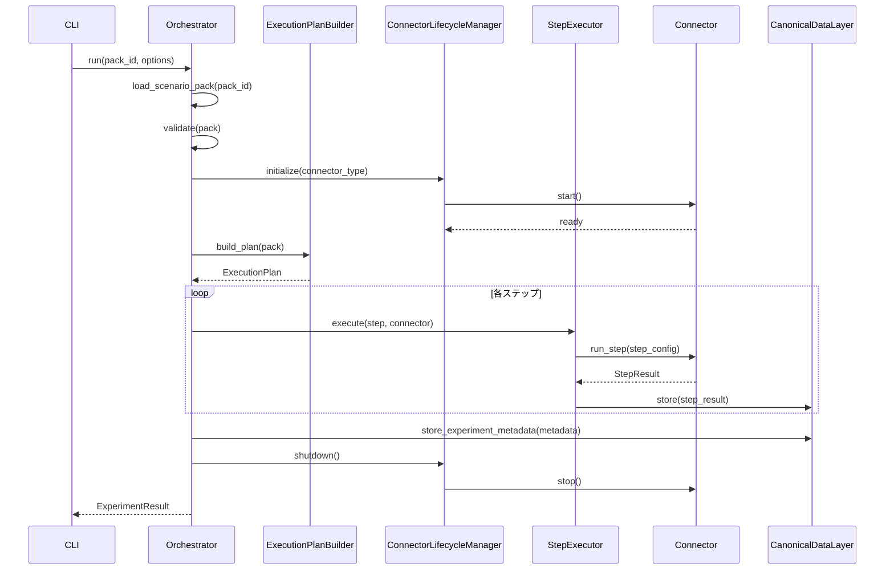
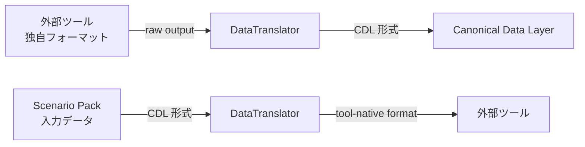
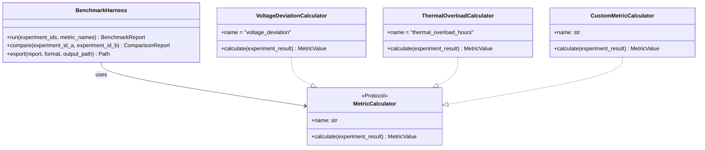
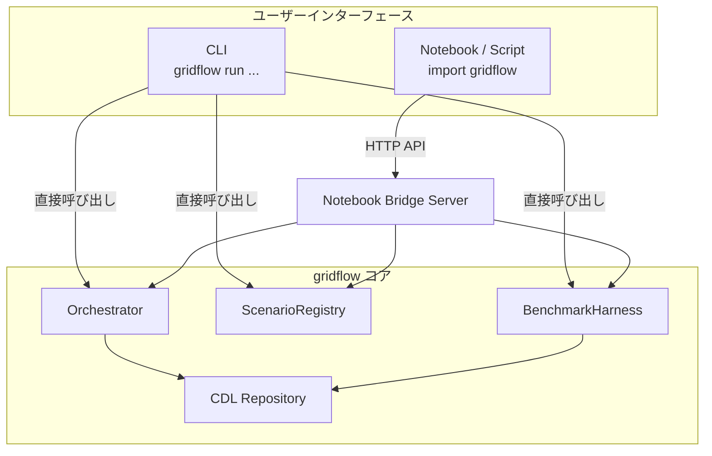

# 第3章 機能設計

本章では、gridflow の主要機能をコンポーネント単位で設計する。各機能は第1章の要求 ID に対応し、トレーサビリティを維持する。

## 更新履歴

| 版数 | 日付 | 変更内容 |
|---|---|---|
| 0.1 | 2026-04-01 | 初版作成 |
| 0.2 | 2026-04-06 | 要求ID→機能ID逆引き対応表を追加（BD-REV-003）、例外名に親クラスとエラーコードを明記（BD-REV-002） |

---

## 3.1 機能一覧

| 機能 ID | 機能名 | コンポーネント | 関連 UC | 関連要求 ID | P0/P1/P2 |
|---|---|---|---|---|---|
| FN-001 | Scenario Pack 管理 | ScenarioRegistry | UC-02 | REQ-F-001 | P0 |
| FN-002 | 実験実行オーケストレーション | Orchestrator | UC-01, UC-04 | REQ-F-002 | P0 |
| FN-003 | Connector 統合 | ConnectorInterface, OpenDSSConnector | UC-01 | REQ-F-007 | P0 |
| FN-004 | Canonical Data Layer | CDL Repository | UC-01, UC-09 | REQ-F-003 | P0 |
| FN-005 | ベンチマーク評価 | BenchmarkHarness | UC-03 | REQ-F-004 | P0 |
| FN-006 | CLI インターフェース | CLI Module | UC-01〜UC-10 | REQ-F-005 | P0 |
| FN-007 | Notebook Bridge | NotebookBridge | UC-06, UC-09, UC-10 | REQ-F-005 | P0 |
| FN-008 | ロギング・トレーシング | StructuredLogger | UC-05 | REQ-Q-008 | P0 |
| FN-009 | 段階的カスタムレイヤー | Plugin System | UC-01 | REQ-F-006 | P0 |

### 要求 ID → 機能 ID 対応表

第1章の���求一覧から本章の��能設計への逆引き対応表���示す。

| 要求 ID | 要求名 | 対応機能 ID | 本章セクション |
|---|---|---|---|
| REQ-F-001 | Scenario Pack + Registry | FN-001 | 3.2 |
| REQ-F-002 | Orchestrator | FN-002 | 3.3 |
| REQ-F-003 | Canonical Data Layer | FN-004 | 3.5 |
| REQ-F-004 | Benchmark Harness | FN-005 | 3.6 |
| REQ-F-005 | CLI + Notebook Bridge | FN-006, FN-007 | 3.7 |
| REQ-F-006 | 段階的カスタムレイヤー | FN-009 | 3.7（3.7.4 節で概要）|
| REQ-F-007 | Connectors | FN-003 | 3.4 |
| REQ-Q-008 | 可観測性 | FN-008 | 3.7（ロギング概要）|

---

## 3.2 Scenario Pack 管理機能

**関連要求**: `REQ-F-001` | **関連 UC**: UC-02

### 3.2.1 概要

Scenario Pack は実験1件を再現可能な単位としてパッケージ化する。ScenarioRegistry がパックの登録・検索・バージョン管理を担う。

### 3.2.2 Scenario Pack 構造

```
scenario-pack/
  pack.yaml              # メタデータ・パラメータ定義
  network/               # ネットワーク定義ファイル群
  timeseries/            # 時系列データ（CSV/Parquet）
  config/                # シミュレータ設定
  metrics.yaml           # 評価指標定義
  expected/              # 期待出力（オプション）
  visualizations/        # 可視化テンプレート（オプション）
```

### 3.2.3 操作別 入力/出力仕様

| 操作 | CLI コマンド | 入力 | 出力 | 説明 |
|---|---|---|---|---|
| 作成 | `gridflow scenario create` | パック名、テンプレート名 | 新規 Scenario Pack ディレクトリ | テンプレートからスキャフォールド生成 |
| 一覧 | `gridflow scenario list` | フィルタ条件（オプション） | パック一覧（JSON/テーブル） | 登録済みパックの検索・表示 |
| 複製 | `gridflow scenario clone` | ソースパック名、新パック名 | 複製された Scenario Pack | パラメータ変更による派生パック作成 |
| 検証 | `gridflow scenario validate` | パックパス | 検証結果（JSON） | スキーマ準拠・ファイル整合性の確認 |
| 登録 | `gridflow scenario register` | パックパス | 登録確認（JSON） | Registry へのパック登録 |

### 3.2.4 ScenarioRegistry Protocol

```python
from typing import Protocol, Optional
from pathlib import Path

class ScenarioRegistryProtocol(Protocol):
    """Scenario Pack の永続化・検索を担うリポジトリ。"""

    def register(self, pack_path: Path) -> str:
        """パックを Registry に登録し、pack_id を返す。

        Raises:
            ValidationError(ConfigError): pack.yaml のスキーマ検証失敗時（CONF-001）
            DuplicatePackError(ConfigError): 同名・同バージョンのパックが既に存在する場合（CONF-002）
        """
        ...

    def get(self, pack_id: str, version: Optional[str] = None) -> "ScenarioPack":
        """pack_id からパックを取得する。version 省略時は最新版。"""
        ...

    def list(
        self,
        query: Optional[str] = None,
        tags: Optional[list[str]] = None,
    ) -> list["ScenarioPackSummary"]:
        """登録済みパックを検索・一覧取得する。"""
        ...

    def validate(self, pack_path: Path) -> "ValidationResult":
        """パックのスキーマ準拠・ファイル整合性を検証する。"""
        ...

    def clone(
        self, source_id: str, new_name: str, overrides: Optional[dict] = None
    ) -> Path:
        """既存パックを複製し、overrides でパラメータを上書きする。"""
        ...
```

### 3.2.5 pack.yaml スキーマ（抜粋）

```yaml
name: ieee13-baseline
version: "1.0.0"
description: "IEEE 13-node feeder baseline simulation"
connector: opendss
seed: 42
parameters:
  load_multiplier: 1.0
  pv_penetration: 0.3
metrics:
  - voltage_deviation
  - thermal_overload_hours
tags:
  - ieee13
  - baseline
```

---

## 3.3 Orchestrator（実験実行）機能

**関連要求**: `REQ-F-002` | **関連 UC**: UC-01, UC-04

### 3.3.1 概要

Orchestrator は実験実行の全体を制御する Facade であり、自身はロジックを持たず、内部コンポーネントに処理を委譲する。

| 委譲先コンポーネント | 責務 |
|---|---|
| ExecutionPlanBuilder | Scenario Pack から実行計画（ステップ列）を構築する |
| ConnectorLifecycleManager | Connector の初期化・ヘルスチェック・終了を管理する |
| StepExecutor | 実行計画の各ステップを逐次実行し、結果を収集する |

### 3.3.2 実行フロー

1. Scenario Pack をロードする
2. pack.yaml のスキーマ検証を行う
3. Connector を初期化する（Docker コンテナ起動を含む）
4. ExecutionPlanBuilder で実行計画を構築する
5. StepExecutor で各ステップを逐次実行する
6. 結果を CDL 形式で保存する
7. Connector をシャットダウンする

### 3.3.3 シーケンス図



### 3.3.4 Orchestrator Protocol

```python
from typing import Protocol, Optional
from dataclasses import dataclass

@dataclass
class RunOptions:
    """実行オプション。"""
    dry_run: bool = False
    output_format: str = "json"  # json | table
    verbose: bool = False

class OrchestratorProtocol(Protocol):
    """実験実行の Facade。"""

    def run(self, pack_id: str, options: Optional[RunOptions] = None) -> "ExperimentResult":
        """Scenario Pack を実行し、結果を返す。"""
        ...

    def status(self) -> "OrchestratorStatus":
        """現在の実行状態を返す。"""
        ...

    def stop(self) -> None:
        """実行中の実験を安全に停止する。"""
        ...
```

---

## 3.4 Connector 機能

**関連要求**: `REQ-F-007` | **関連 UC**: UC-01

### 3.4.1 概要

Connector は外部シミュレーションツールとの統合インターフェースを提供する。P0 では OpenDSS を主要実装とし、将来的に HELICS、Grid2Op、pandapower へ拡張する。

### 3.4.2 ConnectorInterface Protocol

```python
from typing import Protocol
from pathlib import Path

class ConnectorInterface(Protocol):
    """外部シミュレーションツールとの統合インターフェース。"""

    def start(self) -> None:
        """Connector を起動する（Docker コンテナ起動を含む）。

        Raises:
            ConnectorStartError(ConnectorError): 起動失敗時（CONN-001）
        """
        ...

    def health_check(self) -> "HealthStatus":
        """Connector の稼働状態を確認する。"""
        ...

    def run_step(self, step_config: "StepConfig") -> "StepResult":
        """1ステップ分のシミュレーションを実行する。

        Raises:
            ConnectorExecutionError(ConnectorError): 実行���ラー時（CONN-002）
            ConnectorTimeoutError(ConnectorError): タイムアウト時（CONN-003）
        """
        ...

    def stop(self) -> None:
        """Connector を安全に停止する。"""
        ...

    @property
    def name(self) -> str:
        """Connector 名（例: "opendss"）を返す。"""
        ...
```

### 3.4.3 データ変換フロー



| 変換方向 | 入力 | 出力 | 担当 |
|---|---|---|---|
| Inbound（ツール → CDL） | 外部ツールの出力（DSS 結果等） | CDL エンティティ（Topology, TimeSeries, Metric 等） | DataTranslator.to_cdl() |
| Outbound（CDL → ツール） | Scenario Pack の入力データ | 外部ツールのネイティブフォーマット | DataTranslator.from_cdl() |

### 3.4.4 P0 実装: OpenDSSConnector

| 項目 | 内容 |
|---|---|
| 対象ツール | OpenDSS（py-dss-interface 経由） |
| Docker イメージ | `gridflow/opendss:latest` |
| 入力フォーマット | DSS スクリプト（`.dss`） |
| 出力 CDL エンティティ | Topology, Asset, TimeSeries, Metric |
| ヘルスチェック | DSS エンジンの初期化確認 |

---

## 3.5 Canonical Data Layer 機能

**関連要求**: `REQ-F-003` | **関連 UC**: UC-01, UC-09

### 3.5.1 概要

Canonical Data Layer（CDL）はツール固有のデータ形式を共通表現に変換し、実験結果の格納・取得・エクスポートを提供する。

### 3.5.2 CDL エンティティ一覧

| エンティティ | 説明 | 主要属性 |
|---|---|---|
| Topology | ネットワークトポロジ（ノード・ブランチ） | nodes, branches, source_bus |
| Asset | 電力機器（負荷、発電機、PV 等） | asset_type, bus, rated_power |
| TimeSeries | 時系列データ（負荷プロファイル、PV 出力等） | timestamps, values, unit, resolution |
| Event | シミュレーション中のイベント（障害、開閉器操作等） | event_type, timestamp, target_asset |
| Metric | 評価指標（電圧逸脱率、損失等） | metric_name, value, unit, step |
| ScenarioPack | 実験メタデータ | pack_id, version, connector, parameters, seed |

### 3.5.3 CDL Repository Protocol

```python
from typing import Protocol, Optional
from pathlib import Path

class CDLRepositoryProtocol(Protocol):
    """CDL データの永続化・取得を担うリポジトリ。"""

    def store_result(
        self, experiment_id: str, step_id: str, result: "StepResult"
    ) -> None:
        """ステップ実行結果を保存する。"""
        ...

    def get_result(
        self, experiment_id: str, step_id: Optional[str] = None
    ) -> "ExperimentResult":
        """実験結果を取得する。step_id 省略時は全ステップ。"""
        ...

    def store_intermediate(
        self, experiment_id: str, key: str, data: dict
    ) -> None:
        """中間データを保存する。"""
        ...

    def list_experiments(
        self, query: Optional[str] = None
    ) -> list["ExperimentSummary"]:
        """実験一覧を取得する。"""
        ...

    def export(
        self, experiment_id: str, format: str, output_path: Path
    ) -> Path:
        """指定フォーマット（csv/json/parquet）でエクスポートする。"""
        ...
```

### 3.5.4 P0 実装: ファイルシステムベース

```
~/.gridflow/
  experiments/
    {experiment_id}/
      metadata.json          # 実験メタデータ
      steps/
        {step_id}/
          result.json        # ステップ結果
          timeseries.parquet # 時系列データ
          metrics.json       # 評価指標
      intermediate/          # 中間データ
```

Repository パターンによりストレージ実装を抽象化し、P1 以降でデータベースバックエンドへの切替を可能にする（`REQ-F-006`）。

---

## 3.6 Benchmark Harness 機能

**関連要求**: `REQ-F-004` | **関連 UC**: UC-03

### 3.6.1 概要

BenchmarkHarness は実験結果を定量的に採点・比較し、レポートを生成する。MetricCalculator を Strategy パターンで実装し、カスタム指標の追加を容易にする。

### 3.6.2 標準指標一覧

| 指標名 | 単位 | 説明 |
|---|---|---|
| voltage_deviation | % | ノード電圧の基準値からの逸脱率 |
| thermal_overload_hours | h | 熱容量超過の累積時間 |
| energy_not_supplied | MWh | 供給不能エネルギー量 |
| dispatch_cost | USD | 発電コスト |
| co2_emissions | tCO2 | CO2 排出量 |
| curtailment | MWh | 出力抑制量 |
| restoration_time | s | 復旧時間 |
| runtime | s | シミュレーション実行時間 |

### 3.6.3 コンポーネント構成



### 3.6.4 MetricCalculator Protocol

```python
from typing import Protocol

class MetricCalculator(Protocol):
    """評価指標の計算を担う Strategy。"""

    @property
    def name(self) -> str:
        """指標名を返す。"""
        ...

    def calculate(self, experiment_result: "ExperimentResult") -> "MetricValue":
        """実験結果から指標値を算出する。"""
        ...
```

### 3.6.5 ベンチマーク実行フロー

1. 対象実験 ID と評価指標を指定する
2. CDL Repository から実験結果を取得する
3. 指定された MetricCalculator で各指標を算出する
4. BenchmarkReport を生成する
5. 指定フォーマット（JSON/CSV/Markdown）でエクスポートする

---

## 3.7 CLI / Notebook Bridge 機能

**関連要求**: `REQ-F-005` | **関連 UC**: UC-05, UC-09, UC-10

### 3.7.1 CLI 概要

CLI は gridflow の全操作に対するプライマリインターフェースである。Python の click または typer フレームワークで実装し、構造化 JSON 出力をサポートする（`REQ-Q-009`）。

CLI 設計の詳細は[第4章 CLI インターフェース設計](./04_cli_design.md)を参照。

### 3.7.2 Notebook Bridge 概要

Notebook Bridge は Jupyter Notebook / Python スクリプトからの gridflow 操作を可能にする軽量 HTTP API である。CLI と同等の機能をプログラマティックに利用できる。



### 3.7.3 Notebook Bridge API

```python
import gridflow

# 接続
gf = gridflow.connect()  # ローカル Bridge サーバーに接続

# 実験実行
result = gf.run("ieee13-baseline")
print(result.status)        # "completed"
print(result.experiment_id) # "exp-20260401-001"

# 結果取得・分析
df = result.to_dataframe()  # pandas DataFrame に変換
metrics = result.metrics     # dict[str, MetricValue]

# ベンチマーク
report = gf.benchmark.run(
    experiment_ids=["exp-001", "exp-002"],
    metrics=["voltage_deviation", "thermal_overload_hours"],
)
report_df = report.to_dataframe()

# シナリオ操作
packs = gf.scenario.list(tags=["ieee13"])
gf.scenario.clone("ieee13-baseline", "ieee13-highpv", overrides={"pv_penetration": 0.8})
```

### 3.7.4 LLM 互換性

CLI の全出力は `--format json` オプションにより構造化 JSON で取得可能とする。エラーメッセージは自己説明的な構造を持ち、LLM による解析・提案に適した形式とする（`REQ-Q-009`）。

---

## 参照要求

| 要求 ID | 関連セクション |
|---|---|
| REQ-F-001 | 3.2 Scenario Pack 管理機能 |
| REQ-F-002 | 3.3 Orchestrator 機能 |
| REQ-F-003 | 3.5 Canonical Data Layer 機能 |
| REQ-F-004 | 3.6 Benchmark Harness 機能 |
| REQ-F-005 | 3.7 CLI / Notebook Bridge 機能 |
| REQ-F-006 | 3.5 CDL Repository（拡張性） |
| REQ-F-007 | 3.4 Connector 機能 |
| REQ-Q-008 | 3.1 機能一覧（ロギング） |
| REQ-Q-009 | 3.7 LLM 互換性 |
