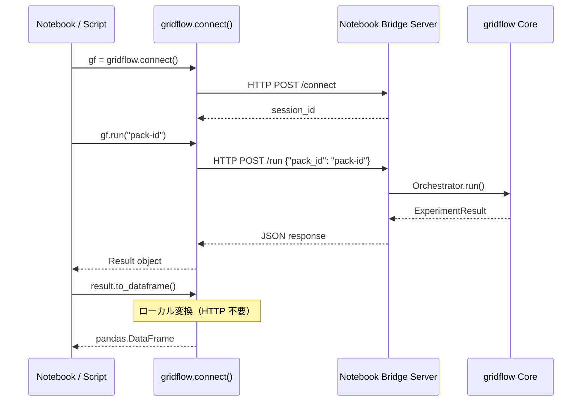

# 第4章 CLI インターフェース設計（画面設計）

本章では、gridflow CLI の全コマンド体系、入出力仕様、Notebook Bridge インターフェース、およびエラーメッセージ設計を定義する。CLI は gridflow のプライマリインターフェースであり、全操作が CLI で完結することを設計原則とする（`REQ-F-005`）。

## 更新履歴

| 版数 | 日付 | 変更内容 |
|---|---|---|
| 0.1 | 2026-04-01 | 初版作成 |

---

## 4.1 コマンド体系一覧

### トップレベルコマンド

| コマンド | 説明 | 関連 UC | 関連要求 |
|---|---|---|---|
| `gridflow run` | 実験を実行する | UC-01 | REQ-F-002 |
| `gridflow scenario` | Scenario Pack を管理する | UC-02 | REQ-F-001 |
| `gridflow benchmark` | ベンチマーク評価を実行する | UC-03 | REQ-F-004 |
| `gridflow status` | 実行状態を確認する | UC-04 | REQ-F-002 |
| `gridflow logs` | ログを表示する | UC-05 | REQ-Q-008 |
| `gridflow trace` | トレース情報を表示する | UC-05 | REQ-Q-008 |
| `gridflow metrics` | メトリクスを表示する | UC-05 | REQ-Q-008 |
| `gridflow debug` | デバッグ情報を表示する | UC-06 | REQ-F-005 |
| `gridflow results` | 実験結果を表示・エクスポートする | UC-09 | REQ-F-003, REQ-Q-006 |
| `gridflow update` | gridflow を更新する | UC-08 | REQ-Q-001 |

### サブコマンド階層

```
gridflow
  ├── run                          # 実験実行
  ├── scenario
  │   ├── create                   # Scenario Pack 作成
  │   ├── list                     # 一覧表示
  │   ├── clone                    # 複製
  │   ├── validate                 # 検証
  │   └── register                 # Registry 登録
  ├── benchmark
  │   ├── run                      # ベンチマーク実行
  │   └── export                   # レポートエクスポート
  ├── status                       # 実行状態確認
  ├── logs                         # ログ表示
  ├── trace                        # トレース表示
  ├── metrics                      # メトリクス表示
  ├── debug                        # デバッグ情報
  ├── results
  │   ├── show                     # 結果表示
  │   └── export                   # 結果エクスポート
  └── update                       # 自己更新
```

---

## 4.2 コマンド別 入力/出力仕様

### 共通オプション

全コマンドで利用可能なグローバルオプション:

| オプション | 短縮形 | 型 | デフォルト | 説明 |
|---|---|---|---|---|
| `--format` | `-f` | `json\|table\|plain` | `table` | 出力フォーマット（`REQ-Q-009`） |
| `--verbose` | `-v` | flag | `false` | 詳細出力を有効化 |
| `--quiet` | `-q` | flag | `false` | 最小出力（エラーのみ） |
| `--config` | | path | `~/.gridflow/config.yaml` | 設定ファイルパス |

### 共通終了コード

| 終了コード | 意味 |
|---|---|
| 0 | 正常終了 |
| 1 | 一般エラー |
| 2 | 引数・オプション不正 |
| 3 | 設定エラー（CONF） |
| 4 | 接続エラー（CONN） |
| 5 | 実行エラー（EXEC） |
| 6 | データエラー（DATA） |
| 7 | システムエラー（SYS） |

---

### 4.2.1 `gridflow run`

**説明**: Scenario Pack を実行し、実験結果を取得する。

| 項目 | 内容 |
|---|---|
| **構文** | `gridflow run <pack-id> [OPTIONS]` |
| **関連 UC** | UC-01 |
| **関連要求** | REQ-F-002 |

**引数:**

| 引数 | 必須 | 型 | 説明 |
|---|---|---|---|
| `pack-id` | Yes | string | 実行する Scenario Pack の ID またはパス |

**オプション:**

| オプション | 短縮形 | 型 | デフォルト | 説明 |
|---|---|---|---|---|
| `--dry-run` | | flag | `false` | 実行計画のみ表示し、実行しない |
| `--seed` | `-s` | int | pack.yaml の値 | 乱数シード上書き |
| `--param` | `-p` | key=value | | パラメータ上書き（複数指定可） |
| `--timeout` | `-t` | int | 3600 | タイムアウト秒数 |
| `--tag` | | string | | 実験タグ（複数指定可） |

**stdout（JSON フォーマット時）:**

```json
{
  "experiment_id": "exp-20260401-001",
  "pack_id": "ieee13-baseline",
  "status": "completed",
  "duration_seconds": 45.2,
  "steps_completed": 24,
  "steps_total": 24,
  "metrics": {
    "voltage_deviation": {"value": 2.3, "unit": "%"},
    "thermal_overload_hours": {"value": 0.0, "unit": "h"}
  },
  "results_path": "~/.gridflow/experiments/exp-20260401-001"
}
```

**stdout（table フォーマット時）:**

```
Experiment  exp-20260401-001
Pack        ieee13-baseline
Status      completed
Duration    45.2s
Steps       24/24

Metrics:
  voltage_deviation        2.3 %
  thermal_overload_hours   0.0 h
```

---

### 4.2.2 `gridflow scenario create`

**説明**: テンプレートから新規 Scenario Pack を作成する。

| 項目 | 内容 |
|---|---|
| **構文** | `gridflow scenario create <name> [OPTIONS]` |
| **関連 UC** | UC-02 |
| **関連要求** | REQ-F-001 |

**引数:**

| 引数 | 必須 | 型 | 説明 |
|---|---|---|---|
| `name` | Yes | string | 新規パック名 |

**オプション:**

| オプション | 短縮形 | 型 | デフォルト | 説明 |
|---|---|---|---|---|
| `--template` | `-t` | string | `default` | テンプレート名 |
| `--connector` | `-c` | string | `opendss` | 対象 Connector |
| `--output-dir` | `-o` | path | `.` | 出力先ディレクトリ |

**stdout（JSON）:**

```json
{
  "name": "my-experiment",
  "path": "./my-experiment",
  "template": "default",
  "connector": "opendss",
  "status": "created"
}
```

---

### 4.2.3 `gridflow scenario list`

**説明**: Registry に登録された Scenario Pack を一覧表示する。

| 項目 | 内容 |
|---|---|
| **構文** | `gridflow scenario list [OPTIONS]` |
| **関連 UC** | UC-02 |
| **関連要求** | REQ-F-001 |

**オプション:**

| オプション | 短縮形 | 型 | デフォルト | 説明 |
|---|---|---|---|---|
| `--tag` | | string | | タグフィルタ（複数指定可） |
| `--connector` | `-c` | string | | Connector フィルタ |
| `--query` | `-q` | string | | フリーテキスト検索 |

**stdout（JSON）:**

```json
[
  {
    "pack_id": "ieee13-baseline",
    "version": "1.0.0",
    "connector": "opendss",
    "tags": ["ieee13", "baseline"],
    "registered_at": "2026-03-15T10:30:00Z"
  }
]
```

---

### 4.2.4 `gridflow scenario clone`

**説明**: 既存 Scenario Pack を複製し、パラメータを変更する。

| 項目 | 内容 |
|---|---|
| **構文** | `gridflow scenario clone <source> <new-name> [OPTIONS]` |
| **関連 UC** | UC-02 |
| **関連要求** | REQ-F-001 |

**引数:**

| 引数 | 必須 | 型 | 説明 |
|---|---|---|---|
| `source` | Yes | string | 複製元パック ID |
| `new-name` | Yes | string | 新規パック名 |

**オプション:**

| オプション | 短縮形 | 型 | デフォルト | 説明 |
|---|---|---|---|---|
| `--param` | `-p` | key=value | | パラメータ上書き（複数指定可） |
| `--output-dir` | `-o` | path | `.` | 出力先ディレクトリ |

---

### 4.2.5 `gridflow scenario validate`

**説明**: Scenario Pack のスキーマ準拠・ファイル整合性を検証する。

| 項目 | 内容 |
|---|---|
| **構文** | `gridflow scenario validate <pack-path>` |
| **関連 UC** | UC-02 |
| **関連要求** | REQ-F-001 |

**stdout（JSON）:**

```json
{
  "pack_path": "./ieee13-baseline",
  "valid": true,
  "errors": [],
  "warnings": [
    {"field": "expected/", "message": "Expected outputs directory is empty"}
  ]
}
```

---

### 4.2.6 `gridflow scenario register`

**説明**: Scenario Pack を Registry に登録する。

| 項目 | 内容 |
|---|---|
| **構文** | `gridflow scenario register <pack-path>` |
| **関連 UC** | UC-02 |
| **関連要求** | REQ-F-001 |

**stdout（JSON）:**

```json
{
  "pack_id": "ieee13-baseline",
  "version": "1.0.0",
  "status": "registered",
  "registered_at": "2026-04-01T09:00:00Z"
}
```

---

### 4.2.7 `gridflow benchmark run`

**説明**: 指定実験に対してベンチマーク評価を実行する。

| 項目 | 内容 |
|---|---|
| **構文** | `gridflow benchmark run <experiment-ids>... [OPTIONS]` |
| **関連 UC** | UC-03 |
| **関連要求** | REQ-F-004 |

**引数:**

| 引数 | 必須 | 型 | 説明 |
|---|---|---|---|
| `experiment-ids` | Yes | string... | 対象実験 ID（複数指定可） |

**オプション:**

| オプション | 短縮形 | 型 | デフォルト | 説明 |
|---|---|---|---|---|
| `--metric` | `-m` | string | 全指標 | 評価指標（複数指定可） |
| `--compare` | | flag | `false` | 実験間比較モード |
| `--baseline` | `-b` | string | | ベースライン実験 ID |

**stdout（JSON）:**

```json
{
  "report_id": "bench-20260401-001",
  "experiments": ["exp-001", "exp-002"],
  "metrics": {
    "voltage_deviation": {
      "exp-001": {"value": 2.3, "unit": "%"},
      "exp-002": {"value": 1.8, "unit": "%"}
    },
    "thermal_overload_hours": {
      "exp-001": {"value": 0.0, "unit": "h"},
      "exp-002": {"value": 0.5, "unit": "h"}
    }
  }
}
```

---

### 4.2.8 `gridflow benchmark export`

**説明**: ベンチマークレポートをエクスポートする。

| 項目 | 内容 |
|---|---|
| **構文** | `gridflow benchmark export <report-id> [OPTIONS]` |
| **関連 UC** | UC-03 |
| **関連要求** | REQ-F-004, REQ-Q-006 |

**オプション:**

| オプション | 短縮形 | 型 | デフォルト | 説明 |
|---|---|---|---|---|
| `--format` | `-f` | `csv\|json\|markdown\|latex` | `json` | エクスポートフォーマット |
| `--output` | `-o` | path | stdout | 出力先ファイルパス |

---

### 4.2.9 `gridflow status`

**説明**: 実行中の実験・Connector の状態を表示する。

| 項目 | 内容 |
|---|---|
| **構文** | `gridflow status [OPTIONS]` |
| **関連 UC** | UC-04 |
| **関連要求** | REQ-F-002 |

**stdout（JSON）:**

```json
{
  "running_experiments": [
    {
      "experiment_id": "exp-20260401-002",
      "pack_id": "ieee13-highpv",
      "status": "running",
      "progress": "18/24 steps",
      "elapsed_seconds": 32.1
    }
  ],
  "connectors": [
    {
      "name": "opendss",
      "status": "healthy",
      "container_id": "abc123def"
    }
  ]
}
```

---

### 4.2.10 `gridflow logs`

**説明**: 構造化ログを表示する。

| 項目 | 内容 |
|---|---|
| **構文** | `gridflow logs [experiment-id] [OPTIONS]` |
| **関連 UC** | UC-05 |
| **関連要求** | REQ-Q-008 |

**オプション:**

| オプション | 短縮形 | 型 | デフォルト | 説明 |
|---|---|---|---|---|
| `--level` | `-l` | `debug\|info\|warn\|error` | `info` | 最小ログレベル |
| `--follow` | `-f` | flag | `false` | リアルタイム追従 |
| `--tail` | `-n` | int | 100 | 表示行数 |
| `--since` | | string | | 開始時刻フィルタ |

---

### 4.2.11 `gridflow trace`

**説明**: 実験実行のトレース情報を表示する。

| 項目 | 内容 |
|---|---|
| **構文** | `gridflow trace <experiment-id> [OPTIONS]` |
| **関連 UC** | UC-05 |
| **関連要求** | REQ-Q-008 |

**オプション:**

| オプション | 短縮形 | 型 | デフォルト | 説明 |
|---|---|---|---|---|
| `--step` | `-s` | string | 全ステップ | 特定ステップのトレース |
| `--depth` | `-d` | int | 3 | トレース深度 |

---

### 4.2.12 `gridflow metrics`

**説明**: システムメトリクスを表示する。

| 項目 | 内容 |
|---|---|
| **構文** | `gridflow metrics [OPTIONS]` |
| **関連 UC** | UC-05 |
| **関連要求** | REQ-Q-008 |

**オプション:**

| オプション | 短縮形 | 型 | デフォルト | 説明 |
|---|---|---|---|---|
| `--experiment` | `-e` | string | | 特定実験のメトリクス |
| `--name` | `-n` | string | 全メトリクス | 特定メトリクスのフィルタ |

---

### 4.2.13 `gridflow debug`

**説明**: デバッグ情報（環境・設定・Connector 状態）を表示する。

| 項目 | 内容 |
|---|---|
| **構文** | `gridflow debug [OPTIONS]` |
| **関連 UC** | UC-06 |
| **関連要求** | REQ-F-005 |

**stdout（JSON）:**

```json
{
  "gridflow_version": "0.1.0",
  "python_version": "3.11.9",
  "docker_version": "24.0.7",
  "config_path": "~/.gridflow/config.yaml",
  "registry_path": "~/.gridflow/registry",
  "experiments_path": "~/.gridflow/experiments",
  "connectors": {
    "opendss": {
      "image": "gridflow/opendss:latest",
      "status": "available"
    }
  },
  "platform": {
    "os": "linux",
    "arch": "amd64"
  }
}
```

---

### 4.2.14 `gridflow results show`

**説明**: 実験結果を表示する。

| 項目 | 内容 |
|---|---|
| **構文** | `gridflow results show <experiment-id> [OPTIONS]` |
| **関連 UC** | UC-09 |
| **関連要求** | REQ-F-003 |

**オプション:**

| オプション | 短縮形 | 型 | デフォルト | 説明 |
|---|---|---|---|---|
| `--step` | `-s` | string | 全ステップ | 特定ステップの結果 |
| `--metric` | `-m` | string | 全指標 | 特定指標のフィルタ |

---

### 4.2.15 `gridflow results export`

**説明**: 実験結果をファイルにエクスポートする。

| 項目 | 内容 |
|---|---|
| **構文** | `gridflow results export <experiment-id> [OPTIONS]` |
| **関連 UC** | UC-09 |
| **関連要求** | REQ-F-003, REQ-Q-006 |

**オプション:**

| オプション | 短縮形 | 型 | デフォルト | 説明 |
|---|---|---|---|---|
| `--format` | `-f` | `csv\|json\|parquet` | `csv` | エクスポートフォーマット |
| `--output` | `-o` | path | `./{experiment-id}/` | 出力先 |
| `--include` | | `metrics\|timeseries\|topology\|all` | `all` | エクスポート対象 |

---

### 4.2.16 `gridflow update`

**説明**: gridflow を最新版に更新する。

| 項目 | 内容 |
|---|---|
| **構文** | `gridflow update [OPTIONS]` |
| **関連 UC** | UC-08 |
| **関連要求** | REQ-Q-001 |

**オプション:**

| オプション | 短縮形 | 型 | デフォルト | 説明 |
|---|---|---|---|---|
| `--check` | | flag | `false` | 更新確認のみ（更新しない） |
| `--version` | | string | latest | 指定バージョンに更新 |

**stdout（JSON）:**

```json
{
  "current_version": "0.1.0",
  "latest_version": "0.2.0",
  "status": "updated",
  "changelog_url": "https://github.com/gridflow/gridflow/releases/tag/v0.2.0"
}
```

---

## 4.3 Notebook Bridge インターフェース仕様

**関連要求**: `REQ-F-005`, `REQ-Q-002`

### 4.3.1 概要

Notebook Bridge は Jupyter Notebook / Python スクリプトから gridflow の全機能にプログラマティックにアクセスするためのインターフェースである。内部的には軽量 HTTP API を介して gridflow コアと通信する。

### 4.3.2 接続・初期化

```python
import gridflow

# デフォルト接続（localhost:9470）
gf = gridflow.connect()

# カスタム接続
gf = gridflow.connect(host="localhost", port=9470)
```

### 4.3.3 実験実行 API

```python
# 基本実行
result = gf.run("ieee13-baseline")

# パラメータ上書き付き実行
result = gf.run(
    "ieee13-baseline",
    params={"pv_penetration": 0.8, "load_multiplier": 1.2},
    seed=123,
    tags=["sensitivity-analysis"],
)

# Dry-run
plan = gf.run("ieee13-baseline", dry_run=True)
print(plan.steps)  # 実行計画の確認
```

### 4.3.4 結果操作 API

```python
# 結果取得
result = gf.results.get("exp-20260401-001")

# pandas DataFrame 変換
df = result.to_dataframe()                    # 全データ
ts_df = result.timeseries.to_dataframe()      # 時系列のみ
metrics_df = result.metrics.to_dataframe()    # 指標のみ

# エクスポート
result.export("csv", output_path="./output/")
result.export("parquet", output_path="./output/")

# 実験一覧
experiments = gf.results.list(query="ieee13")
```

### 4.3.5 シナリオ操作 API

```python
# 一覧
packs = gf.scenario.list(tags=["ieee13"])

# 複製
gf.scenario.clone(
    "ieee13-baseline",
    "ieee13-highpv",
    overrides={"pv_penetration": 0.8},
)

# 検証
validation = gf.scenario.validate("./my-pack")
print(validation.valid)    # True / False
print(validation.errors)   # list[str]

# 登録
gf.scenario.register("./my-pack")
```

### 4.3.6 ベンチマーク API

```python
# ベンチマーク実行
report = gf.benchmark.run(
    experiment_ids=["exp-001", "exp-002"],
    metrics=["voltage_deviation", "thermal_overload_hours"],
)

# DataFrame 変換
report_df = report.to_dataframe()

# 実験比較
comparison = gf.benchmark.compare("exp-001", "exp-002")

# エクスポート
report.export("markdown", output_path="./report.md")
```

### 4.3.7 アーキテクチャ図



---

## 4.4 エラーメッセージ設計

**関連要求**: `REQ-Q-009`（LLM 親和性）

### 4.4.1 エラーフォーマット

全エラーは以下の構造化フォーマットで出力する（M-2 エラー設計準拠）:

```json
{
  "error": {
    "category": "CONN",
    "code": "CONN-001",
    "message": "Failed to start OpenDSS connector",
    "cause": "Docker container 'gridflow-opendss' exited with code 137 (OOM killed)",
    "resolution": "Increase Docker memory limit: docker update --memory=4g gridflow-opendss"
  }
}
```

**table フォーマット時:**

```
ERROR [CONN-001] Failed to start OpenDSS connector
  Cause:      Docker container 'gridflow-opendss' exited with code 137 (OOM killed)
  Resolution: Increase Docker memory limit: docker update --memory=4g gridflow-opendss
```

### 4.4.2 エラーカテゴリ一覧

| カテゴリ | コード接頭辞 | 説明 | 終了コード |
|---|---|---|---|
| CONF | `CONF-xxx` | 設定・構成エラー | 3 |
| CONN | `CONN-xxx` | Connector 接続・起動エラー | 4 |
| EXEC | `EXEC-xxx` | 実行時エラー | 5 |
| DATA | `DATA-xxx` | データ形式・整合性エラー | 6 |
| SYS | `SYS-xxx` | システム・環境エラー | 7 |

### 4.4.3 エラーコード一覧

#### CONF: 設定エラー

| コード | メッセージ | 原因例 | 解決策例 |
|---|---|---|---|
| CONF-001 | Configuration file not found | config.yaml が存在しない | `gridflow init` で初期設定を実行 |
| CONF-002 | Invalid configuration value | 設定値が不正 | config.yaml の該当フィールドを修正 |
| CONF-003 | Missing required configuration | 必須設定が未定義 | ドキュメント参照し設定を追加 |

#### CONN: Connector エラー

| コード | メッセージ | 原因例 | 解決策例 |
|---|---|---|---|
| CONN-001 | Failed to start connector | Docker コンテナ起動失敗 | Docker デーモン稼働確認、メモリ制限確認 |
| CONN-002 | Connector execution error | シミュレーション実行中エラー | 入力データの整合性を確認 |
| CONN-003 | Connector timeout | 応答タイムアウト | `--timeout` 値の増加、ネットワーク規模の確認 |
| CONN-004 | Connector health check failed | ヘルスチェック失敗 | コンテナログ確認: `gridflow logs --connector opendss` |

#### EXEC: 実行エラー

| コード | メッセージ | 原因例 | 解決策例 |
|---|---|---|---|
| EXEC-001 | Experiment execution failed | ステップ実行中の予期せぬエラー | `gridflow logs <exp-id> --level debug` で詳細確認 |
| EXEC-002 | Step validation failed | ステップ結果の検証失敗 | expected/ ディレクトリの期待値を確認 |
| EXEC-003 | Execution plan build failed | 実行計画構築エラー | pack.yaml の steps 定義を確認 |

#### DATA: データエラー

| コード | メッセージ | 原因例 | 解決策例 |
|---|---|---|---|
| DATA-001 | Scenario Pack validation failed | pack.yaml スキーマ不正 | `gridflow scenario validate <path>` で詳細確認 |
| DATA-002 | CDL conversion error | データ変換失敗 | 入力データのフォーマットを確認 |
| DATA-003 | Export format not supported | 未対応エクスポート形式 | サポート形式: csv, json, parquet |
| DATA-004 | Experiment not found | 指定実験 ID が存在しない | `gridflow results show` で実験一覧を確認 |

#### SYS: システムエラー

| コード | メッセージ | 原因例 | 解決策例 |
|---|---|---|---|
| SYS-001 | Docker not available | Docker デーモン未起動 | Docker Desktop を起動、または `systemctl start docker` |
| SYS-002 | Insufficient disk space | ディスク容量不足 | 不要な実験結果を削除 |
| SYS-003 | Permission denied | ファイル権限エラー | `~/.gridflow/` のパーミッションを確認 |

### 4.4.4 エラー構造体の実装

```python
from dataclasses import dataclass
from typing import Optional

@dataclass(frozen=True)
class GridflowError:
    """構造化エラー情報。M-2 エラー設計準拠。"""

    category: str       # CONF | CONN | EXEC | DATA | SYS
    code: str           # e.g., "CONN-001"
    message: str        # 人間可読なエラーメッセージ
    cause: str          # 根本原因の説明
    resolution: str     # 解決策の提案

    def to_dict(self) -> dict:
        return {
            "error": {
                "category": self.category,
                "code": self.code,
                "message": self.message,
                "cause": self.cause,
                "resolution": self.resolution,
            }
        }

    def to_table(self) -> str:
        lines = [
            f"ERROR [{self.code}] {self.message}",
            f"  Cause:      {self.cause}",
            f"  Resolution: {self.resolution}",
        ]
        return "\n".join(lines)

    @property
    def exit_code(self) -> int:
        category_exit_codes = {
            "CONF": 3,
            "CONN": 4,
            "EXEC": 5,
            "DATA": 6,
            "SYS": 7,
        }
        return category_exit_codes.get(self.category, 1)
```

### 4.4.5 エラー出力例

**JSON フォーマット（`--format json`）:**

```json
{
  "error": {
    "category": "DATA",
    "code": "DATA-001",
    "message": "Scenario Pack validation failed",
    "cause": "pack.yaml: field 'connector' is required but missing",
    "resolution": "Add 'connector' field to pack.yaml. Example: connector: opendss"
  }
}
```

**table フォーマット（デフォルト）:**

```
ERROR [DATA-001] Scenario Pack validation failed
  Cause:      pack.yaml: field 'connector' is required but missing
  Resolution: Add 'connector' field to pack.yaml. Example: connector: opendss
```

エラーメッセージは英語を標準とする（`REQ-C-006`）。構造化フォーマットにより、LLM がエラーを解析し、修正提案を生成することを容易にする（`REQ-Q-009`）。

---

## 参照要求

| 要求 ID | 関連セクション |
|---|---|
| REQ-F-001 | 4.1, 4.2.2〜4.2.6 |
| REQ-F-002 | 4.1, 4.2.1, 4.2.9 |
| REQ-F-003 | 4.1, 4.2.14, 4.2.15 |
| REQ-F-004 | 4.1, 4.2.7, 4.2.8 |
| REQ-F-005 | 4.1, 4.2.13, 4.3 |
| REQ-Q-001 | 4.2.16 |
| REQ-Q-002 | 4.3 |
| REQ-Q-006 | 4.2.8, 4.2.15 |
| REQ-Q-008 | 4.2.10〜4.2.12 |
| REQ-Q-009 | 4.2（共通オプション）, 4.4 |
| REQ-C-006 | 4.4.5 |
