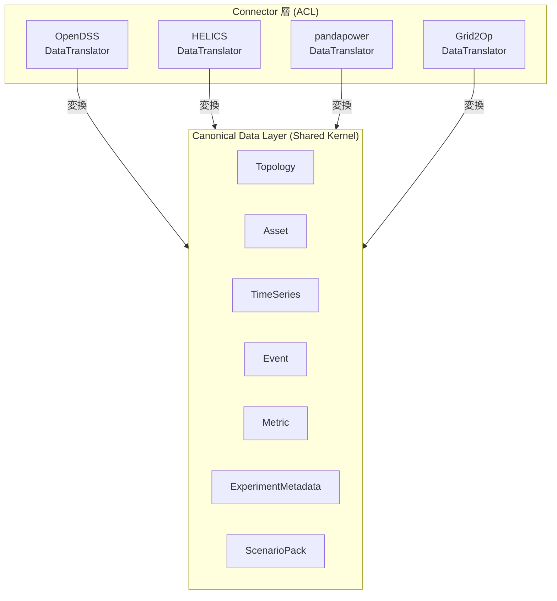
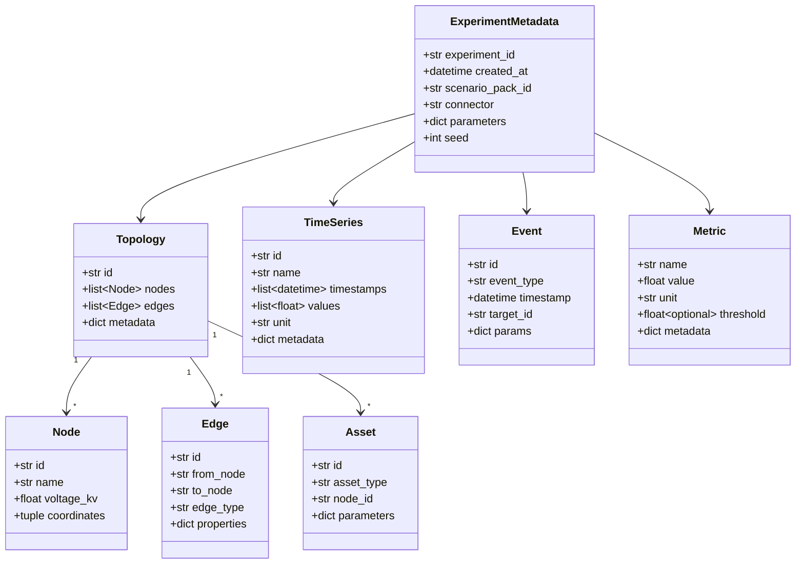
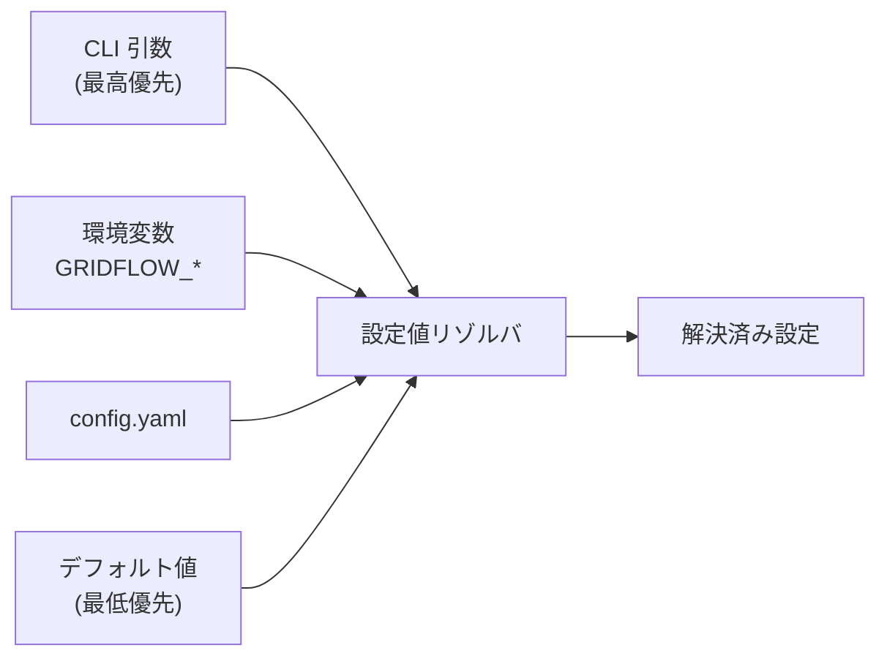

# 第5章 データ設計

本章では、gridflow の中核データモデルである Canonical Data Layer (CDL) の設計、Scenario Pack のデータ構造、設定ファイル仕様、およびエクスポートフォーマットを定義する。

## 更新履歴

| 版数 | 日付 | 変更内容 |
|---|---|---|
| 0.1 | 2026-04-01 | 初版作成 |

---

## 5.1 データモデル概要

### Canonical Data Layer (CDL)

CDL (Canonical Data Layer) は、異なるシミュレーションツール間でデータを共通表現として受け渡すためのツール非依存データモデルである（`REQ-F-003`）。DDD における Shared Kernel に相当し、Clean Architecture のエンティティ層（最内層）に位置する。



### CDL の設計原則

| 原則 | 説明 |
|---|---|
| ツール非依存 | 特定シミュレータの内部表現に依存しない |
| 自己記述的 | メタデータ（単位、座標系、時間基準）を含む |
| バージョン管理可能 | `schema_version` フィールドによりスキーマの後方互換性を管理する |
| シリアライズ可能 | CSV / JSON / Parquet への変換が容易な構造とする |

---

## 5.2 Scenario Pack データ構造

Scenario Pack は、1 件の実験を再現可能な形でパッケージ化したディレクトリ構造である（`REQ-F-001`）。

### ディレクトリ構成

```
scenario-pack/
├── config.yaml              # 実験設定（メイン設定ファイル）
├── metrics.yaml             # 評価指標定義
├── seed                     # 乱数シード値（再現性担保）
├── network/                 # ネットワーク定義
│   ├── topology.json        # ノード・エッジ定義
│   └── assets.json          # 発電機・負荷・蓄電池・送電線定義
├── timeseries/              # 時系列データ
│   ├── load_profile.csv     # 負荷プロファイル
│   ├── solar_generation.csv # 太陽光発電プロファイル
│   └── wind_generation.csv  # 風力発電プロファイル
├── expected/                # 期待結果（回帰テスト用）
│   ├── metrics.json         # 期待メトリクス値
│   └── snapshots/           # 期待スナップショット
└── viz_templates/           # 可視化テンプレート
    ├── voltage_profile.yaml # 電圧プロファイル可視化
    └── power_flow.yaml      # 潮流可視化
```

### config.yaml スキーマ

```yaml
# config.yaml の構造
schema_version: "1.0"          # スキーマバージョン（必須）
name: "ieee13-base-case"       # Scenario Pack 名（必須）
description: "IEEE 13-node test feeder baseline simulation"
baseline: true                 # ベースラインフラグ（比較基準として使用）
citation: "IEEE PES ESTS"      # 引用情報

network:
  topology: "network/topology.json"
  assets: "network/assets.json"

timeseries:
  - path: "timeseries/load_profile.csv"
    type: "load"
    resolution_sec: 3600
  - path: "timeseries/solar_generation.csv"
    type: "generation"
    resolution_sec: 3600

simulation:
  connector: "opendss"
  duration_hours: 24
  step_size_sec: 3600

evaluation:
  metrics: "metrics.yaml"
  expected: "expected/metrics.json"
  tolerance: 0.01               # 許容誤差（回帰テスト用）

visualization:
  templates:
    - "viz_templates/voltage_profile.yaml"
    - "viz_templates/power_flow.yaml"
```

### metrics.yaml スキーマ

```yaml
# metrics.yaml の構造
metrics:
  - name: "voltage_deviation_rate"
    unit: "%"
    threshold:
      max: 5.0
    description: "電圧逸脱率"

  - name: "thermal_overload_hours"
    unit: "hours"
    threshold:
      max: 0.0
    description: "熱的過負荷時間"

  - name: "total_loss"
    unit: "kWh"
    description: "総損失量"
```

---

## 5.3 Canonical Data 形式定義

各 CDL エンティティの構造を Python のデータクラスとして定義する。

### エンティティ一覧



### Python データクラス定義

```python
from __future__ import annotations

from dataclasses import dataclass, field
from datetime import datetime
from enum import Enum


class AssetType(Enum):
    """Asset の種別."""

    GENERATOR = "generator"
    LOAD = "load"
    STORAGE = "storage"
    LINE = "line"
    TRANSFORMER = "transformer"


@dataclass(frozen=True)
class Node:
    """系統ノード."""

    id: str
    name: str
    voltage_kv: float
    coordinates: tuple[float, float] | None = None


@dataclass(frozen=True)
class Edge:
    """系統エッジ（送電線・変圧器接続）."""

    id: str
    from_node: str
    to_node: str
    edge_type: str
    properties: dict[str, object] = field(default_factory=dict)


@dataclass(frozen=True)
class Topology:
    """系統トポロジー（ノードとエッジの集合）."""

    id: str
    nodes: tuple[Node, ...]
    edges: tuple[Edge, ...]
    metadata: dict[str, object] = field(default_factory=dict)


@dataclass(frozen=True)
class Asset:
    """系統アセット（発電機・負荷・蓄電池・送電線）."""

    id: str
    asset_type: AssetType
    node_id: str
    parameters: dict[str, object] = field(default_factory=dict)


@dataclass(frozen=True)
class TimeSeries:
    """時系列データ."""

    id: str
    name: str
    timestamps: tuple[datetime, ...]
    values: tuple[float, ...]
    unit: str
    metadata: dict[str, object] = field(default_factory=dict)


@dataclass(frozen=True)
class Event:
    """イベント（障害・操作・状態変化）."""

    id: str
    event_type: str
    timestamp: datetime
    target_id: str
    params: dict[str, object] = field(default_factory=dict)


@dataclass(frozen=True)
class Metric:
    """評価メトリクス."""

    name: str
    value: float
    unit: str
    threshold: float | None = None
    metadata: dict[str, object] = field(default_factory=dict)


@dataclass(frozen=True)
class ExperimentMetadata:
    """実験メタデータ."""

    experiment_id: str
    created_at: datetime
    scenario_pack_id: str
    connector: str
    parameters: dict[str, object] = field(default_factory=dict)
    seed: int = 0
```

---

## 5.4 設定ファイル仕様

### 設定ファイル形式

gridflow の設定は YAML 形式を採用し、JSON Schema によるバリデーションを行う。

### 設定値の優先順位

設定値は以下の優先順位で解決される（高い方が優先）：

```
CLI 引数 > 環境変数 > config.yaml > デフォルト値
```



### JSON Schema バリデーション

Scenario Pack の `config.yaml` および `metrics.yaml` は、対応する JSON Schema で検証する（`REQ-Q-011`）。

```python
from pathlib import Path
from typing import Any

import yaml
from jsonschema import validate


def validate_scenario_pack(pack_dir: Path) -> list[str]:
    """Scenario Pack のバリデーションを実行する.

    Returns:
        バリデーションエラーのリスト（空なら合格）。
    """
    errors: list[str] = []
    config_path = pack_dir / "config.yaml"

    if not config_path.exists():
        errors.append("config.yaml が見つかりません")
        return errors

    with config_path.open() as f:
        config: dict[str, Any] = yaml.safe_load(f)

    schema = _load_schema("scenario_pack_config")
    try:
        validate(instance=config, schema=schema)
    except Exception as e:
        errors.append(f"config.yaml バリデーションエラー: {e}")

    return errors
```

### 環境変数マッピング

| 環境変数 | 対応する設定項目 | 例 |
|---|---|---|
| `GRIDFLOW_LOG_LEVEL` | ログレベル | `DEBUG`, `INFO`, `WARNING` |
| `GRIDFLOW_DATA_DIR` | データディレクトリ | `/data` |
| `GRIDFLOW_CONNECTOR` | デフォルト Connector | `opendss` |
| `GRIDFLOW_SEED` | デフォルト乱数シード | `42` |

---

## 5.5 エクスポートフォーマット

### 標準エクスポート形式

CDL データは以下の形式でエクスポート可能である（`REQ-F-003`）。

| 形式 | 用途 | 特徴 |
|---|---|---|
| CSV | 汎用的なデータ交換 | 人間可読、Excel 等で開ける |
| JSON | 構造化データ交換 | ネスト構造の保持、API 連携 |
| Parquet | 大規模データ保存 | 圧縮効率、列指向アクセス |

### DataExporter インターフェース

```python
from typing import Protocol

from pathlib import Path


class DataExporter(Protocol):
    """データエクスポートの共通インターフェース."""

    def export(self, data: dict[str, object], output_dir: Path) -> Path:
        """CDL データを指定形式でエクスポートする."""
        ...
```

### CsvExporter

CSV 形式でのエクスポートを提供する。TimeSeries データは 1 ファイル 1 系列、Metric データは一覧表として出力する。

```
output/
├── timeseries/
│   ├── load_profile.csv
│   └── voltage_bus1.csv
├── metrics.csv
└── experiment_metadata.json
```

### PaperExporter（`REQ-Q-006`）

学術論文作成を支援するエクスポーターであり、LaTeX テーブルと matplotlib スクリプトを生成する。

```
output/paper/
├── tables/
│   ├── metrics_comparison.tex     # LaTeX tabular 形式
│   └── scenario_summary.tex
├── figures/
│   ├── voltage_profile.py         # matplotlib スクリプト
│   ├── voltage_profile.pdf        # 生成済み図
│   └── power_flow.py
└── data/
    ├── metrics_comparison.csv     # 図表の元データ
    └── voltage_profile.csv
```

#### LaTeX テーブル出力例

```latex
\begin{table}[htbp]
\centering
\caption{Benchmark Metrics Comparison}
\label{tab:metrics}
\begin{tabular}{lrrr}
\toprule
Metric & Baseline & Proposed & Unit \\
\midrule
Voltage Deviation Rate & 3.2 & 1.8 & \% \\
Thermal Overload Hours & 0.5 & 0.0 & hours \\
Total Loss & 1234.5 & 1100.2 & kWh \\
\bottomrule
\end{tabular}
\end{table}
```

---

## 5.6 トレーサビリティ

| 要件 ID | 本章での対応箇所 |
|---|---|
| `REQ-F-001` | 5.2 Scenario Pack データ構造 |
| `REQ-F-003` | 5.1 CDL 概要、5.3 CDL 形式定義、5.5 エクスポートフォーマット |
| `REQ-Q-006` | 5.5 PaperExporter |
| `REQ-Q-011` | 5.4 JSON Schema バリデーション |
