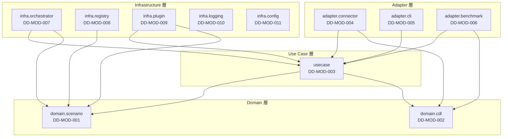

# 第2章 モジュール構成設計

本章では、gridflow の Clean Architecture に基づくパッケージ構成、モジュール一覧と依存関係、レイヤー構成、命名規則、およびモジュール間インターフェース定義を示す。

## 更新履歴

| 版数 | 日付 | 変更内容 |
|---|---|---|
| 0.1 | 2026-04-03 | 初版作成 |
| 0.2 | 2026-04-07 | Phase0結果レビュー対応: (1) `domain/scenario/registry.py` (Protocol) と `errors.py` を追加 (論点6.3)。(2) `usecase/result.py` を追加 (StepResult/ExperimentResult、論点6.4)。(3) `infra/scenario/file_registry.py` を追加 (Domain Protocol 実装)。詳細経緯は `review_record.md` 参照 |
| 0.3 | 2026-04-07 | 論点6.6 Orchestrator 責務分割: `usecase/orchestrator/` を新設（Orchestrator/ExecutionPlan/TimeSync/OrchestratorDriven/HybridSync）、`infra/orchestrator/` を縮小（ContainerOrchestratorRunner/ContainerManager/FederationDriven のみ）。アーキテクチャ doc との整合回復 |

---

## 2.1 パッケージ構成（ディレクトリツリー）

`src/gridflow/` 以下を Clean Architecture 4 層（domain / usecase / adapter / infra）で構成する。

```
gridflow/
├── src/
│   └── gridflow/
│       ├── __init__.py
│       ├── py.typed
│       │
│       ├── domain/                          # Domain 層 ― ビジネスルール
│       │   ├── __init__.py
│       │   ├── scenario/
│       │   │   ├── __init__.py
│       │   │   ├── scenario_pack.py         # ScenarioPack, PackMetadata
│       │   │   ├── registry.py              # ScenarioRegistry (Protocol) ★v0.7 追加（論点6.3）
│       │   │   ├── errors.py                # ScenarioPackError, PackNotFoundError ★Domain契約
│       │   │   └── interfaces.py            # ScenarioRepositoryInterface
│       │   └── cdl/
│       │       ├── __init__.py
│       │       ├── topology.py              # Topology
│       │       ├── asset.py                 # Asset
│       │       ├── time_series.py           # TimeSeries
│       │       ├── event.py                 # Event
│       │       ├── metric.py                # Metric
│       │       └── experiment_metadata.py   # ExperimentMetadata
│       │
│       ├── usecase/                         # Use Case 層 ― アプリケーションロジック
│       │   ├── __init__.py
│       │   ├── run_simulation.py            # RunSimulation
│       │   ├── compare_benchmark.py         # CompareBenchmark
│       │   ├── import_scenario.py           # ImportScenario
│       │   ├── result.py                    # StepStatus, StepResult, ExperimentResult ★v0.7 新設（論点6.4）
│       │   ├── orchestrator/                # ★v0.8 新設（論点6.6）UseCase Orchestrator
│       │   │   ├── __init__.py
│       │   │   ├── orchestrator.py           # Orchestrator (ビジネスロジック、Docker非依存)
│       │   │   ├── execution_plan.py         # ExecutionPlan
│       │   │   ├── time_sync.py              # TimeSync (設定データ)
│       │   │   └── timesync/                 # TimeSyncStrategy 実装 (UseCase部分)
│       │   │       ├── __init__.py
│       │   │       ├── orchestrator_driven.py # OrchestratorDriven
│       │   │       └── hybrid_sync.py        # HybridSync
│       │   ├── scheduling.py                 # SimulationTask, TaskResult
│       │   └── interfaces.py                # Use Case 層 Protocol 定義 (OrchestratorRunner, TimeSyncStrategy 等)
│       │
│       ├── adapter/                         # Adapter 層 ― 外部変換
│       │   ├── __init__.py
│       │   ├── connector/
│       │   │   ├── __init__.py
│       │   │   ├── interfaces.py            # ConnectorInterface
│       │   │   ├── opendss_connector.py      # OpenDSSConnector
│       │   │   └── data_translator.py       # DataTranslator
│       │   ├── cli/
│       │   │   ├── __init__.py
│       │   │   ├── cli_app.py               # CLIApp
│       │   │   ├── command_handler.py        # CommandHandler
│       │   │   └── output_formatter.py      # OutputFormatter
│       │   └── benchmark/
│       │       ├── __init__.py
│       │       ├── benchmark_harness.py     # BenchmarkHarness
│       │       ├── metric_calculator.py     # MetricCalculator
│       │       └── report_generator.py      # ReportGenerator
│       │
│       └── infra/                           # Infrastructure 層 ― 技術基盤
│           ├── __init__.py
│           ├── orchestrator/                # ★v0.8 改訂（論点6.6）Infra 部分のみ
│           │   ├── __init__.py
│           │   ├── container_orchestrator_runner.py  # ContainerOrchestratorRunner (OrchestratorRunner Protocol の Docker 実装)
│           │   ├── container_manager.py      # ContainerManager (Docker 操作低レベル)
│           │   └── timesync/                 # TimeSyncStrategy 実装 (Infra部分)
│           │       ├── __init__.py
│           │       └── federation_driven.py  # FederationDriven (HELICSBroker 依存)
│           ├── scenario/
│           │   ├── __init__.py
│           │   └── file_registry.py         # FileScenarioRegistry（domain.scenario.registry.ScenarioRegistry Protocol 実装）★v0.7
│           ├── registry/                    # ※従来パス。v0.7 で domain Protocol 化に伴い infra.scenario へ実装移動を推奨
│           │   ├── __init__.py
│           │   └── scenario_registry.py     # ScenarioRegistry（旧配置、移行対象）
│           ├── plugin/
│           │   ├── __init__.py
│           │   ├── plugin_registry.py       # PluginRegistry
│           │   └── plugin_discovery.py      # PluginDiscovery
│           ├── logging/
│           │   ├── __init__.py
│           │   └── structured_logger.py     # StructuredLogger
│           └── config/
│               ├── __init__.py
│               └── config_manager.py        # ConfigManager
│
├── tests/
│   ├── conftest.py                          # 共通フィクスチャ
│   ├── unit/
│   │   ├── conftest.py
│   │   ├── domain/
│   │   │   ├── test_scenario_pack.py
│   │   │   ├── test_topology.py
│   │   │   ├── test_asset.py
│   │   │   ├── test_time_series.py
│   │   │   ├── test_event.py
│   │   │   ├── test_metric.py
│   │   │   └── test_experiment_metadata.py
│   │   ├── usecase/
│   │   │   ├── test_run_simulation.py
│   │   │   ├── test_compare_benchmark.py
│   │   │   └── test_import_scenario.py
│   │   ├── adapter/
│   │   │   ├── test_opendss_connector.py
│   │   │   ├── test_data_translator.py
│   │   │   ├── test_cli_app.py
│   │   │   ├── test_command_handler.py
│   │   │   ├── test_output_formatter.py
│   │   │   ├── test_benchmark_harness.py
│   │   │   ├── test_metric_calculator.py
│   │   │   └── test_report_generator.py
│   │   └── infra/
│   │       ├── test_orchestrator.py
│   │       ├── test_execution_plan.py
│   │       ├── test_container_manager.py
│   │       ├── test_time_sync.py
│   │       ├── test_scenario_registry.py
│   │       ├── test_plugin_registry.py
│   │       ├── test_plugin_discovery.py
│   │       ├── test_structured_logger.py
│   │       └── test_config_manager.py
│   └── integration/
│       ├── conftest.py
│       ├── test_simulation_flow.py          # UC-01: シナリオ実行 E2E
│       ├── test_pack_registration.py        # UC-02: Pack 作成・登録
│       ├── test_benchmark_flow.py           # UC-03: ベンチマーク実行
│       └── test_connector_lifecycle.py      # Connector 起動〜停止
│
├── connectors/
│   └── opendss/
│       └── Dockerfile                       # opendss-connector イメージ
├── Dockerfile                               # gridflow-core イメージ
├── docker-compose.yml
└── pyproject.toml
```

---

## 2.2 モジュール一覧・依存関係

### 2.2.1 モジュール一覧

| # | モジュール名 | 責務 | レイヤー | 依存先 |
|---|---|---|---|---|
| DD-MOD-001 | `gridflow.domain.scenario` | ScenarioPack・PackMetadata のエンティティ定義、バリデーション | Domain | なし |
| DD-MOD-002 | `gridflow.domain.cdl` | Topology・Asset・TimeSeries・Event・Metric・ExperimentMetadata の値オブジェクト定義 | Domain | なし |
| DD-MOD-003 | `gridflow.usecase` | RunSimulation・CompareBenchmark・ImportScenario のユースケースロジック | Use Case | `domain.scenario`, `domain.cdl` |
| DD-MOD-004 | `gridflow.adapter.connector` | ConnectorInterface 定義、OpenDSSConnector 実装、DataTranslator による CDL 変換 | Adapter | `usecase`, `domain.cdl` |
| DD-MOD-005 | `gridflow.adapter.cli` | CLIApp・CommandHandler・OutputFormatter による CLI I/O 処理 | Adapter | `usecase` |
| DD-MOD-006 | `gridflow.adapter.benchmark` | BenchmarkHarness・MetricCalculator・ReportGenerator による評価・レポート出力 | Adapter | `usecase`, `domain.cdl` |
| DD-MOD-007 | `gridflow.infra.orchestrator` | Orchestrator・ExecutionPlan・ContainerManager・TimeSync によるコンテナ実行制御 | Infrastructure | `usecase`, `domain.scenario` |
| DD-MOD-008 | `gridflow.infra.registry` | ScenarioRegistry による Scenario Pack の永続化・検索 | Infrastructure | `domain.scenario` |
| DD-MOD-009 | `gridflow.infra.plugin` | PluginRegistry・PluginDiscovery による段階的カスタムレイヤー管理 | Infrastructure | `usecase`, `domain.scenario` |
| DD-MOD-010 | `gridflow.infra.logging` | StructuredLogger による構造化ログ出力 | Infrastructure | なし |
| DD-MOD-011 | `gridflow.infra.config` | ConfigManager による設定ファイル読み込み・バリデーション | Infrastructure | なし |

### 2.2.2 モジュール依存関係図



> **依存ルール**: 矢印は「依存する方向」を示す。Domain 層は他のどの層にも依存しない。Use Case 層は Domain 層のみに依存する。Adapter 層・Infrastructure 層は Use Case 層と Domain 層に依存するが、相互には依存しない。`infra.logging` と `infra.config` はユーティリティとして全層から利用されるが、ビジネスロジックへの依存は持たない。

---

## 2.3 レイヤー構成（Clean Architecture 層別モジュール配置）

### 2.3.1 レイヤー定義

| レイヤー | 責務 | 配置モジュール | 依存ルール |
|---|---|---|---|
| **Domain** | ビジネスルール・エンティティ・値オブジェクトの定義。外部技術に一切依存しない純粋なドメインモデル | `domain.scenario`, `domain.cdl` | 他層に依存しない（最内層） |
| **Use Case** | アプリケーション固有のビジネスロジック。ユースケースごとに 1 クラスとし、Domain 層のエンティティを操作する | `usecase` | Domain 層のみに依存 |
| **Adapter** | 外部世界（CLI・Connector・Benchmark）と Use Case 層の間を変換する。Protocol を介して Use Case 層と疎結合 | `adapter.connector`, `adapter.cli`, `adapter.benchmark` | Use Case 層・Domain 層に依存。Infrastructure 層には依存しない |
| **Infrastructure** | 技術基盤の具象実装。Docker 操作・ファイル永続化・プラグイン機構・ログ・設定など | `infra.orchestrator`, `infra.registry`, `infra.plugin`, `infra.logging`, `infra.config` | Use Case 層・Domain 層に依存。Adapter 層には依存しない |

### 2.3.2 依存方向の図示

```
┌─────────────────────────────────────────────────┐
│                  Adapter 層                      │
│  connector │ cli │ benchmark                     │
└──────────────────┬──────────────────────────────┘
                   │ depends on
┌──────────────────▼──────────────────────────────┐
│                 Use Case 層                      │
│  RunSimulation │ CompareBenchmark │ ImportScenario│
└──────────────────┬──────────────────────────────┘
                   │ depends on
┌──────────────────▼──────────────────────────────┐
│                  Domain 層                       │
│  scenario │ cdl                                  │
└─────────────────────────────────────────────────┘

┌─────────────────────────────────────────────────┐
│              Infrastructure 層                   │
│  orchestrator │ registry │ plugin │ logging │ config│
└──────────────────┬──────────────────────────────┘
                   │ depends on
           Use Case 層 / Domain 層
```

### 2.3.3 依存ルール詳細

1. **Domain 層は他のどの層にも依存しない。** 標準ライブラリ（`dataclasses`, `enum`, `typing` 等）のみを使用する。
2. **Use Case 層は Domain 層のみに依存する。** 外部 I/O には Protocol（インターフェース）を定義し、具象実装は Adapter / Infrastructure 層に委ねる。
3. **Adapter 層は Use Case 層と Domain 層に依存する。** Infrastructure 層には直接依存しない。
4. **Infrastructure 層は Use Case 層と Domain 層に依存する。** Adapter 層には直接依存しない。
5. **Adapter 層と Infrastructure 層は相互に依存しない。** 両者の連携が必要な場合は Use Case 層の Protocol を介する。
6. **`infra.logging` と `infra.config` は例外的に全層から参照可能とする。** ただし、これらのモジュールはビジネスロジックへの依存を持たない。

---

## 2.4 モジュール ↔ フォルダマッピング

| 論理モジュール名 | DD-ID | パス | 主要ファイル |
|---|---|---|---|
| `gridflow.domain.scenario` | DD-MOD-001 | `src/gridflow/domain/scenario/` | `scenario_pack.py`, `interfaces.py` |
| `gridflow.domain.cdl` | DD-MOD-002 | `src/gridflow/domain/cdl/` | `topology.py`, `asset.py`, `time_series.py`, `event.py`, `metric.py`, `experiment_metadata.py` |
| `gridflow.usecase` | DD-MOD-003 | `src/gridflow/usecase/` | `run_simulation.py`, `compare_benchmark.py`, `import_scenario.py`, `interfaces.py` |
| `gridflow.adapter.connector` | DD-MOD-004 | `src/gridflow/adapter/connector/` | `interfaces.py`, `opendss_connector.py`, `data_translator.py` |
| `gridflow.adapter.cli` | DD-MOD-005 | `src/gridflow/adapter/cli/` | `cli_app.py`, `command_handler.py`, `output_formatter.py` |
| `gridflow.adapter.benchmark` | DD-MOD-006 | `src/gridflow/adapter/benchmark/` | `benchmark_harness.py`, `metric_calculator.py`, `report_generator.py` |
| `gridflow.infra.orchestrator` | DD-MOD-007 | `src/gridflow/infra/orchestrator/` | `orchestrator.py`, `execution_plan.py`, `container_manager.py`, `time_sync.py` |
| `gridflow.infra.registry` | DD-MOD-008 | `src/gridflow/infra/registry/` | `scenario_registry.py` |
| `gridflow.infra.plugin` | DD-MOD-009 | `src/gridflow/infra/plugin/` | `plugin_registry.py`, `plugin_discovery.py` |
| `gridflow.infra.logging` | DD-MOD-010 | `src/gridflow/infra/logging/` | `structured_logger.py` |
| `gridflow.infra.config` | DD-MOD-011 | `src/gridflow/infra/config/` | `config_manager.py` |

---

## 2.5 命名規則

### 2.5.1 フォルダ命名規則

| 対象 | 規則 | 例 |
|---|---|---|
| Python パッケージディレクトリ | `snake_case` | `domain/`, `scenario/`, `time_series/` |
| テストディレクトリ | `snake_case` | `tests/unit/`, `tests/integration/` |
| ドキュメントディレクトリ | `snake_case` | `docs/basic_design/`, `docs/detailed_design/` |
| Connector ディレクトリ | `snake_case` | `connectors/opendss/` |

### 2.5.2 ファイル命名規則

| 対象 | 規則 | 例 |
|---|---|---|
| Python モジュール | `snake_case.py` | `scenario_pack.py`, `config_manager.py` |
| パッケージ初期化 | `__init__.py` | 各パッケージに必須 |
| 設定ファイル | `snake_case.{yaml,toml}` | `gridflow.yaml`, `pyproject.toml` |
| データファイル | `snake_case.{yaml,json,csv,parquet}` | `pack.yaml`, `topology.json` |
| Dockerfile | `Dockerfile`（サフィックスなし） | `Dockerfile` |
| Docker Compose | `docker-compose.yml` | `docker-compose.yml` |

### 2.5.3 テストファイル命名規則

| 対象 | 規則 | 例 |
|---|---|---|
| テストモジュール | `test_*.py`（`pytest` 自動検出対応） | `test_scenario_pack.py` |
| 共通フィクスチャ | `conftest.py`（各テストディレクトリに配置） | `tests/conftest.py`, `tests/unit/conftest.py` |
| テストデータ | `tests/fixtures/` 配下に配置 | `tests/fixtures/sample_pack.yaml` |

### 2.5.4 クラス・関数・変数命名規則（PEP 8 準拠 + プロジェクト固有）

| 対象 | 規則 | 例 |
|---|---|---|
| クラス名 | `PascalCase` | `ScenarioPack`, `OpenDSSConnector` |
| Protocol（インターフェース） | `PascalCase` + `Interface` サフィックス | `ConnectorInterface`, `ScenarioRepositoryInterface` |
| 関数・メソッド名 | `snake_case` | `run_simulation()`, `load_pack()` |
| 変数名 | `snake_case` | `execution_plan`, `metric_value` |
| 定数 | `UPPER_SNAKE_CASE` | `DEFAULT_TIMEOUT`, `MAX_RETRIES` |
| プライベート属性 | `_snake_case`（先頭アンダースコア） | `_registry`, `_logger` |
| 型エイリアス | `PascalCase` | `PackId`, `MetricResult` |

### 2.5.5 Docker 関連命名規則

| 対象 | 規則 | 例 |
|---|---|---|
| イメージ名 | `gridflow-{component}` | `gridflow-core`, `gridflow-opendss` |
| コンテナ名 | `gridflow-{component}` | `gridflow-core`, `gridflow-opendss` |
| ネットワーク名 | `gridflow-net` | `gridflow-net` |
| ボリューム名 | `gridflow-{purpose}` | `gridflow-shared-data` |
| サービス名（Compose） | `{component}` または `{component}-connector` | `gridflow-core`, `opendss-connector` |

---

## 2.6 モジュール間インターフェース定義

モジュール間の結合は `typing.Protocol` を用いた構造的部分型で定義する。各レイヤーの境界に Protocol を配置し、依存性逆転（DIP）を実現する。

### 2.6.1 Protocol 一覧

| Protocol 名 | 定義場所 | 定義レイヤー | 実装クラス | 実装レイヤー | 責務 |
|---|---|---|---|---|---|
| `ScenarioRepositoryInterface` | `domain/scenario/interfaces.py` | Domain | `ScenarioRegistry` | Infrastructure | Scenario Pack の永続化・取得・検索 |
| `ConnectorInterface` | `adapter/connector/interfaces.py` | Adapter | `OpenDSSConnector` | Adapter | Connector の初期化・実行・停止・結果取得 |
| `OrchestratorInterface` | `usecase/interfaces.py` | Use Case | `Orchestrator` | Infrastructure | コンテナ実行制御・ステータス管理 |
| `BenchmarkRunnerInterface` | `usecase/interfaces.py` | Use Case | `BenchmarkHarness` | Adapter | ベンチマーク実行・メトリクス計算 |
| `LoggerInterface` | `usecase/interfaces.py` | Use Case | `StructuredLogger` | Infrastructure | 構造化ログ出力 |
| `ConfigProviderInterface` | `usecase/interfaces.py` | Use Case | `ConfigManager` | Infrastructure | 設定値の取得・バリデーション |
| `PluginLoaderInterface` | `usecase/interfaces.py` | Use Case | `PluginDiscovery` | Infrastructure | プラグインの検出・ロード・依存解決 |
| `DataTranslatorInterface` | `adapter/connector/interfaces.py` | Adapter | `DataTranslator` | Adapter | シミュレータ固有データ ↔ CDL 変換 |
| `ReportOutputInterface` | `adapter/benchmark/interfaces.py` | Adapter | `ReportGenerator` | Adapter | ベンチマーク結果のフォーマット出力 |

### 2.6.2 Protocol 定義方針

1. **Protocol は消費側レイヤーに配置する。** Use Case 層が Infrastructure 層の機能を必要とする場合、Protocol は Use Case 層の `interfaces.py` に定義し、具象クラスを Infrastructure 層に配置する（依存性逆転原則）。
2. **Protocol メソッドは IPO 形式で設計する。** Input（引数・型）→ Process（処理概要）→ Output（戻り値・型・例外）を第 3 章クラス設計で詳細化する。
3. **`runtime_checkable` を付与する。** 実行時の `isinstance` チェックを可能にし、Plugin ロード時の型安全性を確保する。

```python
# Protocol 定義の標準パターン（例: ScenarioRepositoryInterface）
from typing import Protocol, runtime_checkable

@runtime_checkable
class ScenarioRepositoryInterface(Protocol):
    def save(self, pack: "ScenarioPack") -> None: ...
    def find_by_id(self, pack_id: str) -> "ScenarioPack | None": ...
    def list_all(self) -> list["ScenarioPack"]: ...
    def delete(self, pack_id: str) -> None: ...
```

---

## トレーサビリティ

| 要件 ID | 本章での対応箇所 |
|---|---|
| `REQ-C-001` | 2.1 Python パッケージ構成、2.5.2 ファイル命名規則 |
| `REQ-C-002` | 2.1 Docker 関連ファイル配置、2.5.5 Docker 関連命名規則 |
| `REQ-C-003` | 2.3 Clean Architecture 4 層による複雑さ制御 |
| `REQ-C-005` | 2.6 Protocol による公開インターフェース定義 |
| `REQ-C-006` | 2.5 英語ベースの命名規則 |
| `REQ-F-001` | 2.2 DD-MOD-001 (domain.scenario), DD-MOD-008 (infra.registry) |
| `REQ-F-002` | 2.2 DD-MOD-007 (infra.orchestrator) |
| `REQ-F-003` | 2.2 DD-MOD-002 (domain.cdl) |
| `REQ-F-004` | 2.2 DD-MOD-006 (adapter.benchmark) |
| `REQ-F-005` | 2.2 DD-MOD-005 (adapter.cli) |
| `REQ-F-006` | 2.2 DD-MOD-009 (infra.plugin) |
| `REQ-F-007` | 2.2 DD-MOD-004 (adapter.connector) |
| `REQ-Q-004` | 2.6 Protocol によるモジュール間疎結合 |
| `REQ-Q-008` | 2.2 DD-MOD-010 (infra.logging) |
