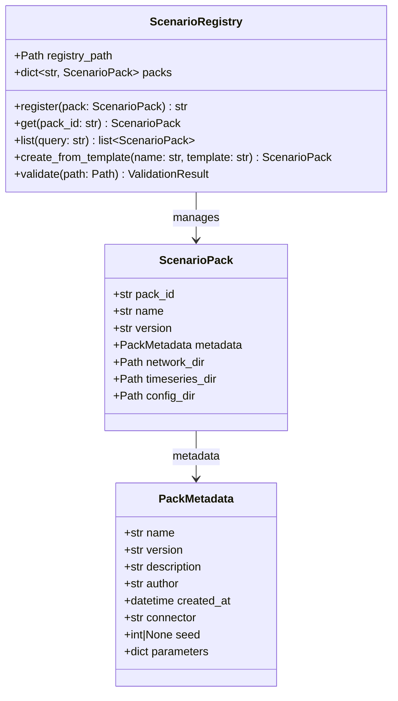
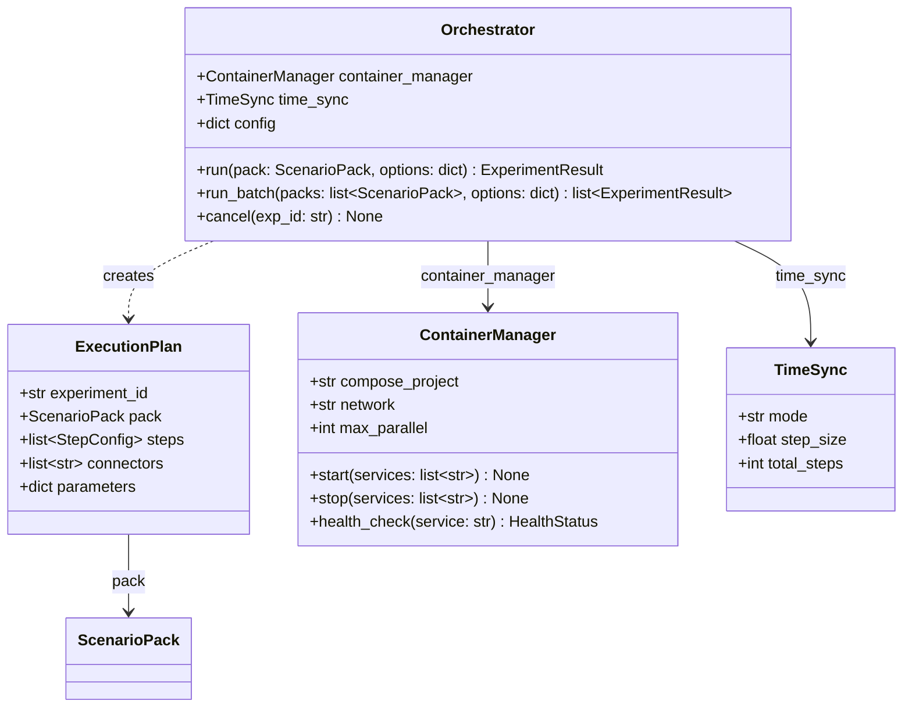
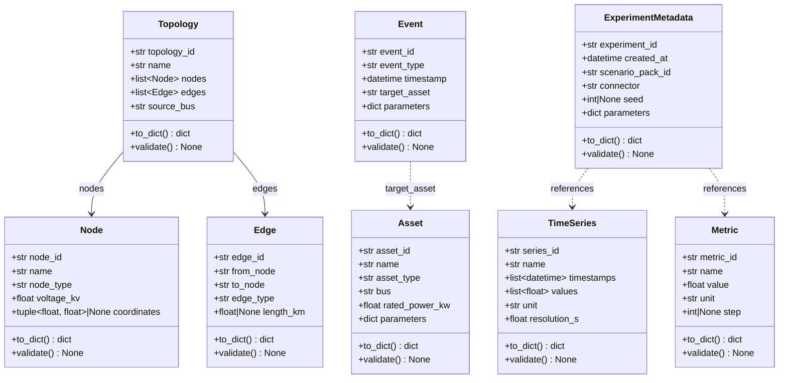
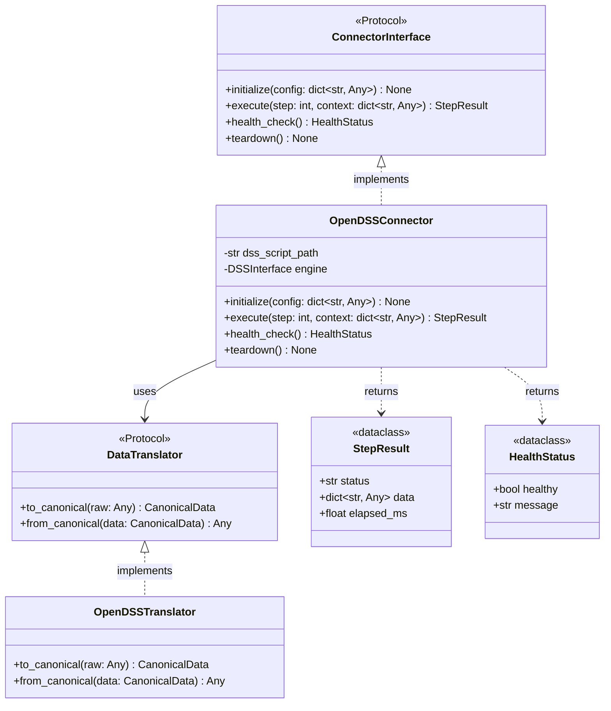
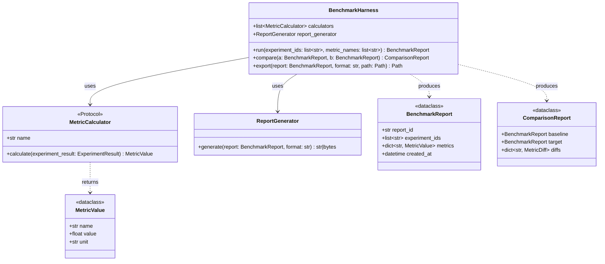
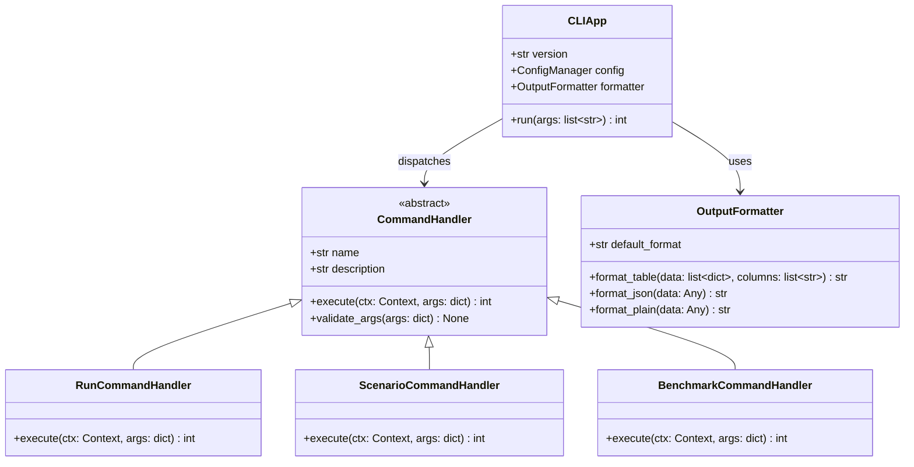
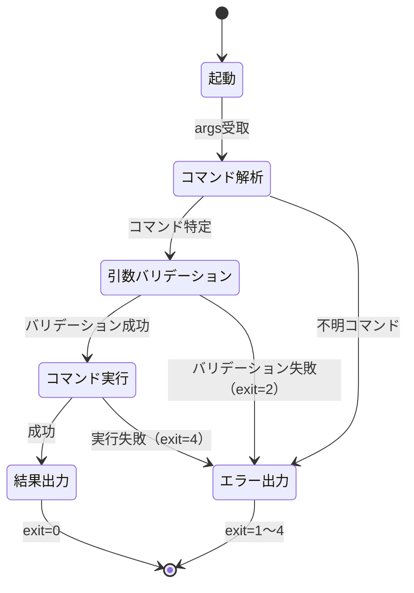
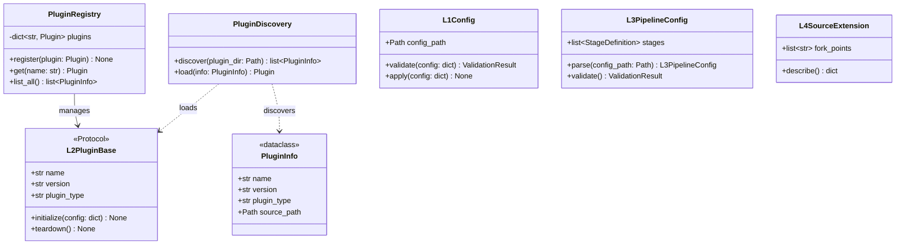
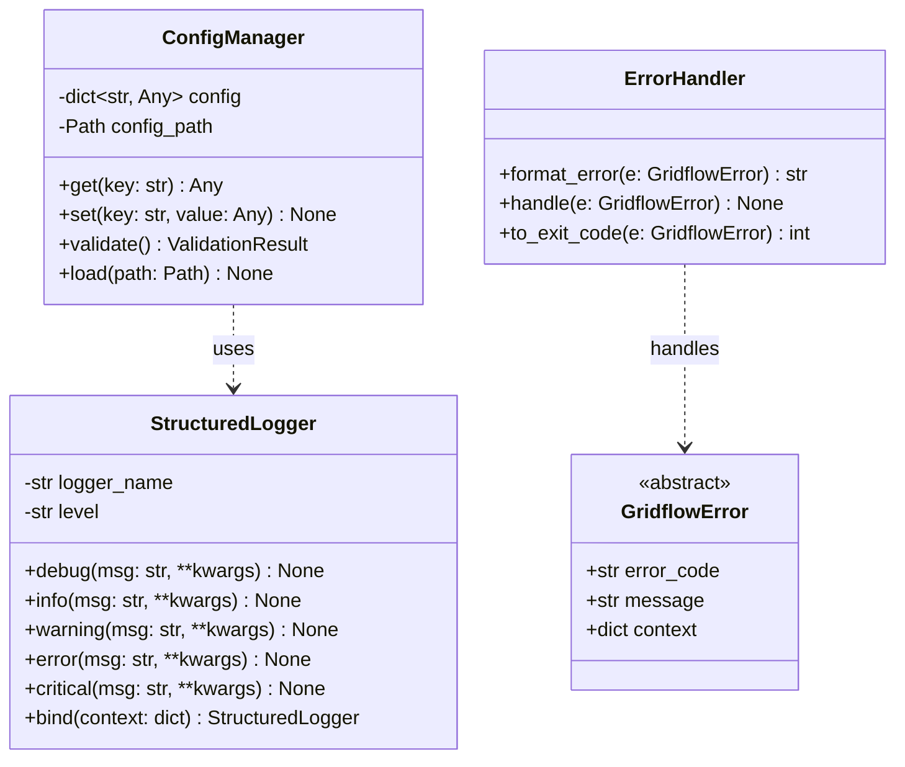

# 3. クラス設計

## 更新履歴

| バージョン | 日付 | 変更内容 | 著者 |
|---|---|---|---|
| 0.1 | 2026-04-03 | 初版作成 | gridflow設計チーム |
| 0.2 | 2026-04-04 | 3.5〜3.9 追記 | gridflow設計チーム |

---

## 3.1 クラス一覧

| クラス名 | モジュール | レイヤー | 責務 | 関連要件 |
|---|---|---|---|---|
| ScenarioPack | gridflow.domain.scenario | Domain | 実験パッケージのデータモデル | REQ-F-001 |
| PackMetadata | gridflow.domain.scenario | Domain | パックのメタデータ | REQ-F-001 |
| ScenarioRegistry | gridflow.infra.registry | Infra | パックの登録・検索・バージョン管理 | REQ-F-001 |
| Orchestrator | gridflow.infra.orchestrator | Infra | 実験実行の統制 | REQ-F-002 |
| ExecutionPlan | gridflow.infra.orchestrator | Infra | 実行計画の定義 | REQ-F-002 |
| ContainerManager | gridflow.infra.orchestrator | Infra | Dockerコンテナ管理 | REQ-F-002 |
| TimeSync | gridflow.infra.orchestrator | Infra | 時間同期制御 | REQ-F-002 |
| Topology | gridflow.domain.cdl | Domain | ネットワークトポロジ | REQ-F-003 |
| Node | gridflow.domain.cdl | Domain | ネットワークノード | REQ-F-003 |
| Edge | gridflow.domain.cdl | Domain | ネットワークエッジ | REQ-F-003 |
| Asset | gridflow.domain.cdl | Domain | 電力機器 | REQ-F-003 |
| TimeSeries | gridflow.domain.cdl | Domain | 時系列データ | REQ-F-003 |
| Event | gridflow.domain.cdl | Domain | シミュレーションイベント | REQ-F-003 |
| Metric | gridflow.domain.cdl | Domain | 評価指標 | REQ-F-003 |
| ExperimentMetadata | gridflow.domain.cdl | Domain | 実験メタデータ | REQ-F-003 |
| ConnectorInterface | gridflow.usecase.interfaces | UseCase | 外部シミュレータ統一IF | REQ-F-007 |
| OpenDSSConnector | gridflow.adapter.connector | Adapter | OpenDSS接続実装 | REQ-F-007 |
| BenchmarkHarness | gridflow.adapter.benchmark | Adapter | ベンチマーク評価 | REQ-F-004 |
| MetricCalculator | gridflow.usecase.interfaces | UseCase | 評価指標計算Protocol | REQ-F-004 |
| CLIApp | gridflow.adapter.cli | Adapter | CLIエントリポイント | REQ-F-005 |
| PluginRegistry | gridflow.infra.plugin | Infra | プラグイン管理 | REQ-F-006 |
| StructuredLogger | gridflow.infra.logging | Infra | 構造化ログ | REQ-Q-008 |
| ConfigManager | gridflow.infra.config | Infra | 設定管理 | REQ-Q-009 |

---

## 3.2 Scenario Pack関連（REQ-F-001）

### 3.2.1 クラス図



### 3.2.2 ScenarioPack

**モジュール:** `gridflow.domain.scenario`

| 属性 | 型 | 説明 |
|---|---|---|
| pack_id | str | パックの一意識別子 |
| name | str | パック名 |
| version | str | バージョン文字列 |
| metadata | PackMetadata | パックのメタデータ |
| network_dir | Path | ネットワーク定義ディレクトリ |
| timeseries_dir | Path | 時系列データディレクトリ |
| config_dir | Path | 設定ファイルディレクトリ |

### 3.2.3 PackMetadata

**モジュール:** `gridflow.domain.scenario`

| 属性 | 型 | 説明 |
|---|---|---|
| name | str | メタデータ名 |
| version | str | バージョン文字列 |
| description | str | パックの説明 |
| author | str | 作成者 |
| created_at | datetime | 作成日時 |
| connector | str | 使用するコネクタ名 |
| seed | int \| None | 乱数シード（再現性用） |
| parameters | dict | 追加パラメータ |

### 3.2.4 ScenarioRegistry

**モジュール:** `gridflow.infra.registry`

| 属性 | 型 | 説明 |
|---|---|---|
| registry_path | Path | レジストリの保存先パス |
| packs | dict[str, ScenarioPack] | 登録済みパックのマップ |

#### メソッド

**register**

| 項目 | 内容 |
|---|---|
| **Input** | `pack: ScenarioPack` -- 登録対象のシナリオパック |
| **Process** | パックのバリデーションを実施し、pack_idをキーとしてレジストリに登録する。既存のpack_idと重複する場合はバージョンを比較し、新規バージョンとして登録する。 |
| **Output** | `str` -- 登録されたpack_id。バリデーション失敗時は `ValidationError` を送出。 |

**get**

| 項目 | 内容 |
|---|---|
| **Input** | `pack_id: str` -- 取得対象のパックID |
| **Process** | レジストリからpack_idに一致するScenarioPackを検索して返却する。 |
| **Output** | `ScenarioPack` -- 該当するパック。見つからない場合は `PackNotFoundError` を送出。 |

**list**

| 項目 | 内容 |
|---|---|
| **Input** | `query: str` -- 検索クエリ文字列（名前・タグ等でフィルタ） |
| **Process** | レジストリ内のパックをクエリ条件でフィルタリングし、一致するパックのリストを返却する。 |
| **Output** | `list[ScenarioPack]` -- 条件に合致するパックのリスト。該当なしの場合は空リスト。 |

**create_from_template**

| 項目 | 内容 |
|---|---|
| **Input** | `name: str` -- 新規パック名, `template: str` -- テンプレート名 |
| **Process** | 指定テンプレートを基にディレクトリ構成とメタデータを生成し、新規ScenarioPackを構築する。 |
| **Output** | `ScenarioPack` -- 生成されたパック。テンプレートが存在しない場合は `TemplateNotFoundError` を送出。 |

**validate**

| 項目 | 内容 |
|---|---|
| **Input** | `path: Path` -- バリデーション対象のパックディレクトリパス |
| **Process** | パックのディレクトリ構造、メタデータスキーマ、必須ファイルの存在をチェックする。 |
| **Output** | `ValidationResult` -- バリデーション結果。構造不正の場合は結果オブジェクトにエラー詳細を格納。 |

---

## 3.3 Orchestrator関連（REQ-F-002）

### 3.3.1 クラス図



### 3.3.2 Orchestrator

**モジュール:** `gridflow.infra.orchestrator`

| 属性 | 型 | 説明 |
|---|---|---|
| container_manager | ContainerManager | コンテナ管理インスタンス |
| time_sync | TimeSync | 時間同期制御インスタンス |
| config | dict | オーケストレータ設定 |

#### メソッド

**run**

| 項目 | 内容 |
|---|---|
| **Input** | `pack: ScenarioPack` -- 実行対象のシナリオパック, `options: dict` -- 実行オプション（タイムアウト、並列数等） |
| **Process** | ExecutionPlanを生成し、ContainerManagerでコンテナを起動後、TimeSyncに従って時間ステップを進行しながらシミュレーションを実行する。各ステップの結果を収集し、完了後にコンテナを停止する。 |
| **Output** | `ExperimentResult` -- 実験結果。実行失敗時は `ExecutionError` を送出。 |

**run_batch**

| 項目 | 内容 |
|---|---|
| **Input** | `packs: list[ScenarioPack]` -- 実行対象のパックリスト, `options: dict` -- 実行オプション |
| **Process** | 複数のシナリオパックを順次またはmax_parallelに従い並列で実行する。各パックに対してrunメソッドを呼び出し、結果をリストとして集約する。 |
| **Output** | `list[ExperimentResult]` -- 各パックの実験結果リスト。個別の失敗はリスト内のExperimentResultにエラー情報として格納。 |

**cancel**

| 項目 | 内容 |
|---|---|
| **Input** | `exp_id: str` -- キャンセル対象の実験ID |
| **Process** | 実行中の実験を特定し、関連コンテナを停止してリソースを解放する。 |
| **Output** | `None`。該当実験が存在しない場合は `ExperimentNotFoundError` を送出。 |

### 3.3.3 ExecutionPlan

**モジュール:** `gridflow.infra.orchestrator`

| 属性 | 型 | 説明 |
|---|---|---|
| experiment_id | str | 実験の一意識別子 |
| pack | ScenarioPack | 対象シナリオパック |
| steps | list[StepConfig] | 実行ステップの設定リスト |
| connectors | list[str] | 使用するコネクタ名のリスト |
| parameters | dict | 実行パラメータ |

### 3.3.4 ContainerManager

**モジュール:** `gridflow.infra.orchestrator`

| 属性 | 型 | 説明 |
|---|---|---|
| compose_project | str | Docker Composeプロジェクト名 |
| network | str | Dockerネットワーク名 |
| max_parallel | int | 最大並列コンテナ数 |

#### メソッド

**start**

| 項目 | 内容 |
|---|---|
| **Input** | `services: list[str]` -- 起動対象のサービス名リスト |
| **Process** | Docker Composeを使用して指定サービスのコンテナを起動する。ネットワーク設定を適用し、起動完了を待機する。 |
| **Output** | `None`。起動失敗時は `ContainerStartError` を送出。 |

**stop**

| 項目 | 内容 |
|---|---|
| **Input** | `services: list[str]` -- 停止対象のサービス名リスト |
| **Process** | 指定サービスのコンテナをグレースフルに停止し、リソースを解放する。 |
| **Output** | `None`。停止失敗時は `ContainerStopError` を送出。 |

**health_check**

| 項目 | 内容 |
|---|---|
| **Input** | `service: str` -- ヘルスチェック対象のサービス名 |
| **Process** | 指定サービスのコンテナに対してヘルスチェックを実行し、応答状態を確認する。 |
| **Output** | `HealthStatus` -- サービスの稼働状態（healthy / unhealthy / starting）。サービスが存在しない場合は `ServiceNotFoundError` を送出。 |

### 3.3.5 TimeSync

**モジュール:** `gridflow.infra.orchestrator`

| 属性 | 型 | 説明 |
|---|---|---|
| mode | str | 同期モード（例: "lockstep", "async"） |
| step_size | float | 1ステップあたりの時間幅（秒） |
| total_steps | int | 総ステップ数 |

---

## 3.4 CDL関連（REQ-F-003）

CDL（Common Data Language）ドメインクラスは全て `dataclass(frozen=True)` として定義し、イミュータブルとする。全クラスに共通メソッド `to_dict()` および `validate()` を実装する。

### 3.4.1 クラス図



### 3.4.2 共通メソッド

全CDLクラスは以下の共通メソッドを実装する。

**to_dict**

| 項目 | 内容 |
|---|---|
| **Input** | なし |
| **Process** | インスタンスの全属性を再帰的に辞書形式へ変換する。datetime型はISO 8601文字列、Path型は文字列に変換する。 |
| **Output** | `dict` -- 属性名をキーとした辞書。 |

**validate**

| 項目 | 内容 |
|---|---|
| **Input** | なし |
| **Process** | インスタンスの属性値に対して型チェック・値域チェック・整合性チェックを実施する。 |
| **Output** | `None`。バリデーション失敗時は `CDLValidationError` を送出。 |

### 3.4.3 Topology

**モジュール:** `gridflow.domain.cdl`

| 属性 | 型 | 説明 |
|---|---|---|
| topology_id | str | トポロジの一意識別子 |
| name | str | トポロジ名 |
| nodes | list[Node] | ノードのリスト |
| edges | list[Edge] | エッジのリスト |
| source_bus | str | 電源バスのノードID |

### 3.4.4 Node

**モジュール:** `gridflow.domain.cdl`

| 属性 | 型 | 説明 |
|---|---|---|
| node_id | str | ノードの一意識別子 |
| name | str | ノード名 |
| node_type | str | ノード種別（例: "bus", "load", "generator"） |
| voltage_kv | float | 定格電圧（kV） |
| coordinates | tuple[float, float] \| None | 地理座標（緯度, 経度）。不明時はNone |

### 3.4.5 Edge

**モジュール:** `gridflow.domain.cdl`

| 属性 | 型 | 説明 |
|---|---|---|
| edge_id | str | エッジの一意識別子 |
| from_node | str | 始点ノードID |
| to_node | str | 終点ノードID |
| edge_type | str | エッジ種別（例: "line", "transformer"） |
| length_km | float \| None | 線路長（km）。該当しない場合はNone |

### 3.4.6 Asset

**モジュール:** `gridflow.domain.cdl`

| 属性 | 型 | 説明 |
|---|---|---|
| asset_id | str | 機器の一意識別子 |
| name | str | 機器名 |
| asset_type | str | 機器種別（例: "pv", "battery", "load"） |
| bus | str | 接続先バスのノードID |
| rated_power_kw | float | 定格電力（kW） |
| parameters | dict | 機器固有の追加パラメータ |

### 3.4.7 TimeSeries

**モジュール:** `gridflow.domain.cdl`

| 属性 | 型 | 説明 |
|---|---|---|
| series_id | str | 時系列データの一意識別子 |
| name | str | 時系列名 |
| timestamps | list[datetime] | タイムスタンプのリスト |
| values | list[float] | 値のリスト |
| unit | str | 単位（例: "kW", "V", "A"） |
| resolution_s | float | データ解像度（秒） |

### 3.4.8 Event

**モジュール:** `gridflow.domain.cdl`

| 属性 | 型 | 説明 |
|---|---|---|
| event_id | str | イベントの一意識別子 |
| event_type | str | イベント種別（例: "fault", "switch", "setpoint"） |
| timestamp | datetime | イベント発生時刻 |
| target_asset | str | 対象機器のasset_id |
| parameters | dict | イベント固有のパラメータ |

### 3.4.9 Metric

**モジュール:** `gridflow.domain.cdl`

| 属性 | 型 | 説明 |
|---|---|---|
| metric_id | str | 指標の一意識別子 |
| name | str | 指標名 |
| value | float | 指標値 |
| unit | str | 単位 |
| step | int \| None | 対応するステップ番号。全体指標の場合はNone |

### 3.4.10 ExperimentMetadata

**モジュール:** `gridflow.domain.cdl`

| 属性 | 型 | 説明 |
|---|---|---|
| experiment_id | str | 実験の一意識別子 |
| created_at | datetime | 実験作成日時 |
| scenario_pack_id | str | 使用したシナリオパックのID |
| connector | str | 使用したコネクタ名 |
| seed | int \| None | 乱数シード。未指定時はNone |
| parameters | dict | 実験パラメータ |

---

## 3.5 Connector関連クラス設計（REQ-F-007）

### 3.5.1 クラス図



### 3.5.2 ConnectorInterface（Protocol）

**モジュール:** `gridflow.usecase.interfaces`

UseCase層に定義し、DIP（依存性逆転の原則）を適用する。Adapter層の具象コネクタはこのProtocolを実装する。

#### メソッド

**initialize**

| 項目 | 内容 |
|---|---|
| **Input** | `config: dict[str, Any]` -- コネクタ固有の設定（スクリプトパス、接続先等） |
| **Process** | コネクタの初期化処理を実行する。外部シミュレータとの接続確立、設定ファイルの読み込み、内部状態の初期化を行う。 |
| **Output** | `None`。初期化失敗時は `ConnectorInitError`（E-30001）を送出。 |

**execute**

| 項目 | 内容 |
|---|---|
| **Input** | `step: int` -- 現在のシミュレーションステップ番号, `context: dict[str, Any]` -- ステップ実行コンテキスト（他コネクタからの入力データ等） |
| **Process** | 1ステップ分のシミュレーションを実行する。contextから入力データを取得し、外部シミュレータに渡して計算を実行し、結果をCDL準拠のデータ形式に変換して返却する。 |
| **Output** | `StepResult` -- ステップ実行結果。実行失敗時は `ConnectorExecuteError`（E-30002）を送出。 |

**health_check**

| 項目 | 内容 |
|---|---|
| **Input** | なし |
| **Process** | コネクタおよび外部シミュレータの稼働状態を確認する。接続状態、プロセス生存、メモリ使用量等をチェックする。 |
| **Output** | `HealthStatus` -- 稼働状態。通信失敗時もHealthStatus（healthy=False）として返却し、例外は送出しない。 |

**teardown**

| 項目 | 内容 |
|---|---|
| **Input** | なし |
| **Process** | コネクタの終了処理を実行する。外部シミュレータとの接続切断、一時ファイルの削除、リソースの解放を行う。 |
| **Output** | `None`。終了処理失敗時は `ConnectorTeardownError`（E-30003）を送出。 |

### 3.5.3 OpenDSSConnector

**モジュール:** `gridflow.adapter.connector`

py-dss-interface経由でOpenDSSエンジンを操作する具象コネクタ。DSSスクリプト（.dss）を入力とし、CDL準拠の出力データ（Topology, Asset, TimeSeries, Metric）を生成する。

| 属性 | 型 | 説明 |
|---|---|---|
| dss_script_path | str | OpenDSSスクリプトファイルのパス |
| engine | DSSInterface | py-dss-interfaceのエンジンインスタンス |

#### メソッド

**initialize**

| 項目 | 内容 |
|---|---|
| **Input** | `config: dict[str, Any]` -- `{"dss_script": str, "options": dict}` |
| **Process** | py-dss-interfaceを初期化し、DSSスクリプトをコンパイルする。スクリプト構文エラーがあれば即座に検出する。 |
| **Output** | `None`。スクリプト不正時は `ConnectorInitError`（E-30001）を送出。 |

**execute**

| 項目 | 内容 |
|---|---|
| **Input** | `step: int` -- ステップ番号, `context: dict[str, Any]` -- 入力コンテキスト |
| **Process** | OpenDSSエンジンで1ステップのパワーフロー計算を実行する。contextから負荷・発電データを設定し、Solve後にノード電圧・線路電流・損失等を取得する。OpenDSSTranslatorでCDL形式に変換する。 |
| **Output** | `StepResult` -- status="success"時、data内にTopology/Asset/TimeSeries/Metricを格納。 |

### 3.5.4 DataTranslator（Protocol）・OpenDSSTranslator

**モジュール:** `gridflow.usecase.interfaces`（Protocol）/ `gridflow.adapter.connector`（実装）

**DataTranslator（Protocol）**

| 項目 | 内容 |
|---|---|
| **to_canonical** | `raw: Any` → `CanonicalData` -- シミュレータ固有の生データをCDL準拠データに変換 |
| **from_canonical** | `data: CanonicalData` → `Any` -- CDL準拠データをシミュレータ固有形式に逆変換 |

**OpenDSSTranslator** はOpenDSS固有のデータ構造（ノード電圧配列、線路電流配列等）とCDLクラス（Topology, Asset, TimeSeries, Metric）間の変換を担う。

### 3.5.5 StepResult・HealthStatus

**モジュール:** `gridflow.usecase.interfaces`

**StepResult**（`dataclass(frozen=True)`）

| 属性 | 型 | 説明 |
|---|---|---|
| status | str | 実行結果ステータス（"success" \| "warning" \| "error"） |
| data | dict[str, Any] | CDL準拠の出力データ |
| elapsed_ms | float | 実行時間（ミリ秒） |

**HealthStatus**（`dataclass(frozen=True)`）

| 属性 | 型 | 説明 |
|---|---|---|
| healthy | bool | 正常稼働ならTrue |
| message | str | 状態メッセージ（異常時はエラー詳細） |

### 3.5.6 REST APIエンドポイント

Connector間通信はRESTで行う。各コネクタは以下のエンドポイントを公開する。

| メソッド | パス | リクエストボディ | レスポンス | 説明 |
|---|---|---|---|---|
| POST | /initialize | `{"config": dict}` | `{"status": "ok"}` | Connector初期化 |
| POST | /execute | `{"step": int, "context": dict}` | `StepResult（JSON）` | 1ステップ実行 |
| GET | /health | なし | `HealthStatus（JSON）` | ヘルスチェック |
| POST | /teardown | なし | `{"status": "ok"}` | 終了・リソース解放 |

---

## 3.6 Benchmark関連クラス設計（REQ-F-004）

### 3.6.1 クラス図



### 3.6.2 BenchmarkHarness

**モジュール:** `gridflow.adapter.benchmark`

| 属性 | 型 | 説明 |
|---|---|---|
| calculators | list[MetricCalculator] | 登録済み指標計算器のリスト |
| report_generator | ReportGenerator | レポート生成器 |

#### メソッド

**run**

| 項目 | 内容 |
|---|---|
| **Input** | `experiment_ids: list[str]` -- 評価対象の実験IDリスト, `metric_names: list[str]` -- 計算する指標名リスト |
| **Process** | 指定された実験結果を取得し、metric_namesに対応するMetricCalculatorを選択して各指標を計算する。結果をBenchmarkReportとして集約する。 |
| **Output** | `BenchmarkReport` -- ベンチマーク評価レポート。実験IDが存在しない場合は `ExperimentNotFoundError` を送出。 |

**compare**

| 項目 | 内容 |
|---|---|
| **Input** | `a: BenchmarkReport` -- ベースラインレポート, `b: BenchmarkReport` -- 比較対象レポート |
| **Process** | 2つのレポートの共通指標について差分（絶対値・変化率）を算出し、改善/悪化を判定する。 |
| **Output** | `ComparisonReport` -- 比較結果レポート。共通指標がない場合は `NoComparableMetricsError` を送出。 |

**export**

| 項目 | 内容 |
|---|---|
| **Input** | `report: BenchmarkReport` -- 出力対象レポート, `format: str` -- 出力形式（"json" \| "csv" \| "html"）, `path: Path` -- 出力先パス |
| **Process** | ReportGeneratorを使用してレポートを指定形式に変換し、指定パスに書き出す。 |
| **Output** | `Path` -- 出力されたファイルのパス。書き込み失敗時は `ExportError` を送出。 |

### 3.6.3 MetricCalculator（Protocol）

**モジュール:** `gridflow.usecase.interfaces`

Strategyパターンを適用し、指標計算ロジックを交換可能にする。

| プロパティ/メソッド | 型 | 説明 |
|---|---|---|
| name（property） | str | 指標名 |
| calculate | (ExperimentResult) → MetricValue | 指標計算 |

#### 標準指標計算器一覧

| クラス名 | 指標名 | 単位 | 説明 |
|---|---|---|---|
| VoltageDeviationCalculator | voltage_deviation | % | ノード電圧の基準値からの逸脱率 |
| ThermalOverloadCalculator | thermal_overload_hours | h | 熱容量超過の累積時間 |
| EnergyNotSuppliedCalculator | energy_not_supplied | MWh | 供給不能エネルギー量 |
| DispatchCostCalculator | dispatch_cost | USD | 発電コスト |
| CO2EmissionsCalculator | co2_emissions | tCO2 | CO2排出量 |
| CurtailmentCalculator | curtailment | MWh | 出力抑制量 |
| RestorationTimeCalculator | restoration_time | s | 復旧時間 |
| RuntimeCalculator | runtime | s | シミュレーション実行時間 |

### 3.6.4 ReportGenerator

**モジュール:** `gridflow.adapter.benchmark`

**generate**

| 項目 | 内容 |
|---|---|
| **Input** | `report: BenchmarkReport` -- 変換対象レポート, `format: str` -- 出力形式（"json" \| "csv" \| "html"） |
| **Process** | BenchmarkReportを指定フォーマットに変換する。JSON: 構造化データ、CSV: フラットテーブル、HTML: グラフ付きレポート。 |
| **Output** | `str \| bytes` -- 変換結果。未対応フォーマットの場合は `UnsupportedFormatError` を送出。 |

### 3.6.5 データクラス

**BenchmarkReport**（`dataclass(frozen=True)`）

| 属性 | 型 | 説明 |
|---|---|---|
| report_id | str | レポートの一意識別子 |
| experiment_ids | list[str] | 評価対象の実験IDリスト |
| metrics | dict[str, MetricValue] | 指標名→計算結果のマッピング |
| created_at | datetime | レポート作成日時 |

**ComparisonReport**（`dataclass(frozen=True)`）

| 属性 | 型 | 説明 |
|---|---|---|
| baseline | BenchmarkReport | ベースラインレポート |
| target | BenchmarkReport | 比較対象レポート |
| diffs | dict[str, MetricDiff] | 指標名→差分情報のマッピング |

**MetricValue**（`dataclass(frozen=True)`）

| 属性 | 型 | 説明 |
|---|---|---|
| name | str | 指標名 |
| value | float | 指標値 |
| unit | str | 単位 |

---

## 3.7 CLI関連クラス設計（REQ-F-005）

### 3.7.1 クラス図



### 3.7.2 CLIApp

**モジュール:** `gridflow.adapter.cli`

clickまたはtyperを使用したCLIエントリポイント。

| 属性 | 型 | 説明 |
|---|---|---|
| version | str | CLIバージョン文字列 |
| config | ConfigManager | 設定管理インスタンス |
| formatter | OutputFormatter | 出力フォーマッタ |

#### メソッド

**run**

| 項目 | 内容 |
|---|---|
| **Input** | `args: list[str]` -- コマンドライン引数 |
| **Process** | 引数をパースし、対応するCommandHandlerにディスパッチする。グローバルオプション（--format, --verbose, --quiet, --config）を先に処理し、Contextに格納する。 |
| **Output** | `int` -- 終了コード（0=成功, 1=一般エラー, 2=引数エラー, 3=設定エラー, 4=実行エラー） |

### 3.7.3 CommandHandler（基底クラス）

**モジュール:** `gridflow.adapter.cli`

各コマンドのハンドラー基底。サブクラスでexecuteを実装する。

| プロパティ | 型 | 説明 |
|---|---|---|
| name | str | コマンド名 |
| description | str | コマンドの説明文 |

#### メソッド

**execute**

| 項目 | 内容 |
|---|---|
| **Input** | `ctx: Context` -- 実行コンテキスト（設定・フォーマッタ等）, `args: dict` -- パース済み引数 |
| **Process** | コマンド固有の処理を実行する。各サブクラスでオーバーライドする。 |
| **Output** | `int` -- 終了コード。 |

**validate_args**

| 項目 | 内容 |
|---|---|
| **Input** | `args: dict` -- バリデーション対象の引数 |
| **Process** | コマンド固有の引数バリデーションを実行する。必須引数の存在確認、型チェック、値域チェックを行う。 |
| **Output** | `None`。バリデーション失敗時は `CLIArgumentError`（終了コード2）を送出。 |

### 3.7.4 トップレベルコマンド一覧

| コマンド | ハンドラークラス | 説明 | 関連UC |
|---|---|---|---|
| `gridflow run` | RunCommandHandler | 実験実行 | UC-01 |
| `gridflow scenario` | ScenarioCommandHandler | Scenario Pack管理 | UC-02 |
| `gridflow benchmark` | BenchmarkCommandHandler | ベンチマーク評価 | UC-03 |
| `gridflow status` | StatusCommandHandler | 実行状態確認 | UC-04 |
| `gridflow logs` | LogsCommandHandler | ログ表示 | UC-05 |
| `gridflow trace` | TraceCommandHandler | トレース表示 | UC-05 |
| `gridflow metrics` | MetricsCommandHandler | メトリクス表示 | UC-05 |
| `gridflow debug` | DebugCommandHandler | デバッグ情報 | UC-06 |
| `gridflow results` | ResultsCommandHandler | 結果表示・エクスポート | UC-09 |
| `gridflow update` | UpdateCommandHandler | 自己更新 | UC-08 |

#### scenarioサブコマンド

| サブコマンド | 説明 |
|---|---|
| `scenario create` | 新規パック作成 |
| `scenario list` | パック一覧表示 |
| `scenario clone` | パック複製 |
| `scenario validate` | パックバリデーション |
| `scenario register` | パック登録 |

### 3.7.5 OutputFormatter

**モジュール:** `gridflow.adapter.cli`

| 属性 | 型 | 説明 |
|---|---|---|
| default_format | str | デフォルト出力形式（"table"） |

#### メソッド

**format_table**

| 項目 | 内容 |
|---|---|
| **Input** | `data: list[dict]` -- テーブルデータ, `columns: list[str]` -- 表示カラム名リスト |
| **Process** | データをカラム幅を自動調整したテーブル形式に整形する。カラーコード対応。 |
| **Output** | `str` -- 整形済みテーブル文字列。 |

**format_json**

| 項目 | 内容 |
|---|---|
| **Input** | `data: Any` -- JSON変換対象データ |
| **Process** | データをインデント付きJSON文字列に変換する。datetime等の非標準型はISO 8601に変換。 |
| **Output** | `str` -- JSON文字列。 |

**format_plain**

| 項目 | 内容 |
|---|---|
| **Input** | `data: Any` -- 出力対象データ |
| **Process** | データを装飾なしのプレーンテキストに変換する。パイプライン連携向け。 |
| **Output** | `str` -- プレーンテキスト文字列。 |

### 3.7.6 CLI状態遷移図



### 3.7.7 CLI出力フォーマット仕様

**テーブル形式**（デフォルト）:
```
EXPERIMENT  STATUS   DURATION  METRICS
exp-001     success  12.3s     voltage_deviation=1.2%
exp-002     running  --        --
```

**JSON形式**（`--format json`）:
```json
[
  {"experiment": "exp-001", "status": "success", "duration": 12.3, "metrics": {"voltage_deviation": 1.2}},
  {"experiment": "exp-002", "status": "running", "duration": null, "metrics": null}
]
```

**プレーン形式**（`--format plain`）:
```
exp-001 success 12.3 voltage_deviation=1.2
exp-002 running - -
```

---

## 3.8 Plugin API関連クラス設計（REQ-F-006）

### 3.8.1 クラス図



### 3.8.2 カスタマイズレベル概要

| レベル | 名称 | 対象ユーザ | 必要スキル | 変更範囲 |
|---|---|---|---|---|
| L1 | 設定変更 | 全研究者 | YAML編集 | パラメータ値 |
| L2 | プラグイン開発 | 中級 | Python基礎 | カスタムConnector/Metric（<100行） |
| L3 | パイプライン構成 | 上級 | Python+Docker | ワークフロー再構成 |
| L4 | ソース改変 | 開発者 | フルスタック | コア機能変更（フォーク） |

### 3.8.3 PluginRegistry

**モジュール:** `gridflow.infra.plugin`

| 属性 | 型 | 説明 |
|---|---|---|
| plugins | dict[str, Plugin] | 登録済みプラグインのマップ（名前→インスタンス） |

#### メソッド

**register**

| 項目 | 内容 |
|---|---|
| **Input** | `plugin: Plugin` -- 登録対象のプラグインインスタンス |
| **Process** | プラグインのname属性をキーとしてレジストリに登録する。同名プラグインが既に存在する場合はバージョンを比較し、上書き or エラーを判定する。 |
| **Output** | `None`。重複登録でバージョンが同一の場合は `PluginAlreadyRegisteredError`（E-30010）を送出。 |

**get**

| 項目 | 内容 |
|---|---|
| **Input** | `name: str` -- 取得対象のプラグイン名 |
| **Process** | レジストリから名前に一致するプラグインを検索して返却する。 |
| **Output** | `Plugin` -- 該当プラグイン。見つからない場合は `PluginNotFoundError`（E-30011）を送出。 |

**list_all**

| 項目 | 内容 |
|---|---|
| **Input** | なし |
| **Process** | レジストリに登録された全プラグインの情報をPluginInfoリストとして返却する。 |
| **Output** | `list[PluginInfo]` -- 登録済みプラグイン情報のリスト。 |

### 3.8.4 PluginDiscovery

**モジュール:** `gridflow.infra.plugin`

#### メソッド

**discover**

| 項目 | 内容 |
|---|---|
| **Input** | `plugin_dir: Path` -- プラグイン格納ディレクトリのパス |
| **Process** | 指定ディレクトリを走査し、プラグイン規約（`plugin.yaml` + Pythonモジュール）に従うディレクトリを検出する。各プラグインのメタデータを読み取りPluginInfoを構築する。 |
| **Output** | `list[PluginInfo]` -- 検出されたプラグイン情報のリスト。ディレクトリが存在しない場合は空リスト。 |

**load**

| 項目 | 内容 |
|---|---|
| **Input** | `info: PluginInfo` -- ロード対象のプラグイン情報 |
| **Process** | PluginInfoのsource_pathからPythonモジュールを動的インポートし、プラグインクラスをインスタンス化する。L2PluginBase Protocolの準拠を検証する。 |
| **Output** | `Plugin` -- ロードされたプラグインインスタンス。インポート失敗時は `PluginLoadError`（E-30012）を送出。 |

### 3.8.5 L1Config

**モジュール:** `gridflow.infra.plugin`

YAML設定ファイルのバリデーションと適用を担う。L1（設定変更）レベルのカスタマイズ。

| 属性 | 型 | 説明 |
|---|---|---|
| config_path | Path | 設定ファイルのパス |

#### メソッド

**validate**

| 項目 | 内容 |
|---|---|
| **Input** | `config: dict` -- バリデーション対象の設定辞書 |
| **Process** | JSONスキーマに基づいて設定値の型・値域・必須項目をチェックする。 |
| **Output** | `ValidationResult` -- バリデーション結果。 |

**apply**

| 項目 | 内容 |
|---|---|
| **Input** | `config: dict` -- 適用対象の設定辞書 |
| **Process** | バリデーション後、設定値をConfigManagerに反映する。 |
| **Output** | `None`。バリデーション失敗時は `ConfigValidationError`（E-40001）を送出。 |

### 3.8.6 L2PluginBase（Protocol）

**モジュール:** `gridflow.infra.plugin`

カスタムConnectorやMetricCalculatorの基底Protocol。L2（プラグイン開発）レベルのカスタマイズ。

| プロパティ | 型 | 説明 |
|---|---|---|
| name | str | プラグイン名 |
| version | str | プラグインバージョン |
| plugin_type | str | プラグイン種別（"connector" \| "metric"） |

#### メソッド

**initialize**

| 項目 | 内容 |
|---|---|
| **Input** | `config: dict` -- プラグイン固有の設定 |
| **Process** | プラグインの初期化処理を実行する。 |
| **Output** | `None`。 |

**teardown**

| 項目 | 内容 |
|---|---|
| **Input** | なし |
| **Process** | プラグインの終了処理・リソース解放を実行する。 |
| **Output** | `None`。 |

### 3.8.7 L3PipelineConfig・L4SourceExtension

**L3PipelineConfig**

**モジュール:** `gridflow.infra.plugin`

| 属性 | 型 | 説明 |
|---|---|---|
| stages | list[StageDefinition] | パイプラインステージ定義のリスト |

| メソッド | Input | Output | 説明 |
|---|---|---|---|
| parse | `config_path: Path` | `L3PipelineConfig` | YAML定義ファイルをパースしてパイプライン構成を構築。クラスメソッド。 |
| validate | なし | `ValidationResult` | ステージ間の依存関係・循環参照をチェック。 |

**L4SourceExtension**

**モジュール:** `gridflow.infra.plugin`

| 属性 | 型 | 説明 |
|---|---|---|
| fork_points | list[str] | フォーク可能なモジュールパスのリスト |

| メソッド | Input | Output | 説明 |
|---|---|---|---|
| describe | なし | `dict` | フォークポイントの一覧と各ポイントの変更可能範囲を返却。 |

### 3.8.8 PluginInfo

**モジュール:** `gridflow.infra.plugin`

`dataclass(frozen=True)`

| 属性 | 型 | 説明 |
|---|---|---|
| name | str | プラグイン名 |
| version | str | プラグインバージョン |
| plugin_type | str | プラグイン種別（"connector" \| "metric" \| "pipeline"） |
| source_path | Path | プラグインソースディレクトリのパス |

---

## 3.9 共通基盤クラス設計（REQ-Q-008, REQ-Q-009）

### 3.9.1 クラス図



### 3.9.2 StructuredLogger

**モジュール:** `gridflow.infra.logging`

structlogを使用した構造化ログ出力。JSON Lines形式で出力し、コンテキスト情報をバインド可能。

| 属性 | 型 | 説明 |
|---|---|---|
| logger_name | str | ロガー名（モジュール名） |
| level | str | ログレベル（DEBUG \| INFO \| WARNING \| ERROR \| CRITICAL） |

#### メソッド

**debug / info / warning / error / critical**

| 項目 | 内容 |
|---|---|
| **Input** | `msg: str` -- ログメッセージ, `**kwargs` -- 追加コンテキスト（key=value形式） |
| **Process** | 対応するログレベルでメッセージを出力する。バインド済みコンテキストとkwargsをマージし、JSON Lines形式で出力する。タイムスタンプはISO 8601形式で自動付与する。 |
| **Output** | `None`。 |

**bind**

| 項目 | 内容 |
|---|---|
| **Input** | `context: dict` -- バインドするコンテキスト情報（例: experiment_id, step等） |
| **Process** | 指定コンテキストをロガーにバインドし、以後の全ログ出力に自動付与する。新しいStructuredLoggerインスタンスを返却する（イミュータブル）。 |
| **Output** | `StructuredLogger` -- コンテキストがバインドされた新しいロガーインスタンス。 |

#### ログ出力例（JSON Lines）

```json
{"timestamp": "2026-04-04T10:00:00Z", "level": "info", "logger": "gridflow.infra.orchestrator", "experiment_id": "exp-001", "step": 5, "msg": "Step completed", "elapsed_ms": 123.4}
```

### 3.9.3 ConfigManager

**モジュール:** `gridflow.infra.config`

YAML設定ファイルの読込・管理を担う。設定値は以下の優先順位で解決する:

1. CLI引数（最優先）
2. 環境変数（`GRIDFLOW_` プレフィックス）
3. プロジェクト設定（`./gridflow.yaml`）
4. ユーザー設定（`~/.config/gridflow/config.yaml`）
5. デフォルト値（最低優先）

| 属性 | 型 | 説明 |
|---|---|---|
| config | dict[str, Any] | 解決済み設定値の辞書 |
| config_path | Path | プロジェクト設定ファイルのパス |

#### メソッド

**get**

| 項目 | 内容 |
|---|---|
| **Input** | `key: str` -- 設定キー（ドット区切り、例: "orchestrator.timeout"） |
| **Process** | 優先順位に従って設定値を解決する。ドット区切りキーはネストされた辞書を再帰的に探索する。 |
| **Output** | `Any` -- 設定値。キーが存在しない場合は `ConfigKeyNotFoundError`（E-40002）を送出。 |

**set**

| 項目 | 内容 |
|---|---|
| **Input** | `key: str` -- 設定キー, `value: Any` -- 設定値 |
| **Process** | 指定キーに値を設定する。ランタイム設定として最優先で適用される。型チェックを実施する。 |
| **Output** | `None`。型不正の場合は `ConfigTypeError`（E-40003）を送出。 |

**validate**

| 項目 | 内容 |
|---|---|
| **Input** | なし |
| **Process** | 全設定値に対してJSONスキーマベースのバリデーションを実施する。必須項目の存在、型、値域をチェックする。 |
| **Output** | `ValidationResult` -- バリデーション結果。 |

**load**

| 項目 | 内容 |
|---|---|
| **Input** | `path: Path` -- 設定ファイルのパス |
| **Process** | 指定パスのYAMLファイルを読み込み、内部設定辞書にマージする。既存設定との優先順位を考慮する。 |
| **Output** | `None`。ファイルが存在しない場合は `ConfigFileNotFoundError`（E-40004）を送出。YAML構文エラー時は `ConfigParseError`（E-40005）を送出。 |

### 3.9.4 ErrorHandler

**モジュール:** `gridflow.infra.error`

GridflowError基底例外を統一的にハンドリングする。

#### メソッド

**format_error**

| 項目 | 内容 |
|---|---|
| **Input** | `e: GridflowError` -- フォーマット対象のエラー |
| **Process** | エラーコード・メッセージ・コンテキスト情報を人間可読な文字列に整形する。--verboseモード時はスタックトレースも含める。 |
| **Output** | `str` -- 整形済みエラー文字列。 |

**handle**

| 項目 | 内容 |
|---|---|
| **Input** | `e: GridflowError` -- ハンドル対象のエラー |
| **Process** | エラーをStructuredLoggerでログ出力し、format_errorで整形した文字列をstderrに出力する。リカバリ可能なエラーは警告として処理し、致命的エラーはプロセス終了を行う。 |
| **Output** | `None`。 |

**to_exit_code**

| 項目 | 内容 |
|---|---|
| **Input** | `e: GridflowError` -- 変換対象のエラー |
| **Process** | エラーコードのレイヤープレフィックスに基づいて終了コードを決定する。E-10xxx→3（設定エラー）、E-20xxx→4（実行エラー）、E-30xxx→4（実行エラー）、E-40xxx→3（設定エラー）。 |
| **Output** | `int` -- 終了コード（1〜4）。 |

### 3.9.5 GridflowError（基底例外）

**モジュール:** `gridflow.domain.error`

全gridflow例外の基底クラス。Domain層に定義する。

| 属性 | 型 | 説明 |
|---|---|---|
| error_code | str | エラーコード（例: "E-10001"） |
| message | str | エラーメッセージ |
| context | dict | エラー発生時のコンテキスト情報 |

#### 主要サブクラス一覧

| クラス名 | エラーコード範囲 | レイヤー | 説明 |
|---|---|---|---|
| ConfigError | E-10xxx | Infra | 設定関連エラー |
| OrchestrationError | E-20xxx | Infra | オーケストレーション関連エラー |
| ConnectorError | E-30xxx | Adapter | コネクタ関連エラー |
| ValidationError | E-40xxx | Domain | バリデーション関連エラー |
