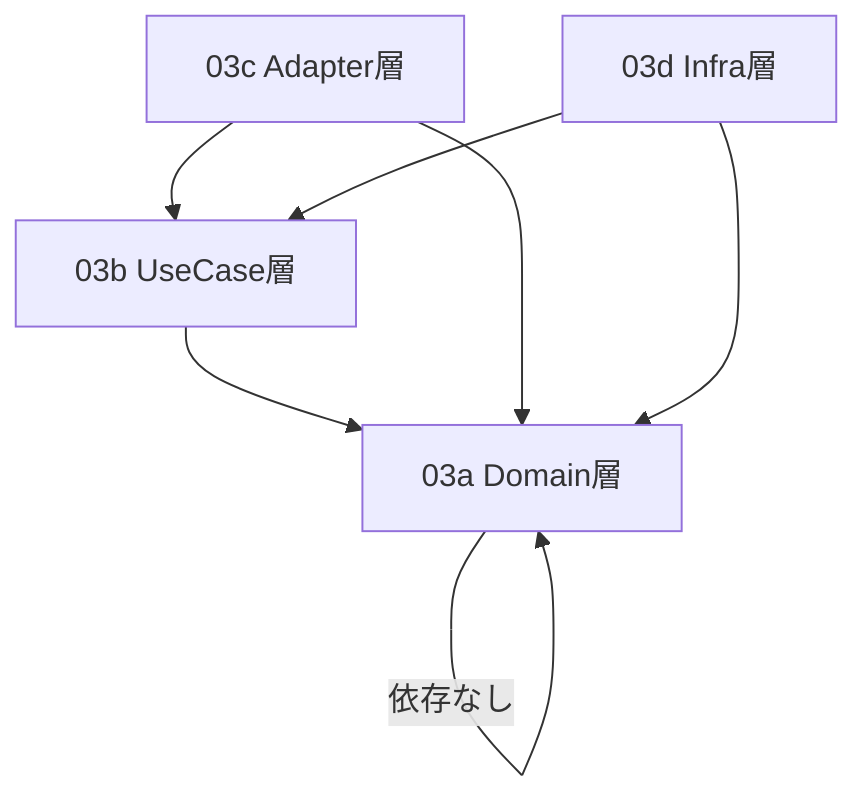

# 3. クラス設計（Index）

## 更新履歴

| バージョン | 日付 | 変更内容 | 著者 |
|---|---|---|---|
| 0.1 | 2026-04-03 | 初版作成 | gridflow設計チーム |
| 0.2 | 2026-04-04 | 3.5〜3.9 追記 | gridflow設計チーム |
| 0.3 | 2026-04-04 | 3.10 トレース関連クラス追加（Perfetto形式） | gridflow設計チーム |
| 0.4 | 2026-04-06 | 不足クラス追加、状態属性追加、例外クラス階層統一（DD-REV-101/102/103） | Claude |
| 0.5 | 2026-04-06 | Clean Architecture レイヤー別に4ファイルへ分割、本ファイルをIndexに変更 | Claude |
| 0.6 | 2026-04-06 | X5/X6レビュー対応: 15クラス追加（Result型群, TimeSyncStrategy, HELICSBroker等）、属性統一 | Claude |

---

本章はファイルサイズ最適化のため、Clean Architecture の4レイヤーに対応する4つのサブファイルに分割されています。

## 分割構成

| ファイル | レイヤー | 含まれるセクション | 主要クラス |
|---|---|---|---|
| [03a_domain_classes.md](03a_domain_classes.md) | Domain（ドメイン層） | 3.1 クラス一覧, 3.2 Scenario Pack, 3.4 CDL, 3.4+ 結果型 | ScenarioPack, PackMetadata, ScenarioRegistry, Topology, Node, Edge, Asset, TimeSeries, Event, Metric, ExperimentMetadata, CanonicalData, CDLRepository, ExperimentResult, NodeResult, BranchResult, LoadResult, GeneratorResult, RenewableResult, Interruption |
| [03b_usecase_classes.md](03b_usecase_classes.md) | UseCase（ユースケース層） | 3.3 Orchestrator, 3.5 Connector, 3.6 Benchmark | Orchestrator, ExecutionPlan, ContainerManager, TimeSync, TimeSyncStrategy, OrchestratorDriven, FederationDriven, HybridSync, ConnectorInterface, FederatedConnectorInterface, OpenDSSConnector, DataTranslator, BenchmarkHarness, MetricCalculator, ReportGenerator, SimulationTask, TaskResult |
| [03c_adapter_classes.md](03c_adapter_classes.md) | Adapter（アダプタ層） | 3.7 CLI, 3.8 Plugin API | CLIApp, CommandHandler, OutputFormatter, PluginRegistry, PluginDiscovery, L2PluginBase, ControllerPlugin |
| [03d_infra_classes.md](03d_infra_classes.md) | Infrastructure（インフラ層） | 3.9 共通基盤, 3.10 トレース | StructuredLogger, ConfigManager, ErrorHandler, GridflowError, HealthChecker, MigrationRunner, HELICSBroker, TraceSpan, TraceRecorder, PerfettoExporter |

## レイヤー依存関係

> **依存方向**: Domain ← UseCase ← Adapter / Infrastructure（Clean Architecture の依存性ルールに従う）

## クラス一覧（全47クラス）

全クラスの一覧は [03a_domain_classes.md § 3.1](03a_domain_classes.md#31-クラス一覧) を参照。

## セクション → ファイル対応表

| セクション | タイトル | ファイル |
|---|---|---|
| 3.1 | クラス一覧 | [03a](03a_domain_classes.md) |
| 3.2 | Scenario Pack関連（REQ-F-001） | [03a](03a_domain_classes.md) |
| 3.3 | Orchestrator関連（REQ-F-002） | [03b](03b_usecase_classes.md) |
| 3.4 | CDL関連（REQ-F-003） | [03a](03a_domain_classes.md) |
| 3.5 | Connector関連（REQ-F-007） | [03b](03b_usecase_classes.md) |
| 3.6 | Benchmark関連（REQ-F-004） | [03b](03b_usecase_classes.md) |
| 3.7 | CLI関連（REQ-F-005） | [03c](03c_adapter_classes.md) |
| 3.8 | Plugin API関連（REQ-F-006） | [03c](03c_adapter_classes.md) |
| 3.9 | 共通基盤（REQ-Q-008, REQ-Q-009） | [03d](03d_infra_classes.md) |
| 3.10 | トレース関連（REQ-Q-008） | [03d](03d_infra_classes.md) |
