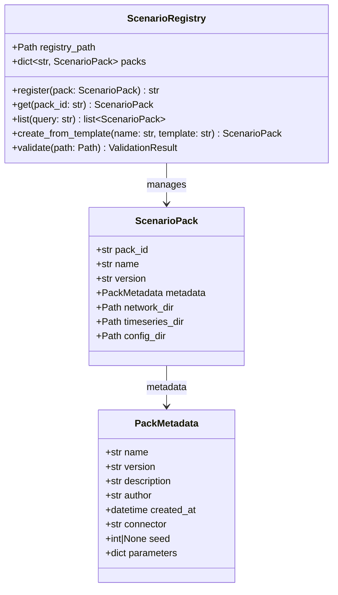
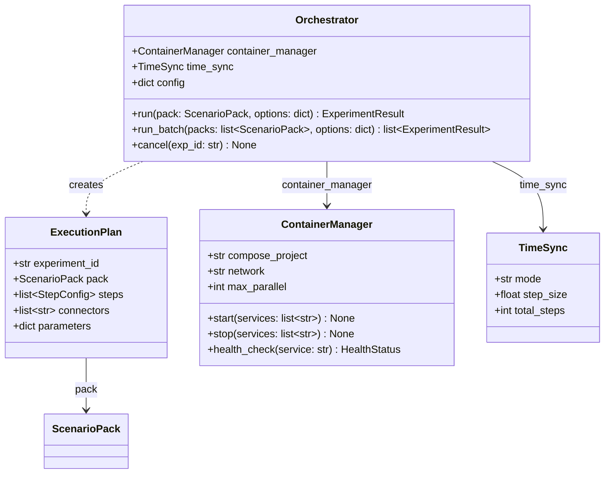
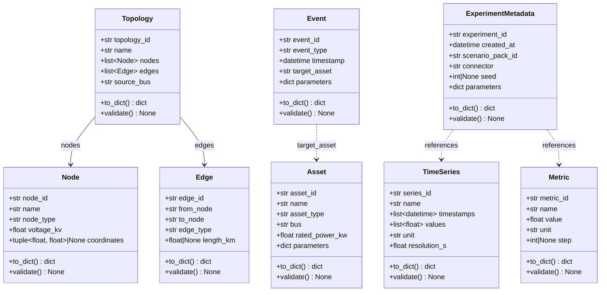

# 3. クラス設計

## 更新履歴

| バージョン | 日付 | 変更内容 | 著者 |
|---|---|---|---|
| 0.1 | 2026-04-03 | 初版作成 | gridflow設計チーム |

---

## 3.1 クラス一覧

| クラス名 | モジュール | レイヤー | 責務 | 関連要件 |
|---|---|---|---|---|
| ScenarioPack | gridflow.domain.scenario | Domain | 実験パッケージのデータモデル | REQ-F-001 |
| PackMetadata | gridflow.domain.scenario | Domain | パックのメタデータ | REQ-F-001 |
| ScenarioRegistry | gridflow.infra.registry | Infra | パックの登録・検索・バージョン管理 | REQ-F-001 |
| Orchestrator | gridflow.infra.orchestrator | Infra | 実験実行の統制 | REQ-F-002 |
| ExecutionPlan | gridflow.infra.orchestrator | Infra | 実行計画の定義 | REQ-F-002 |
| ContainerManager | gridflow.infra.orchestrator | Infra | Dockerコンテナ管理 | REQ-F-002 |
| TimeSync | gridflow.infra.orchestrator | Infra | 時間同期制御 | REQ-F-002 |
| Topology | gridflow.domain.cdl | Domain | ネットワークトポロジ | REQ-F-003 |
| Node | gridflow.domain.cdl | Domain | ネットワークノード | REQ-F-003 |
| Edge | gridflow.domain.cdl | Domain | ネットワークエッジ | REQ-F-003 |
| Asset | gridflow.domain.cdl | Domain | 電力機器 | REQ-F-003 |
| TimeSeries | gridflow.domain.cdl | Domain | 時系列データ | REQ-F-003 |
| Event | gridflow.domain.cdl | Domain | シミュレーションイベント | REQ-F-003 |
| Metric | gridflow.domain.cdl | Domain | 評価指標 | REQ-F-003 |
| ExperimentMetadata | gridflow.domain.cdl | Domain | 実験メタデータ | REQ-F-003 |
| ConnectorInterface | gridflow.usecase.interfaces | UseCase | 外部シミュレータ統一IF | REQ-F-007 |
| OpenDSSConnector | gridflow.adapter.connector | Adapter | OpenDSS接続実装 | REQ-F-007 |
| BenchmarkHarness | gridflow.adapter.benchmark | Adapter | ベンチマーク評価 | REQ-F-004 |
| MetricCalculator | gridflow.usecase.interfaces | UseCase | 評価指標計算Protocol | REQ-F-004 |
| CLIApp | gridflow.adapter.cli | Adapter | CLIエントリポイント | REQ-F-005 |
| PluginRegistry | gridflow.infra.plugin | Infra | プラグイン管理 | REQ-F-006 |
| StructuredLogger | gridflow.infra.logging | Infra | 構造化ログ | REQ-Q-008 |
| ConfigManager | gridflow.infra.config | Infra | 設定管理 | REQ-Q-009 |

---

## 3.2 Scenario Pack関連（REQ-F-001）

### 3.2.1 クラス図

### 3.2.2 ScenarioPack

**モジュール:** `gridflow.domain.scenario`

| 属性 | 型 | 説明 |
|---|---|---|
| pack_id | str | パックの一意識別子 |
| name | str | パック名 |
| version | str | バージョン文字列 |
| metadata | PackMetadata | パックのメタデータ |
| network_dir | Path | ネットワーク定義ディレクトリ |
| timeseries_dir | Path | 時系列データディレクトリ |
| config_dir | Path | 設定ファイルディレクトリ |

### 3.2.3 PackMetadata

**モジュール:** `gridflow.domain.scenario`

| 属性 | 型 | 説明 |
|---|---|---|
| name | str | メタデータ名 |
| version | str | バージョン文字列 |
| description | str | パックの説明 |
| author | str | 作成者 |
| created_at | datetime | 作成日時 |
| connector | str | 使用するコネクタ名 |
| seed | int \| None | 乱数シード（再現性用） |
| parameters | dict | 追加パラメータ |

### 3.2.4 ScenarioRegistry

**モジュール:** `gridflow.infra.registry`

| 属性 | 型 | 説明 |
|---|---|---|
| registry_path | Path | レジストリの保存先パス |
| packs | dict[str, ScenarioPack] | 登録済みパックのマップ |

#### メソッド

**register**

| 項目 | 内容 |
|---|---|
| **Input** | `pack: ScenarioPack` -- 登録対象のシナリオパック |
| **Process** | パックのバリデーションを実施し、pack_idをキーとしてレジストリに登録する。既存のpack_idと重複する場合はバージョンを比較し、新規バージョンとして登録する。 |
| **Output** | `str` -- 登録されたpack_id。バリデーション失敗時は `ValidationError` を送出。 |

**get**

| 項目 | 内容 |
|---|---|
| **Input** | `pack_id: str` -- 取得対象のパックID |
| **Process** | レジストリからpack_idに一致するScenarioPackを検索して返却する。 |
| **Output** | `ScenarioPack` -- 該当するパック。見つからない場合は `PackNotFoundError` を送出。 |

**list**

| 項目 | 内容 |
|---|---|
| **Input** | `query: str` -- 検索クエリ文字列（名前・タグ等でフィルタ） |
| **Process** | レジストリ内のパックをクエリ条件でフィルタリングし、一致するパックのリストを返却する。 |
| **Output** | `list[ScenarioPack]` -- 条件に合致するパックのリスト。該当なしの場合は空リスト。 |

**create_from_template**

| 項目 | 内容 |
|---|---|
| **Input** | `name: str` -- 新規パック名, `template: str` -- テンプレート名 |
| **Process** | 指定テンプレートを基にディレクトリ構成とメタデータを生成し、新規ScenarioPackを構築する。 |
| **Output** | `ScenarioPack` -- 生成されたパック。テンプレートが存在しない場合は `TemplateNotFoundError` を送出。 |

**validate**

| 項目 | 内容 |
|---|---|
| **Input** | `path: Path` -- バリデーション対象のパックディレクトリパス |
| **Process** | パックのディレクトリ構造、メタデータスキーマ、必須ファイルの存在をチェックする。 |
| **Output** | `ValidationResult` -- バリデーション結果。構造不正の場合は結果オブジェクトにエラー詳細を格納。 |

---

## 3.3 Orchestrator関連（REQ-F-002）

### 3.3.1 クラス図

### 3.3.2 Orchestrator

**モジュール:** `gridflow.infra.orchestrator`

| 属性 | 型 | 説明 |
|---|---|---|
| container_manager | ContainerManager | コンテナ管理インスタンス |
| time_sync | TimeSync | 時間同期制御インスタンス |
| config | dict | オーケストレータ設定 |

#### メソッド

**run**

| 項目 | 内容 |
|---|---|
| **Input** | `pack: ScenarioPack` -- 実行対象のシナリオパック, `options: dict` -- 実行オプション（タイムアウト、並列数等） |
| **Process** | ExecutionPlanを生成し、ContainerManagerでコンテナを起動後、TimeSyncに従って時間ステップを進行しながらシミュレーションを実行する。各ステップの結果を収集し、完了後にコンテナを停止する。 |
| **Output** | `ExperimentResult` -- 実験結果。実行失敗時は `ExecutionError` を送出。 |

**run_batch**

| 項目 | 内容 |
|---|---|
| **Input** | `packs: list[ScenarioPack]` -- 実行対象のパックリスト, `options: dict` -- 実行オプション |
| **Process** | 複数のシナリオパックを順次またはmax_parallelに従い並列で実行する。各パックに対してrunメソッドを呼び出し、結果をリストとして集約する。 |
| **Output** | `list[ExperimentResult]` -- 各パックの実験結果リスト。個別の失敗はリスト内のExperimentResultにエラー情報として格納。 |

**cancel**

| 項目 | 内容 |
|---|---|
| **Input** | `exp_id: str` -- キャンセル対象の実験ID |
| **Process** | 実行中の実験を特定し、関連コンテナを停止してリソースを解放する。 |
| **Output** | `None`。該当実験が存在しない場合は `ExperimentNotFoundError` を送出。 |

### 3.3.3 ExecutionPlan

**モジュール:** `gridflow.infra.orchestrator`

| 属性 | 型 | 説明 |
|---|---|---|
| experiment_id | str | 実験の一意識別子 |
| pack | ScenarioPack | 対象シナリオパック |
| steps | list[StepConfig] | 実行ステップの設定リスト |
| connectors | list[str] | 使用するコネクタ名のリスト |
| parameters | dict | 実行パラメータ |

### 3.3.4 ContainerManager

**モジュール:** `gridflow.infra.orchestrator`

| 属性 | 型 | 説明 |
|---|---|---|
| compose_project | str | Docker Composeプロジェクト名 |
| network | str | Dockerネットワーク名 |
| max_parallel | int | 最大並列コンテナ数 |

#### メソッド

**start**

| 項目 | 内容 |
|---|---|
| **Input** | `services: list[str]` -- 起動対象のサービス名リスト |
| **Process** | Docker Composeを使用して指定サービスのコンテナを起動する。ネットワーク設定を適用し、起動完了を待機する。 |
| **Output** | `None`。起動失敗時は `ContainerStartError` を送出。 |

**stop**

| 項目 | 内容 |
|---|---|
| **Input** | `services: list[str]` -- 停止対象のサービス名リスト |
| **Process** | 指定サービスのコンテナをグレースフルに停止し、リソースを解放する。 |
| **Output** | `None`。停止失敗時は `ContainerStopError` を送出。 |

**health_check**

| 項目 | 内容 |
|---|---|
| **Input** | `service: str` -- ヘルスチェック対象のサービス名 |
| **Process** | 指定サービスのコンテナに対してヘルスチェックを実行し、応答状態を確認する。 |
| **Output** | `HealthStatus` -- サービスの稼働状態（healthy / unhealthy / starting）。サービスが存在しない場合は `ServiceNotFoundError` を送出。 |

### 3.3.5 TimeSync

**モジュール:** `gridflow.infra.orchestrator`

| 属性 | 型 | 説明 |
|---|---|---|
| mode | str | 同期モード（例: "lockstep", "async"） |
| step_size | float | 1ステップあたりの時間幅（秒） |
| total_steps | int | 総ステップ数 |

---

## 3.4 CDL関連（REQ-F-003）

CDL（Common Data Language）ドメインクラスは全て `dataclass(frozen=True)` として定義し、イミュータブルとする。全クラスに共通メソッド `to_dict()` および `validate()` を実装する。

### 3.4.1 クラス図

### 3.4.2 共通メソッド

全CDLクラスは以下の共通メソッドを実装する。

**to_dict**

| 項目 | 内容 |
|---|---|
| **Input** | なし |
| **Process** | インスタンスの全属性を再帰的に辞書形式へ変換する。datetime型はISO 8601文字列、Path型は文字列に変換する。 |
| **Output** | `dict` -- 属性名をキーとした辞書。 |

**validate**

| 項目 | 内容 |
|---|---|
| **Input** | なし |
| **Process** | インスタンスの属性値に対して型チェック・値域チェック・整合性チェックを実施する。 |
| **Output** | `None`。バリデーション失敗時は `CDLValidationError` を送出。 |

### 3.4.3 Topology

**モジュール:** `gridflow.domain.cdl`

| 属性 | 型 | 説明 |
|---|---|---|
| topology_id | str | トポロジの一意識別子 |
| name | str | トポロジ名 |
| nodes | list[Node] | ノードのリスト |
| edges | list[Edge] | エッジのリスト |
| source_bus | str | 電源バスのノードID |

### 3.4.4 Node

**モジュール:** `gridflow.domain.cdl`

| 属性 | 型 | 説明 |
|---|---|---|
| node_id | str | ノードの一意識別子 |
| name | str | ノード名 |
| node_type | str | ノード種別（例: "bus", "load", "generator"） |
| voltage_kv | float | 定格電圧（kV） |
| coordinates | tuple[float, float] \| None | 地理座標（緯度, 経度）。不明時はNone |

### 3.4.5 Edge

**モジュール:** `gridflow.domain.cdl`

| 属性 | 型 | 説明 |
|---|---|---|
| edge_id | str | エッジの一意識別子 |
| from_node | str | 始点ノードID |
| to_node | str | 終点ノードID |
| edge_type | str | エッジ種別（例: "line", "transformer"） |
| length_km | float \| None | 線路長（km）。該当しない場合はNone |

### 3.4.6 Asset

**モジュール:** `gridflow.domain.cdl`

| 属性 | 型 | 説明 |
|---|---|---|
| asset_id | str | 機器の一意識別子 |
| name | str | 機器名 |
| asset_type | str | 機器種別（例: "pv", "battery", "load"） |
| bus | str | 接続先バスのノードID |
| rated_power_kw | float | 定格電力（kW） |
| parameters | dict | 機器固有の追加パラメータ |

### 3.4.7 TimeSeries

**モジュール:** `gridflow.domain.cdl`

| 属性 | 型 | 説明 |
|---|---|---|
| series_id | str | 時系列データの一意識別子 |
| name | str | 時系列名 |
| timestamps | list[datetime] | タイムスタンプのリスト |
| values | list[float] | 値のリスト |
| unit | str | 単位（例: "kW", "V", "A"） |
| resolution_s | float | データ解像度（秒） |

### 3.4.8 Event

**モジュール:** `gridflow.domain.cdl`

| 属性 | 型 | 説明 |
|---|---|---|
| event_id | str | イベントの一意識別子 |
| event_type | str | イベント種別（例: "fault", "switch", "setpoint"） |
| timestamp | datetime | イベント発生時刻 |
| target_asset | str | 対象機器のasset_id |
| parameters | dict | イベント固有のパラメータ |

### 3.4.9 Metric

**モジュール:** `gridflow.domain.cdl`

| 属性 | 型 | 説明 |
|---|---|---|
| metric_id | str | 指標の一意識別子 |
| name | str | 指標名 |
| value | float | 指標値 |
| unit | str | 単位 |
| step | int \| None | 対応するステップ番号。全体指標の場合はNone |

### 3.4.10 ExperimentMetadata

**モジュール:** `gridflow.domain.cdl`

| 属性 | 型 | 説明 |
|---|---|---|
| experiment_id | str | 実験の一意識別子 |
| created_at | datetime | 実験作成日時 |
| scenario_pack_id | str | 使用したシナリオパックのID |
| connector | str | 使用したコネクタ名 |
| seed | int \| None | 乱数シード。未指定時はNone |
| parameters | dict | 実験パラメータ |
