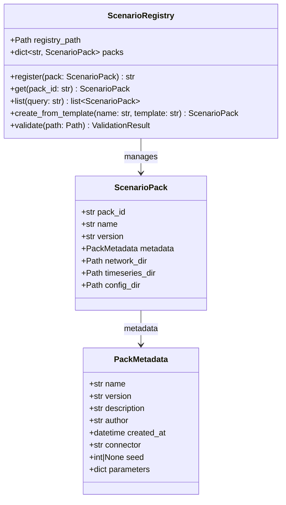
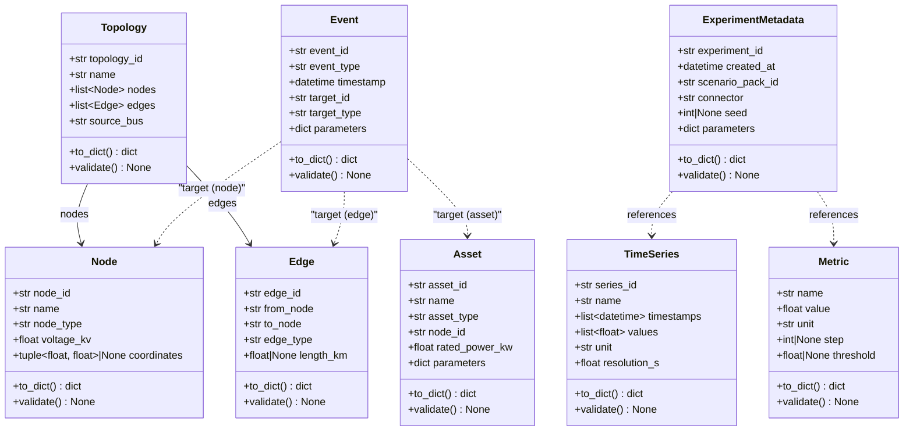

# 3A. ドメイン層クラス設計

## 更新履歴

| バージョン | 日付 | 変更内容 | 著者 |
|---|---|---|---|
| 0.1 | 2026-04-03 | 初版作成 | gridflow設計チーム |
| 0.4 | 2026-04-06 | 不足クラス追加（CanonicalData, CDLRepository）、状態属性追加（ScenarioPack）（DD-REV-101/103） | Claude |
| 0.5 | 2026-04-06 | 第3章分割（03_class_design.md → 03a/03b/03c/03d） | Claude |
| 0.6 | 2026-04-06 | X5/X6レビュー対応: Event.target拡張(target_id+target_type), Metric PK統一(metric_id→name), Asset.bus→node_id統一, ExperimentResult/Result型群/Interruption追加 | Claude |

---

> **ナビゲーション:** [クラス設計 Index](03_class_design.md) | **03a ドメイン層（本文書）** | [03b ユースケース層](03b_usecase_classes.md) | [03c アダプタ層](03c_adapter_classes.md) | [03d インフラ層](03d_infra_classes.md)

---

## 3.1 クラス一覧

| DD-CLS | クラス名 | モジュール | レイヤー | 責務 | 関連要件 |
|---|---|---|---|---|---|
| DD-CLS-001 | ScenarioPack | gridflow.domain.scenario | Domain | 実験パッケージのデータモデル | REQ-F-001 |
| DD-CLS-002 | PackMetadata | gridflow.domain.scenario | Domain | パックのメタデータ | REQ-F-001 |
| DD-CLS-003 | ScenarioRegistry | gridflow.infra.registry | Infra | パックの登録・検索・バージョン管理 | REQ-F-001 |
| DD-CLS-004 | Topology | gridflow.domain.cdl | Domain | ネットワークトポロジ | REQ-F-003 |
| DD-CLS-005 | Asset | gridflow.domain.cdl | Domain | 電力機器 | REQ-F-003 |
| DD-CLS-006 | TimeSeries | gridflow.domain.cdl | Domain | 時系列データ | REQ-F-003 |
| DD-CLS-007 | Orchestrator | gridflow.infra.orchestrator | Infra | 実験実行の統制 | REQ-F-002 |
| DD-CLS-008 | ExecutionPlan | gridflow.infra.orchestrator | Infra | 実行計画の定義 | REQ-F-002 |
| DD-CLS-009 | ContainerManager | gridflow.infra.orchestrator | Infra | Dockerコンテナ管理 | REQ-F-002 |
| DD-CLS-010 | CLIApp | gridflow.adapter.cli | Adapter | CLIエントリポイント | REQ-F-005 |
| DD-CLS-011 | CommandHandler | gridflow.adapter.cli | Adapter | CLIコマンドハンドラー基底 | REQ-F-005 |
| DD-CLS-012 | OutputFormatter | gridflow.adapter.cli | Adapter | CLI出力フォーマッタ | REQ-F-005 |
| DD-CLS-013 | BenchmarkHarness | gridflow.adapter.benchmark | Adapter | ベンチマーク評価 | REQ-F-004 |
| DD-CLS-014 | MetricCalculator | gridflow.usecase.interfaces | UseCase | 評価指標計算Protocol | REQ-F-004 |
| DD-CLS-015 | ReportGenerator | gridflow.adapter.benchmark | Adapter | ベンチマークレポート生成 | REQ-F-004 |
| DD-CLS-016 | PluginRegistry | gridflow.infra.plugin | Infra | プラグイン管理 | REQ-F-006 |
| DD-CLS-017 | PluginDiscovery | gridflow.infra.plugin | Infra | プラグイン検出・ロード | REQ-F-006 |
| DD-CLS-018 | ConnectorInterface | gridflow.usecase.interfaces | UseCase | 外部シミュレータ統一IF | REQ-F-007 |
| DD-CLS-019 | OpenDSSConnector | gridflow.adapter.connector | Adapter | OpenDSS接続実装 | REQ-F-007 |
| DD-CLS-020 | DataTranslator | gridflow.usecase.interfaces | UseCase | データ変換Protocol | REQ-F-007 |
| DD-CLS-021 | StructuredLogger | gridflow.infra.logging | Infra | 構造化ログ | REQ-Q-008 |
| DD-CLS-022 | ConfigManager | gridflow.infra.config | Infra | 設定管理 | REQ-Q-009 |
| DD-CLS-023 | ErrorHandler | gridflow.infra.error | Infra | エラーハンドリング | REQ-Q-008 |
| DD-CLS-024 | TimeSync | gridflow.infra.orchestrator | Infra | 時間同期制御 | REQ-F-002 |
| DD-CLS-025 | Event | gridflow.domain.cdl | Domain | シミュレーションイベント | REQ-F-003 |
| DD-CLS-026 | Metric | gridflow.domain.cdl | Domain | 評価指標 | REQ-F-003 |
| DD-CLS-027 | ExperimentMetadata | gridflow.domain.cdl | Domain | 実験メタデータ | REQ-F-003 |
| DD-CLS-028 | Node | gridflow.domain.cdl | Domain | ネットワークノード | REQ-F-003 |
| DD-CLS-029 | Edge | gridflow.domain.cdl | Domain | ネットワークエッジ | REQ-F-003 |
| DD-CLS-030 | TraceSpan | gridflow.infra.trace | Infra | トレーススパン（OTel互換） | REQ-Q-008 |
| DD-CLS-031 | TraceRecorder | gridflow.infra.trace | Infra | トレース記録 | REQ-Q-008 |
| DD-CLS-032 | PerfettoExporter | gridflow.infra.trace | Infra | Perfetto形式エクスポート | REQ-Q-008 |
| DD-CLS-033 | ExperimentResult | gridflow.domain.result | Domain | 実験結果の集約データモデル | REQ-F-002 |
| DD-CLS-034 | NodeResult | gridflow.domain.result | Domain | ノード別シミュレーション結果 | REQ-F-002 |
| DD-CLS-035 | BranchResult | gridflow.domain.result | Domain | ブランチ別シミュレーション結果 | REQ-F-002 |
| DD-CLS-036 | LoadResult | gridflow.domain.result | Domain | 負荷別シミュレーション結果 | REQ-F-002 |
| DD-CLS-037 | GeneratorResult | gridflow.domain.result | Domain | 発電機別シミュレーション結果 | REQ-F-002 |
| DD-CLS-038 | RenewableResult | gridflow.domain.result | Domain | 再エネ別シミュレーション結果 | REQ-F-002 |
| DD-CLS-039 | Interruption | gridflow.domain.result | Domain | 停電イベント（IEEE 1366用） | REQ-F-004 |
| DD-CLS-040 | TimeSyncStrategy | gridflow.usecase.interfaces | UseCase | 時間同期戦略Protocol | REQ-F-002 |
| DD-CLS-041 | OrchestratorDriven | gridflow.infra.orchestrator | Infra | Orchestrator駆動の時間同期 | REQ-F-002 |
| DD-CLS-042 | FederationDriven | gridflow.infra.orchestrator | Infra | HELICS Federation駆動の時間同期 | REQ-F-002 |
| DD-CLS-043 | HybridSync | gridflow.infra.orchestrator | Infra | ハイブリッド時間同期 | REQ-F-002 |
| DD-CLS-044 | HELICSBroker | gridflow.infra.orchestrator | Infra | HELICS Broker管理 | REQ-F-002 |
| DD-CLS-045 | FederatedConnectorInterface | gridflow.usecase.interfaces | UseCase | HELICS対応コネクタIF | REQ-F-007 |
| DD-CLS-046 | SimulationTask | gridflow.usecase.scheduling | UseCase | バッチスケジューリング用タスク | REQ-F-002 |
| DD-CLS-047 | TaskResult | gridflow.usecase.scheduling | UseCase | タスク実行結果 | REQ-F-002 |

---

## 3.2 Scenario Pack関連（REQ-F-001）

### 3.2.1 クラス図



### 3.2.2 ScenarioPack

**モジュール:** `gridflow.domain.scenario`

| 属性 | 型 | 説明 |
|---|---|---|
| pack_id | str | パックの一意識別子 |
| name | str | パック名 |
| version | str | バージョン文字列 |
| metadata | PackMetadata | パックのメタデータ |
| network_dir | Path | ネットワーク定義ディレクトリ |
| timeseries_dir | Path | 時系列データディレクトリ |
| config_dir | Path | 設定ファイルディレクトリ |
| status | PackStatus | 現在の状態（Draft / Validated / Registered / Running / Completed）。第5章 5.3 状態遷移参照 |

### 3.2.3 PackMetadata

**モジュール:** `gridflow.domain.scenario`

| 属性 | 型 | 説明 |
|---|---|---|
| name | str | メタデータ名 |
| version | str | バージョン文字列 |
| description | str | パックの説明 |
| author | str | 作成者 |
| created_at | datetime | 作成日時 |
| connector | str | 使用するコネクタ名 |
| seed | int \| None | 乱数シード（再現性用） |
| parameters | dict | 追加パラメータ |

### 3.2.4 ScenarioRegistry

**モジュール:** `gridflow.infra.registry`

| 属性 | 型 | 説明 |
|---|---|---|
| registry_path | Path | レジストリの保存先パス |
| packs | dict[str, ScenarioPack] | 登録済みパックのマップ |

#### メソッド

**register**

| 項目 | 内容 |
|---|---|
| **Input** | `pack: ScenarioPack` -- 登録対象のシナリオパック |
| **Process** | パックのバリデーションを実施し、pack_idをキーとしてレジストリに登録する。既存のpack_idと重複する場合はバージョンを比較し、新規バージョンとして登録する。 |
| **Output** | `str` -- 登録されたpack_id。バリデーション失敗時は `ValidationError` を送出。 |

**get**

| 項目 | 内容 |
|---|---|
| **Input** | `pack_id: str` -- 取得対象のパックID |
| **Process** | レジストリからpack_idに一致するScenarioPackを検索して返却する。 |
| **Output** | `ScenarioPack` -- 該当するパック。見つからない場合は `PackNotFoundError` を送出。 |

**list**

| 項目 | 内容 |
|---|---|
| **Input** | `query: str` -- 検索クエリ文字列（名前・タグ等でフィルタ） |
| **Process** | レジストリ内のパックをクエリ条件でフィルタリングし、一致するパックのリストを返却する。 |
| **Output** | `list[ScenarioPack]` -- 条件に合致するパックのリスト。該当なしの場合は空リスト。 |

**create_from_template**

| 項目 | 内容 |
|---|---|
| **Input** | `name: str` -- 新規パック名, `template: str` -- テンプレート名 |
| **Process** | 指定テンプレートを基にディレクトリ構成とメタデータを生成し、新規ScenarioPackを構築する。 |
| **Output** | `ScenarioPack` -- 生成されたパック。テンプレートが存在しない場合は `TemplateNotFoundError` を送出。 |

**validate**

| 項目 | 内容 |
|---|---|
| **Input** | `path: Path` -- バリデーション対象のパックディレクトリパス |
| **Process** | パックのディレクトリ構造、メタデータスキーマ、必須ファイルの存在をチェックする。 |
| **Output** | `ValidationResult` -- バリデーション結果。構造不正の場合は結果オブジェクトにエラー詳細を格納。 |

---

## 3.4 CDL関連（REQ-F-003）

CDL（Common Data Language）ドメインクラスは全て `dataclass(frozen=True)` として定義し、イミュータブルとする。全クラスに共通メソッド `to_dict()` および `validate()` を実装する。

> **コンテナ型の使い分け:** frozen dataclass の内部属性には不変コンテナ `tuple` を使用する（第6章準拠）。メソッドの引数・戻り値には `list` を使用し、呼び出し側の利便性を確保する。

### 3.4.1 クラス図



### 3.4.2 共通メソッド

全CDLクラスは以下の共通メソッドを実装する。

**to_dict**

| 項目 | 内容 |
|---|---|
| **Input** | なし |
| **Process** | インスタンスの全属性を再帰的に辞書形式へ変換する。datetime型はISO 8601文字列、Path型は文字列に変換する。 |
| **Output** | `dict` -- 属性名をキーとした辞書。 |

**validate**

| 項目 | 内容 |
|---|---|
| **Input** | なし |
| **Process** | インスタンスの属性値に対して型チェック・値域チェック・整合性チェックを実施する。 |
| **Output** | `None`。バリデーション失敗時は `CDLValidationError` を送出。 |

### 3.4.3 Topology

**モジュール:** `gridflow.domain.cdl`

| 属性 | 型 | 説明 |
|---|---|---|
| topology_id | str | トポロジの一意識別子 |
| name | str | トポロジ名 |
| nodes | list[Node] | ノードのリスト |
| edges | list[Edge] | エッジのリスト |
| source_bus | str | 電源バスのノードID |

### 3.4.4 Node

**モジュール:** `gridflow.domain.cdl`

| 属性 | 型 | 説明 |
|---|---|---|
| node_id | str | ノードの一意識別子 |
| name | str | ノード名 |
| node_type | str | ノード種別（例: "bus", "load", "generator"） |
| voltage_kv | float | 定格電圧（kV） |
| coordinates | tuple[float, float] \| None | 地理座標（緯度, 経度）。不明時はNone |

### 3.4.5 Edge

**モジュール:** `gridflow.domain.cdl`

| 属性 | 型 | 説明 |
|---|---|---|
| edge_id | str | エッジの一意識別子 |
| from_node | str | 始点ノードID |
| to_node | str | 終点ノードID |
| edge_type | str | エッジ種別（例: "line", "transformer"） |
| length_km | float \| None | 線路長（km）。該当しない場合はNone |

### 3.4.6 Asset

**モジュール:** `gridflow.domain.cdl`

| 属性 | 型 | 説明 |
|---|---|---|
| asset_id | str | 機器の一意識別子 |
| name | str | 機器名 |
| asset_type | str | 機器種別（例: "pv", "battery", "load"） |
| node_id | str | 接続先ノードID（Node.node_id を参照） |
| rated_power_kw | float | 定格電力（kW） |
| parameters | dict | 機器固有の追加パラメータ |

### 3.4.7 TimeSeries

**モジュール:** `gridflow.domain.cdl`

| 属性 | 型 | 説明 |
|---|---|---|
| series_id | str | 時系列データの一意識別子 |
| name | str | 時系列名 |
| timestamps | list[datetime] | タイムスタンプのリスト |
| values | list[float] | 値のリスト |
| unit | str | 単位（例: "kW", "V", "A"） |
| resolution_s | float | データ解像度（秒） |

### 3.4.8 Event

**モジュール:** `gridflow.domain.cdl`

| 属性 | 型 | 説明 |
|---|---|---|
| event_id | str | イベントの一意識別子 |
| event_type | str | イベント種別（例: "fault", "switch", "setpoint", "load_change", "generation_change"） |
| timestamp | datetime | イベント発生時刻 |
| target_id | str | 対象要素の識別子（Node.node_id, Edge.edge_id, または Asset.asset_id） |
| target_type | str | 対象要素の種別（"node" \| "edge" \| "asset"） |
| parameters | dict | イベント固有のパラメータ |

### 3.4.9 Metric

**モジュール:** `gridflow.domain.cdl`

| 属性 | 型 | 説明 |
|---|---|---|
| name | str | 指標名（実験内で一意、PK） |
| value | float | 指標値 |
| unit | str | 単位 |
| step | int \| None | 対応するステップ番号。全体指標の場合はNone |
| threshold | float \| None | 閾値（超過で警告）。不要時はNone |

### 3.4.10 ExperimentMetadata

**モジュール:** `gridflow.domain.cdl`

| 属性 | 型 | 説明 |
|---|---|---|
| experiment_id | str | 実験の一意識別子 |
| created_at | datetime | 実験作成日時 |
| scenario_pack_id | str | 使用したシナリオパックのID |
| connector | str | 使用したコネクタ名 |
| seed | int \| None | 乱数シード。未指定時はNone |
| parameters | dict | 実験パラメータ |

### 3.4.11 CanonicalData（Union型）

CDL エンティティの統一的な型表現。DataTranslator Protocol の入出力型として使用する。

```python
CanonicalData = Topology | Asset | TimeSeries | Event | Metric | ExperimentMetadata
```

### 3.4.12 CDLRepository（Protocol）

**モジュール:** `gridflow.usecase.interfaces`

CDL データの永続化・取得を担う UseCase 層 Protocol。

**store**

| 項目 | 内容 |
|---|---|
| **Input** | `data: CanonicalData` -- 格納対象の CDL データ |
| **Process** | データをシリアライズし、ストレージに書き込む。data_id を生成して返却する。 |
| **Output** | `str` -- 格納されたデータの一意識別子。 |

**get**

| 項目 | 内容 |
|---|---|
| **Input** | `data_id: str` -- 取得対象のデータ識別子 |
| **Process** | ストレージからデータを読み込み、デシリアライズして返却する。 |
| **Output** | `CanonicalData` -- 取得されたデータ。未発見時は `DataNotFoundError(RegistryError)` を送出。 |

**get_result**

| 項目 | 内容 |
|---|---|
| **Input** | `exp_id: str` -- 実験 ID |
| **Process** | 指定実験の全結果データを取得する。 |
| **Output** | `ExperimentResult` -- 実験結果。未発見時は `ExperimentNotFoundError(OrchestratorError)` を送出。 |

**export**

| 項目 | 内容 |
|---|---|
| **Input** | `exp_id: str` -- 実験 ID, `format: str` -- 出力フォーマット（"csv" / "json" / "parquet"）, `output_dir: Path` -- 出力先ディレクトリ |
| **Process** | 指定フォーマットで実験結果をファイルに出力する。 |
| **Output** | `Path` -- 出力ファイルパス。フォーマット未対応時は `UnsupportedFormatError(AdapterError)` を送出。 |

---

## 3.4+ シミュレーション結果型（REQ-F-002, REQ-F-004）

第7章（アルゴリズム設計）のメトリクス計算・バッチスケジューリングで使用するシミュレーション結果のデータ型を定義する。全て `dataclass(frozen=True)` とする。

### 3.4.13 ExperimentResult

**モジュール:** `gridflow.domain.result`

Orchestrator.run() の戻り値であり、BenchmarkHarness / MetricCalculator の入力型。第7章の `SimulationResults` に相当する。

| 属性 | 型 | 説明 |
|---|---|---|
| experiment_id | str | 実験の一意識別子 |
| metadata | ExperimentMetadata | 実験メタデータ |
| steps | list[StepResult] | 各ステップの実行結果リスト |
| node_results | list[NodeResult] | ノード別結果（電圧等） |
| branch_results | list[BranchResult] | ブランチ別結果（電流・損失等） |
| load_results | list[LoadResult] | 負荷別結果（需要・供給） |
| generator_results | list[GeneratorResult] | 発電機別結果（出力・コスト） |
| renewable_results | list[RenewableResult] | 再エネ別結果（可用・出力抑制） |
| interruptions | list[Interruption] | 停電イベントリスト（IEEE 1366指標計算用） |
| metrics | dict[str, MetricValue] | 算出済み指標のマッピング |
| elapsed_s | float | 総実行時間（秒） |

### 3.4.14 NodeResult

**モジュール:** `gridflow.domain.result`

ノード単位の時系列シミュレーション結果。

| 属性 | 型 | 説明 |
|---|---|---|
| node_id | str | 対象ノードID |
| voltages | tuple[float, ...] | 各ステップの電圧値（pu） |

#### メソッド

**voltage_at**

| 項目 | 内容 |
|---|---|
| **Input** | `step: int` -- ステップ番号 |
| **Process** | 指定ステップの電圧値を返却する。 |
| **Output** | `float` -- 電圧値（pu）。 |

### 3.4.15 BranchResult

**モジュール:** `gridflow.domain.result`

ブランチ（線路・変圧器）単位の時系列シミュレーション結果。

| 属性 | 型 | 説明 |
|---|---|---|
| edge_id | str | 対象エッジID |
| currents | tuple[float, ...] | 各ステップの電流値（A） |
| losses_kw | tuple[float, ...] | 各ステップの損失（kW） |
| i_rated | float | 定格電流（A） |

#### メソッド

| メソッド | Input | Output | 説明 |
|---|---|---|---|
| current_at | `step: int` | `float` | 指定ステップの電流値 |
| loss_kw_at | `step: int` | `float` | 指定ステップの損失 |

### 3.4.16 LoadResult

**モジュール:** `gridflow.domain.result`

負荷単位の時系列シミュレーション結果。

| 属性 | 型 | 説明 |
|---|---|---|
| asset_id | str | 対象負荷のアセットID |
| demands | tuple[float, ...] | 各ステップの需要（kW） |
| supplied | tuple[float, ...] | 各ステップの供給量（kW） |

#### メソッド

| メソッド | Input | Output | 説明 |
|---|---|---|---|
| demand_at | `step: int` | `float` | 指定ステップの需要 |
| supplied_at | `step: int` | `float` | 指定ステップの供給量 |

### 3.4.17 GeneratorResult

**モジュール:** `gridflow.domain.result`

発電機単位の時系列シミュレーション結果。

| 属性 | 型 | 説明 |
|---|---|---|
| asset_id | str | 対象発電機のアセットID |
| powers | tuple[float, ...] | 各ステップの出力（kW） |
| cost_per_unit | float | 単位発電コスト（USD/kWh） |
| emission_factor | float | CO2排出係数（tCO2/kWh） |

#### メソッド

| メソッド | Input | Output | 説明 |
|---|---|---|---|
| power_at | `step: int` | `float` | 指定ステップの出力 |

### 3.4.18 RenewableResult

**モジュール:** `gridflow.domain.result`

再エネ発電機単位の時系列シミュレーション結果。

| 属性 | 型 | 説明 |
|---|---|---|
| asset_id | str | 対象再エネ機のアセットID |
| available | tuple[float, ...] | 各ステップの可用出力（kW） |
| dispatched | tuple[float, ...] | 各ステップの実出力（kW） |

#### メソッド

| メソッド | Input | Output | 説明 |
|---|---|---|---|
| available_at | `step: int` | `float` | 指定ステップの可用出力 |
| dispatched_at | `step: int` | `float` | 指定ステップの実出力 |

### 3.4.19 Interruption

**モジュール:** `gridflow.domain.result`

停電イベントのデータモデル。IEEE 1366 信頼性指標（SAIDI/SAIFI/CAIDI）の計算入力として使用する。

| 属性 | 型 | 説明 |
|---|---|---|
| event_id | str | 停電イベントID |
| start_time | float | 停電開始時刻（秒） |
| end_time | float | 停電終了時刻（秒） |
| duration_min | float | 停電時間（分） |
| customers_affected | int | 影響を受けた顧客数 |
| cause | str | 原因（"fault" \| "maintenance" \| "overload"） |

---

> **関連文書:** Orchestrator・Connector・Benchmark は → [03b ユースケース層](03b_usecase_classes.md) / CLI・Plugin は → [03c アダプタ層](03c_adapter_classes.md) / 共通基盤・トレースは → [03d インフラ層](03d_infra_classes.md)
