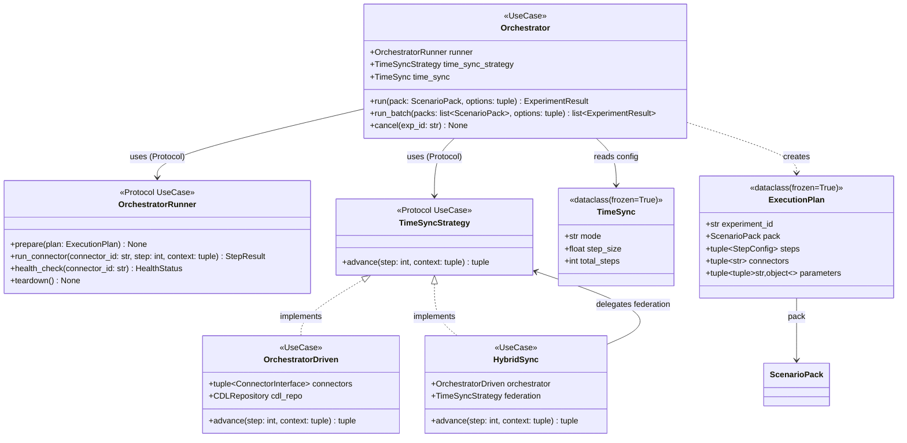
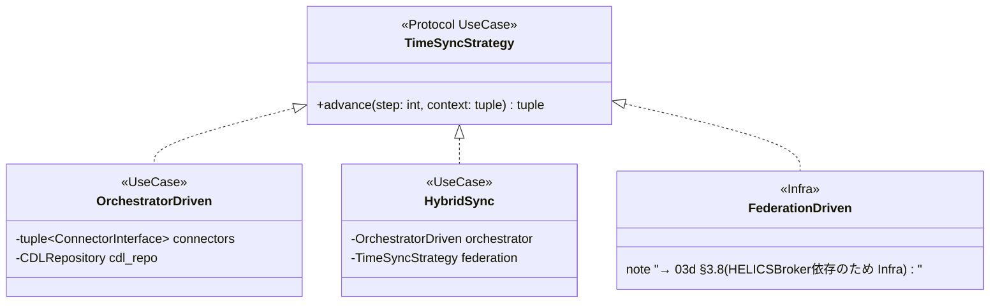
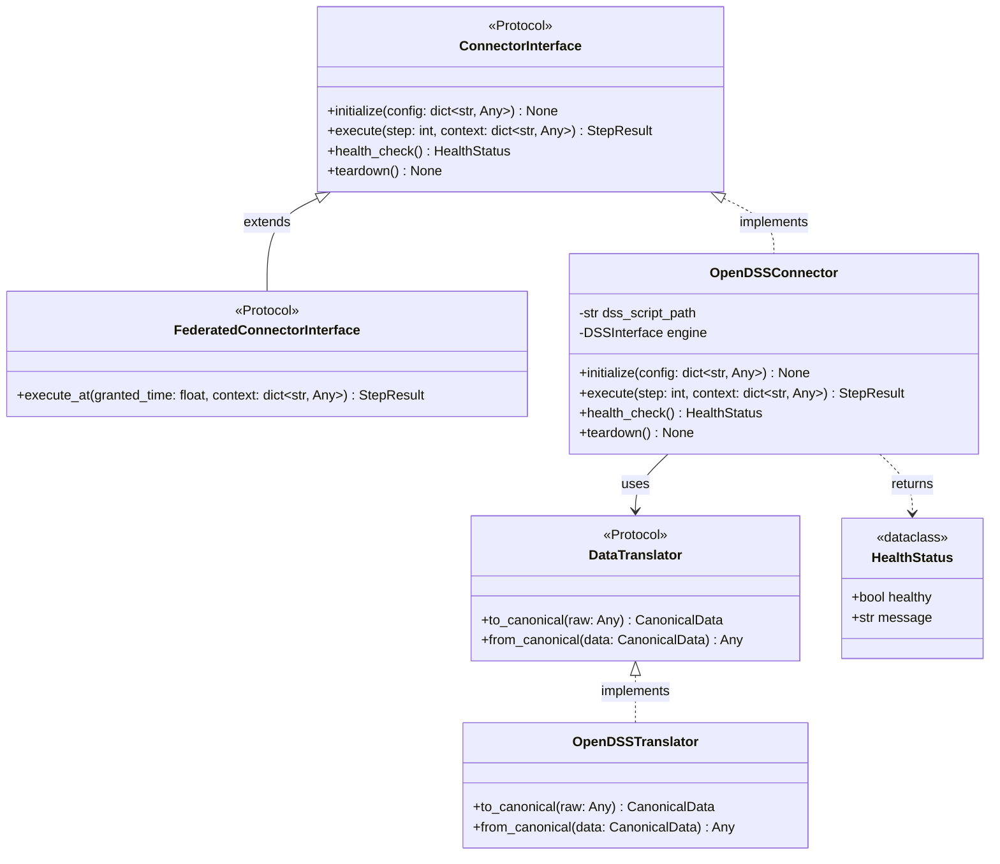
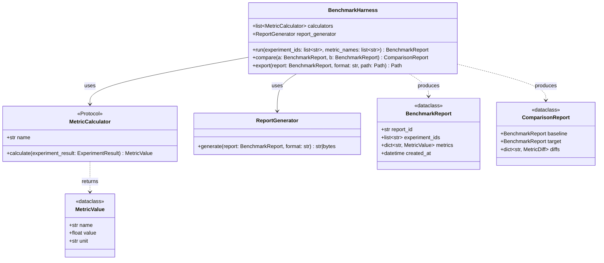

# 3B. ユースケース層クラス設計

## 更新履歴

| バージョン | 日付 | 変更内容 | 著者 |
|---|---|---|---|
| 0.1 | 2026-04-03 | 初版作成 | gridflow設計チーム |
| 0.2 | 2026-04-04 | 3.5〜3.6 追記 | gridflow設計チーム |
| 0.4 | 2026-04-06 | 状態属性追加（Orchestrator）（DD-REV-103） | Claude |
| 0.5 | 2026-04-06 | 第3章分割（03_class_design.md → 03a/03b/03c/03d） | Claude |
| 0.6 | 2026-04-06 | X6レビュー対応: TimeSyncStrategy(Protocol)+3実装追加, FederatedConnectorInterface追加, SimulationTask/TaskResult追加 | Claude |
| 0.7 | 2026-04-07 | Phase0結果レビュー対応: (1) Orchestrator関連（3.3節 Orchestrator/ExecutionPlan/ContainerManager/TimeSync/OrchestratorDriven 等）を Infra 層 [03d](03d_infra_classes.md) へ移設（論点6.2: ファイル名と内容のレイヤー整合化）。(2) StepResult を [03e](03e_usecase_results.md) へ移設し、enum 化＋属性拡張（論点6.4）。本ファイルは純粋な UseCase クラスのみを収録 | Claude |
| 0.8 | 2026-04-07 | 論点6.6 Orchestrator 責務分割: §3.3 を UseCase 層として復活。Orchestrator (UseCase, ビジネスロジック)、OrchestratorRunner Protocol (UseCase 境界)、ExecutionPlan/TimeSync/OrchestratorDriven/HybridSync (UseCase) を本ファイルへ。Container 系・FederationDriven (Infra 技術詳細) は 03d §3.8 に残置。アーキテクチャ doc (03_static_view.md L301) との整合を回復 | Claude |

---

> **ナビゲーション:** [クラス設計 Index](03_class_design.md) | [03a ドメイン層](03a_domain_classes.md) | **03b ユースケース層（本文書）** | [03c アダプタ層](03c_adapter_classes.md) | [03d インフラ層](03d_infra_classes.md) | [03e UseCase結果型](03e_usecase_results.md)

> **本ファイルの責務（v0.8 改訂）:** UseCase 層のクラス／Protocol を収録する。特に §3.3 は v0.8（論点6.6）で Orchestrator の責務分割を実施し、UseCase ビジネスロジック部分（Orchestrator / OrchestratorRunner Protocol / ExecutionPlan / TimeSync / OrchestratorDriven / HybridSync / SimulationTask / TaskResult）を本ファイルに復活させた。Infra 技術詳細（ContainerOrchestratorRunner / ContainerManager / FederationDriven）は [03d §3.8](03d_infra_classes.md) へ、結果型（StepResult / ExperimentResult）は [03e](03e_usecase_results.md) へ。

---

## 3.3 Orchestrator 関連（UseCase 層、REQ-F-002）

> **v0.8 改訂（論点6.6: Orchestrator の責務分割）:** 当初 Orchestrator は `gridflow.infra.orchestrator` の単一クラスだったが、責務が「実験実行のビジネスロジック (UseCase)」と「Docker コンテナ操作 (Infra)」を兼ねており、Clean Architecture の層境界を跨いでいた。アーキテクチャドキュメント (`docs/architecture/03_static_view.md` L301) は Orchestrator を **Use Cases 層**と位置付けているのに対し、詳細設計の v0.7 までは Infra 層に集約していた——この矛盾を解消するため、責務を分割した。
>
> **分割後の構成:**
> - **本節 (03b §3.3)**: UseCase 層に属する純粋なビジネスロジック。`Orchestrator`, `ExecutionPlan`, `TimeSync` (設定), `TimeSyncStrategy` (Protocol), `OrchestratorDriven`, `HybridSync`, `OrchestratorRunner` (Protocol), `SimulationTask` / `TaskResult`
> - **[03d §3.8](03d_infra_classes.md#38-orchestrator-関連infra-層reqf002)**: Infra 層に属する技術詳細。`ContainerOrchestratorRunner`, `ContainerManager`, `FederationDriven` (HELICSBroker 依存)
>
> **依存方向:** UseCase Orchestrator は `OrchestratorRunner` Protocol に依存し、Infra 実装が Protocol を満たす。Orchestrator は Docker を一切知らない。詳細経緯は `review_record.md` §8.6（論点6.6）参照。

### 3.3.1 クラス図



### 3.3.2 Orchestrator

**モジュール:** `gridflow.usecase.orchestrator`
**レイヤー:** UseCase

実験実行のビジネスロジックを担う UseCase クラス。Connector 呼び出し順序、TimeSync 戦略選択、ステップ結果集約を行う。**Docker / コンテナ・プロセス管理・ネットワークなどの技術詳細を一切知らない**。物理的な実行基盤は `OrchestratorRunner` Protocol 経由で Infra 層に委譲する。

| 属性 | 型 | 説明 |
|---|---|---|
| runner | OrchestratorRunner | 物理実行基盤（Protocol、Infra 実装が DI される） |
| time_sync_strategy | TimeSyncStrategy | 時間同期戦略（Protocol） |
| time_sync | TimeSync | 時間同期の設定データ |
| config | tuple[tuple[str, object], ...] | オーケストレータ設定 |
| state | OrchestratorState | 現在の状態（Idle / Initializing / Running / Completed / Failed）。第5章 5.1 状態遷移参照 |

#### メソッド

**run**

| 項目 | 内容 |
|---|---|
| **Input** | `pack: ScenarioPack`, `options: tuple[tuple[str, object], ...]` |
| **Process** | (1) ExecutionPlan を生成。(2) `runner.prepare(plan)` を呼んで実行基盤を準備。(3) TimeSyncStrategy に従って各ステップを進行し、各 Connector を `runner.run_connector()` 経由で呼び出す。(4) 各ステップの StepResult を集約。(5) `runner.teardown()` で実行基盤を解放。Docker や Container の存在は一切意識しない。 |
| **Output** | `ExperimentResult` ([03e §3.11.4](03e_usecase_results.md) 参照)。実行失敗時は `ExecutionError(SimulationError)` を送出 |

**run_batch**

| 項目 | 内容 |
|---|---|
| **Input** | `packs: list[ScenarioPack]`, `options: tuple` |
| **Process** | 複数 Pack を順次または並列で実行する。並列度は runner の能力 (`runner.max_parallel`) に従う |
| **Output** | `list[ExperimentResult]` |

**cancel**

| 項目 | 内容 |
|---|---|
| **Input** | `exp_id: str` |
| **Process** | 実行中の実験を特定し、`runner.teardown()` を経由して停止する |
| **Output** | `None`。該当実験が存在しない場合は `ExperimentNotFoundError` を送出 |

### 3.3.3 OrchestratorRunner（Protocol）

**モジュール:** `gridflow.usecase.interfaces`
**レイヤー:** UseCase（境界 Protocol）

UseCase Orchestrator が依存する「物理実行基盤」の境界。具体的な実装方式（Docker / プロセス / リモートサーバー / モック）に依存しない契約を定義する。Infra 層の `ContainerOrchestratorRunner` 等が Protocol を実装する。

```python
from typing import Protocol

class OrchestratorRunner(Protocol):
    """物理実行基盤の境界 Protocol。
    
    エラー契約:
        prepare(): 起動失敗時に RunnerStartError(InfraError) を送出
        run_connector(): 通信失敗時に ConnectorCommunicationError、コネクタ不在時に ConnectorNotFoundError を送出
        teardown(): エラーは記録のみで例外送出しない（best-effort）
    """
    def prepare(self, plan: ExecutionPlan) -> None: ...
    def run_connector(self, connector_id: str, step: int, context: tuple[tuple[str, object], ...]) -> "StepResult": ...
    def health_check(self, connector_id: str) -> HealthStatus: ...
    def teardown(self) -> None: ...
```

> **依存方向の遵守:** UseCase Orchestrator → OrchestratorRunner Protocol（同じ UseCase 層）。Infra 実装 (`ContainerOrchestratorRunner`) は Protocol を import して継承する形で UseCase に依存する。Domain → UseCase → Infra の依存方向と整合する。

### 3.3.4 ExecutionPlan

**モジュール:** `gridflow.usecase.orchestrator`
**レイヤー:** UseCase（純粋データクラス）

| 属性 | 型 | 説明 |
|---|---|---|
| experiment_id | str | 実験の一意識別子 |
| pack | ScenarioPack | 対象シナリオパック |
| steps | tuple[StepConfig, ...] | 実行ステップの設定 |
| connectors | tuple[str, ...] | 使用するコネクタ ID のタプル |
| parameters | tuple[tuple[str, object], ...] | 実行パラメータ（不変、論点6.1） |

`@dataclass(frozen=True)`。

### 3.3.5 TimeSync（設定データ）

**モジュール:** `gridflow.usecase.orchestrator`
**レイヤー:** UseCase

時間同期の**設定データ**。`TimeSyncStrategy` が振る舞いを担うのに対し、TimeSync は設定パラメータのみを保持する純粋なデータクラス。

| 属性 | 型 | 説明 |
|---|---|---|
| mode | str | 同期モード（"orchestrator" \| "federation" \| "hybrid"） |
| step_size | float | 1ステップあたりの時間幅（秒） |
| total_steps | int | 総ステップ数 |

`@dataclass(frozen=True)`。

### 3.3.6 TimeSyncStrategy（Protocol）と UseCase 実装

**Protocol モジュール:** `gridflow.usecase.interfaces`
**UseCase 実装モジュール:** `gridflow.usecase.orchestrator.timesync`

時間同期の**実行戦略**インタフェース（第7章 7.1 節アルゴリズム対応）。



**advance**

| 項目 | 内容 |
|---|---|
| **Input** | `step: int`, `context: tuple[tuple[str, object], ...]` |
| **Process** | 同期戦略に従って全コネクタの1ステップ実行を統制し、結果を集約する |
| **Output** | `tuple[tuple[str, object], ...]`。同期失敗時は `SyncError(SimulationError)` を送出 |

#### OrchestratorDriven（UseCase 層）

`gridflow.usecase.orchestrator.timesync.OrchestratorDriven`。Orchestrator が直接ステップタイミングを制御する。各 Connector を `ConnectorInterface` Protocol 経由（または OrchestratorRunner 経由）で呼び出すため、**HELICSBroker 等の技術詳細に依存しない**。よって UseCase 層に属する。OpenDSS / pandapower 等の非リアルタイムコネクタ向け。

#### HybridSync（UseCase 層）

`gridflow.usecase.orchestrator.timesync.HybridSync`。`OrchestratorDriven`（UseCase）と `FederationDriven`（Infra）を `TimeSyncStrategy` Protocol 経由で合成する。Infra 実装に依存しないので UseCase 層に置ける。

#### FederationDriven → 03d へ

`FederationDriven` は `HELICSBroker`（Infra 層の技術詳細）に直接依存するため Infra 層に属する。詳細は [03d §3.8.5](03d_infra_classes.md#385-federationdriven) を参照。

### 3.3.7 SimulationTask / TaskResult

**モジュール:** `gridflow.usecase.scheduling`
**レイヤー:** UseCase

バッチスケジューリング（第7章 7.3 節）で使用するタスク定義と結果。

**SimulationTask**（`dataclass`）

| 属性 | 型 | 説明 |
|---|---|---|
| task_id | str | タスクの一意識別子 |
| pack | ScenarioPack | 実行対象のシナリオパック |
| options | tuple[tuple[str, object], ...] | 実行オプション |

**execute**

| 項目 | 内容 |
|---|---|
| **Input** | なし（属性から取得） |
| **Process** | Orchestrator.run() を非同期で呼び出し、ExperimentResult を取得する |
| **Output** | `TaskResult`。失敗時は `SchedulerError(SimulationError)` を送出 |

**TaskResult**（`dataclass(frozen=True)`）

| 属性 | 型 | 説明 |
|---|---|---|
| task_id | str | 対応するタスクID |
| status | str | "completed" \| "failed" |
| data | ExperimentResult \| None | 成功時の実験結果（[03e](03e_usecase_results.md) 参照） |
| error | str \| None | 失敗時のエラーメッセージ |


---

## 3.5 Connector関連クラス設計（REQ-F-007）

### 3.5.1 クラス図



### 3.5.2 ConnectorInterface（Protocol）

**モジュール:** `gridflow.usecase.interfaces`

UseCase層に定義し、DIP（依存性逆転の原則）を適用する。Adapter層の具象コネクタはこのProtocolを実装する。

#### メソッド

**initialize**

| 項目 | 内容 |
|---|---|
| **Input** | `config: dict[str, Any]` -- コネクタ固有の設定（スクリプトパス、接続先等） |
| **Process** | コネクタの初期化処理を実行する。外部シミュレータとの接続確立、設定ファイルの読み込み、内部状態の初期化を行う。 |
| **Output** | `None`。初期化失敗時は `ConnectorInitError`（E-30001）を送出。 |

**execute**

| 項目 | 内容 |
|---|---|
| **Input** | `step: int` -- 現在のシミュレーションステップ番号, `context: dict[str, Any]` -- ステップ実行コンテキスト（他コネクタからの入力データ等） |
| **Process** | 1ステップ分のシミュレーションを実行する。contextから入力データを取得し、外部シミュレータに渡して計算を実行し、結果をCDL準拠のデータ形式に変換して返却する。 |
| **Output** | `StepResult` -- ステップ実行結果。実行失敗時は `ConnectorExecuteError`（E-30002）を送出。 |

**health_check**

| 項目 | 内容 |
|---|---|
| **Input** | なし |
| **Process** | コネクタおよび外部シミュレータの稼働状態を確認する。接続状態、プロセス生存、メモリ使用量等をチェックする。 |
| **Output** | `HealthStatus` -- 稼働状態。通信失敗時もHealthStatus（healthy=False）として返却し、例外は送出しない。 |

**teardown**

| 項目 | 内容 |
|---|---|
| **Input** | なし |
| **Process** | コネクタの終了処理を実行する。外部シミュレータとの接続切断、一時ファイルの削除、リソースの解放を行う。 |
| **Output** | `None`。終了処理失敗時は `ConnectorTeardownError`（E-30003）を送出。 |

### 3.5.2a FederatedConnectorInterface（Protocol）

**モジュール:** `gridflow.usecase.interfaces`

HELICS 対応コネクタ向けの拡張 Protocol。ConnectorInterface を継承し、時刻ベースの実行メソッド `execute_at` を追加する。FederationDriven / HybridSync 戦略で使用される。

#### メソッド

**execute_at**

| 項目 | 内容 |
|---|---|
| **Input** | `granted_time: float` -- HELICS Broker から付与されたシミュレーション時刻（秒）, `context: dict[str, Any]` -- ステップ実行コンテキスト |
| **Process** | 付与された時刻で1ステップ分のシミュレーションを実行する。`execute(step, context)` のステップベース実行に対し、時刻ベースでの実行を提供する。 |
| **Output** | `StepResult` -- ステップ実行結果。実行失敗時は `ConnectorExecuteError`（E-30002）を送出。 |

> **備考:** HELICS 非対応のコネクタ（OpenDSS等）はこの Protocol を実装する必要はない。ConnectorInterface のみ実装すれば OrchestratorDriven 戦略で使用可能。

### 3.5.3 OpenDSSConnector

**モジュール:** `gridflow.adapter.connector`

py-dss-interface経由でOpenDSSエンジンを操作する具象コネクタ。DSSスクリプト（.dss）を入力とし、CDL準拠の出力データ（Topology, Asset, TimeSeries, Metric）を生成する。

| 属性 | 型 | 説明 |
|---|---|---|
| dss_script_path | str | OpenDSSスクリプトファイルのパス |
| engine | DSSInterface | py-dss-interfaceのエンジンインスタンス |

#### メソッド

**initialize**

| 項目 | 内容 |
|---|---|
| **Input** | `config: dict[str, Any]` -- `{"dss_script": str, "options": dict}` |
| **Process** | py-dss-interfaceを初期化し、DSSスクリプトをコンパイルする。スクリプト構文エラーがあれば即座に検出する。 |
| **Output** | `None`。スクリプト不正時は `ConnectorInitError`（E-30001）を送出。 |

**execute**

| 項目 | 内容 |
|---|---|
| **Input** | `step: int` -- ステップ番号, `context: dict[str, Any]` -- 入力コンテキスト |
| **Process** | OpenDSSエンジンで1ステップのパワーフロー計算を実行する。contextから負荷・発電データを設定し、Solve後にノード電圧・線路電流・損失等を取得する。OpenDSSTranslatorでCDL形式に変換する。 |
| **Output** | `StepResult` -- status="success"時、data内にTopology/Asset/TimeSeries/Metricを格納。 |

### 3.5.4 DataTranslator（Protocol）・OpenDSSTranslator

**モジュール:** `gridflow.usecase.interfaces`（Protocol）/ `gridflow.adapter.connector`（実装）

**DataTranslator（Protocol）**

| 項目 | 内容 |
|---|---|
| **to_canonical** | `raw: Any` → `CanonicalData` -- シミュレータ固有の生データをCDL準拠データに変換 |
| **from_canonical** | `data: CanonicalData` → `Any` -- CDL準拠データをシミュレータ固有形式に逆変換 |

**OpenDSSTranslator** はOpenDSS固有のデータ構造（ノード電圧配列、線路電流配列等）とCDLクラス（Topology, Asset, TimeSeries, Metric）間の変換を担う。

### 3.5.5 HealthStatus（StepResult は 03e へ移設）

**モジュール:** `gridflow.usecase.interfaces`

> **StepResult 移設通知（v0.7）:** ConnectorInterface.execute() の戻り値となる `StepResult` は、属性拡張（step_id / timestamp / error / Enum status）と共に [03e_usecase_results.md](03e_usecase_results.md) へ移設した。理由は (1) ExperimentResult との集約関係を1ファイルにまとめる、(2) 属性が増えたため独立章にする、の2点。詳細は `review_record.md` 論点6.4 参照。

**HealthStatus**（`dataclass(frozen=True)`）

| 属性 | 型 | 説明 |
|---|---|---|
| healthy | bool | 正常稼働ならTrue |
| message | str | 状態メッセージ（異常時はエラー詳細） |

### 3.5.6 REST APIエンドポイント

Connector間通信はRESTで行う。各コネクタは以下のエンドポイントを公開する。

| メソッド | パス | リクエストボディ | レスポンス | 説明 |
|---|---|---|---|---|
| POST | /initialize | `{"config": dict}` | `{"status": "ok"}` | Connector初期化 |
| POST | /execute | `{"step": int, "context": dict}` | `StepResult（JSON）` | 1ステップ実行 |
| GET | /health | なし | `HealthStatus（JSON）` | ヘルスチェック |
| POST | /teardown | なし | `{"status": "ok"}` | 終了・リソース解放 |

---

## 3.6 Benchmark関連クラス設計（REQ-F-004）

### 3.6.1 クラス図



### 3.6.2 BenchmarkHarness

**モジュール:** `gridflow.adapter.benchmark`

| 属性 | 型 | 説明 |
|---|---|---|
| calculators | list[MetricCalculator] | 登録済み指標計算器のリスト |
| report_generator | ReportGenerator | レポート生成器 |

#### メソッド

**run**

| 項目 | 内容 |
|---|---|
| **Input** | `experiment_ids: list[str]` -- 評価対象の実験IDリスト, `metric_names: list[str]` -- 計算する指標名リスト |
| **Process** | 指定された実験結果を取得し、metric_namesに対応するMetricCalculatorを選択して各指標を計算する。結果をBenchmarkReportとして集約する。 |
| **Output** | `BenchmarkReport` -- ベンチマーク評価レポート。実験IDが存在しない場合は `ExperimentNotFoundError` を送出。 |

**compare**

| 項目 | 内容 |
|---|---|
| **Input** | `a: BenchmarkReport` -- ベースラインレポート, `b: BenchmarkReport` -- 比較対象レポート |
| **Process** | 2つのレポートの共通指標について差分（絶対値・変化率）を算出し、改善/悪化を判定する。 |
| **Output** | `ComparisonReport` -- 比較結果レポート。共通指標がない場合は `NoComparableMetricsError` を送出。 |

**export**

| 項目 | 内容 |
|---|---|
| **Input** | `report: BenchmarkReport` -- 出力対象レポート, `format: str` -- 出力形式（"json" \| "csv" \| "html"）, `path: Path` -- 出力先パス |
| **Process** | ReportGeneratorを使用してレポートを指定形式に変換し、指定パスに書き出す。 |
| **Output** | `Path` -- 出力されたファイルのパス。書き込み失敗時は `ExportError` を送出。 |

### 3.6.3 MetricCalculator（Protocol）

**モジュール:** `gridflow.usecase.interfaces`

Strategyパターンを適用し、指標計算ロジックを交換可能にする。

| プロパティ/メソッド | 型 | 説明 |
|---|---|---|
| name（property） | str | 指標名 |
| calculate | (ExperimentResult) → MetricValue | 指標計算 |

#### 標準指標計算器一覧

| クラス名 | 指標名 | 単位 | 準拠規格 | 説明 |
|---|---|---|---|---|
| VoltageDeviationCalculator | voltage_deviation_max | % | EN 50160 | 最大電圧偏差率 |
| VoltageDeviationCalculator | voltage_deviation_mean | % | EN 50160 | 平均電圧偏差率 |
| VoltageDeviationCalculator | voltage_deviation_p95 | % | EN 50160 | 95パーセンタイル電圧偏差率 |
| VoltageDeviationCalculator | voltage_violation_ratio | % | EN 50160 | 電圧違反率（閾値超過サンプル比） |
| ThermalOverloadCalculator | thermal_overload_hours | h | — | 熱容量超過の累積時間 |
| EnergyNotSuppliedCalculator | energy_not_supplied | MWh | — | 供給不能エネルギー量 |
| SAIDICalculator | saidi | min/customer | IEEE 1366 | 顧客あたり平均停電時間 |
| SAIFICalculator | saifi | 回/customer | IEEE 1366 | 顧客あたり平均停電回数 |
| CAIDICalculator | caidi | min/回 | IEEE 1366 | 停電1回あたり平均復旧時間 |
| DispatchCostCalculator | dispatch_cost | USD | — | 発電コスト |
| CO2EmissionsCalculator | co2_emissions | tCO2 | — | CO2排出量 |
| CurtailmentCalculator | curtailment | MWh | — | 出力抑制量 |
| LossesCalculator | losses | MWh | — | 系統損失 |
| RestorationTimeCalculator | restoration_time | s | — | 復旧時間 |
| RuntimeCalculator | runtime | s | — | シミュレーション実行時間 |

### 3.6.4 ReportGenerator

**モジュール:** `gridflow.adapter.benchmark`

**generate**

| 項目 | 内容 |
|---|---|
| **Input** | `report: BenchmarkReport` -- 変換対象レポート, `format: str` -- 出力形式（"json" \| "csv" \| "html"） |
| **Process** | BenchmarkReportを指定フォーマットに変換する。JSON: 構造化データ、CSV: フラットテーブル、HTML: グラフ付きレポート。 |
| **Output** | `str \| bytes` -- 変換結果。未対応フォーマットの場合は `UnsupportedFormatError` を送出。 |

### 3.6.5 データクラス

**BenchmarkReport**（`dataclass(frozen=True)`）

| 属性 | 型 | 説明 |
|---|---|---|
| report_id | str | レポートの一意識別子 |
| experiment_ids | list[str] | 評価対象の実験IDリスト |
| metrics | dict[str, MetricValue] | 指標名→計算結果のマッピング |
| created_at | datetime | レポート作成日時 |

**ComparisonReport**（`dataclass(frozen=True)`）

| 属性 | 型 | 説明 |
|---|---|---|
| baseline | BenchmarkReport | ベースラインレポート |
| target | BenchmarkReport | 比較対象レポート |
| diffs | dict[str, MetricDiff] | 指標名→差分情報のマッピング |

**MetricValue**（`dataclass(frozen=True)`）

| 属性 | 型 | 説明 |
|---|---|---|
| name | str | 指標名 |
| value | float | 指標値 |
| unit | str | 単位 |

---

> **関連文書:** ドメインクラス（ScenarioPack, CDL）は → [03a ドメイン層](03a_domain_classes.md) / CLI・Plugin は → [03c アダプタ層](03c_adapter_classes.md) / 共通基盤・トレースは → [03d インフラ層](03d_infra_classes.md)
