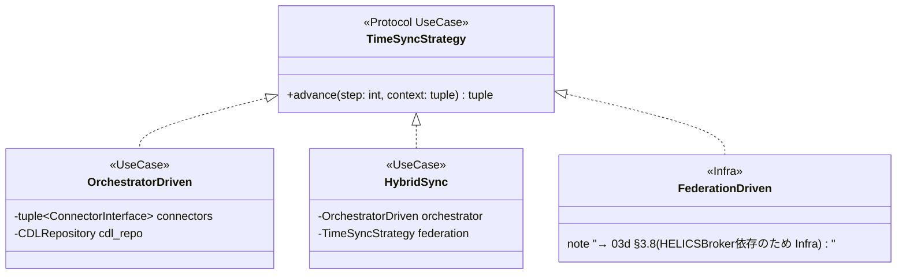
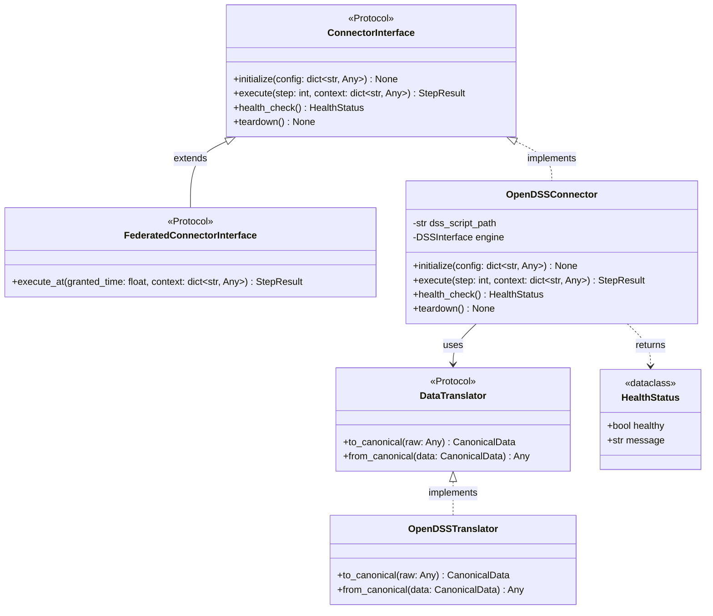
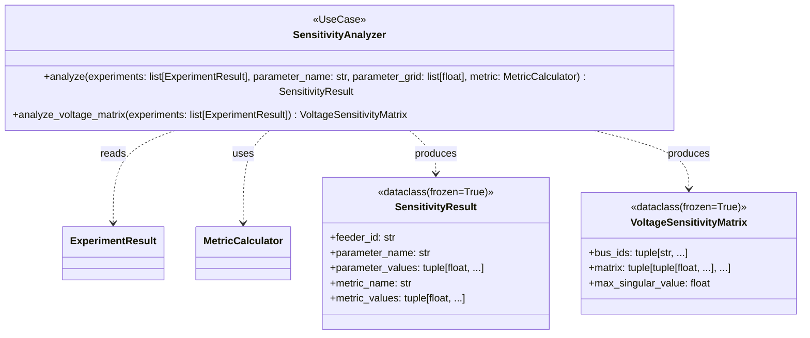

# 3B. ユースケース層クラス設計

## 更新履歴

| バージョン | 日付 | 変更内容 | 著者 |
|---|---|---|---|
| 0.1 | 2026-04-03 | 初版作成 | gridflow設計チーム |
| 0.2 | 2026-04-04 | 3.5〜3.6 追記 | gridflow設計チーム |
| 0.4 | 2026-04-06 | 状態属性追加（Orchestrator）（DD-REV-103） | Claude |
| 0.5 | 2026-04-06 | 第3章分割（03_class_design.md → 03a/03b/03c/03d） | Claude |
| 0.6 | 2026-04-06 | X6レビュー対応: TimeSyncStrategy(Protocol)+3実装追加, FederatedConnectorInterface追加, SimulationTask/TaskResult追加 | Claude |
| 0.7 | 2026-04-07 | Phase0結果レビュー対応: (1) Orchestrator関連（3.3節 Orchestrator/ExecutionPlan/ContainerManager/TimeSync/OrchestratorDriven 等）を Infra 層 [03d](03d_infra_classes.md) へ移設（論点6.2: ファイル名と内容のレイヤー整合化）。(2) StepResult を [03e](03e_usecase_results.md) へ移設し、enum 化＋属性拡張（論点6.4）。本ファイルは純粋な UseCase クラスのみを収録 | Claude |
| 0.10 | 2026-04-22 | Phase 2 v0.3 整合化: §3.6a を実装に合わせて update — (1) `ParamAxis.target` プロパティ追加 (§5.1.1 Option A 実装に合わせて, M3), (2) `ChildAssignment` 節新設 (M2), (3) `SweepResult.assignments` フィールド明文化 (M9), (4) `SweepResult.per_experiment_metrics` を column-oriented に明示 (M1 是正済み), (5) `SweepResult.created_at` 型を `datetime` に修正 (M8), (6) `Aggregator.aggregate` シグネチャを実装通り `Sequence[Mapping[str,float]] → tuple[tuple[str,float],...]` に修正 (M7) | Claude |
| 0.8 | 2026-04-07 | 論点6.6 Orchestrator 責務分割: §3.3 を UseCase 層として復活。Orchestrator (UseCase, ビジネスロジック)、OrchestratorRunner Protocol (UseCase 境界)、ExecutionPlan/TimeSync/OrchestratorDriven/HybridSync (UseCase) を本ファイルへ。Container 系・FederationDriven (Infra 技術詳細) は 03d §3.8 に残置。アーキテクチャ doc (03_static_view.md L301) との整合を回復 | Claude |
| 0.9 | 2026-04-11 | §3.5.6 REST API 仕様を深化: (1) セッションモデル (1 container = 1 session) と状態遷移を明示、(2) `/initialize` は `{"pack_id": str}` を受け取り shared volume 経由でパックを解決する方式に変更、(3) `/execute` の `context` は params tuple 形式 (CLAUDE.md §0.1 準拠) に統一、(4) エラーレスポンスを `GridflowError.to_dict()` と互換な JSON にし HTTP ステータスとエラーコード範囲の対応表を追加、(5) 状態衝突は 409 Conflict で明示的に拒否、(6) 新規エラークラス `ConnectorStateError` (E-30006) / `ConnectorRequestError` (E-30007) を追加。CLAUDE.md §0.5 (割り切り禁止原則) 下での深度不足解消 | Claude |

---

> **ナビゲーション:** [クラス設計 Index](03_class_design.md) | [03a ドメイン層](03a_domain_classes.md) | **03b ユースケース層（本文書）** | [03c アダプタ層](03c_adapter_classes.md) | [03d インフラ層](03d_infra_classes.md) | [03e UseCase結果型](03e_usecase_results.md)

> **本ファイルの責務（v0.8 改訂）:** UseCase 層のクラス／Protocol を収録する。特に §3.3 は v0.8（論点6.6）で Orchestrator の責務分割を実施し、UseCase ビジネスロジック部分（Orchestrator / OrchestratorRunner Protocol / ExecutionPlan / TimeSync / OrchestratorDriven / HybridSync / SimulationTask / TaskResult）を本ファイルに復活させた。Infra 技術詳細（ContainerOrchestratorRunner / ContainerManager / FederationDriven）は [03d §3.8](03d_infra_classes.md) へ、結果型（StepResult / ExperimentResult）は [03e](03e_usecase_results.md) へ。

---

## 3.3 Orchestrator 関連（UseCase 層、REQ-F-002）

> **v0.8 改訂（論点6.6: Orchestrator の責務分割）:** 当初 Orchestrator は `gridflow.infra.orchestrator` の単一クラスだったが、責務が「実験実行のビジネスロジック (UseCase)」と「Docker コンテナ操作 (Infra)」を兼ねており、Clean Architecture の層境界を跨いでいた。アーキテクチャドキュメント (`docs/architecture/03_static_view.md` L301) は Orchestrator を **Use Cases 層**と位置付けているのに対し、詳細設計の v0.7 までは Infra 層に集約していた——この矛盾を解消するため、責務を分割した。
>
> **分割後の構成:**
> - **本節 (03b §3.3)**: UseCase 層に属する純粋なビジネスロジック。`Orchestrator`, `ExecutionPlan`, `TimeSync` (設定), `TimeSyncStrategy` (Protocol), `OrchestratorDriven`, `HybridSync`, `OrchestratorRunner` (Protocol), `SimulationTask` / `TaskResult`
> - **[03d §3.8](03d_infra_classes.md#38-orchestrator-関連infra-層reqf002)**: Infra 層に属する技術詳細。`ContainerOrchestratorRunner`, `ContainerManager`, `FederationDriven` (HELICSBroker 依存)
>
> **依存方向:** UseCase Orchestrator は `OrchestratorRunner` Protocol に依存し、Infra 実装が Protocol を満たす。Orchestrator は Docker を一切知らない。詳細経緯は `review_record.md` §8.6（論点6.6）参照。

### 3.3.1 クラス図


### 3.3.2 Orchestrator

**モジュール:** `gridflow.usecase.orchestrator`
**レイヤー:** UseCase

実験実行のビジネスロジックを担う UseCase クラス。Connector 呼び出し順序、TimeSync 戦略選択、ステップ結果集約を行う。**Docker / コンテナ・プロセス管理・ネットワークなどの技術詳細を一切知らない**。物理的な実行基盤は `OrchestratorRunner` Protocol 経由で Infra 層に委譲する。

| 属性 | 型 | 説明 |
|---|---|---|
| runner | OrchestratorRunner | 物理実行基盤（Protocol、Infra 実装が DI される） |
| time_sync_strategy | TimeSyncStrategy | 時間同期戦略（Protocol） |
| time_sync | TimeSync | 時間同期の設定データ |
| config | tuple[tuple[str, object], ...] | オーケストレータ設定 |
| state | OrchestratorState | 現在の状態（Idle / Initializing / Running / Completed / Failed）。第5章 5.1 状態遷移参照 |

#### メソッド

**run**

| 項目 | 内容 |
|---|---|
| **Input** | `pack: ScenarioPack`, `options: tuple[tuple[str, object], ...]` |
| **Process** | (1) ExecutionPlan を生成。(2) `runner.prepare(plan)` を呼んで実行基盤を準備。(3) TimeSyncStrategy に従って各ステップを進行し、各 Connector を `runner.run_connector()` 経由で呼び出す。(4) 各ステップの StepResult を集約。(5) `runner.teardown()` で実行基盤を解放。Docker や Container の存在は一切意識しない。 |
| **Output** | `ExperimentResult` ([03e §3.11.4](03e_usecase_results.md) 参照)。実行失敗時は `ExecutionError(SimulationError)` を送出 |

**run_batch**

| 項目 | 内容 |
|---|---|
| **Input** | `packs: list[ScenarioPack]`, `options: tuple` |
| **Process** | 複数 Pack を順次または並列で実行する。並列度は runner の能力 (`runner.max_parallel`) に従う |
| **Output** | `list[ExperimentResult]` |

**cancel**

| 項目 | 内容 |
|---|---|
| **Input** | `exp_id: str` |
| **Process** | 実行中の実験を特定し、`runner.teardown()` を経由して停止する |
| **Output** | `None`。該当実験が存在しない場合は `ExperimentNotFoundError` を送出 |

### 3.3.3 OrchestratorRunner（Protocol）

**モジュール:** `gridflow.usecase.interfaces`
**レイヤー:** UseCase（境界 Protocol）

UseCase Orchestrator が依存する「物理実行基盤」の境界。具体的な実装方式（Docker / プロセス / リモートサーバー / モック）に依存しない契約を定義する。Infra 層の `ContainerOrchestratorRunner` 等が Protocol を実装する。

```python
from typing import Protocol

class OrchestratorRunner(Protocol):
    """物理実行基盤の境界 Protocol。
    
    エラー契約:
        prepare(): 起動失敗時に RunnerStartError(InfraError) を送出
        run_connector(): 通信失敗時に ConnectorCommunicationError、コネクタ不在時に ConnectorNotFoundError を送出
        teardown(): エラーは記録のみで例外送出しない（best-effort）
    """
    def prepare(self, plan: ExecutionPlan) -> None: ...
    def run_connector(self, connector_id: str, step: int, context: tuple[tuple[str, object], ...]) -> "StepResult": ...
    def health_check(self, connector_id: str) -> HealthStatus: ...
    def teardown(self) -> None: ...
```

> **依存方向の遵守:** UseCase Orchestrator → OrchestratorRunner Protocol（同じ UseCase 層）。Infra 実装 (`ContainerOrchestratorRunner`) は Protocol を import して継承する形で UseCase に依存する。Domain → UseCase → Infra の依存方向と整合する。

### 3.3.4 ExecutionPlan

**モジュール:** `gridflow.usecase.orchestrator`
**レイヤー:** UseCase（純粋データクラス）

| 属性 | 型 | 説明 |
|---|---|---|
| experiment_id | str | 実験の一意識別子 |
| pack | ScenarioPack | 対象シナリオパック |
| steps | tuple[StepConfig, ...] | 実行ステップの設定 |
| connectors | tuple[str, ...] | 使用するコネクタ ID のタプル |
| parameters | tuple[tuple[str, object], ...] | 実行パラメータ（不変、論点6.1） |

`@dataclass(frozen=True)`。

### 3.3.5 TimeSync（設定データ）

**モジュール:** `gridflow.usecase.orchestrator`
**レイヤー:** UseCase

時間同期の**設定データ**。`TimeSyncStrategy` が振る舞いを担うのに対し、TimeSync は設定パラメータのみを保持する純粋なデータクラス。

| 属性 | 型 | 説明 |
|---|---|---|
| mode | str | 同期モード（"orchestrator" \| "federation" \| "hybrid"） |
| step_size | float | 1ステップあたりの時間幅（秒） |
| total_steps | int | 総ステップ数 |

`@dataclass(frozen=True)`。

### 3.3.6 TimeSyncStrategy（Protocol）と UseCase 実装

**Protocol モジュール:** `gridflow.usecase.interfaces`
**UseCase 実装モジュール:** `gridflow.usecase.orchestrator.timesync`

時間同期の**実行戦略**インタフェース（第7章 7.1 節アルゴリズム対応）。



**advance**

| 項目 | 内容 |
|---|---|
| **Input** | `step: int`, `context: tuple[tuple[str, object], ...]` |
| **Process** | 同期戦略に従って全コネクタの1ステップ実行を統制し、結果を集約する |
| **Output** | `tuple[tuple[str, object], ...]`。同期失敗時は `SyncError(SimulationError)` を送出 |

#### OrchestratorDriven（UseCase 層）

`gridflow.usecase.orchestrator.timesync.OrchestratorDriven`。Orchestrator が直接ステップタイミングを制御する。各 Connector を `ConnectorInterface` Protocol 経由（または OrchestratorRunner 経由）で呼び出すため、**HELICSBroker 等の技術詳細に依存しない**。よって UseCase 層に属する。OpenDSS / pandapower 等の非リアルタイムコネクタ向け。

#### HybridSync（UseCase 層）

`gridflow.usecase.orchestrator.timesync.HybridSync`。`OrchestratorDriven`（UseCase）と `FederationDriven`（Infra）を `TimeSyncStrategy` Protocol 経由で合成する。Infra 実装に依存しないので UseCase 層に置ける。

#### FederationDriven → 03d へ

`FederationDriven` は `HELICSBroker`（Infra 層の技術詳細）に直接依存するため Infra 層に属する。詳細は [03d §3.8.5](03d_infra_classes.md#385-federationdriven) を参照。

### 3.3.7 SimulationTask / TaskResult

**モジュール:** `gridflow.usecase.scheduling`
**レイヤー:** UseCase

バッチスケジューリング（第7章 7.3 節）で使用するタスク定義と結果。

**SimulationTask**（`dataclass`）

| 属性 | 型 | 説明 |
|---|---|---|
| task_id | str | タスクの一意識別子 |
| pack | ScenarioPack | 実行対象のシナリオパック |
| options | tuple[tuple[str, object], ...] | 実行オプション |

**execute**

| 項目 | 内容 |
|---|---|
| **Input** | なし（属性から取得） |
| **Process** | Orchestrator.run() を非同期で呼び出し、ExperimentResult を取得する |
| **Output** | `TaskResult`。失敗時は `SchedulerError(SimulationError)` を送出 |

**TaskResult**（`dataclass(frozen=True)`）

| 属性 | 型 | 説明 |
|---|---|---|
| task_id | str | 対応するタスクID |
| status | str | "completed" \| "failed" |
| data | ExperimentResult \| None | 成功時の実験結果（[03e](03e_usecase_results.md) 参照） |
| error | str \| None | 失敗時のエラーメッセージ |


---

## 3.5 Connector関連クラス設計（REQ-F-007）

### 3.5.1 クラス図



### 3.5.2 ConnectorInterface（Protocol）

**モジュール:** `gridflow.usecase.interfaces`

UseCase層に定義し、DIP（依存性逆転の原則）を適用する。Adapter層の具象コネクタはこのProtocolを実装する。

#### メソッド

**initialize**

| 項目 | 内容 |
|---|---|
| **Input** | `config: dict[str, Any]` -- コネクタ固有の設定（スクリプトパス、接続先等） |
| **Process** | コネクタの初期化処理を実行する。外部シミュレータとの接続確立、設定ファイルの読み込み、内部状態の初期化を行う。 |
| **Output** | `None`。初期化失敗時は `ConnectorInitError`（E-30001）を送出。 |

**execute**

| 項目 | 内容 |
|---|---|
| **Input** | `step: int` -- 現在のシミュレーションステップ番号, `context: dict[str, Any]` -- ステップ実行コンテキスト（他コネクタからの入力データ等） |
| **Process** | 1ステップ分のシミュレーションを実行する。contextから入力データを取得し、外部シミュレータに渡して計算を実行し、結果をCDL準拠のデータ形式に変換して返却する。 |
| **Output** | `StepResult` -- ステップ実行結果。実行失敗時は `ConnectorExecuteError`（E-30002）を送出。 |

**health_check**

| 項目 | 内容 |
|---|---|
| **Input** | なし |
| **Process** | コネクタおよび外部シミュレータの稼働状態を確認する。接続状態、プロセス生存、メモリ使用量等をチェックする。 |
| **Output** | `HealthStatus` -- 稼働状態。通信失敗時もHealthStatus（healthy=False）として返却し、例外は送出しない。 |

**teardown**

| 項目 | 内容 |
|---|---|
| **Input** | なし |
| **Process** | コネクタの終了処理を実行する。外部シミュレータとの接続切断、一時ファイルの削除、リソースの解放を行う。 |
| **Output** | `None`。終了処理失敗時は `ConnectorTeardownError`（E-30003）を送出。 |

### 3.5.2a FederatedConnectorInterface（Protocol）

**モジュール:** `gridflow.usecase.interfaces`

HELICS 対応コネクタ向けの拡張 Protocol。ConnectorInterface を継承し、時刻ベースの実行メソッド `execute_at` を追加する。FederationDriven / HybridSync 戦略で使用される。

#### メソッド

**execute_at**

| 項目 | 内容 |
|---|---|
| **Input** | `granted_time: float` -- HELICS Broker から付与されたシミュレーション時刻（秒）, `context: dict[str, Any]` -- ステップ実行コンテキスト |
| **Process** | 付与された時刻で1ステップ分のシミュレーションを実行する。`execute(step, context)` のステップベース実行に対し、時刻ベースでの実行を提供する。 |
| **Output** | `StepResult` -- ステップ実行結果。実行失敗時は `ConnectorExecuteError`（E-30002）を送出。 |

> **備考:** HELICS 非対応のコネクタ（OpenDSS等）はこの Protocol を実装する必要はない。ConnectorInterface のみ実装すれば OrchestratorDriven 戦略で使用可能。

### 3.5.3 OpenDSSConnector

**モジュール:** `gridflow.adapter.connector`

py-dss-interface経由でOpenDSSエンジンを操作する具象コネクタ。DSSスクリプト（.dss）を入力とし、CDL準拠の出力データ（Topology, Asset, TimeSeries, Metric）を生成する。

| 属性 | 型 | 説明 |
|---|---|---|
| dss_script_path | str | OpenDSSスクリプトファイルのパス |
| engine | DSSInterface | py-dss-interfaceのエンジンインスタンス |

#### メソッド

**initialize**

| 項目 | 内容 |
|---|---|
| **Input** | `config: dict[str, Any]` -- `{"dss_script": str, "options": dict}` |
| **Process** | py-dss-interfaceを初期化し、DSSスクリプトをコンパイルする。スクリプト構文エラーがあれば即座に検出する。 |
| **Output** | `None`。スクリプト不正時は `ConnectorInitError`（E-30001）を送出。 |

**execute**

| 項目 | 内容 |
|---|---|
| **Input** | `step: int` -- ステップ番号, `context: dict[str, Any]` -- 入力コンテキスト |
| **Process** | OpenDSSエンジンで1ステップのパワーフロー計算を実行する。contextから負荷・発電データを設定し、Solve後にノード電圧・線路電流・損失等を取得する。OpenDSSTranslatorでCDL形式に変換する。 |
| **Output** | `StepResult` -- status="success"時、data内にTopology/Asset/TimeSeries/Metricを格納。 |

### 3.5.4 DataTranslator（Protocol）・OpenDSSTranslator

**モジュール:** `gridflow.usecase.interfaces`（Protocol）/ `gridflow.adapter.connector`（実装）

**DataTranslator（Protocol）**

| 項目 | 内容 |
|---|---|
| **to_canonical** | `raw: Any` → `CanonicalData` -- シミュレータ固有の生データをCDL準拠データに変換 |
| **from_canonical** | `data: CanonicalData` → `Any` -- CDL準拠データをシミュレータ固有形式に逆変換 |

**OpenDSSTranslator** はOpenDSS固有のデータ構造（ノード電圧配列、線路電流配列等）とCDLクラス（Topology, Asset, TimeSeries, Metric）間の変換を担う。

### 3.5.4a PandaPowerConnector / PandapowerTranslator（Phase 2 拡張）

**モジュール:** `gridflow.adapter.connector.pandapower`
**レイヤー:** Adapter

pandapower は Python native の電力系統解析ライブラリ。OpenDSS と比較して以下の特性がある:

| 特性 | OpenDSS | pandapower |
|---|---|---|
| 主要入力形式 | `.dss` テキスト | Python object (pandapower network) |
| 三相 | 詳細 (phase-by-phase) | 対称近似が中心 (三相非対称は拡張) |
| Jacobian 取得 | SystemY からの計算 | `net._ppc['internal']['J']` 直接取得 |
| 組込フィーダー | なし | `pandapower.networks.*` で豊富 |

#### 設計の焦点

pandapower は OpenDSSConnector と同じ `ConnectorInterface` Protocol を実装する。違いはすべて連携のいインターフェース内部で吸収する:

1. **ネットワーク構築**: `pp.networks.<factory_name>()` を動的に呼び出す。pack.parameters の `pp_network` 属性に factory 名を指定
2. **PV 注入**: `pp.create_sgen(net, bus=..., p_mw=...)` で静止型 generator として実装
3. **潮流解**: `pp.runpp(net)` で実行。結果は `net.res_bus.vm_pu` で取得
4. **bus 名マッピング**: pandapower は integer index を使うため、bus 名は `str(index)` で表現

#### PandapowerTranslator

**モジュール:** `gridflow.adapter.connector.pandapower_translator`

pandapower network object と CDL (Topology / Asset / TimeSeries / Metric) 間の双方向変換。

| メソッド | 説明 |
|---|---|
| `to_canonical(net)` | pandapower network → CDL Topology + Asset 群 |
| `from_canonical(topology, assets)` | CDL → pandapower network (cross-solver 検証の基盤, REQ-F-003 拡張) |

#### Cross-solver 検証への寄与

`from_canonical()` を OpenDSSTranslator と PandapowerTranslator の両方が実装すると、CDL が**第三の中間表現**として機能し、以下が可能になる:

```
.dss (OpenDSS)  ─┐
                 ├→ to_canonical → CDL → from_canonical ─┬→ OpenDSS network
.yaml (pp)      ─┘                                       └→ pandapower network
```

MVP try6 で判明した「solver と topology が交絡する」問題 (§5.1.3) を、同一 CDL を両 solver に流し込むことで解消できる。

### 3.5.5 HealthStatus（StepResult は 03e へ移設）

**モジュール:** `gridflow.usecase.interfaces`

> **StepResult 移設通知（v0.7）:** ConnectorInterface.execute() の戻り値となる `StepResult` は、属性拡張（step_id / timestamp / error / Enum status）と共に [03e_usecase_results.md](03e_usecase_results.md) へ移設した。理由は (1) ExperimentResult との集約関係を1ファイルにまとめる、(2) 属性が増えたため独立章にする、の2点。詳細は `review_record.md` 論点6.4 参照。

**HealthStatus**（`dataclass(frozen=True)`）

| 属性 | 型 | 説明 |
|---|---|---|
| healthy | bool | 正常稼働ならTrue |
| message | str | 状態メッセージ（異常時はエラー詳細） |

### 3.5.6 REST APIエンドポイント

Connector間通信はRESTで行う。各コネクタコンテナは以下のエンドポイントを公開する。

#### セッションモデル

**1 connector コンテナ = 1 アクティブセッション**。並行実験は Orchestrator が
複数のコンテナインスタンスを起動して実現する（03d §3.8.2 `ContainerOrchestratorRunner`）。
コンテナ内でセッション ID を管理しないのは、セッション単位の独立性（メモリ空間、
ソルバー状態、クラッシュ時の局所化）をコンテナ境界と一致させるためである。
これにより、セッションの並行性は Docker のプロセス境界で物理的に保証される。

**セッションライフサイクル:**

```
[UNINITIALIZED] --/initialize--> [READY] --/execute--> [READY] --/teardown--> [UNINITIALIZED]
                                    |                                              ^
                                    +------ /execute 内で例外発生 --[AUTO_RESET]---+
```

- `/initialize` 成功: `UNINITIALIZED → READY`
- `/execute`: `READY → READY`（ステップ進行）
- `/teardown`: `READY → UNINITIALIZED`（明示的リソース解放）
- `/execute` 中に `OpenDSSError` 等の内部例外: 自動 `teardown` を実行し `READY → UNINITIALIZED` に遷移（リソースリーク防止）

#### エンドポイント一覧

| メソッド | パス | リクエストボディ | 成功レスポンス | 許容状態 |
|---|---|---|---|---|
| GET | /health | なし | 200 `HealthStatus (JSON)` | 常に |
| POST | /initialize | `{"pack_id": str}` | 200 `{"status": "ok"}` | UNINITIALIZED のみ |
| POST | /execute | `{"step": int, "context": tuple[tuple[str, object], ...]}` | 200 `StepResult (JSON)` | READY のみ |
| POST | /teardown | なし | 200 `{"status": "ok"}` | READY のみ |

**`/initialize` のリクエスト仕様:**

| フィールド | 型 | 説明 |
|---|---|---|
| pack_id | str | 事前に `FileScenarioRegistry` に登録済みの Scenario Pack ID |

パックの実体（network ファイル等）は `docker-compose` の shared volume
（`~/.gridflow/packs` + `./examples:/app/examples:ro`）経由で参照する。パック全体を
JSON 転送しない理由は、network ファイル（`.dss` / `.raw` / `.json` 等）の
サイズとフォーマット多様性、および再現性のためにファイルハッシュで実体を
参照したいためである（03b §3.5 ScenarioPack 設計、`docker-compose` §11.2）。

**`/execute` のリクエスト仕様:**

| フィールド | 型 | 説明 |
|---|---|---|
| step | int | ステップインデックス（0-based, 単調増加を呼び出し側が保証） |
| context | `list[list[str, object]]` (JSON) → `tuple[tuple[str, object], ...]` | params tuple 形式。CLAUDE.md §0.1 準拠。サーバー側で `as_params()` により正規化 |

**`/execute` のレスポンス仕様 (`StepResult`):**

03e §3.11.3 `StepResult` を JSON シリアライズしたもの。`node_result` の
voltages は `list[float]`、`timestamp` は ISO-8601 UTC 文字列、`status` は
Enum 値文字列（`"success"` / `"error"`）。

#### エラーレスポンス

すべてのエラーは以下の JSON 形式で返す（`GridflowError.to_dict()` と互換）：

```json
{
  "error_code": "E-30002",
  "message": "<human readable>",
  "context": {"key": "value"}
}
```

HTTP ステータスとエラーコードの対応：

| HTTP | エラーコード範囲 | 原因 | 典型的な `error_code` |
|---|---|---|---|
| 400 Bad Request | E-30xxx | リクエストボディ形式不正（JSON パース失敗、必須フィールド欠損、型不一致） | `E-30003` |
| 404 Not Found | - | 未定義パス | - |
| 405 Method Not Allowed | - | メソッド不一致 | - |
| 409 Conflict | E-30xxx | 状態不整合：UNINITIALIZED 状態で `/execute` / `/teardown`、または READY 状態で `/initialize`（セッション衝突） | `E-30006`（新規: `ConnectorStateError`） |
| 422 Unprocessable Entity | E-10xxx | ビジネスバリデーション失敗（例: pack_id が registry に存在しない） | `E-10002` |
| 500 Internal Server Error | E-30xxx | コネクタ内部エラー（例: OpenDSS 非収束、driver クラッシュ） | `E-30002` |

**`/initialize` 呼び出し時の状態衝突**は **409 Conflict** を返す。呼び出し側が前の
セッションを `/teardown` してから再試行する責務を負う。「前セッションを黙って閉じて
新規作成する」動作は行わない（状態遷移を明示的にし、誤使用を早期検知するため）。

#### 新規エラークラス

本節のエラー仕様に伴い、以下を `gridflow.domain.error` に追加する：

| クラス | error_code | 親 | 説明 |
|---|---|---|---|
| `ConnectorStateError` | E-30006 | `ConnectorError` | REST API 呼び出しが現在の connector セッション状態に対して無効（例: READY 状態で /initialize、UNINITIALIZED 状態で /execute） |
| `ConnectorRequestError` | E-30007 | `ConnectorError` | REST API のリクエストボディが不正（JSON パース失敗、型不一致、必須フィールド欠損） |

#### サーバー実装モジュール

本 REST API は `gridflow.connectors.<name>` モジュール
（例: `gridflow.connectors.opendss`）として実装し、対応する connector Docker
イメージの ENTRYPOINT が `python -m gridflow.connectors.<name>` でこれを起動する
（詳細設計 §11.1.2）。サーバー実装は `gridflow.adapter.connector.<name>` の
`ConnectorInterface` 実装を内部で使い回し、HTTP 層だけを薄くかぶせる。

---

## 3.6 Benchmark関連クラス設計（REQ-F-004）

### 3.6.1 クラス図


### 3.6.2 BenchmarkHarness

**モジュール:** `gridflow.adapter.benchmark`

| 属性 | 型 | 説明 |
|---|---|---|
| calculators | list[MetricCalculator] | 登録済み指標計算器のリスト |
| report_generator | ReportGenerator | レポート生成器 |

#### メソッド

**run**

| 項目 | 内容 |
|---|---|
| **Input** | `experiment_ids: list[str]` -- 評価対象の実験IDリスト, `metric_names: list[str]` -- 計算する指標名リスト |
| **Process** | 指定された実験結果を取得し、metric_namesに対応するMetricCalculatorを選択して各指標を計算する。結果をBenchmarkReportとして集約する。 |
| **Output** | `BenchmarkReport` -- ベンチマーク評価レポート。実験IDが存在しない場合は `ExperimentNotFoundError` を送出。 |

**compare**

| 項目 | 内容 |
|---|---|
| **Input** | `a: BenchmarkReport` -- ベースラインレポート, `b: BenchmarkReport` -- 比較対象レポート |
| **Process** | 2つのレポートの共通指標について差分（絶対値・変化率）を算出し、改善/悪化を判定する。 |
| **Output** | `ComparisonReport` -- 比較結果レポート。共通指標がない場合は `NoComparableMetricsError` を送出。 |

**export**

| 項目 | 内容 |
|---|---|
| **Input** | `report: BenchmarkReport` -- 出力対象レポート, `format: str` -- 出力形式（"json" \| "csv" \| "html"）, `path: Path` -- 出力先パス |
| **Process** | ReportGeneratorを使用してレポートを指定形式に変換し、指定パスに書き出す。 |
| **Output** | `Path` -- 出力されたファイルのパス。書き込み失敗時は `ExportError` を送出。 |

### 3.6.3 MetricCalculator（Protocol）

**モジュール:** `gridflow.usecase.interfaces`

Strategyパターンを適用し、指標計算ロジックを交換可能にする。

| プロパティ/メソッド | 型 | 説明 |
|---|---|---|
| name（property） | str | 指標名 |
| calculate | (ExperimentResult) → MetricValue | 指標計算 |

#### 標準指標計算器一覧

| クラス名 | 指標名 | 単位 | 準拠規格 | 説明 |
|---|---|---|---|---|
| VoltageDeviationCalculator | voltage_deviation_max | % | EN 50160 | 最大電圧偏差率 |
| VoltageDeviationCalculator | voltage_deviation_mean | % | EN 50160 | 平均電圧偏差率 |
| VoltageDeviationCalculator | voltage_deviation_p95 | % | EN 50160 | 95パーセンタイル電圧偏差率 |
| VoltageDeviationCalculator | voltage_violation_ratio | % | EN 50160 | 電圧違反率（閾値超過サンプル比） |
| ThermalOverloadCalculator | thermal_overload_hours | h | — | 熱容量超過の累積時間 |
| EnergyNotSuppliedCalculator | energy_not_supplied | MWh | — | 供給不能エネルギー量 |
| SAIDICalculator | saidi | min/customer | IEEE 1366 | 顧客あたり平均停電時間 |
| SAIFICalculator | saifi | 回/customer | IEEE 1366 | 顧客あたり平均停電回数 |
| CAIDICalculator | caidi | min/回 | IEEE 1366 | 停電1回あたり平均復旧時間 |
| DispatchCostCalculator | dispatch_cost | USD | — | 発電コスト |
| CO2EmissionsCalculator | co2_emissions | tCO2 | — | CO2排出量 |
| CurtailmentCalculator | curtailment | MWh | — | 出力抑制量 |
| LossesCalculator | losses | MWh | — | 系統損失 |
| RestorationTimeCalculator | restoration_time | s | — | 復旧時間 |
| RuntimeCalculator | runtime | s | — | シミュレーション実行時間 |

### 3.6.4 ReportGenerator

**モジュール:** `gridflow.adapter.benchmark`

**generate**

| 項目 | 内容 |
|---|---|
| **Input** | `report: BenchmarkReport` -- 変換対象レポート, `format: str` -- 出力形式（"json" \| "csv" \| "html"） |
| **Process** | BenchmarkReportを指定フォーマットに変換する。JSON: 構造化データ、CSV: フラットテーブル、HTML: グラフ付きレポート。 |
| **Output** | `str \| bytes` -- 変換結果。未対応フォーマットの場合は `UnsupportedFormatError` を送出。 |

### 3.6.5 データクラス

**BenchmarkReport**（`dataclass(frozen=True)`）

| 属性 | 型 | 説明 |
|---|---|---|
| report_id | str | レポートの一意識別子 |
| experiment_ids | list[str] | 評価対象の実験IDリスト |
| metrics | dict[str, MetricValue] | 指標名→計算結果のマッピング |
| created_at | datetime | レポート作成日時 |

**ComparisonReport**（`dataclass(frozen=True)`）

| 属性 | 型 | 説明 |
|---|---|---|
| baseline | BenchmarkReport | ベースラインレポート |
| target | BenchmarkReport | 比較対象レポート |
| diffs | dict[str, MetricDiff] | 指標名→差分情報のマッピング |

**MetricValue**（`dataclass(frozen=True)`）

| 属性 | 型 | 説明 |
|---|---|---|
| name | str | 指標名 |
| value | float | 指標値 |
| unit | str | 単位 |

---

## 3.6a Sweep 関連クラス設計（REQ-F-016）

### 3.6a.1 設計方針

`SweepPlan` と `SweepOrchestrator` は Phase 1 MVP で先行実装されたが (`gridflow.usecase.sweep_plan`, `gridflow.usecase.sweep`)、正式な設計書記述が欠落していた。Phase 2 で以下を確定する:

1. 既存実装を設計書に正式化
2. `SweepResult` に `per_experiment_metrics` を追加 (MVP try5-7 の教訓。§5.1.2)
3. `Aggregator` Protocol の拡張点を明文化

### 3.6a.2 SweepPlan

**モジュール:** `gridflow.usecase.sweep_plan`
**レイヤー:** UseCase (`@dataclass(frozen=True)`)

パラメータ sweep 計画。`base_pack_id` を起点とし、`axes` で指定したパラメータ軸の組合せを展開して子実験を生成する。

| 属性 | 型 | 説明 |
|---|---|---|
| sweep_id | str | sweep の一意識別子 |
| base_pack_id | str | 全子実験が派生する ScenarioPack ID |
| axes | tuple[ParamAxis, ...] | パラメータ軸のタプル |
| aggregator_name | str | 集約戦略名 (AggregatorRegistry で解決) |
| seed | int | 乱数 seed (再現性保証) |

#### 展開セマンティクス

- 非ランダム軸 (`RangeAxis`, `ChoiceAxis`) → **cartesian 積**
- ランダム軸 (`RandomSampleAxis`) → **zipped draws** (全ランダム軸は同一 n_samples)
- 最終展開 = cartesian(non-random) × zipped(random)

#### メソッド

**expand**

| 項目 | 内容 |
|---|---|
| **Input** | なし (self の axes を使用) |
| **Process** | 各軸から sample を取得し、上記セマンティクスで展開。axis.target (`"pack"` or `"metric:<metric_name>"`) に従って各子実験の値を pack 用 / metric 用に振り分け、`ChildAssignment` を構築する |
| **Output** | `tuple[ChildAssignment, ...]` — 各子実験の構造化割当 (pack 用 Params + per-metric kwargs 上書き) |

**plan_hash**

| 項目 | 内容 |
|---|---|
| **Input** | なし |
| **Process** | sweep_id + base_pack_id + axes の正規化表現を SHA256 し先頭 16 文字を返す |
| **Output** | `str` (16 chars) — 結果の provenance 追跡用 |

### 3.6a.3 ParamAxis（Protocol）

**モジュール:** `gridflow.usecase.sweep_plan`

sweep の 1 軸を表す Protocol。具象実装は `RangeAxis`, `ChoiceAxis`, `RandomSampleAxis`。

| プロパティ/メソッド | 型 | 説明 |
|---|---|---|
| name (property) | str | 値が代入されるパラメータキー。`target` の値で意味が変わる (下記参照) |
| is_random (property) | bool | zipped-random グループに属するか |
| target (property) | str | 値の代入先を表す文字列。`"pack"` (default) なら `pack.metadata.parameters[name]` を上書き。`"metric:<metric_name>"` ならその metric の kwargs[name] を上書き (Phase 2 §5.1.1 Option A) |
| sample() | `tuple[object, ...]` | 決定的な値タプル。ランダム軸は seed で再現可能 |

#### target の文法

```
target := "pack"                           # default; pack.metadata.parameters への代入
       | "metric:" <metric_name>           # 指定 metric の kwargs への代入
```

`metric:` プレフィックスは module 定数 `TARGET_METRIC_PREFIX` で定義。`metric:` の後の `<metric_name>` は SweepOrchestrator に渡される `metric_specs` の `MetricSpec.name` と一致する必要がある (一致しない場合は `OrchestratorError` を fail-fast)。

### 3.6a.3a ChildAssignment

**モジュール:** `gridflow.usecase.sweep_plan`
**レイヤー:** UseCase (`@dataclass(frozen=True)`)

`SweepPlan.expand()` の戻り値要素。1 子実験ぶんの軸割当を **target ごとに構造分離** して保持する。CLAUDE.md §0.1「責務分離」「pack params と metric params を構造で分けることで namespacing 文字列に頼らない」原則の表れ。

| 属性 | 型 | 説明 |
|---|---|---|
| pack_params | `Params` | `target == "pack"` の軸が貢献する pack.metadata.parameters 上書き (canonical sorted tuple-of-pairs) |
| metric_params | `tuple[tuple[str, Params], ...]` | metric 名でソート済み tuple。各エントリは `(metric_name, kwargs_overrides)` |

**不変条件** (`__post_init__` で fail-fast):
- metric_params 内の metric 名重複なし
- metric_params は metric 名で昇順ソート (canonical 形)

#### メソッド

**to_dict**

| 項目 | 内容 |
|---|---|
| **Input** | なし |
| **Process** | pack_params と metric_params を JSON 互換 dict にシリアライズ |
| **Output** | `dict[str, object]` — `{"pack_params": {...}, "metric_params": {<name>: {...}, ...}}` |

### 3.6a.4 SweepResult

**モジュール:** `gridflow.usecase.sweep_plan`
**レイヤー:** UseCase (`@dataclass(frozen=True)`)

Monte Carlo sweep の結果を格納する。**Phase 2 で `per_experiment_metrics` および `assignments` を追加**し、下流の post-processing (SensitivityAnalyzer 等) が child experiment JSON を個別に再読み込みせずに済むようにする。

| 属性 | 型 | 説明 |
|---|---|---|
| sweep_id | str | plan.sweep_id |
| base_pack_id | str | plan.base_pack_id |
| plan_hash | str | SweepPlan のハッシュ (provenance) |
| experiment_ids | tuple[str, ...] | 全子実験 ID (順序保証) |
| aggregated_metrics | tuple[tuple[str, float], ...] | sweep レベルの集約 metric (mean/max/min/stdev 等) |
| **per_experiment_metrics** | `tuple[tuple[str, tuple[float, ...]], ...]` | **Phase 2 追加 (column-oriented)**: 各エントリは `(metric_name, vector_of_N_floats)`。outer は metric 名で sort 済み (canonical 形)、各 vector は `experiment_ids` と positional align (`vector[i]` ↔ `experiment_ids[i]`) |
| **assignments** | `tuple[ChildAssignment, ...]` | **Phase 2 追加**: 各子実験を生成した `ChildAssignment` (pack params + metric params の構造化形式)。`experiment_ids` と positional align |
| elapsed_s | float | 実行時間（秒） |
| created_at | datetime | UTC 作成時刻 (in-memory は `datetime`、`to_dict()` 経由で ISO 8601 文字列に変換) |

**不変条件** (`__post_init__` で fail-fast):
- per_experiment_metrics の metric 名は重複なし
- per_experiment_metrics は metric 名で昇順ソート
- 各 metric vector の長さ = `len(experiment_ids)` (rectangular)
- `len(assignments) == len(experiment_ids)`

#### per_experiment_metrics が column-oriented である根拠

§5.1.2 の動機 (MVP try5-7) は **「同一 sweep に対して quantile / bootstrap / histogram などの分析を post-processing で適用」**。これらはすべて「1 metric × N experiments」のベクトル取得が支配的。column 形式なら O(1) lookup + O(N) iterate、row 形式なら毎回 dict 再構築 = O(N·M)。pandas / NumPy / Apache Arrow といった analytics エコシステムも column-oriented 前提。

JSON シリアライズ形:
```json
"per_experiment_metrics": {
  "voltage_deviation": [0.04, 0.06, 0.05, ...],
  "hosting_capacity":  [1.2, 0.8, 1.1, ...]
}
```

#### Phase 2 追加の根拠

MVP try5-7 では `hcar_metric.py:load_placements_from_sweep()` が n=1000 件の child JSON を個別に open() しており、I/O コストが大きかった。`per_experiment_metrics` (column 形) を SweepResult に含めることで、SensitivityAnalyzer や CVaR 系 metric が 1 ファイル読むだけで全 per-experiment 値を取得できる。

**互換性**: 既存の `aggregated_metrics` は不変。新フィールド (`per_experiment_metrics`, `assignments`) の追加のみ。

### 3.6a.5 Aggregator（Protocol）

**モジュール:** `gridflow.usecase.sweep`

per-experiment の metric 値群から sweep レベルの集約 metric を生成する Strategy。

#### Protocol シグネチャ

| プロパティ/メソッド | 型 | 説明 |
|---|---|---|
| name | str | レジストリでの識別子 (`"statistics"`, `"extrema"` など) |
| aggregate(per_experiment) | `tuple[tuple[str, float], ...]` | per-experiment の metric dict 列を sweep レベル集約 metric (canonical sorted tuple) に縮約 |

`aggregate()` の引数型は `Sequence[Mapping[str, float]]` (= per-experiment 1 行ぶんの `{metric_name: value}` のリスト)。`ExperimentResult` を直接受けない理由は、Aggregator 自体は metric 計算済みの数値だけを扱う pure 関数であり、ExperimentResult への依存を持たせると BenchmarkHarness を介して実験単位での再計算ループに混乱を呼ぶため (CLAUDE.md §0.1「責務分離の言い訳で原則を緩めない」)。

返り値が `dict[str, float]` ではなく `tuple[tuple[str, float], ...]` (canonical sorted) なのは、`SweepResult.aggregated_metrics` 自体が project-wide Params 慣習に従う必要があるため。

標準実装:
- `StatisticsAggregator`: mean / median / min / max / stdev
- `ExtremaAggregator`: min / max のみ
- 追加実装 (Phase 2 v0.3 以降): `QuantileAggregator` (25th/75th/95th percentile), `CVaRAggregator` (下位 5% の期待値)

### 3.6a.6 SweepOrchestrator

**モジュール:** `gridflow.usecase.sweep`
**レイヤー:** UseCase

`SweepPlan` を入力とし、`Orchestrator` を N 回駆動して全子実験を実行、`Aggregator` で集約して `SweepResult` を返す。

#### コンストラクタ

| 引数 | 型 | 説明 |
|---|---|---|
| registry | ScenarioRegistry | base pack 解決と child pack 登録 |
| orchestrator | Orchestrator | UseCase 層の単一実験 Orchestrator |
| aggregator_registry | AggregatorRegistry | 名前 → Aggregator |
| connector_id | str = "opendss" | 全子実験で使用する connector id |
| harness | BenchmarkHarness \| None = None | child の metric を計算する harness。`metric_specs` 未指定時のデフォルト経路 |
| metric_specs | `tuple[MetricSpec, ...]` = () | §5.1.1 Option A: metric 名 + plugin + base kwargs を宣言。axis target=`metric:<name>` の値はこれを per-child で kwargs override する |
| results_dir | Path \| None = None | child ExperimentResult JSON 永続化ディレクトリ |

#### メソッド

**run**

| 項目 | 内容 |
|---|---|
| **Input** | `plan: SweepPlan` |
| **Process** | 1. plan.expand() で `tuple[ChildAssignment, ...]` を生成。2. 各 axis の target が `metric:` なら、対応する MetricSpec が登録済みかを fail-fast で検証。3. 各子実験用に ScenarioPack を派生 (`assignment.pack_params` を上書き)。4. assignment.metric_params が空でなければ per-child harness を再構築 (各 MetricSpec の base kwargs を override)、空ならコンストラクタの `harness` を使用。5. Orchestrator.run() で実行、harness で metric 計算し row-of-dict に保存。6. 全 child 完了後、row-of-dict を column-oriented に転置して `per_experiment_metrics` を構築。7. Aggregator.aggregate() で集約。8. SweepResult を構築 (per_experiment_metrics + assignments + 集約値) |
| **Output** | `SweepResult`。plan が axes を持たない場合 `ValueError`。axis target が未登録 metric を指す場合 `OrchestratorError` |

---

## 3.7 SensitivityAnalyzer 関連クラス設計（REQ-F-016）

### 3.7.1 設計方針

MVP 検証 (try4-try7) で「同一 simulation 結果に対して metric パラメータを変えて再評価したい」という研究ワークフロー要件が判明した。現在の MetricCalculator は 1 プラグイン = 1 固定パラメータであり、閾値 sweep に対応できない。

SensitivityAnalyzer は **Connector の再実行を伴わない post-processing** として UseCase 層に配置する。Connector は step 実行のみを担い、感度分析は Connector の出力 (ExperimentResult 群) を入力とする別 UseCase が担う。

```
Connector.step()
    → ExperimentResult (voltage data)
        → SensitivityAnalyzer.analyze() ← NEW
            → SensitivityResult (metric vs parameter curve)
```

この設計は以下の原則に従う:
- **Connector の責務不変**: step 実行 + フォーマット変換のみ（§3.5.2 と整合）
- **層境界の維持**: 分析は UseCase 層、Connector は Adapter 層（CLAUDE.md §0.1）
- **MetricCalculator との一貫性**: Strategy pattern で評価ロジックを注入

### 3.7.2 クラス図



### 3.7.3 SensitivityAnalyzer

**モジュール:** `gridflow.usecase.sensitivity`
**レイヤー:** UseCase

同一 Monte Carlo sweep の ExperimentResult 群を入力とし、metric パラメータを sweep した感度曲線、または bus 間電圧感度行列を算出する。

#### メソッド

**analyze**

| 項目 | 内容 |
|---|---|
| **Input** | `experiments: list[ExperimentResult]` — 同一 sweep の全実験結果。`parameter_name: str` — sweep 対象の metric パラメータ名 (e.g. "voltage_low")。`parameter_grid: list[float]` — 評価するパラメータ値の grid。`metric: MetricCalculator` — パラメータ変更可能な MetricCalculator インスタンス。`bootstrap_n: int = 0` — bootstrap リサンプル数 (0 なら CI なし) |
| **Process** | 1. 各実験から voltage data を抽出。2. parameter_grid の各値で MetricCalculator を再初期化し、全実験の metric を再計算。3. 各パラメータ値で mean metric を算出。4. bootstrap_n > 0 なら bootstrap CI を算出。5. SensitivityResult を構築して返却 |
| **Output** | `SensitivityResult`。parameter_grid 外の値を要求された場合は `ValueError`。experiments が空なら `ValueError` |

**analyze_voltage_matrix**

| 項目 | 内容 |
|---|---|
| **Input** | `experiments: list[ExperimentResult]` — 各実験は異なる bus への PV 注入を含む。注入 bus は `ExperimentMetadata.parameters` の `pv_bus` から取得。注入量は `pv_kw` から取得 |
| **Process** | 1. 各実験の (pv_bus, pv_kw, voltage_vector) を抽出。2. baseline (PV なし) の voltage vector を特定または推定。3. ΔV = V(with PV) - V(baseline) を計算。4. bus ごとに ΔV / ΔP の統計量を集約し感度行列 S を構築。5. S の SVD を計算し、最大特異値と対応する bus を特定 |
| **Output** | `VoltageSensitivityMatrix`。PV 注入情報が不足する場合は `ValueError` |

### 3.7.4 ツール固有の感度行列取得（Protocol 外拡張）

OpenDSS や pandapower は solver 内部で Jacobian / Y-bus 行列を保持しており、数値微分より精度が高い。これらのツール固有機能は **ConnectorInterface Protocol には追加せず**、具象 Connector クラスのメソッドとして提供する。

```python
# Adapter 層 (Protocol 外)
class OpenDSSConnector(ConnectorInterface):
    # Protocol メソッド (§3.5.2 で定義済み)
    def initialize(self, pack: ScenarioPack) -> None: ...
    def step(self, step_index: int) -> ConnectorStepOutput: ...
    def teardown(self) -> None: ...

    # Protocol 外のツール固有拡張
    def extract_system_y(self) -> tuple[tuple[complex, ...], ...]:
        """OpenDSS 固有: SystemY (system admittance matrix) を取得."""
        ...
```

SensitivityAnalyzer は `isinstance` による型絞りで利用する:

```python
# UseCase 層
if isinstance(connector, OpenDSSConnector):
    y_matrix = connector.extract_system_y()
    # Y-bus から電圧感度行列を解析的に導出
else:
    # 数値微分 (複数 ExperimentResult の差分) にフォールバック
```

この設計により:
- ConnectorInterface の統一性は維持される（Grid2Op / HELICS にも適用可能）
- ツール固有の高精度手法も利用可能
- フォールバック (数値微分) が常に存在し、graceful degradation

---

> **関連文書:** ドメインクラス（ScenarioPack, CDL）は → [03a ドメイン層](03a_domain_classes.md) / CLI・Plugin は → [03c アダプタ層](03c_adapter_classes.md) / 共通基盤・トレースは → [03d インフラ層](03d_infra_classes.md)
