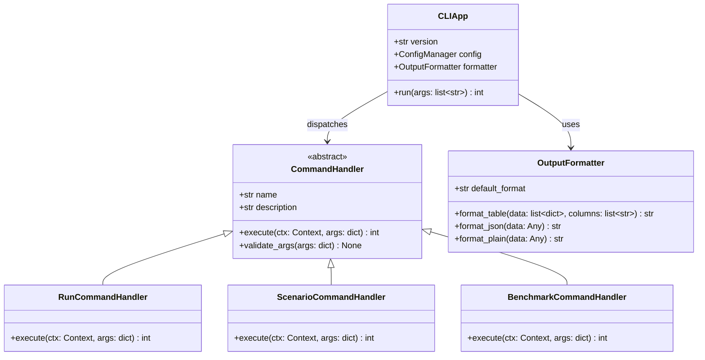
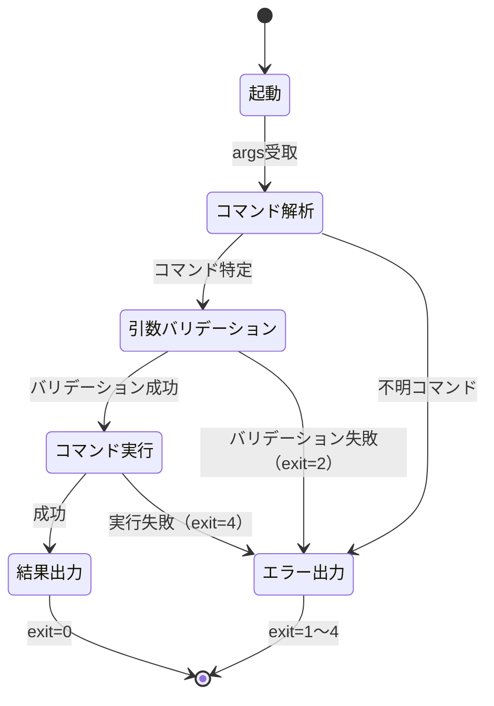
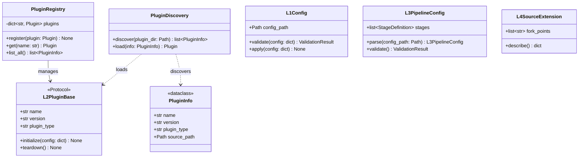
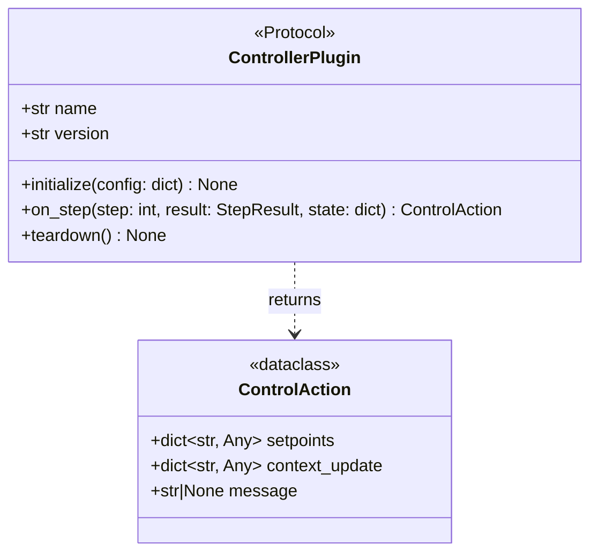

# 3C. アダプタ層クラス設計

## 更新履歴

| バージョン | 日付 | 変更内容 | 著者 |
|---|---|---|---|
| 0.1 | 2026-04-03 | 初版作成 | gridflow設計チーム |
| 0.2 | 2026-04-04 | 3.7〜3.8 追記 | gridflow設計チーム |
| 0.4 | 2026-04-06 | CLIサブコマンドハンドラー追加（DD-REV-101） | Claude |
| 0.5 | 2026-04-06 | 第3章分割（03_class_design.md → 03a/03b/03c/03d） | Claude |

---

> **ナビゲーション:** [クラス設計 Index](03_class_design.md) | [03a ドメイン層](03a_domain_classes.md) | [03b ユースケース層](03b_usecase_classes.md) | **03c アダプタ層（本文書）** | [03d インフラ層](03d_infra_classes.md)

---

## 3.7 CLI関連クラス設計（REQ-F-005）

### 3.7.1 クラス図



### 3.7.2 CLIApp

**モジュール:** `gridflow.adapter.cli`

clickまたはtyperを使用したCLIエントリポイント。

| 属性 | 型 | 説明 |
|---|---|---|
| version | str | CLIバージョン文字列 |
| config | ConfigManager | 設定管理インスタンス |
| formatter | OutputFormatter | 出力フォーマッタ |

#### メソッド

**run**

| 項目 | 内容 |
|---|---|
| **Input** | `args: list[str]` -- コマンドライン引数 |
| **Process** | 引数をパースし、対応するCommandHandlerにディスパッチする。グローバルオプション（--format, --verbose, --quiet, --config）を先に処理し、Contextに格納する。 |
| **Output** | `int` -- 終了コード（0=成功, 1=一般エラー, 2=引数エラー, 3=設定エラー, 4=実行エラー） |

### 3.7.3 CommandHandler（基底クラス）

**モジュール:** `gridflow.adapter.cli`

各コマンドのハンドラー基底。サブクラスでexecuteを実装する。

| プロパティ | 型 | 説明 |
|---|---|---|
| name | str | コマンド名 |
| description | str | コマンドの説明文 |

#### メソッド

**execute**

| 項目 | 内容 |
|---|---|
| **Input** | `ctx: Context` -- 実行コンテキスト（設定・フォーマッタ等）, `args: dict` -- パース済み引数 |
| **Process** | コマンド固有の処理を実行する。各サブクラスでオーバーライドする。 |
| **Output** | `int` -- 終了コード。 |

**validate_args**

| 項目 | 内容 |
|---|---|
| **Input** | `args: dict` -- バリデーション対象の引数 |
| **Process** | コマンド固有の引数バリデーションを実行する。必須引数の存在確認、型チェック、値域チェックを行う。 |
| **Output** | `None`。バリデーション失敗時は `CLIArgumentError`（終了コード2）を送出。 |

### 3.7.4 トップレベルコマンド一覧

| コマンド | ハンドラークラス | 説明 | 関連UC |
|---|---|---|---|
| `gridflow run` | RunCommandHandler | 実験実行（複数pack指定で逐次バッチ） | UC-01 |
| `gridflow sweep` | SweepCommandHandler | パラメータスイープ実行 | UC-01 |
| `gridflow evaluate` | EvaluateCommandHandler | 既存結果への metric 再適用 (Phase 2, REQ-F-016) | UC-03 |
| `gridflow scenario` | ScenarioCommandHandler | Scenario Pack管理 | UC-02 |
| `gridflow benchmark` | BenchmarkCommandHandler | ベンチマーク評価 | UC-03 |
| `gridflow status` | StatusCommandHandler | 実行状態確認 | UC-04 |
| `gridflow logs` | LogsCommandHandler | ログ表示 | UC-05 |
| `gridflow trace` | TraceCommandHandler | トレース表示 | UC-05 |
| `gridflow plot` | PlotCommandHandler | 可視化テンプレート実行 | UC-09 |
| `gridflow metrics` | MetricsCommandHandler | メトリクス表示 | UC-05 |
| `gridflow debug` | DebugCommandHandler | デバッグ情報 | UC-06 |
| `gridflow results` | ResultsCommandHandler | 結果表示・エクスポート | UC-09 |
| `gridflow update` | UpdateCommandHandler | 自己更新 | UC-08 |

#### scenarioサブコマンド

| サブコマンド | 説明 |
|---|---|
| `scenario create` | 新規パック作成 |
| `scenario list` | パック一覧表示 |
| `scenario clone` | パック複製 |
| `scenario validate` | パックバリデーション |
| `scenario register` | パック登録 |

### 3.7.5 OutputFormatter

**モジュール:** `gridflow.adapter.cli`

| 属性 | 型 | 説明 |
|---|---|---|
| default_format | str | デフォルト出力形式（"table"） |

#### メソッド

**format_table**

| 項目 | 内容 |
|---|---|
| **Input** | `data: list[dict]` -- テーブルデータ, `columns: list[str]` -- 表示カラム名リスト |
| **Process** | データをカラム幅を自動調整したテーブル形式に整形する。カラーコード対応。 |
| **Output** | `str` -- 整形済みテーブル文字列。 |

**format_json**

| 項目 | 内容 |
|---|---|
| **Input** | `data: Any` -- JSON変換対象データ |
| **Process** | データをインデント付きJSON文字列に変換する。datetime等の非標準型はISO 8601に変換。 |
| **Output** | `str` -- JSON文字列。 |

**format_plain**

| 項目 | 内容 |
|---|---|
| **Input** | `data: Any` -- 出力対象データ |
| **Process** | データを装飾なしのプレーンテキストに変換する。パイプライン連携向け。 |
| **Output** | `str` -- プレーンテキスト文字列。 |

### 3.7.6 CLI状態遷移図



### 3.7.7 CLI出力フォーマット仕様

**テーブル形式**（デフォルト）:
```
EXPERIMENT  STATUS   DURATION  METRICS
exp-001     success  12.3s     voltage_deviation=1.2%
exp-002     running  --        --
```

**JSON形式**（`--format json`）:
```json
[
  {"experiment": "exp-001", "status": "success", "duration": 12.3, "metrics": {"voltage_deviation": 1.2}},
  {"experiment": "exp-002", "status": "running", "duration": null, "metrics": null}
]
```

**プレーン形式**（`--format plain`）:
```
exp-001 success 12.3 voltage_deviation=1.2
exp-002 running - -
```

### 3.7.8 CLIサブコマンドハンドラー

第4章のシーケンス図に登場するCLIサブコマンドのハンドラーを、CommandHandler（3.7.3）の具象クラスとして定義する。

#### EvaluateCommandHandler (Phase 2, REQ-F-016)

**モジュール:** `gridflow.adapter.cli.commands`

`gridflow evaluate` コマンドを処理する。**既存の sweep 結果に対して metric を再適用する post-processing** を提供する。同一 simulation 結果から異なる metric パラメータ（電圧閾値等）での評価を得たい研究ワークフロー（MVP try4-7 で要件判明）を支える。

| 項目 | 内容 |
|---|---|
| **Input** | `ctx: Context` — CLI コンテキスト。`args`: `--results <sweep.json>` — 既存 SweepResult または child experiments ディレクトリ。`--metric <spec>` — metric プラグイン指定 (e.g. `"hc:HC(voltage_low=0.90)"`)。複数 `--metric` を指定可能。`--parameter-sweep <name>:<start>:<stop>:<n>` — metric パラメータの sweep (optional, SensitivityAnalyzer を起動)。`--output <path>` — 出力 JSON |
| **Process** | 1. `--results` から SweepResult + child experiment data を読込。2. 単一 metric モード: 各 metric プラグインを全 experiment に適用、per_experiment_metrics と aggregated_metrics を算出。3. `--parameter-sweep` モード: SensitivityAnalyzer.analyze() で parameter_grid 上の metric 曲線を生成。4. 結果を JSON に出力 |
| **Output** | `int` — 終了コード（0: 成功、1: 成果物欠損、2: metric プラグイン解決失敗） |

**使用例**:

```bash
# 単一 metric 再適用
gridflow evaluate \
  --results sweep_base.json \
  --metric "hc:HC(voltage_low=0.95)" \
  --output hc_range_a.json

# 複数 metric 一括
gridflow evaluate \
  --results sweep_base.json \
  --metric "hc_a:HC(voltage_low=0.95)" \
  --metric "hc_b:HC(voltage_low=0.90)" \
  --output hc_both.json

# metric パラメータ sweep (SensitivityAnalyzer 起動)
gridflow evaluate \
  --results sweep_base.json \
  --metric "hc:HC" \
  --parameter-sweep "voltage_low:0.90:0.95:11" \
  --output hc_sensitivity.json
```

**`gridflow benchmark` との違い**:

- `benchmark` は 2 実験間の差分比較（baseline vs target）
- `evaluate` は同一 sweep への metric 再適用（post-processing）
- 両者は異なる UseCase を持ち、分離する

#### DebugCommandHandler

**モジュール:** `gridflow.adapter.cli.commands`

`gridflow debug` コマンドを処理する。Docker 状態確認・HealthCheck・設定検証を統合し、診断レポートを出力する。

| 項目 | 内容 |
|---|---|
| **Input** | `ctx: Context` -- CLI コンテキスト, `args: dict` -- `--verbose` 等のオプション |
| **Process** | ContainerManager.check_status() で Docker 状態を確認し、各 Connector の health_check() を実行し、ConfigManager.validate() で設定を検証する。結果を DiagnosticReport にまとめる。 |
| **Output** | `int` -- 終了コード（0: 正常, 1: 問題あり） |

#### InitCommandHandler

**モジュール:** `gridflow.adapter.cli.commands`

`gridflow init` コマンドを処理する。初期設定ファイル生成・Docker イメージ取得・ヘルスチェックを実行する。

| 項目 | 内容 |
|---|---|
| **Input** | `ctx: Context` -- CLI コンテキスト, `args: dict` -- `--template` 等のオプション |
| **Process** | gridflow.yaml を生成し、docker compose pull でイメージを取得し、HealthChecker.run_health_check() で動作確認する。 |
| **Output** | `int` -- 終了コード（0: 正常, 1: 失敗） |

#### UpdateCommandHandler

**モジュール:** `gridflow.adapter.cli.commands`

`gridflow update` コマンドを処理する。gridflow 自体のアップデートとマイグレーションを実行する。

| 項目 | 内容 |
|---|---|
| **Input** | `ctx: Context` -- CLI コンテキスト, `args: dict` -- `--check` 等のオプション |
| **Process** | PyPI で最新バージョンを確認し、pip upgrade を実行し、Docker イメージを更新し、MigrationRunner.run_pending() でスキーママイグレーションを実行する。 |
| **Output** | `int` -- 終了コード（0: 正常, 1: 失敗） |

#### MetricsCommandHandler

**モジュール:** `gridflow.adapter.cli.commands`

`gridflow metrics` コマンドを処理する。KPI の集計・表示を担う（第4章で KPIAggregator として登場）。

| 項目 | 内容 |
|---|---|
| **Input** | `ctx: Context` -- CLI コンテキスト, `args: dict` -- `--experiment` 等のフィルタオプション |
| **Process** | CDLRepository.get_all_results() から結果を取得し、BenchmarkHarness のメトリクス計算機能を利用して集計する。 |
| **Output** | `int` -- 終了コード（0: 正常, 1: データなし） |

#### DiagnosticReport（dataclass）

**モジュール:** `gridflow.adapter.cli.commands`

| 属性 | 型 | 説明 |
|---|---|---|
| docker_status | dict | Docker デーモン・コンテナの状態 |
| health_results | list[HealthStatus] | 各 Connector のヘルスチェック結果 |
| config_validation | bool | 設定バリデーション結果 |
| timestamp | datetime | 診断実行日時 |

---

## 3.8 Plugin API関連クラス設計（REQ-F-006）

### 3.8.1 クラス図



### 3.8.2 カスタマイズレベル概要

| レベル | 名称 | 対象ユーザ | 必要スキル | 変更範囲 |
|---|---|---|---|---|
| L1 | 設定変更 | 全研究者 | YAML編集 | パラメータ値 |
| L2 | プラグイン開発 | 中級 | Python基礎 | カスタムConnector/Metric（<100行） |
| L3 | パイプライン構成 | 上級 | Python+Docker | ワークフロー再構成 |
| L4 | ソース改変 | 開発者 | フルスタック | コア機能変更（フォーク） |

### 3.8.3 PluginRegistry

**モジュール:** `gridflow.infra.plugin`

| 属性 | 型 | 説明 |
|---|---|---|
| plugins | dict[str, Plugin] | 登録済みプラグインのマップ（名前→インスタンス） |

#### メソッド

**register**

| 項目 | 内容 |
|---|---|
| **Input** | `plugin: Plugin` -- 登録対象のプラグインインスタンス |
| **Process** | プラグインのname属性をキーとしてレジストリに登録する。同名プラグインが既に存在する場合はバージョンを比較し、上書き or エラーを判定する。 |
| **Output** | `None`。重複登録でバージョンが同一の場合は `PluginAlreadyRegisteredError`（E-30010）を送出。 |

**get**

| 項目 | 内容 |
|---|---|
| **Input** | `name: str` -- 取得対象のプラグイン名 |
| **Process** | レジストリから名前に一致するプラグインを検索して返却する。 |
| **Output** | `Plugin` -- 該当プラグイン。見つからない場合は `PluginNotFoundError`（E-30011）を送出。 |

**list_all**

| 項目 | 内容 |
|---|---|
| **Input** | なし |
| **Process** | レジストリに登録された全プラグインの情報をPluginInfoリストとして返却する。 |
| **Output** | `list[PluginInfo]` -- 登録済みプラグイン情報のリスト。 |

### 3.8.4 PluginDiscovery

**モジュール:** `gridflow.infra.plugin`

#### メソッド

**discover**

| 項目 | 内容 |
|---|---|
| **Input** | `plugin_dir: Path` -- プラグイン格納ディレクトリのパス |
| **Process** | 指定ディレクトリを走査し、プラグイン規約（`plugin.yaml` + Pythonモジュール）に従うディレクトリを検出する。各プラグインのメタデータを読み取りPluginInfoを構築する。 |
| **Output** | `list[PluginInfo]` -- 検出されたプラグイン情報のリスト。ディレクトリが存在しない場合は空リスト。 |

**load**

| 項目 | 内容 |
|---|---|
| **Input** | `info: PluginInfo` -- ロード対象のプラグイン情報 |
| **Process** | PluginInfoのsource_pathからPythonモジュールを動的インポートし、プラグインクラスをインスタンス化する。L2PluginBase Protocolの準拠を検証する。 |
| **Output** | `Plugin` -- ロードされたプラグインインスタンス。インポート失敗時は `PluginLoadError`（E-30012）を送出。 |

### 3.8.5 L1Config

**モジュール:** `gridflow.infra.plugin`

YAML設定ファイルのバリデーションと適用を担う。L1（設定変更）レベルのカスタマイズ。

| 属性 | 型 | 説明 |
|---|---|---|
| config_path | Path | 設定ファイルのパス |

#### メソッド

**validate**

| 項目 | 内容 |
|---|---|
| **Input** | `config: dict` -- バリデーション対象の設定辞書 |
| **Process** | JSONスキーマに基づいて設定値の型・値域・必須項目をチェックする。 |
| **Output** | `ValidationResult` -- バリデーション結果。 |

**apply**

| 項目 | 内容 |
|---|---|
| **Input** | `config: dict` -- 適用対象の設定辞書 |
| **Process** | バリデーション後、設定値をConfigManagerに反映する。 |
| **Output** | `None`。バリデーション失敗時は `ConfigValidationError`（E-40001）を送出。 |

### 3.8.6 L2PluginBase（Protocol）

**モジュール:** `gridflow.infra.plugin`

カスタムConnectorやMetricCalculatorの基底Protocol。L2（プラグイン開発）レベルのカスタマイズ。

| プロパティ | 型 | 説明 |
|---|---|---|
| name | str | プラグイン名 |
| version | str | プラグインバージョン |
| plugin_type | str | プラグイン種別（"connector" \| "metric" \| "controller"） |

#### メソッド

**initialize**

| 項目 | 内容 |
|---|---|
| **Input** | `config: dict` -- プラグイン固有の設定 |
| **Process** | プラグインの初期化処理を実行する。 |
| **Output** | `None`。 |

**teardown**

| 項目 | 内容 |
|---|---|
| **Input** | なし |
| **Process** | プラグインの終了処理・リソース解放を実行する。 |
| **Output** | `None`。 |

### 3.8.7a ControllerPlugin（Protocol）

**モジュール:** `gridflow.infra.plugin`

ステップ間に制御ロジックを挟むための L2 Plugin。Orchestrator が各ステップ実行後に `on_step()` を呼び出し、次ステップの context を更新する。研究者が新しい制御アルゴリズム（Volt-VAr, MPC, ルールベース等）を実装する主要な拡張ポイント。



**想定するユーザーストーリー（M1学生）:**

```python
# my_voltvar.py — L2 Plugin として実装（<100行目標）
class MyVoltVarController:
    name = "my-voltvar"
    version = "0.1.0"

    def initialize(self, config: dict) -> None:
        self.v_target = config.get("v_target", 1.0)  # pu
        self.q_max = config.get("q_max", 100)  # kVAr

    def on_step(self, step: int, result: StepResult, state: dict) -> ControlAction:
        # 各ノード電圧を取得し、Volt-VAr カーブに従って無効電力指令を計算
        voltages = result.data.get("node_voltages", {})
        setpoints = {}
        for node_id, v in voltages.items():
            q = self._voltvar_curve(v)
            setpoints[node_id] = {"q_setpoint": q}
        return ControlAction(setpoints=setpoints, context_update={})

    def _voltvar_curve(self, v_pu: float) -> float:
        # IEEE 1547 Volt-VAr カーブ（簡易実装）
        if v_pu < 0.92:
            return self.q_max
        elif v_pu < 0.98:
            return self.q_max * (0.98 - v_pu) / 0.06
        elif v_pu < 1.02:
            return 0.0
        elif v_pu < 1.08:
            return -self.q_max * (v_pu - 1.02) / 0.06
        else:
            return -self.q_max

    def teardown(self) -> None:
        pass
```

#### メソッド

**on_step**

| 項目 | 内容 |
|---|---|
| **Input** | `step: int` — 完了したステップ番号, `result: StepResult` — そのステップの実行結果, `state: dict` — コントローラの永続化状態（MPC等で過去履歴が必要な場合） |
| **Process** | ステップ結果を分析し、次ステップに適用するセットポイント（制御指令値）を算出する。 |
| **Output** | `ControlAction` — setpoints（機器への指令値）と context_update（次ステップのcontextに追加する情報）。 |

**ControlAction** (`dataclass(frozen=True)`)

| 属性 | 型 | 説明 |
|---|---|---|
| setpoints | dict[str, Any] | 機器ID → 制御指令値のマッピング（例: `{"pv_1": {"q_setpoint": -50}}` ） |
| context_update | dict[str, Any] | 次ステップの execute() context に追加する情報 |
| message | str \| None | ログ出力用メッセージ（オプション） |

#### Orchestrator内での呼び出しフロー

```python
# Orchestrator.run() 内部（簡略化）
controller = load_controller_plugin(pack.simulation.controller)
controller.initialize(pack.config)
state = {}

for step in range(total_steps):
    result = connector.execute(step, context)
    if controller:
        action = controller.on_step(step, result, state)
        context.update(action.context_update)
        context["setpoints"] = action.setpoints
```

### 3.8.7 L3PipelineConfig・L4SourceExtension

**L3PipelineConfig**

**モジュール:** `gridflow.infra.plugin`

| 属性 | 型 | 説明 |
|---|---|---|
| stages | list[StageDefinition] | パイプラインステージ定義のリスト |

| メソッド | Input | Output | 説明 |
|---|---|---|---|
| parse | `config_path: Path` | `L3PipelineConfig` | YAML定義ファイルをパースしてパイプライン構成を構築。クラスメソッド。 |
| validate | なし | `ValidationResult` | ステージ間の依存関係・循環参照をチェック。 |

**L4SourceExtension**

**モジュール:** `gridflow.infra.plugin`

| 属性 | 型 | 説明 |
|---|---|---|
| fork_points | list[str] | フォーク可能なモジュールパスのリスト |

| メソッド | Input | Output | 説明 |
|---|---|---|---|
| describe | なし | `dict` | フォークポイントの一覧と各ポイントの変更可能範囲を返却。 |

### 3.8.8 PluginInfo

**モジュール:** `gridflow.infra.plugin`

`dataclass(frozen=True)`

| 属性 | 型 | 説明 |
|---|---|---|
| name | str | プラグイン名 |
| version | str | プラグインバージョン |
| plugin_type | str | プラグイン種別（"connector" \| "metric" \| "pipeline"） |
| source_path | Path | プラグインソースディレクトリのパス |

---

> **関連文書:** ドメインクラス（ScenarioPack, CDL）は → [03a ドメイン層](03a_domain_classes.md) / Orchestrator・Connector・Benchmark は → [03b ユースケース層](03b_usecase_classes.md) / 共通基盤・トレースは → [03d インフラ層](03d_infra_classes.md)
