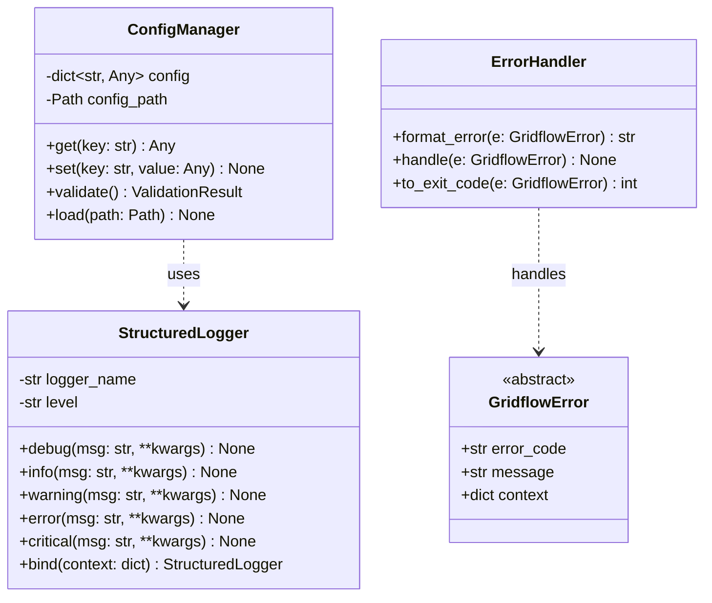
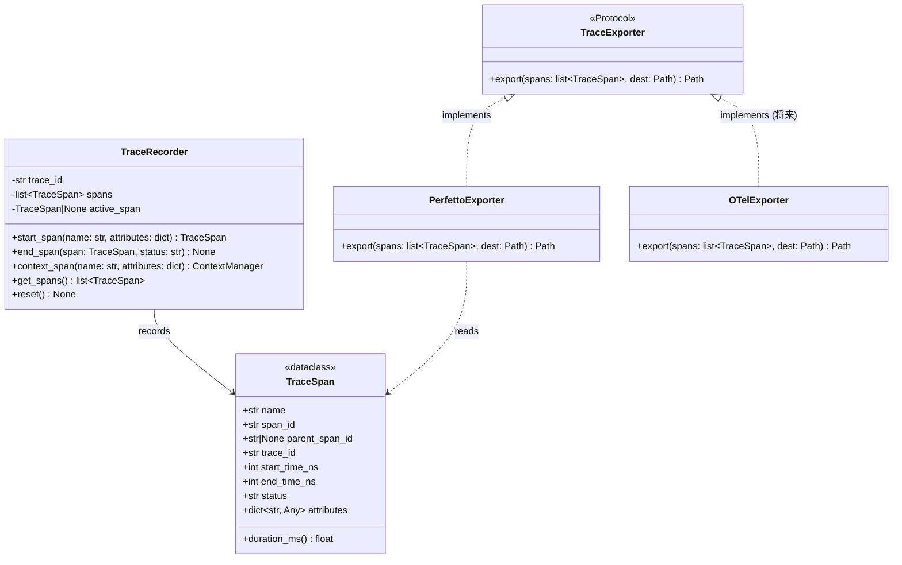

# 3D. インフラ層クラス設計

## 更新履歴

| バージョン | 日付 | 変更内容 | 著者 |
|---|---|---|---|
| 0.1 | 2026-04-03 | 初版作成 | gridflow設計チーム |
| 0.2 | 2026-04-04 | 3.9 追記 | gridflow設計チーム |
| 0.3 | 2026-04-04 | 3.10 トレース関連クラス追加（Perfetto形式） | gridflow設計チーム |
| 0.4 | 2026-04-06 | HealthChecker, MigrationRunner 追加、例外クラス階層統一（DD-REV-101/102） | Claude |
| 0.5 | 2026-04-06 | 第3章分割（03_class_design.md → 03a/03b/03c/03d） | Claude |
| 0.6 | 2026-04-06 | X6レビュー対応: HELICSBroker追加 | Claude |

---

> **ナビゲーション:** [クラス設計 Index](03_class_design.md) | [03a ドメイン層](03a_domain_classes.md) | [03b ユースケース層](03b_usecase_classes.md) | [03c アダプタ層](03c_adapter_classes.md) | **03d インフラ層（本文書）**

---

## 3.9 共通基盤クラス設計（REQ-Q-008, REQ-Q-009）

### 3.9.1 クラス図



### 3.9.2 StructuredLogger

**モジュール:** `gridflow.infra.logging`

structlogを使用した構造化ログ出力。JSON Lines形式で出力し、コンテキスト情報をバインド可能。

| 属性 | 型 | 説明 |
|---|---|---|
| logger_name | str | ロガー名（モジュール名） |
| level | str | ログレベル（DEBUG \| INFO \| WARNING \| ERROR \| CRITICAL） |

#### メソッド

**debug / info / warning / error / critical**

| 項目 | 内容 |
|---|---|
| **Input** | `msg: str` -- ログメッセージ, `**kwargs` -- 追加コンテキスト（key=value形式） |
| **Process** | 対応するログレベルでメッセージを出力する。バインド済みコンテキストとkwargsをマージし、JSON Lines形式で出力する。タイムスタンプはISO 8601形式で自動付与する。 |
| **Output** | `None`。 |

**bind**

| 項目 | 内容 |
|---|---|
| **Input** | `context: dict` -- バインドするコンテキスト情報（例: experiment_id, step等） |
| **Process** | 指定コンテキストをロガーにバインドし、以後の全ログ出力に自動付与する。新しいStructuredLoggerインスタンスを返却する（イミュータブル）。 |
| **Output** | `StructuredLogger` -- コンテキストがバインドされた新しいロガーインスタンス。 |

#### ログ出力例（JSON Lines）

```json
{"timestamp": "2026-04-04T10:00:00Z", "level": "info", "logger": "gridflow.infra.orchestrator", "experiment_id": "exp-001", "step": 5, "msg": "Step completed", "elapsed_ms": 123.4}
```

### 3.9.3 ConfigManager

**モジュール:** `gridflow.infra.config`

YAML設定ファイルの読込・管理を担う。設定値は以下の優先順位で解決する:

1. CLI引数（最優先）
2. 環境変数（`GRIDFLOW_` プレフィックス）
3. プロジェクト設定（`./gridflow.yaml`）
4. ユーザー設定（`~/.config/gridflow/config.yaml`）
5. デフォルト値（最低優先）

| 属性 | 型 | 説明 |
|---|---|---|
| config | dict[str, Any] | 解決済み設定値の辞書 |
| config_path | Path | プロジェクト設定ファイルのパス |

#### メソッド

**get**

| 項目 | 内容 |
|---|---|
| **Input** | `key: str` -- 設定キー（ドット区切り、例: "orchestrator.timeout"） |
| **Process** | 優先順位に従って設定値を解決する。ドット区切りキーはネストされた辞書を再帰的に探索する。 |
| **Output** | `Any` -- 設定値。キーが存在しない場合は `ConfigKeyNotFoundError`（E-40002）を送出。 |

**set**

| 項目 | 内容 |
|---|---|
| **Input** | `key: str` -- 設定キー, `value: Any` -- 設定値 |
| **Process** | 指定キーに値を設定する。ランタイム設定として最優先で適用される。型チェックを実施する。 |
| **Output** | `None`。型不正の場合は `ConfigTypeError`（E-40003）を送出。 |

**validate**

| 項目 | 内容 |
|---|---|
| **Input** | なし |
| **Process** | 全設定値に対してJSONスキーマベースのバリデーションを実施する。必須項目の存在、型、値域をチェックする。 |
| **Output** | `ValidationResult` -- バリデーション結果。 |

**load**

| 項目 | 内容 |
|---|---|
| **Input** | `path: Path` -- 設定ファイルのパス |
| **Process** | 指定パスのYAMLファイルを読み込み、内部設定辞書にマージする。既存設定との優先順位を考慮する。 |
| **Output** | `None`。ファイルが存在しない場合は `ConfigFileNotFoundError`（E-40004）を送出。YAML構文エラー時は `ConfigParseError`（E-40005）を送出。 |

### 3.9.4 ErrorHandler

**モジュール:** `gridflow.infra.error`

GridflowError基底例外を統一的にハンドリングする。

#### メソッド

**format_error**

| 項目 | 内容 |
|---|---|
| **Input** | `e: GridflowError` -- フォーマット対象のエラー |
| **Process** | エラーコード・メッセージ・コンテキスト情報を人間可読な文字列に整形する。--verboseモード時はスタックトレースも含める。 |
| **Output** | `str` -- 整形済みエラー文字列。 |

**handle**

| 項目 | 内容 |
|---|---|
| **Input** | `e: GridflowError` -- ハンドル対象のエラー |
| **Process** | エラーをStructuredLoggerでログ出力し、format_errorで整形した文字列をstderrに出力する。リカバリ可能なエラーは警告として処理し、致命的エラーはプロセス終了を行う。 |
| **Output** | `None`。 |

**to_exit_code**

| 項目 | 内容 |
|---|---|
| **Input** | `e: GridflowError` -- 変換対象のエラー |
| **Process** | エラーコードのレイヤープレフィックスに基づいて終了コードを決定する。E-10xxx→3（設定エラー）、E-20xxx→4（実行エラー）、E-30xxx→4（実行エラー）、E-40xxx→3（設定エラー）。 |
| **Output** | `int` -- 終了コード（1〜4）。 |

### 3.9.5 GridflowError（基底例外）

**モジュール:** `gridflow.domain.error`

全gridflow例外の基底クラス。Domain層に定義する。

| 属性 | 型 | 説明 |
|---|---|---|
| error_code | str | エラーコード（例: "E-10001"） |
| message | str | エラーメッセージ |
| context | dict | エラー発生時のコンテキスト情報 |

#### 例外クラス階層

第8章のエラーコード体系（E-10xxx〜E-40xxx）に準拠する。カテゴリベース例外を親クラス、操作固有例外をサブクラスとする。

```
GridflowError
├── DomainError
│   ├── ScenarioPackError       (E-10001〜E-10004)
│   │   └── PackNotFoundError
│   ├── CDLValidationError      (E-10005〜E-10008)
│   └── MetricCalculationError  (E-10009〜E-10011)
├── UseCaseError
│   ├── SimulationError         (E-20001〜E-20008)
│   │   └── ExecutionError
│   └── BenchmarkError          (E-20005〜E-20007)
│       └── NoComparableMetricsError
├── AdapterError
│   ├── ConnectorError          (E-30001〜E-30003)
│   │   ├── ConnectorInitError
│   │   ├── ConnectorExecuteError
│   │   └── ConnectorTeardownError
│   ├── OpenDSSError            (E-30004〜E-30006)
│   ├── CLIError                (E-30007〜E-30008)
│   │   └── CLIArgumentError
│   ├── PluginError             (E-30009〜E-30012)
│   │   ├── PluginAlreadyRegisteredError
│   │   ├── PluginNotFoundError
│   │   └── PluginLoadError
│   ├── ExportError             (E-30013)
│   └── UnsupportedFormatError  (E-30014)
└── InfraError
    ├── OrchestratorError       (E-40001〜E-40002)
    │   ├── ExperimentNotFoundError
    │   └── ServiceNotFoundError
    ├── ContainerError          (E-40003〜E-40005)
    │   ├── ContainerStartError
    │   └── ContainerStopError
    ├── RegistryError           (E-40006〜E-40007)
    │   └── TemplateNotFoundError
    └── ConfigError             (E-40008〜E-40011)
        ├── ConfigValidationError
        ├── ConfigKeyNotFoundError
        ├── ConfigTypeError
        ├── ConfigFileNotFoundError
        └── ConfigParseError
```

> **命名規則**: 第3章の各メソッド定義（IPO 形式の Output）で使用する例外名はサブクラス名（操作固有名）を使用し、括弧内に親クラスを明記する（例: `PackNotFoundError(RegistryError)`）。詳細は第8章を参照。

### 3.9.6 HealthChecker

**モジュール:** `gridflow.infra.health`

システム全体のヘルスチェックを実行する共通基盤クラス。`gridflow init`、`gridflow debug` 等の複数コマンドから利用される。

**run_health_check**

| 項目 | 内容 |
|---|---|
| **Input** | `timeout_s: int = 30` -- ヘルスチェックのタイムアウト（秒） |
| **Process** | Docker デーモンの稼働確認、各 Connector の health_check() 呼び出し、CDL ストレージのアクセス確認を順次実行する。 |
| **Output** | `HealthCheckResult` -- 全チェック結果。`ok: bool`, `checks: list[HealthCheckItem]`, `message: str` を含む。 |

### 3.9.7 MigrationRunner

**モジュール:** `gridflow.infra.migration`

スキーマバージョンアップ時のマイグレーションを実行する共通基盤クラス。`gridflow update` から呼び出される。

**run_pending**

| 項目 | 内容 |
|---|---|
| **Input** | なし |
| **Process** | 現在のスキーマバージョンと最新バージョンを比較し、未適用のマイグレーションスクリプトを順次実行する。実行前にバックアップを作成し、失敗時はロールバックする。 |
| **Output** | `MigrationResult` -- `applied: list[str]`（適用済みマイグレーション名）, `success: bool`, `rollback: bool` を含む。失敗時は `ExecutionError(SimulationError)` を送出。 |

### 3.9.8 HELICSBroker

**モジュール:** `gridflow.infra.orchestrator`

HELICS（Hierarchical Engine for Large-scale Infrastructure Co-Simulation）Broker の管理クラス。FederationDriven / HybridSync 時間同期戦略（[03b 3.3.6](03b_usecase_classes.md#336-timesyncstrategyprotocol)）で使用される。

#### メソッド

**initialize**

| 項目 | 内容 |
|---|---|
| **Input** | `connectors: list[FederatedConnectorInterface]` -- HELICS 対応コネクタのリスト |
| **Process** | HELICS Broker プロセスを起動し、各コネクタを Federate として登録する。接続確立のタイムアウトは設定値（デフォルト30秒）に従う。 |
| **Output** | `None`。タイムアウト時は `BrokerTimeoutError(OrchestratorError)` を送出。 |

**request_time**

| 項目 | 内容 |
|---|---|
| **Input** | `current_time: float` -- 現在のシミュレーション時刻（秒） |
| **Process** | HELICS Broker に時刻付与を要求し、全 Federate が同期した時点で付与時刻を返却する。 |
| **Output** | `float` -- 付与されたシミュレーション時刻（秒）。同期失敗時は `SyncError(SimulationError)` を送出。 |

**finalize**

| 項目 | 内容 |
|---|---|
| **Input** | なし |
| **Process** | HELICS Broker を終了し、全 Federate を切断する。リソースを解放する。 |
| **Output** | `None`。 |

---

## 3.10 トレース関連クラス設計（REQ-Q-008）

実験実行パイプラインの各ステップの所要時間・状態を記録し、Perfetto（Chrome Trace Format）で出力する。内部データモデルはOpenTelemetry Spanと互換性を持たせ、将来の OTel エクスポータ追加に備える。

### 3.10.1 クラス図



### 3.10.2 TraceSpan

**モジュール:** `gridflow.infra.trace`

`dataclass(frozen=True)` — 記録済みの1スパン。OpenTelemetry Span と 1:1 対応する属性を持つ。

| 属性 | 型 | 説明 | OTel対応フィールド |
|---|---|---|---|
| name | str | スパン名（例: "opendss_init", "step_1"） | `Span.name` |
| span_id | str | スパンの一意識別子（16桁hex） | `Span.span_id` |
| parent_span_id | str \| None | 親スパンID。ルートスパンはNone | `Span.parent_span_id` |
| trace_id | str | トレース全体の一意識別子（32桁hex） | `Span.trace_id` |
| start_time_ns | int | 開始時刻（Unix epoch ナノ秒） | `Span.start_time` |
| end_time_ns | int | 終了時刻（Unix epoch ナノ秒） | `Span.end_time` |
| status | str | "ok" \| "error" \| "unset" | `Span.status.status_code` |
| attributes | dict[str, Any] | 任意のメタデータ | `Span.attributes` |

#### メソッド

**duration_ms**

| 項目 | 内容 |
|---|---|
| **Input** | なし |
| **Process** | `(end_time_ns - start_time_ns) / 1_000_000` を計算する。 |
| **Output** | `float` — 所要時間（ミリ秒）。 |

### 3.10.3 TraceRecorder

**モジュール:** `gridflow.infra.trace`

実験実行中にスパンを記録するレコーダー。Orchestrator が実験開始時にインスタンス化し、各ステップの開始・終了を記録する。

| 属性 | 型 | 説明 |
|---|---|---|
| trace_id | str | 実験全体のトレースID（experiment_idから生成） |
| spans | list[TraceSpan] | 記録済みスパンのリスト |
| active_span | TraceSpan \| None | 現在アクティブなスパン |

#### メソッド

**start_span**

| 項目 | 内容 |
|---|---|
| **Input** | `name: str` — スパン名, `attributes: dict` — メタデータ（任意） |
| **Process** | 新しいTraceSpanを生成し、start_time_nsに現在時刻を記録する。active_spanが存在する場合はそのspan_idをparent_span_idに設定する（自動ネスト）。 |
| **Output** | `TraceSpan` — 開始されたスパン（end_time_nsは未設定）。 |

**end_span**

| 項目 | 内容 |
|---|---|
| **Input** | `span: TraceSpan` — 終了対象スパン, `status: str` — "ok" \| "error" |
| **Process** | end_time_nsに現在時刻を記録し、statusを設定する。完了したスパンをspansリストに追加する。 |
| **Output** | `None`。 |

**context_span**

| 項目 | 内容 |
|---|---|
| **Input** | `name: str` — スパン名, `attributes: dict` — メタデータ（任意） |
| **Process** | コンテキストマネージャとして動作する。`__enter__` で start_span を呼び、`__exit__` で end_span を呼ぶ。例外発生時は status="error" で終了する。 |
| **Output** | `ContextManager[TraceSpan]` — with文で使用。 |

**使用例:**
```python
recorder = TraceRecorder(trace_id="exp-001")
with recorder.context_span("opendss_init", {"connector": "opendss"}):
    connector.initialize(config)
with recorder.context_span("step_1", {"step": 1}):
    result = connector.execute(step=1, context=ctx)
```

### 3.10.4 TraceExporter（Protocol）

**モジュール:** `gridflow.infra.trace`

トレースデータを外部形式にエクスポートする Protocol。

**export**

| 項目 | 内容 |
|---|---|
| **Input** | `spans: list[TraceSpan]` — エクスポート対象, `dest: Path` — 出力先ファイルパス |
| **Process** | スパンリストを対象形式に変換し、ファイルに書き出す。 |
| **Output** | `Path` — 出力されたファイルパス。書き込み失敗時は `ExportError` を送出。 |

### 3.10.5 PerfettoExporter

**モジュール:** `gridflow.infra.trace`

TraceSpan を Chrome Trace Format（Perfetto互換）JSON に変換する。

#### TraceSpan → Chrome Trace Event 変換ルール

| TraceSpan属性 | Chrome Trace Eventフィールド | 変換ルール |
|---|---|---|
| name | `name` | そのまま |
| — | `ph` | `"X"`（Complete Event） |
| start_time_ns | `ts` | `start_time_ns / 1000`（マイクロ秒に変換） |
| end_time_ns - start_time_ns | `dur` | `(end_time_ns - start_time_ns) / 1000` |
| trace_id | `pid` | trace_idのハッシュ値を整数化（プロセスID相当） |
| parent_span_id の有無 | `tid` | ネスト深度に基づきスレッドIDを割当（ルート=1, 子=2, ...） |
| attributes | `args` | そのまま（+ `span_id`, `status` を追加） |

#### 出力JSON例

```json
{
  "traceEvents": [
    {
      "name": "experiment",
      "ph": "X",
      "ts": 1712200000000,
      "dur": 312000000,
      "pid": 1,
      "tid": 1,
      "args": {
        "span_id": "a1b2c3d4e5f60001",
        "status": "ok",
        "experiment_id": "exp-001",
        "pack_id": "ieee13"
      }
    },
    {
      "name": "opendss_init",
      "ph": "X",
      "ts": 1712200001000,
      "dur": 5200000,
      "pid": 1,
      "tid": 2,
      "args": {
        "span_id": "a1b2c3d4e5f60002",
        "parent_span_id": "a1b2c3d4e5f60001",
        "status": "ok",
        "connector": "opendss"
      }
    },
    {
      "name": "step_1_powerflow",
      "ph": "X",
      "ts": 1712200006200,
      "dur": 245000000,
      "pid": 1,
      "tid": 2,
      "args": {
        "span_id": "a1b2c3d4e5f60003",
        "parent_span_id": "a1b2c3d4e5f60001",
        "status": "ok",
        "step": 1,
        "voltage_max_pu": 1.05,
        "converged": true
      }
    },
    {
      "name": "benchmark_eval",
      "ph": "X",
      "ts": 1712200251200,
      "dur": 61000000,
      "pid": 1,
      "tid": 2,
      "args": {
        "span_id": "a1b2c3d4e5f60004",
        "parent_span_id": "a1b2c3d4e5f60001",
        "status": "ok",
        "metrics": ["voltage_deviation", "runtime"]
      }
    }
  ],
  "displayTimeUnit": "ms",
  "metadata": {
    "gridflow_version": "0.1.0",
    "trace_id": "abc123def456",
    "experiment_id": "exp-001",
    "format": "perfetto",
    "otel_compatible": true
  }
}
```

→ **ui.perfetto.dev にドラッグ&ドロップで即座にタイムライン可視化可能**

### 3.10.6 OTelExporter（将来実装）

**モジュール:** `gridflow.infra.trace`（P2以降）

TraceSpan を OTLP JSON 形式に変換する。TraceSpan の属性設計が OpenTelemetry Span と 1:1 対応しているため、変換は直接的である。

| 実装時期 | 条件 |
|---|---|
| P2（HIL連携） | 複数マシン間の分散トレースが必要になった場合 |

変換時に W3C Trace Context ヘッダ（`traceparent`）を生成し、コンテナ間のcontext propagation を実現する。

---

> **関連文書:** ドメインクラス（ScenarioPack, CDL）は → [03a ドメイン層](03a_domain_classes.md) / Orchestrator・Connector・Benchmark は → [03b ユースケース層](03b_usecase_classes.md) / CLI・Plugin は → [03c アダプタ層](03c_adapter_classes.md)
