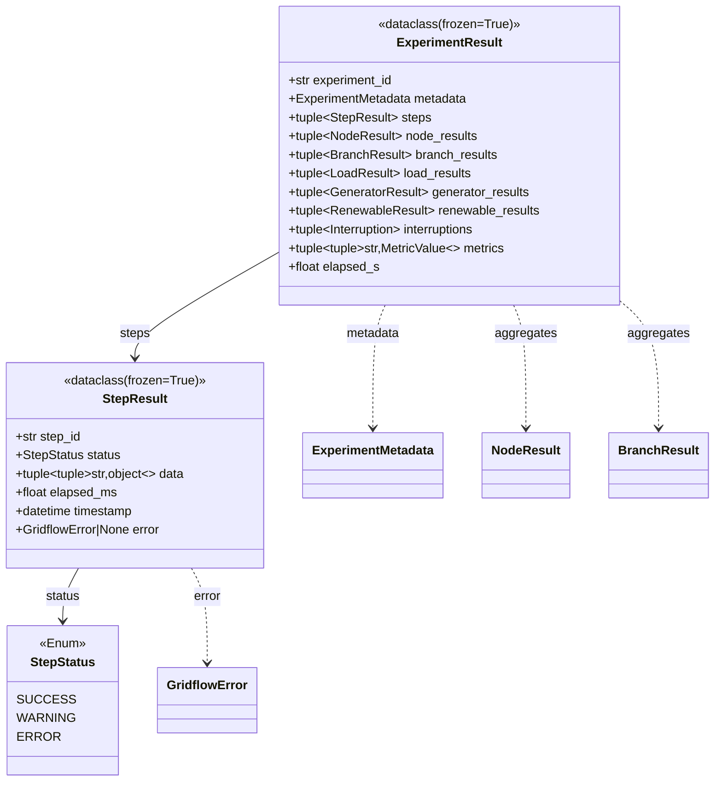

# 3E. UseCase 層 結果型クラス設計

## 更新履歴

| バージョン | 日付 | 変更内容 | 著者 |
|---|---|---|---|
| 0.1 | 2026-04-07 | 初版作成。Phase 0 結果レビューに基づき、StepResult / StepStatus / ExperimentResult を UseCase 層に新設・移設（論点6.4）。詳細経緯は `review_record.md` 参照 | Claude |

---

> **ナビゲーション:** [クラス設計 Index](03_class_design.md) | [03a ドメイン層](03a_domain_classes.md) | [03b ユースケース層](03b_usecase_classes.md) | [03c アダプタ層](03c_adapter_classes.md) | [03d インフラ層](03d_infra_classes.md) | **03e UseCase結果型（本文書）**

> **本ファイルの責務:** UseCase 層の **結果型** クラスを収録する。具体的には、シミュレーション実行（Orchestrator.run / ConnectorInterface.execute）の戻り値、および BenchmarkHarness / MetricCalculator の入力となるデータクラス。
>
> 03b（UseCase 振る舞い）と分離した理由は、(1) 結果型に独立した設計議論があり章として独立させた方が見通しが良い、(2) `StepResult` の属性拡張により記述量が増えた、ため。

---

## 3.11 設計方針

- すべての結果型は `@dataclass(frozen=True)` とし、不変・ハッシュ可能とする
- 任意キー/値を持つデータ（`StepResult.data` 等）は `tuple[tuple[str, object], ...]` で表現する（03a 3.4.1 v0.7 補足準拠、論点6.1）
- 状態を表す属性は `enum.Enum` で型安全を確保する
- 配下に Domain 層の Result 型（NodeResult / BranchResult / LoadResult / GeneratorResult / RenewableResult / Interruption）を集約する。Domain → UseCase の依存方向違反を避けるため、これらの Domain 型は UseCase 型から参照される片方向依存となる

---

## 3.11.1 クラス図



---

## 3.11.2 StepStatus（Enum）

**モジュール:** `gridflow.usecase.result`

シミュレーション 1 ステップの実行結果ステータスを表す列挙型。

```python
from enum import Enum

class StepStatus(Enum):
    SUCCESS = "success"
    WARNING = "warning"
    ERROR = "error"
```

| 値 | 意味 |
|---|---|
| SUCCESS | ステップが正常完了 |
| WARNING | 警告あり（閾値超過等）だが処理は継続可能 |
| ERROR | エラーで処理失敗 |

> **設計判断:** v0.7 以前は 8.0.5 / 03b 3.5.5 で `status: str` だったが、型安全性・IDE 補完・誤値防止のため Enum に変更（論点6.4 (b) = B3）。JSON シリアライズ時は `.value` で文字列に変換する。

---

## 3.11.3 StepResult

**モジュール:** `gridflow.usecase.result`

`ConnectorInterface.execute()` の戻り値、および ExperimentResult.steps の要素。1 ステップの実行結果を表す。

| 属性 | 型 | 説明 |
|---|---|---|
| step_id | str | ステップの一意識別子（例: 実験ID + ステップ番号） |
| status | StepStatus | 実行結果ステータス（3.11.2 参照） |
| data | tuple[tuple[str, object], ...] | CDL 準拠の出力データ（不変。利用時は `dict(self.data)` で復元） |
| elapsed_ms | float | 実行時間（ミリ秒） |
| timestamp | datetime | ステップ実行完了時刻 |
| error | GridflowError \| None | エラー時の例外オブジェクト。SUCCESS/WARNING 時は None |

**設計判断（v0.7 確定 — 論点6.4）:**
- 配置: UseCase 層 (a=A2)。Domain → UseCase 依存違反を避けるため、ExperimentResult ごと UseCase へ移した
- 属性: 8.0.5 の最小3属性に加え step_id / timestamp / error を追加（e=E2）。エラー伝搬経路を明確化し、ログ・デバッグの実用性を確保
- frozen: 必須（d=D1）。実行途中で逐次組み立てる場合は内部 Builder を使用し、完成時に StepResult を生成する
- data: dict を使わず tuple-of-tuples（c=C4 → 論点6.1 で B 採択）

#### メソッド

**to_dict**

| 項目 | 内容 |
|---|---|
| **Input** | なし |
| **Process** | 全属性を辞書化する。`status` は `.value` の文字列に、`timestamp` は ISO 8601 文字列に、`data` は `dict(self.data)` に、`error` は `error.to_dict()`（存在する場合）に変換する。 |
| **Output** | `dict[str, object]` -- ログ出力や JSON シリアライズ用辞書 |

**is_success**

| 項目 | 内容 |
|---|---|
| **Input** | なし |
| **Process** | `status == StepStatus.SUCCESS` を判定する |
| **Output** | `bool` |

---

## 3.11.4 ExperimentResult

**モジュール:** `gridflow.usecase.result`

`Orchestrator.run()` の戻り値であり、`BenchmarkHarness` / `MetricCalculator` の入力型。第7章の `SimulationResults` に相当する。v0.7 で `gridflow.domain.result` から `gridflow.usecase.result` へ移設した（論点6.4）。

| 属性 | 型 | 説明 |
|---|---|---|
| experiment_id | str | 実験の一意識別子 |
| metadata | ExperimentMetadata | 実験メタデータ（[03a 3.4.10](03a_domain_classes.md) 参照） |
| steps | tuple[StepResult, ...] | 各ステップの実行結果 |
| node_results | tuple[NodeResult, ...] | ノード別結果（[03a 3.4.14](03a_domain_classes.md) 参照） |
| branch_results | tuple[BranchResult, ...] | ブランチ別結果（[03a 3.4.15](03a_domain_classes.md)） |
| load_results | tuple[LoadResult, ...] | 負荷別結果（[03a 3.4.16](03a_domain_classes.md)） |
| generator_results | tuple[GeneratorResult, ...] | 発電機別結果（[03a 3.4.17](03a_domain_classes.md)） |
| renewable_results | tuple[RenewableResult, ...] | 再エネ別結果（[03a 3.4.18](03a_domain_classes.md)） |
| interruptions | tuple[Interruption, ...] | 停電イベント（[03a 3.4.19](03a_domain_classes.md), IEEE 1366 用） |
| metrics | tuple[tuple[str, MetricValue], ...] | 算出済み指標のマッピング（不変、利用時は `dict(self.metrics)`） |
| elapsed_s | float | 総実行時間（秒） |

**設計判断:**
- list → tuple に変更し全属性を不変化（frozen 原則徹底）
- `metrics: dict[str, MetricValue]` を `tuple[tuple[str, MetricValue], ...]` に変更（論点6.1 と一貫）
- 配下の Domain Result 型（NodeResult 等）は Domain 層に残置。UseCase 層が Domain 型を集約する片方向依存

#### メソッド

**get_metric**

| 項目 | 内容 |
|---|---|
| **Input** | `name: str` -- 指標名 |
| **Process** | metrics タプルを線形探索し、name に一致する MetricValue を返す |
| **Output** | `MetricValue`。未発見時は `MetricNotFoundError` を送出 |

**to_dict**

| 項目 | 内容 |
|---|---|
| **Input** | なし |
| **Process** | 全属性を再帰的に辞書化する |
| **Output** | `dict[str, object]` |

---

## 3.11.5 関連エラー

| エラークラス | 階層 | 送出場面 |
|---|---|---|
| `MetricNotFoundError` | DomainError 配下 | `ExperimentResult.get_metric()` で指定 name が見つからない場合 |
| `GridflowError` | 基底 | `StepResult.error` 属性が保持する例外オブジェクトの基底型 |

詳細は [08_error_design.md](08_error_design.md) 参照。

---

> **関連文書:** Domain 層のシミュレーション結果型 (NodeResult / BranchResult / LoadResult / GeneratorResult / RenewableResult / Interruption) は → [03a §3.4.14〜3.4.19](03a_domain_classes.md) / Orchestrator (UseCase 層ビジネスロジック) は → [03b §3.3](03b_usecase_classes.md) / Orchestrator の Infra 実装 (ContainerOrchestratorRunner / ContainerManager / FederationDriven) は → [03d §3.8](03d_infra_classes.md) / Connector の HealthStatus は → [03b §3.5.5](03b_usecase_classes.md)
