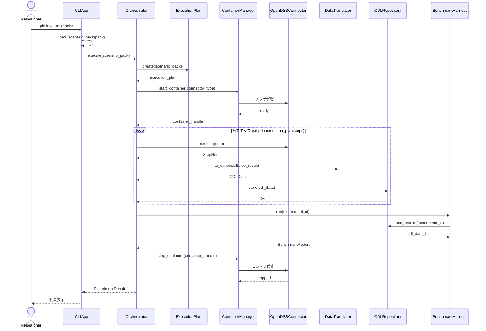
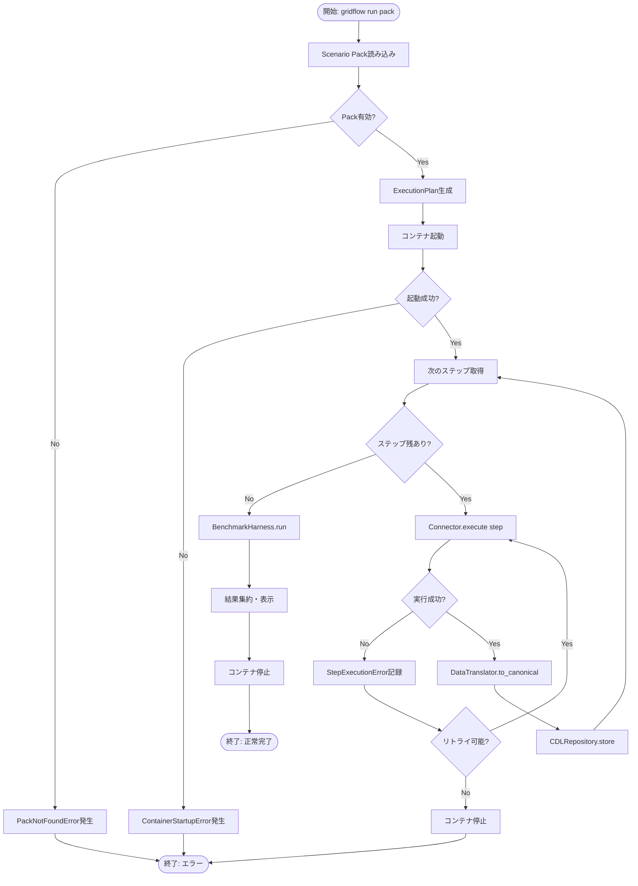
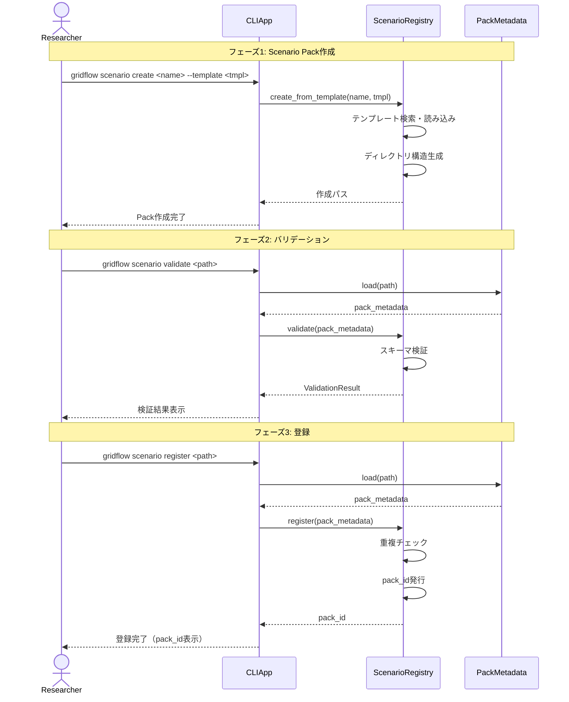
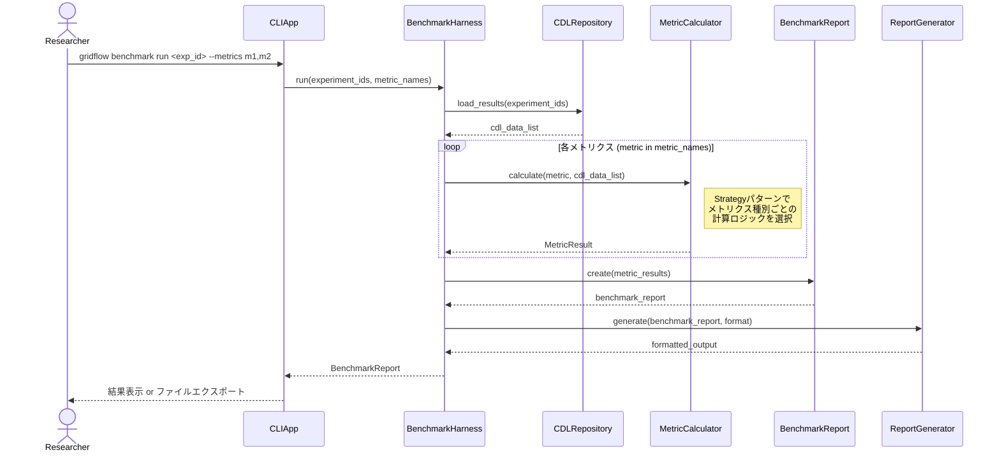
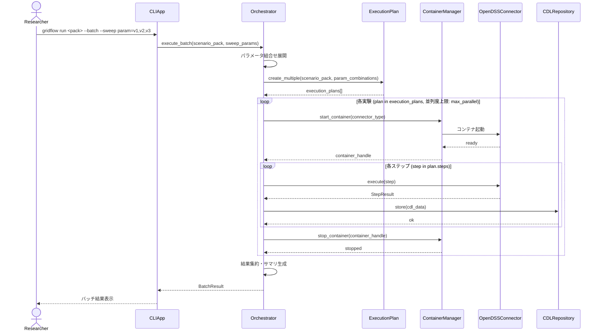
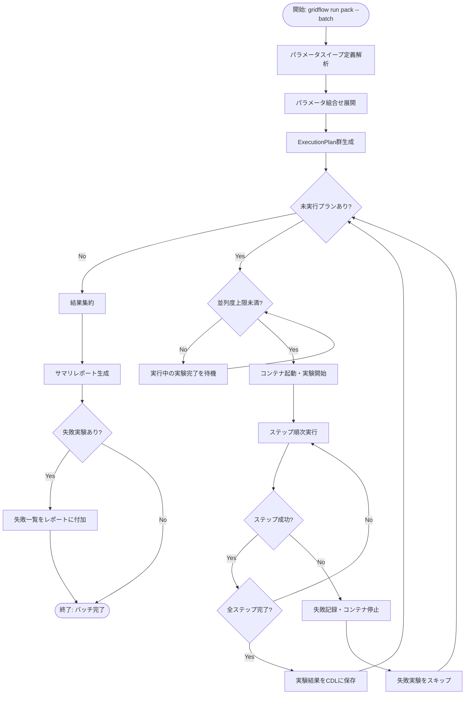

# 第4章 処理フロー設計（シーケンス図・アクティビティ図）

## 更新履歴

| 版数 | 日付 | 変更内容 |
|---|---|---|
| 0.1 | 2026-04-03 | 初版作成（4.1〜4.5） |

---

## 4.1 処理フロー一覧

**関連要件**: REQ-001〜REQ-010

| フローID | 対応UC | フロー名 | 図の種類 |
|---|---|---|---|
| DD-SEQ-001 | UC-01 | シナリオ実行 | シーケンス図+アクティビティ図 |
| DD-SEQ-002 | UC-02 | Scenario Pack作成・登録 | シーケンス図 |
| DD-SEQ-003 | UC-03 | ベンチマーク実行 | シーケンス図 |
| DD-SEQ-004 | UC-04 | バッチ実行 | シーケンス図+アクティビティ図+バッチ処理設計 |
| DD-SEQ-005 | UC-05 | 結果エクスポート | シーケンス図 |
| DD-SEQ-006 | UC-06 | コネクタ管理 | シーケンス図 |
| DD-SEQ-007 | UC-07 | メトリクス定義管理 | シーケンス図 |
| DD-SEQ-008 | UC-08 | 実験比較 | シーケンス図 |
| DD-SEQ-009 | UC-09 | 設定管理 | シーケンス図 |
| DD-SEQ-010 | UC-10 | ログ・監視 | シーケンス図 |
| DD-SEQ-012 | — | エラーハンドリング共通フロー | アクティビティ図 |
| DD-SEQ-013 | — | コンテナライフサイクル管理 | シーケンス図+状態遷移図 |
| DD-SEQ-014 | — | CDLデータ変換パイプライン | アクティビティ図 |
| DD-SEQ-015 | — | プラグイン読み込みフロー | シーケンス図 |

---

## 4.2 シナリオ実行フロー（UC-01）

**関連要件**: REQ-001

### 登場オブジェクト

- **Researcher** — 研究者（アクター）
- **CLIApp** — CLIエントリポイント
- **Orchestrator** — 実行オーケストレータ
- **ExecutionPlan** — 実行計画
- **ContainerManager** — コネクタコンテナ管理
- **OpenDSSConnector** — OpenDSS用コネクタ
- **DataTranslator** — CDL変換
- **CDLRepository** — CDLデータ永続化
- **BenchmarkHarness** — ベンチマーク評価

### IPO

| 項目 | 内容 |
|---|---|
| **Input** | `gridflow run <pack>` コマンド引数（pack: `str` — Scenario Packパスまたはpack_id） |
| **Process** | Pack読み込み → ExecutionPlan生成 → コンテナ起動 → ステップ順次実行 → CDL変換・保存 → ベンチマーク評価 |
| **Output** | `ExperimentResult`（実験結果オブジェクト） / 例外: `PackNotFoundError`, `ContainerStartupError`, `StepExecutionError` |

### シーケンス図

### アクティビティ図（ステップループの分岐・エラー時フロー）

---

## 4.3 Scenario Pack 作成・登録フロー（UC-02）

**関連要件**: REQ-002

### 登場オブジェクト

- **Researcher** — 研究者（アクター）
- **CLIApp** — CLIエントリポイント
- **ScenarioRegistry** — シナリオ管理レジストリ
- **PackMetadata** — Packメタデータ

### IPO

| 項目 | 内容 |
|---|---|
| **Input** | `gridflow scenario create <name> --template <tmpl>` / `gridflow scenario validate <path>` / `gridflow scenario register <path>` （name: `str`, tmpl: `str`, path: `Path`） |
| **Process** | テンプレートからディレクトリ生成 → スキーマ検証 → Registry登録 → pack_id発行 |
| **Output** | `pack_id: str`（登録時） / `ValidationResult`（検証時） / 例外: `TemplateNotFoundError`, `SchemaValidationError`, `RegistrationError` |

### シーケンス図

---

## 4.4 ベンチマーク実行フロー（UC-03）

**関連要件**: REQ-003

### 登場オブジェクト

- **Researcher** — 研究者（アクター）
- **CLIApp** — CLIエントリポイント
- **BenchmarkHarness** — ベンチマーク実行管理
- **CDLRepository** — CDLデータ永続化
- **MetricCalculator** — メトリクス計算（Strategyパターン）
- **BenchmarkReport** — ベンチマーク結果レポート
- **ReportGenerator** — レポート出力

### IPO

| 項目 | 内容 |
|---|---|
| **Input** | `gridflow benchmark run <exp_id> [--metrics voltage_deviation,thermal_overload]`（exp_id: `str`, metrics: `list[str]`（省略時は全メトリクス）） |
| **Process** | CDLから実験結果取得 → Strategyパターンでメトリクス計算 → レポート生成 → 出力 |
| **Output** | `BenchmarkReport` / ファイルエクスポート（CSV, JSON等） / 例外: `ExperimentNotFoundError`, `MetricCalculationError` |

### シーケンス図

---

## 4.5 バッチ実行フロー（UC-04）

**関連要件**: REQ-004

### 登場オブジェクト

- **Researcher** — 研究者（アクター）
- **CLIApp** — CLIエントリポイント
- **Orchestrator** — 実行オーケストレータ
- **ExecutionPlan** — 実行計画（複数生成）
- **ContainerManager** — コネクタコンテナ管理（並列度制御）
- **OpenDSSConnector** — OpenDSS用コネクタ（複数インスタンス）
- **CDLRepository** — CDLデータ永続化

### IPO

| 項目 | 内容 |
|---|---|
| **Input** | `gridflow run <pack> --batch --sweep param=v1,v2,v3`（pack: `str`, sweep: `dict[str, list[Any]]`） |
| **Process** | パラメータ組合せ展開 → ExecutionPlan群生成 → 並列度制御付きコンテナ起動 → 並列ステップ実行 → 結果集約 |
| **Output** | `BatchResult`（全実験結果 + サマリ） / 例外: `ParameterExpansionError`, `BatchExecutionError` |

### シーケンス図

### アクティビティ図（並列実行・分岐・エラー時フロー）

### バッチ処理設計表

| 項目 | 内容 |
|---|---|
| 入力データ | Scenario Pack + パラメータスイープ定義 |
| 加工処理 | パラメータ展開 → 実験計画生成 → 並列実行 → 結果収集 |
| 出力データ | 実験結果群（CDL形式）+ サマリレポート |
| スケジュール | 即時実行（CLIトリガー） |
| 異常時処理 | 失敗実験をスキップし残りを継続、失敗一覧をレポート |
