# 第4章 処理フロー設計（シーケンス図・アクティビティ図）
## 更新履歴
| 版数 | 日付 | 変更内容 |
|---|---|---|
| 0.1 | 2026-04-03 | 初版作成（4.6〜4.15） |
| 0.2 | 2026-04-04 | 4.6.2 gridflow trace 詳細化（Perfetto形式、CLI出力仕様） |

---

## 4.6 ログ・実行トレースフロー

**関連要件**: REQ-Q-008

### 概要

`gridflow logs` / `gridflow trace` / `gridflow metrics` の各サブコマンドによるログ参照・実行トレース・KPI メトリクス取得の処理フローを定義する。

### 4.6.1 gridflow logs

| 項目 | 内容 |
|---|---|
| **Input** | `--level` (str, optional, default="INFO"), `--follow` (bool, optional, default=False) |
| **Process** | StructuredLogger からログファイルを読み込み、レベルでフィルタリング。`--follow` 時は tail -f 相当のストリーミング出力 |
| **Output** | フィルタ済みログ行の CLI 出力（stdout）。ログファイル不在時は `GridFlowFileNotFoundError` |

### 4.6.2 gridflow trace

| 項目 | 内容 |
|---|---|
| **Input** | `exp_id` (str, required), `--format` (str, "table"\|"json"\|"perfetto", default="table"), `--step` (str, optional), `--depth` (int, default=3), `--output` / `-o` (Path, optional) |
| **Process** | CDLRepository から該当実験 ID のトレースファイル（Perfetto JSON）を読み込み、TraceSpan リストに変換する。`--step` 指定時は該当スパンとその子スパンのみフィルタする。`--format` に応じて出力形式を切り替える。 |
| **Output** | `table`: CLI テーブル表示（stdout）。`json`: TraceSpan 配列の JSON（stdout）。`perfetto`: Chrome Trace Format JSON ファイル出力（`-o` 指定先、未指定時は `{exp_id}.trace.json`）。該当 ID 不在時は `ExperimentNotFoundError` |

#### トレース記録フロー（Orchestrator → TraceRecorder）

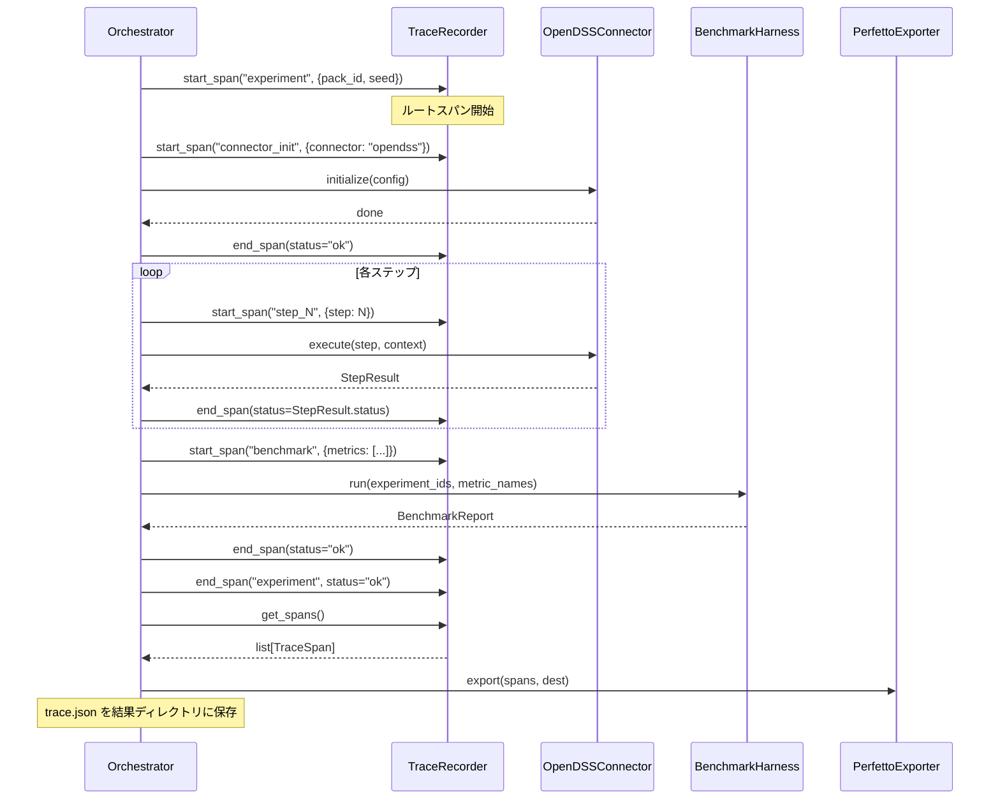

#### CLI 出力形式

**テーブル形式**（`gridflow trace exp-001`、デフォルト）:

```
TRACE: exp-001 (total: 312.0s)
━━━━━━━━━━━━━━━━━━━━━━━━━━━━━━━━━━━━━━━━━━━━━━━━
STEP                 DURATION   STATUS   SHARE
────────────────────────────────────────────────
experiment           312.0s     ok       100.0%
├─ opendss_init        5.2s     ok         1.7%
├─ step_1            245.0s     ok        78.5%  ◀ BOTTLENECK
├─ step_2              0.8s     ok         0.3%
└─ benchmark          61.0s     ok        19.6%
━━━━━━━━━━━━━━━━━━━━━━━━━━━━━━━━━━━━━━━━━━━━━━━━
BOTTLENECK: step_1 (78.5% of total)
```

ボトルネック判定: 全体の50%以上を占めるスパンに `◀ BOTTLENECK` マークを付与。

**JSON形式**（`gridflow trace exp-001 --format json`）:

```json
{
  "trace_id": "abc123def456",
  "experiment_id": "exp-001",
  "total_duration_ms": 312000,
  "spans": [
    {
      "name": "experiment",
      "span_id": "a1b2c3d4e5f60001",
      "parent_span_id": null,
      "start_time_ns": 1712200000000000,
      "end_time_ns": 1712200312000000000,
      "duration_ms": 312000,
      "status": "ok",
      "attributes": {"pack_id": "ieee13", "seed": 42}
    }
  ],
  "bottleneck": {"name": "step_1", "share_pct": 78.5}
}
```

**Perfetto形式**（`gridflow trace exp-001 --format perfetto -o trace.json`）:

Chrome Trace Format JSON を出力。ui.perfetto.dev で可視化可能。フォーマット詳細は第3章 3.10.5 PerfettoExporter を参照。

### 4.6.3 gridflow metrics

| 項目 | 内容 |
|---|---|
| **Input** | なし（オプションで `--format json` 指定可） |
| **Process** | KPI メトリクスを集計し、テーブルまたは JSON 形式で出力 |
| **Output** | テーブル表示 or JSON（stdout） |

### シーケンス図

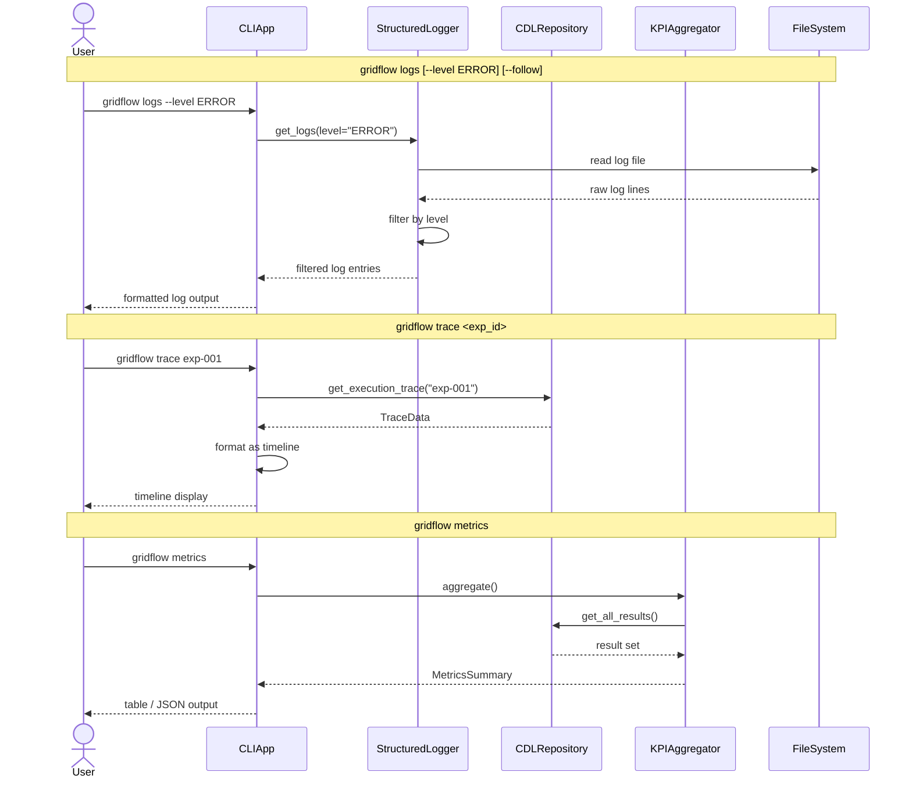

---

## 4.7 デバッグ・エラー対応フロー

**関連要件**: REQ-F-005

### 概要

`gridflow debug` コマンドにより、Docker 状態確認・Connector ヘルスチェック・設定検証を一括で実施し、診断レポートを出力する。

### IPO

| 項目 | 内容 |
|---|---|
| **Input** | なし（オプションで `--verbose` 指定可） |
| **Process** | 1. Docker デーモン状態確認 → 2. 各 Connector のヘルスチェック → 3. 設定ファイル（config.yaml）の検証 → 4. 結果を診断レポートに集約 |
| **Output** | 診断レポート（stdout）。各項目の PASS/FAIL ステータスを含む。Docker 未起動時は `DockerNotRunningError` |

### シーケンス図

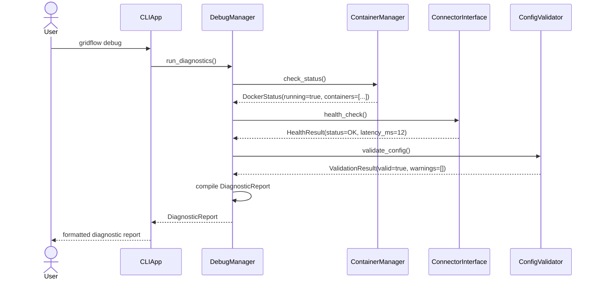

---

## 4.8 インストール・セットアップフロー

**関連要件**: REQ-Q-001, REQ-Q-001（セットアップ 30 分以内）

### 概要

`pip install gridflow` に続き `gridflow init` で設定ファイル生成・Docker イメージ取得・ヘルスチェックまでを一括で行う。目標完了時間は 30 分以内。

### IPO

| 項目 | 内容 |
|---|---|
| **Input** | なし（`gridflow init` はインタラクティブにプロジェクト名等を問い合わせる） |
| **Process** | 1. `pip install gridflow` → 2. `gridflow init` → 設定ファイル生成（`~/.gridflow/config.yaml`） → 3. `docker compose pull` → 4. ヘルスチェック → 5. 完了メッセージ |
| **Output** | セットアップ完了メッセージ（stdout）。Docker 未インストール時は `DockerNotInstalledError` |

### シーケンス図

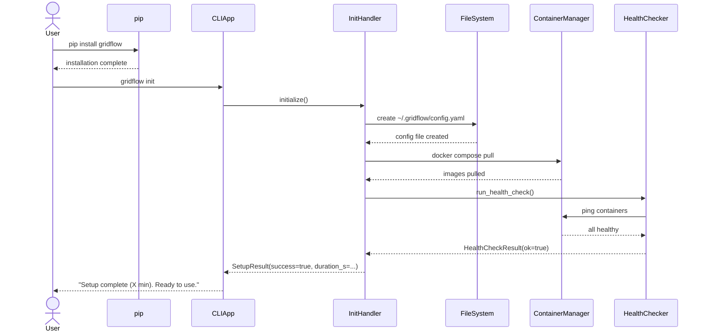

---

## 4.9 アップデート・アンインストールフロー

**関連要件**: REQ-Q-001

### 概要

`gridflow update` コマンドにより、CLI 本体・Docker イメージの更新およびマイグレーションを実行する。

### IPO

| 項目 | 内容 |
|---|---|
| **Input** | なし（オプションで `--check` で更新有無のみ確認） |
| **Process** | 1. 最新バージョン確認（PyPI） → 2. `pip install --upgrade gridflow` → 3. Docker イメージ更新 → 4. マイグレーション実行 → 5. 完了 |
| **Output** | 更新結果メッセージ（stdout）。ネットワーク不通時は `NetworkError` |

### シーケンス図

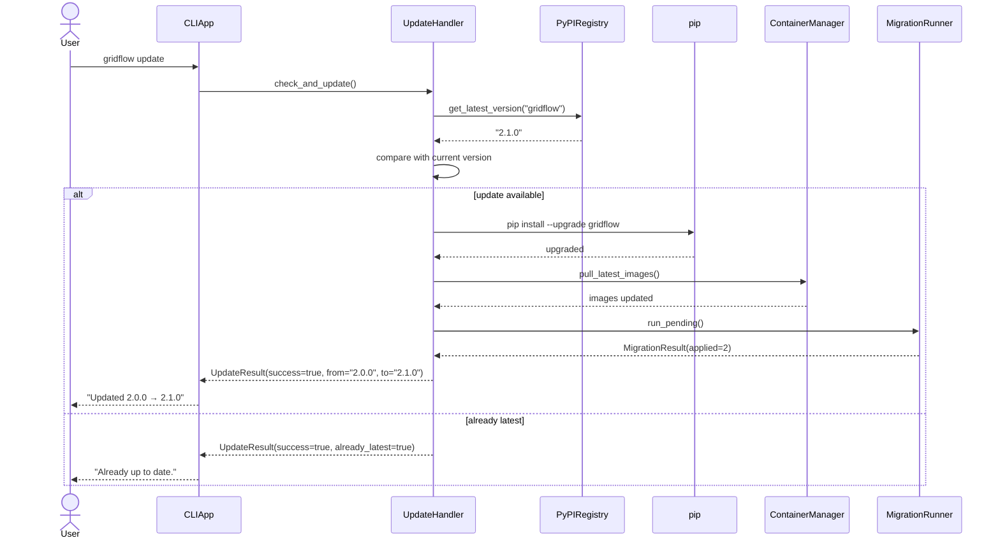

---

## 4.10 結果参照・データエクスポートフロー

**関連要件**: REQ-F-003, REQ-Q-006

### 概要

`gridflow results show` で実験結果をテーブル表示し、`gridflow results export` でファイルとして書き出す。

### 4.10.1 gridflow results show

| 項目 | 内容 |
|---|---|
| **Input** | `exp_id` (str, required) |
| **Process** | CDLRepository.get_result(exp_id) → テーブル形式に整形 |
| **Output** | 結果テーブル（stdout）。該当 ID 不在時は `ExperimentNotFoundError` |

### 4.10.2 gridflow results export

| 項目 | 内容 |
|---|---|
| **Input** | `exp_id` (str, required), `--format` (str, default="csv", choices=["csv","parquet","json"]), `-o` (str, default="./") |
| **Process** | CDLRepository.export(exp_id, format, output_dir) → 指定形式でファイル書き出し |
| **Output** | 出力ファイルパス（stdout）。書き込み権限不足時は `PermissionError` |

### シーケンス図

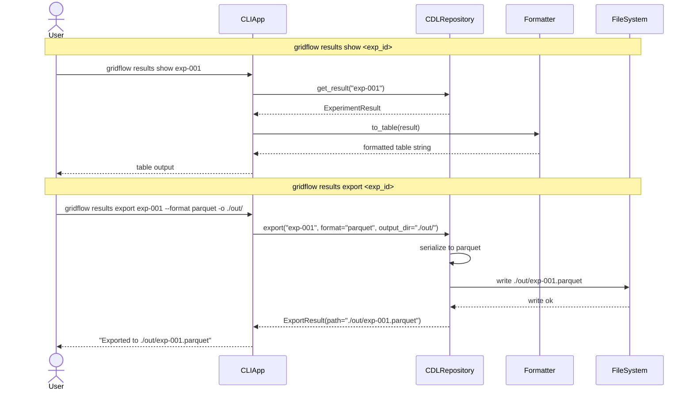

---

## 4.11 LLM による実験指示フロー

**関連要件**: REQ-Q-009

### 概要

LLM が構造化 JSON/YAML コマンドを発行し、CLIApp がそれを解析して通常のコマンドフローに委譲する。

### IPO

| 項目 | 内容 |
|---|---|
| **Input** | 構造化 JSON（例: `{"command": "run", "pack": "microgrid-01", "options": {"seed": 42}}`） |
| **Process** | 1. JSON/YAML パース → 2. コマンド・引数のバリデーション → 3. 該当する UseCase ハンドラに委譲 → 4. 結果を構造化 JSON で返却 |
| **Output** | 構造化 JSON（例: `{"status": "success", "experiment_id": "exp-001", "metrics": {...}}`）。不正コマンド時は `{"status": "error", "message": "..."}` |

### シーケンス図

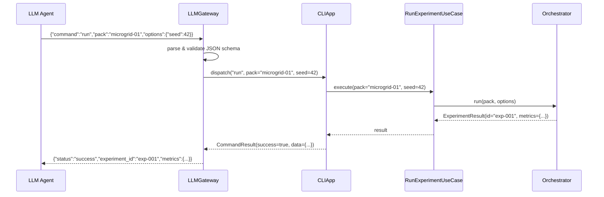

---

## 4.12 Connector 初期化・実行フロー

**関連要件**: REQ-Q-008, REQ-Q-009

### 概要

Connector の起動からステップ実行ループ、終了までのライフサイクルを定義する。

### IPO

| 項目 | 内容 |
|---|---|
| **Input** | `config` (ConnectorConfig): 接続先・認証情報・タイムアウト設定 |
| **Process** | 1. ContainerManager.start() → 2. ConnectorInterface.initialize(config) → 3. ヘルスチェック待ち → 4. ステップループ（execute(step, context) → StepResult）→ 5. teardown() |
| **Output** | 各ステップの `StepResult`（成功/失敗・出力データ）。タイムアウト時は `ConnectorTimeoutError` |

### シーケンス図

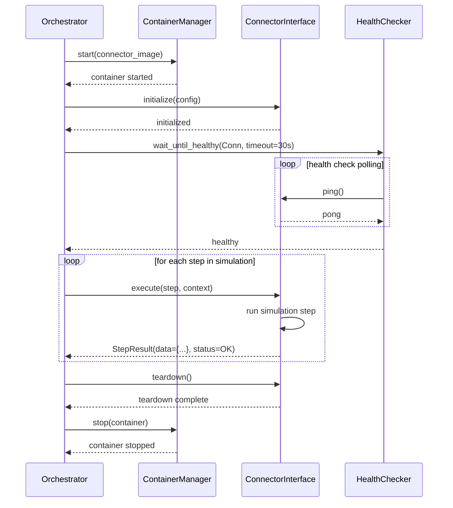

---

## 4.13 CDL 変換フロー

**関連要件**: REQ-F-003, REQ-Q-006, REQ-Q-009

### 概要

外部ツール出力を Canonical Data Layer (CDL) に変換して格納するフロー、および CDL からツールネイティブ形式に逆変換するフローを定義する。

### 4.13.1 外部ツール出力 → CDL 格納

| 項目 | 内容 |
|---|---|
| **Input** | `raw` (dict): 外部ツールの生出力 |
| **Process** | DataTranslator.to_canonical(raw) → CanonicalData 生成 → CDLRepository.store() |
| **Output** | 格納された CanonicalData の ID。スキーマ不一致時は `DataTranslationError` |

### 4.13.2 CDL → ツールネイティブ形式

| 項目 | 内容 |
|---|---|
| **Input** | `data_id` (str): CDL 上のデータ ID, `target_format` (str): 変換先形式 |
| **Process** | CDLRepository.get(data_id) → CanonicalData → DataTranslator.from_canonical(data, target_format) |
| **Output** | ツールネイティブ形式のデータ（dict）。未対応形式時は `UnsupportedFormatError` |

### シーケンス図

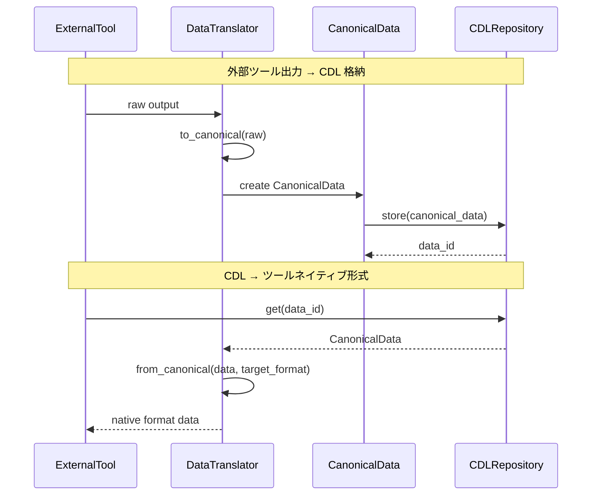

---

## 4.14 Plugin ロード・実行フロー

**関連要件**: REQ-Q-009

### 概要

起動時に Plugin を自動検出・登録し、実行時に名前指定で取得・実行するフローを定義する。

### 4.14.1 起動時: Plugin ディスカバリ・登録

| 項目 | 内容 |
|---|---|
| **Input** | `plugin_dir` (Path): プラグインディレクトリパス |
| **Process** | PluginDiscovery.discover(plugin_dir) → PluginInfo 一覧 → PluginRegistry.register() → 各 Plugin.initialize() |
| **Output** | 登録された Plugin 数。不正プラグイン検出時は `PluginLoadError`（スキップして続行） |

### 4.14.2 実行時: Plugin 取得・実行

| 項目 | 内容 |
|---|---|
| **Input** | `name` (str): プラグイン名, `params` (dict): 実行パラメータ |
| **Process** | PluginRegistry.get(name) → Plugin.execute(params) |
| **Output** | Plugin 実行結果（PluginResult）。未登録名指定時は `PluginNotFoundError` |

### シーケンス図

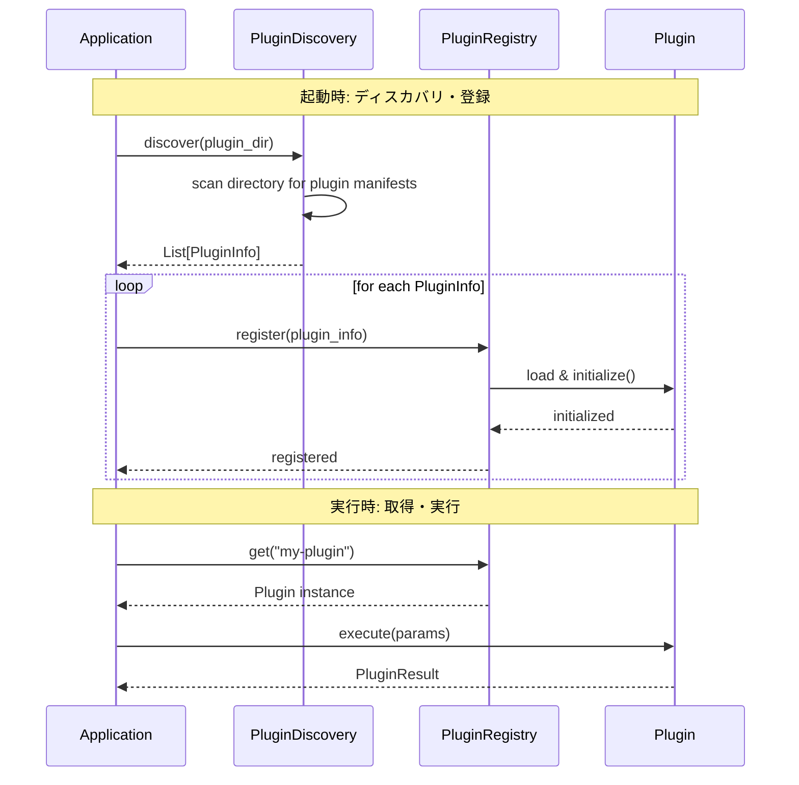

---

## 4.15 エラーハンドリングフロー

**関連要件**: REQ-F-005

### 概要

Domain 層で発生した例外が UseCase 層・Adapter 層を経て CLI 出力に至るまでの伝播フローを定義する。各層で文脈情報の付加・ユーザー向けメッセージへの変換を行う。

### 例外伝播の IPO（各層）

| 層 | Input | Process | Output |
|---|---|---|---|
| **Domain** | ビジネスルール違反等 | ドメイン固有例外を raise | `DomainException`（例: `InvalidPackError`, `SimulationError`） |
| **UseCase** | `DomainException` | 実行文脈情報（experiment_id 等）を付加 | `UseCaseException`（cause に元例外を保持） |
| **Adapter** | `UseCaseException` | ユーザー向けメッセージに変換、exit code を決定 | CLI 出力（stderr） + exit code |

### フローチャート

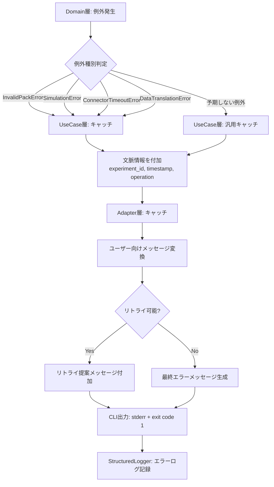

### Exit Code 一覧

| Exit Code | 意味 | 対応例外 |
|---|---|---|
| 0 | 正常終了 | — |
| 1 | 一般エラー | `UseCaseException` |
| 2 | 入力バリデーションエラー | `ValidationError` |
| 3 | Connector エラー | `ConnectorTimeoutError`, `ConnectorError` |
| 4 | データ変換エラー | `DataTranslationError` |
| 10 | Docker 未起動 | `DockerNotRunningError` |
| 127 | 不明なコマンド | — |
