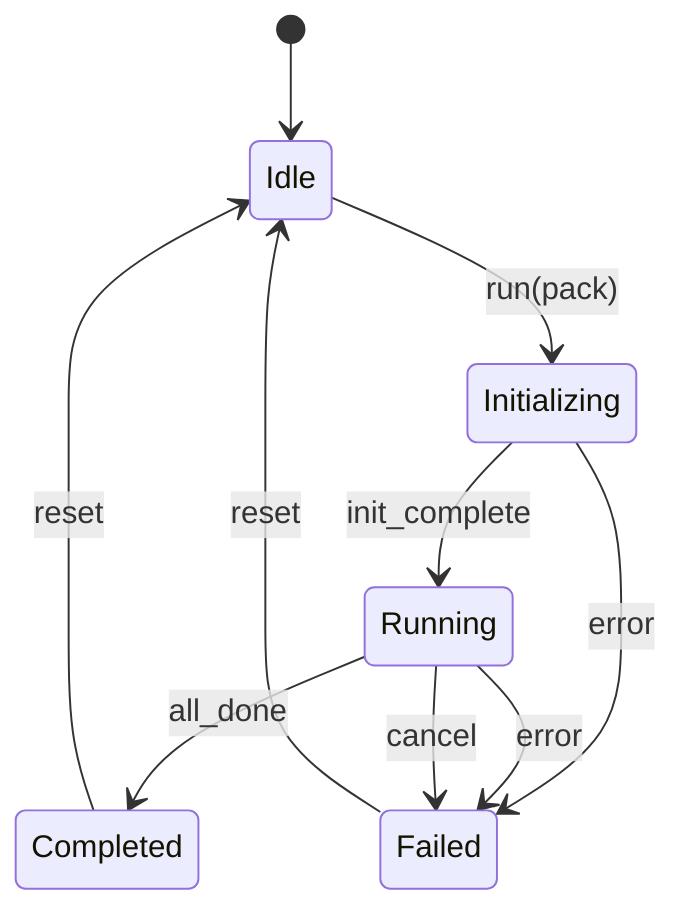
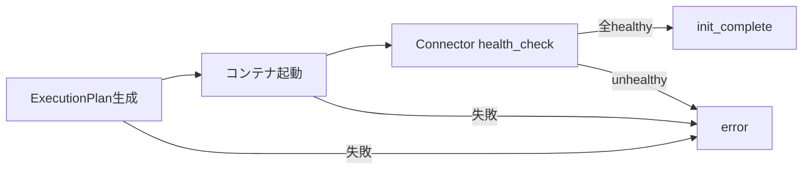
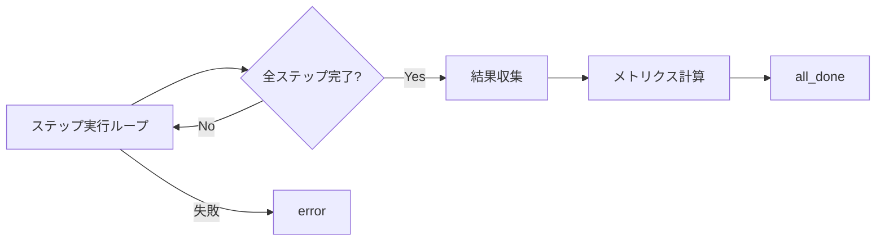
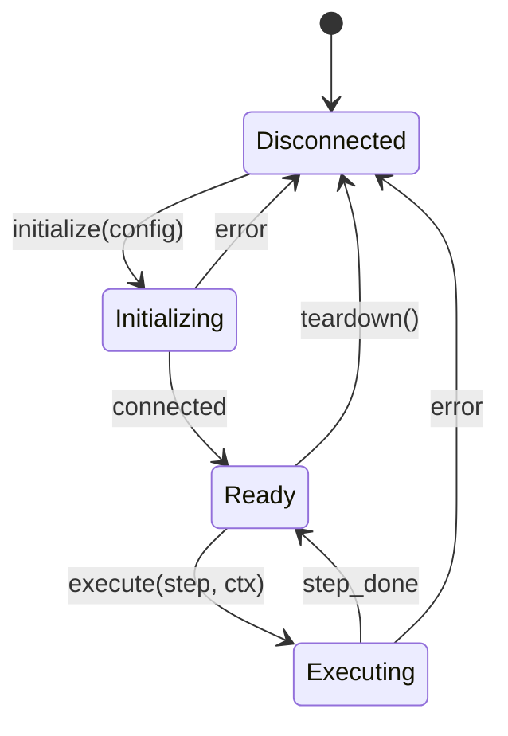
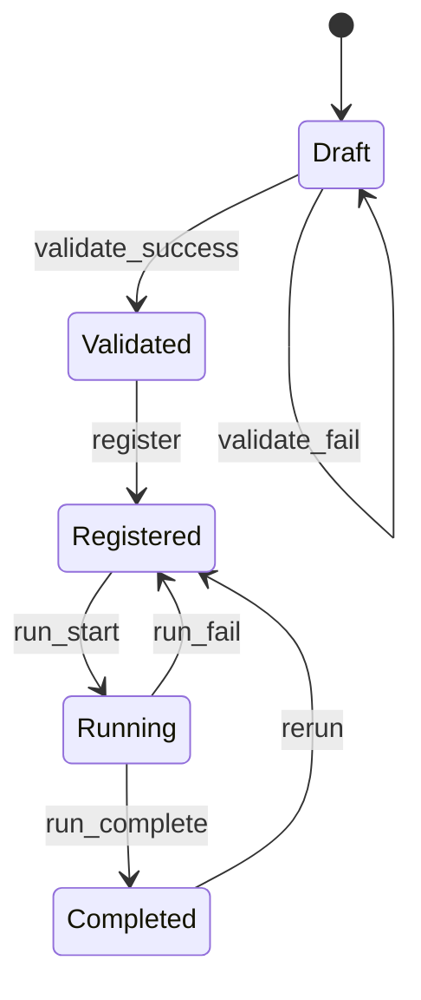

# 第5章 状態遷移設計
## 更新履歴
| 版数 | 日付 | 変更内容 |
|---|---|---|
| 0.1 | 2026-04-03 | 初版作成 |
| 0.2 | 2026-04-04 | 状態数削減（26→14状態）。Ready/Collecting統合、Connector簡素化、バッチジョブはMVP後 |

---

## 5.0 状態遷移の設計方針

### 5.0.1 削減の根拠

状態数はバグの温床となる。状態 N に対して遷移パスは最悪 N×(N-1) 通りに達し、各境界がバグの発生点になる。本設計では以下の原則で状態を最小化する。

| 原則 | 説明 |
|---|---|
| **外から見た振る舞いが同じなら統合** | 内部サブフェーズ（Collecting等）は状態に昇格させない |
| **一方向フロー優先** | 逆遷移（Archived→Registered等）はMVP後に検討 |
| **実装詳細は状態にしない** | teardown中（Disconnecting）等は呼び出し側から見れば待機と同じ |
| **MVPスコープ外は除外** | バッチジョブ状態遷移はP1以降で追加 |

### 5.0.2 状態数サマリ

| ステートマシン | v0.1 | v0.2 | 削減内容 |
|---|---|---|---|
| Orchestrator | 7 | **5** | Ready/Collecting統合 |
| Connector | 7 | **4** | Connected/Idle統合、Disconnecting削除 |
| Scenario Pack | 6 | **5** | Archived削除（MVP後） |
| バッチジョブ | 6 | **—** | MVP後に追加 |
| 合計 | 26 | **14** | 46%削減 |

---

## 5.1 Orchestrator 状態遷移（REQ-F-002）

### 状態一覧

| 状態 | 説明 |
|---|---|
| Idle | 初期状態。コマンド待ち |
| Initializing | ExecutionPlan生成・コンテナ起動・Connectorヘルスチェック |
| Running | ステップ実行中（結果収集を含む） |
| Completed | 正常完了 |
| Failed | 異常終了 |

> **v0.1からの変更:** `Ready`（Connector healthy確認後の待機）は `Initializing` の完了条件に統合。`Collecting`（結果収集）は `Running` の最終サブフェーズとして統合。外部から見た振る舞い（中断不可・待機）が同じため。

### 状態遷移図



### 状態遷移表

| 現在の状態＼イベント | run(pack) | init_complete | all_done | error | cancel | reset |
|---|---|---|---|---|---|---|
| Idle | → Initializing | — | — | — | — | — |
| Initializing | — | → Running | — | → Failed | — | — |
| Running | — | — | → Completed | → Failed | → Failed | — |
| Completed | — | — | — | — | — | → Idle |
| Failed | — | — | — | — | — | → Idle |

**遷移数: 8。テストすべきパス: 正常系1 + 異常系3（init失敗, 実行失敗, cancel）+ reset 2 = 6パス。**

### Initializing 内部フロー（状態に昇格しないサブフェーズ）



### Running 内部フロー（状態に昇格しないサブフェーズ）



---

## 5.2 Connector 状態遷移（REQ-F-007）

### 状態一覧

| 状態 | 説明 |
|---|---|
| Disconnected | 未接続。初期状態および終了後の状態 |
| Initializing | initialize()実行中。接続確立・設定読込 |
| Ready | 接続済み・コマンド受付可能 |
| Executing | execute()実行中。1ステップのシミュレーション処理 |

> **v0.1からの変更:** `Connected` と `Idle` を `Ready` に統合（外部から見て区別不要）。`Disconnecting` を削除（teardown()はReady/Error→Disconnected の遷移アクション）。`Error` を削除し、エラー時は `Disconnected` に遷移（Orchestrator側でリトライ判断）。

### 状態遷移図



### 状態遷移表

| 現在の状態＼イベント | initialize(config) | connected | execute(step,ctx) | step_done | teardown() | error |
|---|---|---|---|---|---|---|
| Disconnected | → Initializing | — | — | — | — | — |
| Initializing | — | → Ready | — | — | — | → Disconnected |
| Ready | — | — | → Executing | — | → Disconnected | — |
| Executing | — | — | — | → Ready | — | → Disconnected |

**遷移数: 7。テストすべきパス: 正常系1（init→execute→teardown）+ 異常系2（init失敗, execute失敗）= 3パス。**

### Error時の振る舞い

Connector自体はError状態を持たない。エラー時は `Disconnected` に戻り、Orchestrator（8.4節リトライ設計）がリトライを判断する。

```python
# Orchestrator側のリトライ判断
try:
    result = connector.execute(step, ctx)
except ConnectorError as e:
    # Connector は Disconnected に遷移済み
    if retry_policy.should_retry(e):
        connector.initialize(config)  # 再接続
        result = connector.execute(step, ctx)
    else:
        raise
```

---

## 5.3 Scenario Pack ライフサイクル（REQ-F-001）

### 状態一覧

| 状態 | 説明 |
|---|---|
| Draft | 作成中・未検証 |
| Validated | 検証済み・登録可能 |
| Registered | 登録済み・実行可能 |
| Running | 実行中（Orchestrator が使用中） |
| Completed | 実行完了・結果保持 |

> **v0.1からの変更:** `Archived` を削除。アーカイブは Registered 状態にメタデータフラグ（`archived: bool`）として実装し、状態に昇格させない。MVP後に必要であれば再検討。

### 状態遷移図



### 状態遷移表

| 現在の状態＼イベント | validate_success | validate_fail | register | run_start | run_complete | run_fail | rerun |
|---|---|---|---|---|---|---|---|
| Draft | → Validated | → Draft | — | — | — | — | — |
| Validated | — | — | → Registered | — | — | — | — |
| Registered | — | — | — | → Running | — | — | — |
| Running | — | — | — | — | → Completed | → Registered | — |
| Completed | — | — | — | — | — | — | → Registered |

**遷移数: 7。テストすべきパス: 正常系1 + バリデーション失敗1 + 実行失敗1 + 再実行1 = 4パス。**

---

## 5.4 バッチジョブ状態遷移（REQ-F-002）— MVP後

> **注記:** バッチジョブ（複数Scenario Packの並列/逐次実行）はPhase 1 MVPのスコープ外。MVPでは `Orchestrator.run()` による単一実行のみをサポートする。P1以降でバッチ実行を追加する際に、本セクションを定義する。
>
> 追加時の設計方針:
> - 状態数は5以下を目標とする（Queued, Running, Succeeded, Failed, Cancelled）
> - Retrying は状態ではなく、Failed からの自動遷移アクションとして実装する

---

## 5.5 状態遷移テスト方針

### 5.5.1 テスト網羅基準

| 基準 | 内容 |
|---|---|
| 全遷移カバレッジ | 状態遷移表の全「→」セルを最低1回通過 |
| 全拒否カバレッジ | 状態遷移表の全「—」セルのうち、APIから到達可能なものを拒否確認 |
| 正常系E2Eパス | 各ステートマシンの最短正常パスを1本 |
| 異常系パス | error遷移を含むパスを各ステートマシン2本以上 |

### 5.5.2 テストケース数の見積

| ステートマシン | 遷移数 | 拒否確認数 | 合計テストケース |
|---|---|---|---|
| Orchestrator | 8 | 5 | 13 |
| Connector | 7 | 4 | 11 |
| Scenario Pack | 7 | 5 | 12 |
| **合計** | **22** | **14** | **36** |

v0.1（37遷移 + 推定30拒否 = 67テスト）から**46%削減**。
