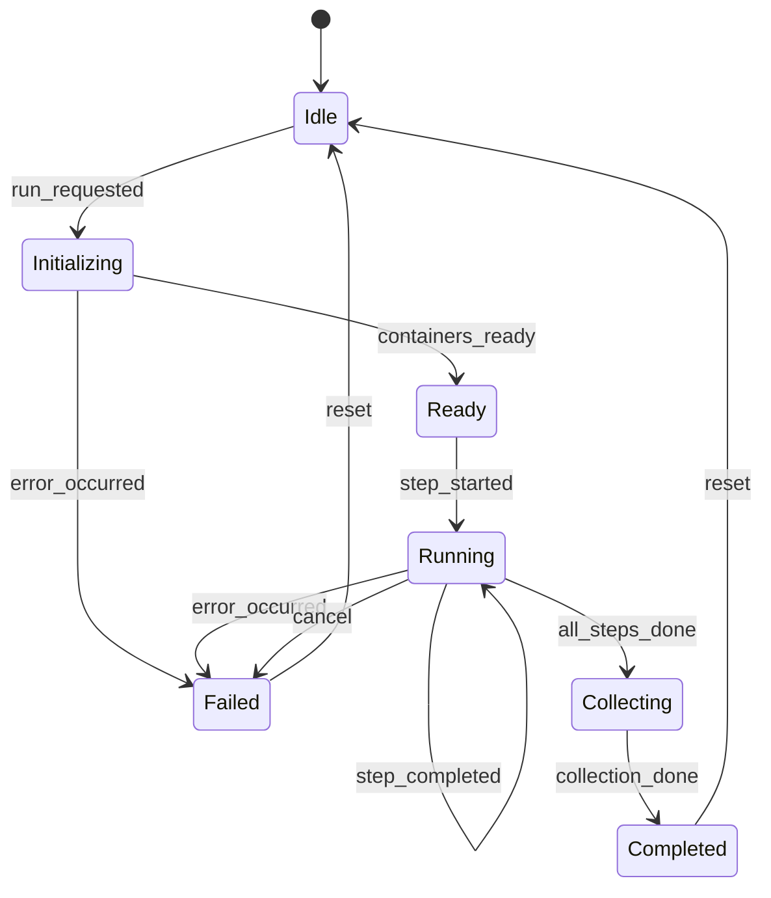
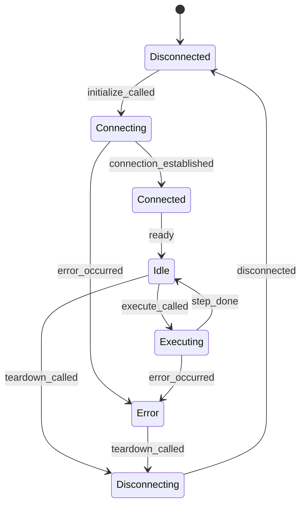
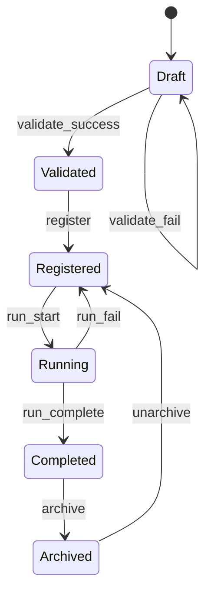
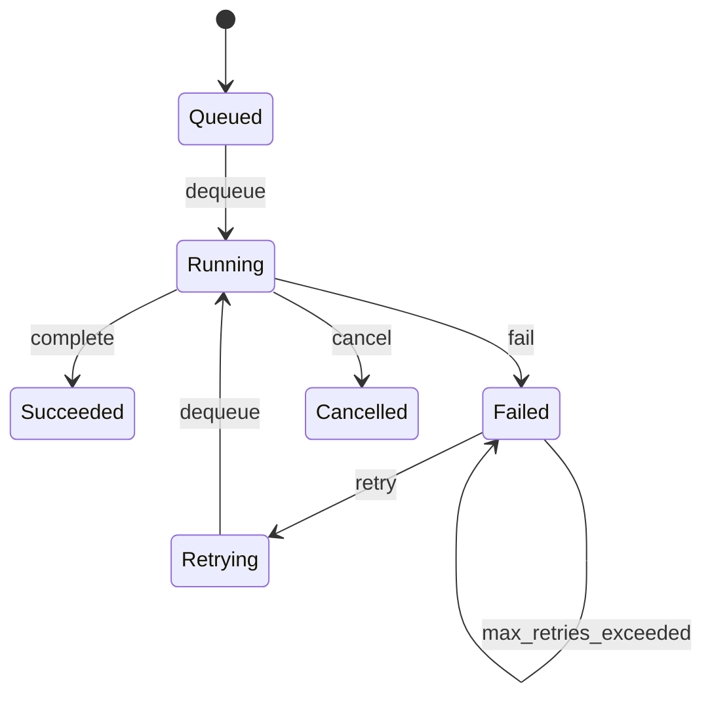

# 第5章 状態遷移設計
## 更新履歴
| 版数 | 日付 | 変更内容 |
|---|---|---|
| 0.1 | 2026-04-03 | 初版作成 |

---

## 5.1 Orchestrator 状態遷移（REQ-F-002）

### 状態一覧

| 状態 | 説明 |
|---|---|
| Idle | 初期状態。コマンド待ち |
| Initializing | ExecutionPlan生成・コンテナ起動中 |
| Ready | 全Connectorがhealthy。実行準備完了 |
| Running | ステップ実行中 |
| Collecting | 結果収集・メトリクス計算中 |
| Completed | 正常完了 |
| Failed | 異常終了 |

### 状態遷移図

### 状態遷移表

| 現在の状態＼イベント | run_requested | containers_ready | step_started | step_completed | all_steps_done | collection_done | error_occurred | reset | cancel |
|---|---|---|---|---|---|---|---|---|---|
| Idle | → Initializing | — | — | — | — | — | — | — | — |
| Initializing | — | → Ready | — | — | — | — | → Failed | — | — |
| Ready | — | — | → Running | — | — | — | — | — | — |
| Running | — | — | — | → Running | → Collecting | — | → Failed | — | → Failed |
| Collecting | — | — | — | — | — | → Completed | — | — | — |
| Completed | — | — | — | — | — | — | — | → Idle | — |
| Failed | — | — | — | — | — | — | — | → Idle | — |

---

## 5.2 Connector 状態遷移（REQ-F-007）

### 状態一覧

| 状態 | 説明 |
|---|---|
| Disconnected | 未接続状態 |
| Connecting | 接続処理中 |
| Connected | 接続確立済み |
| Idle | 実行待ち |
| Executing | ステップ実行中 |
| Disconnecting | 切断処理中 |
| Error | エラー状態 |

### 状態遷移図

### 状態遷移表

| 現在の状態＼イベント | initialize_called | connection_established | execute_called | step_done | teardown_called | error_occurred | recovered | ready | disconnected |
|---|---|---|---|---|---|---|---|---|---|
| Disconnected | → Connecting | — | — | — | — | — | — | — | — |
| Connecting | — | → Connected | — | — | — | → Error | — | — | — |
| Connected | — | — | — | — | — | — | — | → Idle | — |
| Idle | — | — | → Executing | — | → Disconnecting | — | — | — | — |
| Executing | — | — | — | → Idle | — | → Error | — | — | — |
| Error | — | — | — | — | → Disconnecting | — | — | — | — |
| Disconnecting | — | — | — | — | — | — | — | — | → Disconnected |

---

## 5.3 Scenario Pack ライフサイクル（REQ-F-001）

### 状態一覧

| 状態 | 説明 |
|---|---|
| Draft | 作成中・未検証 |
| Validated | 検証済み |
| Registered | 登録済み・実行可能 |
| Running | 実行中 |
| Completed | 実行完了 |
| Archived | アーカイブ済み |

### 状態遷移図

### 状態遷移表

| 現在の状態＼イベント | validate_success | validate_fail | register | run_start | run_complete | run_fail | archive | unarchive |
|---|---|---|---|---|---|---|---|---|
| Draft | → Validated | → Draft | — | — | — | — | — | — |
| Validated | — | — | → Registered | — | — | — | — | — |
| Registered | — | — | — | → Running | — | — | — | — |
| Running | — | — | — | — | → Completed | → Registered | — | — |
| Completed | — | — | — | — | — | — | → Archived | — |
| Archived | — | — | — | — | — | — | — | → Registered |

---

## 5.4 バッチジョブ状態遷移（REQ-F-002）

### 状態一覧

| 状態 | 説明 |
|---|---|
| Queued | キュー投入済み・実行待ち |
| Running | 実行中 |
| Succeeded | 正常完了 |
| Failed | 異常終了 |
| Cancelled | キャンセル済み |
| Retrying | リトライ待ち |

### 状態遷移図

### 状態遷移表

| 現在の状態＼イベント | dequeue | complete | fail | cancel | retry | max_retries_exceeded |
|---|---|---|---|---|---|---|
| Queued | → Running | — | — | — | — | — |
| Running | — | → Succeeded | → Failed | → Cancelled | — | — |
| Succeeded | — | — | — | — | — | — |
| Failed | — | — | — | — | → Retrying | → Failed |
| Cancelled | — | — | — | — | — | — |
| Retrying | → Running | — | — | — | — | — |
