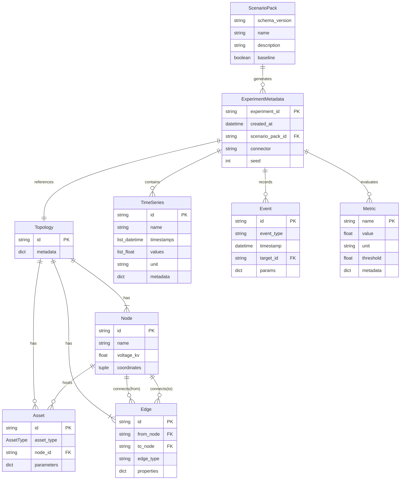

# 第6章 データ詳細設計

本章では、基本設計 第5章（データ設計）で定義した Canonical Data Layer (CDL) のエンティティ関係・属性定義、YAML/JSON スキーマ、およびファイル I/O 仕様を詳細化する。

## 更新履歴

| 版数 | 日付 | 変更内容 |
|---|---|---|
| 0.1 | 2026-04-03 | 初版作成（6.1〜6.4） |

---

## 6.1 CDL エンティティ関係図（ER図）

**関連要件**: `REQ-F-003`

CDL を構成する全エンティティ間の関係を以下の ER 図に示す。ScenarioPack を起点として、ExperimentMetadata が実験単位の集約ルートとなり、Topology・TimeSeries・Event・Metric を束ねる。Topology は Node・Edge・Asset を所有する。



### カーディナリティ一覧

| 親エンティティ | 子エンティティ | 関係 | カーディナリティ | 説明 |
|---|---|---|---|---|
| ScenarioPack | ExperimentMetadata | generates | 1 : 0..* | 1 つの Pack から複数実験を生成可能 |
| ExperimentMetadata | Topology | references | 1 : 1 | 実験は 1 つの Topology を参照 |
| ExperimentMetadata | TimeSeries | contains | 1 : 0..* | 実験は 0 個以上の時系列を保持 |
| ExperimentMetadata | Event | records | 1 : 0..* | 実験は 0 個以上のイベントを記録 |
| ExperimentMetadata | Metric | evaluates | 1 : 0..* | 実験は 0 個以上のメトリクスを算出 |
| Topology | Node | has | 1 : 1..* | トポロジーは 1 個以上のノードを持つ |
| Topology | Edge | has | 1 : 1..* | トポロジーは 1 個以上のエッジを持つ |
| Topology | Asset | has | 1 : 0..* | トポロジーは 0 個以上のアセットを持つ |
| Node | Asset | hosts | 1 : 0..* | ノードは 0 個以上のアセットを接続 |
| Node | Edge | connects | 1 : 0..* | ノードは 0 個以上のエッジの端点となる |

---

## 6.2 CDL エンティティ属性定義

各エンティティの属性を以下の表で定義する。Python 型は `dataclasses.dataclass(frozen=True)` による不変オブジェクトとして実装する。

### 6.2.1 Topology

| 属性名 | Python 型 | 必須/オプション | 制約 | 説明 |
|---|---|---|---|---|
| `id` | `str` | 必須 | 空文字不可、一意 | トポロジー識別子 |
| `nodes` | `tuple[Node, ...]` | 必須 | 1 個以上 | 所属するノードの不変タプル |
| `edges` | `tuple[Edge, ...]` | 必須 | 1 個以上 | 所属するエッジの不変タプル |
| `metadata` | `dict[str, object]` | オプション | デフォルト `{}` | 座標系、基準電圧等の補助情報 |

### 6.2.2 Node

| 属性名 | Python 型 | 必須/オプション | 制約 | 説明 |
|---|---|---|---|---|
| `id` | `str` | 必須 | 空文字不可、Topology 内で一意 | ノード識別子 |
| `name` | `str` | 必須 | 空文字不可 | ノード表示名 |
| `voltage_kv` | `float` | 必須 | 正の値 | 定格電圧 (kV) |
| `coordinates` | `tuple[float, float] \| None` | オプション | デフォルト `None`、(緯度, 経度) | 地理座標 |

### 6.2.3 Edge

| 属性名 | Python 型 | 必須/オプション | 制約 | 説明 |
|---|---|---|---|---|
| `id` | `str` | 必須 | 空文字不可、Topology 内で一意 | エッジ識別子 |
| `from_node` | `str` | 必須 | 有効な Node.id を参照 | 始点ノード ID |
| `to_node` | `str` | 必須 | 有効な Node.id を参照 | 終点ノード ID |
| `edge_type` | `str` | 必須 | `"line"` \| `"transformer"` \| `"switch"` | エッジ種別 |
| `properties` | `dict[str, object]` | オプション | デフォルト `{}` | インピーダンス、定格容量等の物理パラメータ |

### 6.2.4 Asset

| 属性名 | Python 型 | 必須/オプション | 制約 | 説明 |
|---|---|---|---|---|
| `id` | `str` | 必須 | 空文字不可、一意 | アセット識別子 |
| `asset_type` | `AssetType` | 必須 | Enum: `GENERATOR`, `LOAD`, `STORAGE`, `LINE`, `TRANSFORMER` | アセット種別 |
| `node_id` | `str` | 必須 | 有効な Node.id を参照 | 接続先ノード ID |
| `parameters` | `dict[str, object]` | オプション | デフォルト `{}` | 定格出力、容量等のアセット固有パラメータ |

### 6.2.5 TimeSeries

| 属性名 | Python 型 | 必須/オプション | 制約 | 説明 |
|---|---|---|---|---|
| `id` | `str` | 必須 | 空文字不可、一意 | 時系列識別子 |
| `name` | `str` | 必須 | 空文字不可 | 時系列の表示名（例: `"load_profile"` ） |
| `timestamps` | `tuple[datetime, ...]` | 必須 | 昇順、1 個以上、`values` と同数 | タイムスタンプ列 |
| `values` | `tuple[float, ...]` | 必須 | `timestamps` と同数 | 値列 |
| `unit` | `str` | 必須 | 空文字不可（例: `"kW"`, `"kVar"`, `"V"` ） | 物理単位 |
| `metadata` | `dict[str, object]` | オプション | デフォルト `{}` | 解像度、補間方式等の補助情報 |

### 6.2.6 Event

| 属性名 | Python 型 | 必須/オプション | 制約 | 説明 |
|---|---|---|---|---|
| `id` | `str` | 必須 | 空文字不可、一意 | イベント識別子 |
| `event_type` | `str` | 必須 | `"fault"` \| `"switch"` \| `"load_change"` \| `"generation_change"` | イベント種別 |
| `timestamp` | `datetime` | 必須 | シミュレーション時間範囲内 | 発生時刻 |
| `target_id` | `str` | 必須 | 有効な Node.id または Edge.id を参照 | 対象要素 ID |
| `params` | `dict[str, object]` | オプション | デフォルト `{}` | イベント固有パラメータ（障害種別、変化量等） |

### 6.2.7 Metric

| 属性名 | Python 型 | 必須/オプション | 制約 | 説明 |
|---|---|---|---|---|
| `name` | `str` | 必須 | 空文字不可、実験内で一意 | メトリクス名（例: `"voltage_deviation_rate"` ） |
| `value` | `float` | 必須 | 有限値 | 計算結果値 |
| `unit` | `str` | 必須 | 空文字不可（例: `"%"`, `"hours"`, `"kWh"` ） | 物理単位 |
| `threshold` | `float \| None` | オプション | デフォルト `None`、指定時は有限値 | 閾値（超過で警告） |
| `metadata` | `dict[str, object]` | オプション | デフォルト `{}` | 算出条件等の補助情報 |

### 6.2.8 ExperimentMetadata

| 属性名 | Python 型 | 必須/オプション | 制約 | 説明 |
|---|---|---|---|---|
| `experiment_id` | `str` | 必須 | 空文字不可、グローバル一意（UUID 推奨） | 実験識別子 |
| `created_at` | `datetime` | 必須 | ISO 8601 形式 | 実験作成日時 |
| `scenario_pack_id` | `str` | 必須 | 有効な ScenarioPack 名を参照 | 元となる Scenario Pack の識別子 |
| `connector` | `str` | 必須 | 登録済み Connector 名（例: `"opendss"`, `"pandapower"` ） | 使用した Connector |
| `parameters` | `dict[str, object]` | オプション | デフォルト `{}` | 実験固有パラメータ（シミュレーション設定等） |
| `seed` | `int` | オプション | デフォルト `0`、非負整数 | 乱数シード（再現性担保） |

---

## 6.3 YAML/JSON スキーマ定義

### 6.3.1 pack.yaml (config.yaml) JSON Schema

Scenario Pack のメイン設定ファイル `config.yaml` に対する JSON Schema を以下に定義する（`REQ-Q-011`）。バリデーションは `jsonschema` ライブラリにより実行時に検証される。

```json
{
  "$schema": "https://json-schema.org/draft/2020-12/schema",
  "$id": "https://gridflow.dev/schemas/pack-config-v1.json",
  "title": "Scenario Pack config.yaml",
  "description": "gridflow Scenario Pack のメイン設定ファイルスキーマ",
  "type": "object",
  "required": ["schema_version", "name", "network", "simulation"],
  "additionalProperties": false,
  "properties": {
    "schema_version": {
      "type": "string",
      "pattern": "^\\d+\\.\\d+$",
      "description": "スキーマバージョン（例: '1.0'）"
    },
    "name": {
      "type": "string",
      "minLength": 1,
      "maxLength": 128,
      "pattern": "^[a-z0-9][a-z0-9_-]*$",
      "description": "Scenario Pack 名（小文字英数字・ハイフン・アンダースコア）"
    },
    "description": {
      "type": "string",
      "maxLength": 1024,
      "description": "Scenario Pack の説明"
    },
    "baseline": {
      "type": "boolean",
      "default": false,
      "description": "ベースラインフラグ（比較基準として使用する場合 true）"
    },
    "citation": {
      "type": "string",
      "description": "引用情報"
    },
    "network": {
      "type": "object",
      "required": ["topology", "assets"],
      "additionalProperties": false,
      "properties": {
        "topology": {
          "type": "string",
          "pattern": "\\.json$",
          "description": "トポロジー定義ファイルの相対パス"
        },
        "assets": {
          "type": "string",
          "pattern": "\\.json$",
          "description": "アセット定義ファイルの相対パス"
        }
      }
    },
    "timeseries": {
      "type": "array",
      "items": {
        "type": "object",
        "required": ["path", "type", "resolution_sec"],
        "additionalProperties": false,
        "properties": {
          "path": {
            "type": "string",
            "description": "時系列データファイルの相対パス"
          },
          "type": {
            "type": "string",
            "enum": ["load", "generation", "price", "temperature"],
            "description": "時系列データ種別"
          },
          "resolution_sec": {
            "type": "integer",
            "minimum": 1,
            "description": "時間解像度（秒）"
          }
        }
      }
    },
    "simulation": {
      "type": "object",
      "required": ["connector", "duration_hours", "step_size_sec"],
      "additionalProperties": false,
      "properties": {
        "connector": {
          "type": "string",
          "enum": ["opendss", "pandapower", "helics", "grid2op"],
          "description": "使用する Connector 名"
        },
        "duration_hours": {
          "type": "number",
          "exclusiveMinimum": 0,
          "description": "シミュレーション時間（時間）"
        },
        "step_size_sec": {
          "type": "integer",
          "minimum": 1,
          "description": "シミュレーションステップサイズ（秒）"
        }
      }
    },
    "evaluation": {
      "type": "object",
      "additionalProperties": false,
      "properties": {
        "metrics": {
          "type": "string",
          "description": "メトリクス定義ファイルの相対パス"
        },
        "expected": {
          "type": "string",
          "description": "期待結果ファイルの相対パス"
        },
        "tolerance": {
          "type": "number",
          "minimum": 0,
          "default": 0.01,
          "description": "回帰テスト用許容誤差"
        }
      }
    },
    "visualization": {
      "type": "object",
      "additionalProperties": false,
      "properties": {
        "templates": {
          "type": "array",
          "items": {
            "type": "string"
          },
          "description": "可視化テンプレートファイルの相対パスリスト"
        }
      }
    }
  }
}
```

### 6.3.2 スキーマバリデーション適用方針

| 項目 | 方針 |
|---|---|
| バリデーションタイミング | `ImportScenario` ユースケース実行時、および CLI の `validate` サブコマンド実行時 |
| バリデーションライブラリ | `jsonschema` (Python) |
| スキーマ格納先 | `src/gridflow/infra/schema/` ディレクトリ配下に JSON ファイルとして配置 |
| バージョン管理 | `schema_version` フィールドにより後方互換性を管理。旧バージョンのスキーマも保持する |
| エラー報告 | バリデーションエラーは全件収集し、エラーメッセージのリストとして返却する |

---

## 6.4 ファイル I/O 仕様

### 6.4.1 対応フォーマット一覧

CDL データの永続化およびエクスポートに使用するファイル形式を以下に定義する（`REQ-F-003`）。

| 形式 | 拡張子 | エンコーディング | ヘッダー | 圧縮 | 主な用途 |
|---|---|---|---|---|---|
| CSV | `.csv` | UTF-8 (BOM なし) | 1 行目をカラム名ヘッダーとする | なし（オプションで gzip `.csv.gz`） | TimeSeries の入出力、Metric 一覧エクスポート |
| JSON | `.json` | UTF-8 (BOM なし) | なし（自己記述的構造） | なし | Topology、Asset、ExperimentMetadata、config.yaml のシリアライズ |
| Parquet | `.parquet` | バイナリ | スキーマ埋め込み | Snappy（デフォルト）、gzip、zstd から選択可 | 大規模 TimeSeries の高速列指向アクセス、長期保存 |

### 6.4.2 CSV I/O 仕様

| 項目 | 仕様 |
|---|---|
| 区切り文字 | カンマ (`,`) |
| 改行コード | LF (`\n`) |
| クォート | ダブルクォート (`"`)、フィールド内にカンマ・改行を含む場合のみ適用 |
| エンコーディング | UTF-8（BOM なし） |
| ヘッダー行 | 必須（1 行目にカラム名） |
| 日時フォーマット | ISO 8601（`YYYY-MM-DDTHH:MM:SS+00:00`） |
| 欠損値表現 | 空文字列 (`""`) |
| 浮動小数点精度 | 小数点以下 6 桁（出力時）、入力時は任意精度を受け入れ |
| 読み込みライブラリ | `pandas.read_csv()` または標準 `csv` モジュール |
| 書き出しライブラリ | `pandas.DataFrame.to_csv(index=False)` |

### 6.4.3 JSON I/O 仕様

| 項目 | 仕様 |
|---|---|
| エンコーディング | UTF-8（BOM なし） |
| フォーマット | インデント 2 スペースの整形済み JSON（出力時） |
| 日時フォーマット | ISO 8601 文字列 |
| 数値 | IEEE 754 浮動小数点。`NaN`・`Infinity` は使用不可（JSON 標準準拠） |
| `null` の扱い | オプション属性が未設定の場合、キーごと省略を推奨。明示的に `null` としても可 |
| 読み込みライブラリ | `json.load()` (標準ライブラリ) |
| 書き出しライブラリ | `json.dump(ensure_ascii=False, indent=2)` |
| 最大ファイルサイズ | 100 MB（超過する場合は Parquet を使用） |

### 6.4.4 Parquet I/O 仕様

| 項目 | 仕様 |
|---|---|
| エンジン | `pyarrow`（必須依存） |
| 圧縮形式 | Snappy（デフォルト）。設定により gzip、zstd に切り替え可 |
| スキーマ | PyArrow Schema をファイルメタデータに埋め込み |
| 日時フォーマット | `timestamp[us, tz=UTC]`（マイクロ秒精度、UTC） |
| パーティション | 単一ファイル出力（デフォルト）。大規模データはディレクトリパーティションを許容 |
| 読み込みライブラリ | `pandas.read_parquet(engine="pyarrow")` |
| 書き出しライブラリ | `pandas.DataFrame.to_parquet(engine="pyarrow", compression="snappy")` |
| 推奨用途 | 行数 10,000 以上の TimeSeries データ、ベンチマーク結果の長期保存 |

### 6.4.5 形式選択ガイドライン

| ユースケース | 推奨形式 | 理由 |
|---|---|---|
| TimeSeries 入力（ユーザー作成） | CSV | テキストエディタ・Excel で編集可能 |
| TimeSeries 保存（大規模） | Parquet | 圧縮効率とクエリ性能に優れる |
| Topology / Asset 定義 | JSON | ネスト構造を自然に表現可能 |
| ExperimentMetadata | JSON | 構造化データの可読性を確保 |
| Metric エクスポート | CSV | 他ツール（Excel、R 等）との連携が容易 |
| Metric 期待値（回帰テスト） | JSON | 構造化された比較が容易 |
| Scenario Pack 設定 | YAML | 人間可読性とコメント記述を重視 |
