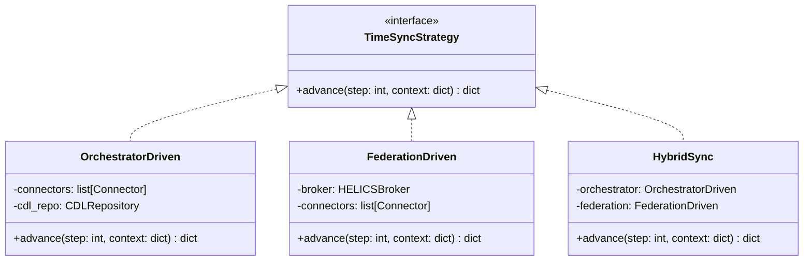
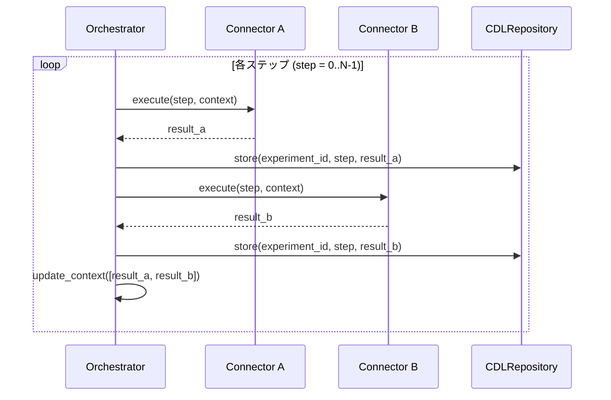
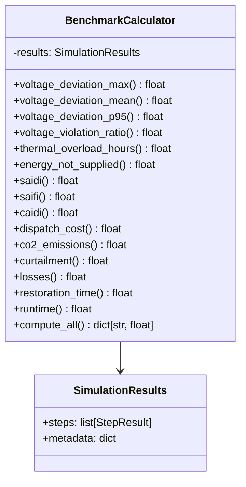
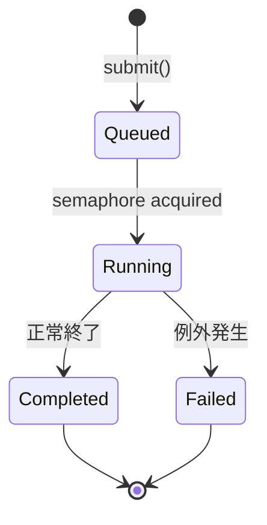
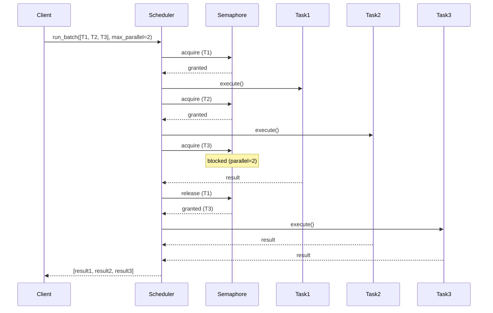
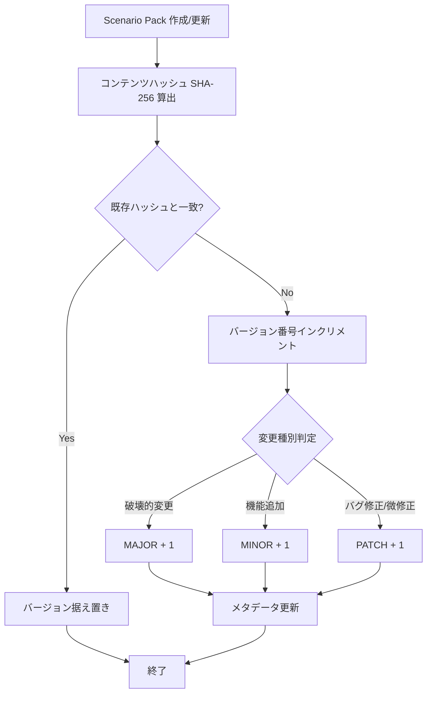
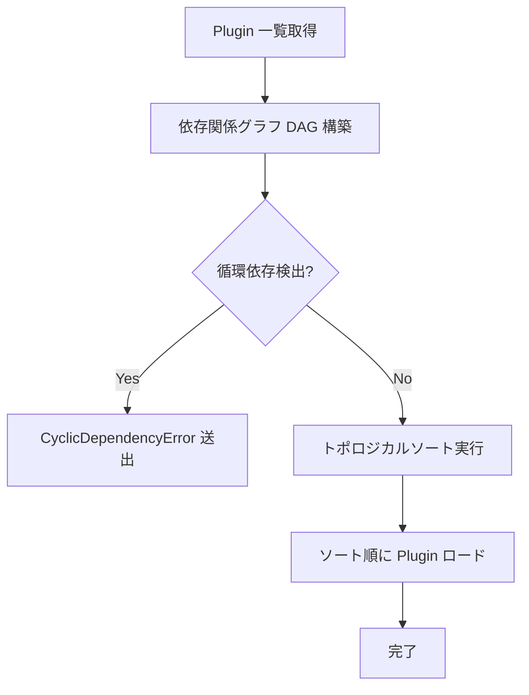
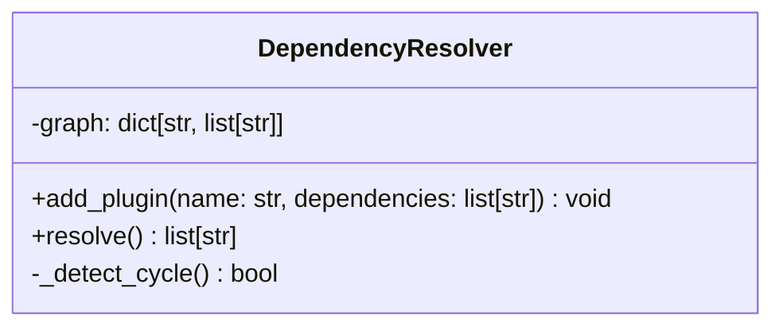
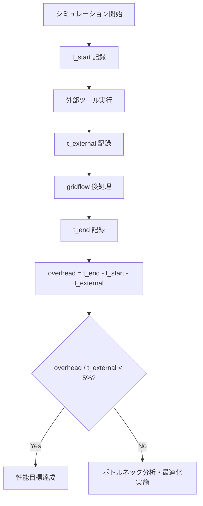

# 第7章 アルゴリズム設計

## 更新履歴
| 版数 | 日付 | 変更内容 |
|---|---|---|
| 0.1 | 2026-04-03 | 初版作成 |
| 0.2 | 2026-04-04 | 7.2 メトリクス拡充: EN 50160電圧品質4指標, IEEE 1366信頼度3指標(SAIDI/SAIFI/CAIDI), losses追加 |

---

## 7.1 時間同期アルゴリズム（REQ-F-002）

シミュレーション実行時の時間同期には以下の3方式を定義する。実行環境に応じて適切な方式を選択する。

### 方式一覧

| 方式 | 対象Connector | 制御主体 |
|---|---|---|
| Orchestrator-driven | OpenDSS, pandapower | Orchestrator がステップタイミング決定 |
| Federation-driven | HELICS | HELICS Broker が時間管理 |
| Hybrid | 混合環境 | Orchestrator + HELICS Broker 連携 |

### クラス図



### Orchestrator-driven 方式

#### IPO

- **Input**: `total_steps: int` — シミュレーション総ステップ数, `connectors: list[Connector]` — 実行対象Connector一覧, `context: dict` — 初期コンテキスト
- **Process**: 各ステップで全Connectorを順次実行し、結果をCDLリポジトリへ格納。ステップ完了後にコンテキストを更新する。
- **Output**: `dict` — 最終コンテキスト。例外: `ConnectorExecutionError`（Connector実行失敗時）

#### 疑似コード

```python
def run_orchestrator_driven(total_steps: int, connectors: list[Connector],
                            context: dict, cdl_repo: CDLRepository,
                            experiment_id: str) -> dict:
    for step in range(total_steps):
        results = []
        for connector in connectors:
            result = connector.execute(step, context)
            cdl_repo.store(experiment_id, step, result)
            results.append(result)
        context = update_context(results)
    return context
```

### Federation-driven 方式

#### IPO

- **Input**: `broker: HELICSBroker` — HELICS Broker インスタンス, `connectors: list[Connector]` — HELICS 連携対象Connector一覧, `end_time: float` — シミュレーション終了時刻
- **Process**: HELICS Broker が時間進行を管理し、各Connectorは Broker から付与された時刻に基づき実行される。
- **Output**: `dict` — 最終コンテキスト。例外: `BrokerTimeoutError`（Broker応答タイムアウト時）

#### 疑似コード

```python
def run_federation_driven(broker: HELICSBroker, connectors: list[Connector],
                          end_time: float, cdl_repo: CDLRepository,
                          experiment_id: str) -> dict:
    broker.initialize(connectors)
    current_time = 0.0
    context = {}
    while current_time < end_time:
        granted_time = broker.request_time(current_time)
        results = []
        for connector in connectors:
            result = connector.execute_at(granted_time, context)
            cdl_repo.store(experiment_id, granted_time, result)
            results.append(result)
        context = update_context(results)
        current_time = granted_time
    broker.finalize()
    return context
```

### Hybrid 方式

#### IPO

- **Input**: `orchestrated_connectors: list[Connector]` — Orchestrator管理対象, `federated_connectors: list[Connector]` — HELICS管理対象, `broker: HELICSBroker`, `total_steps: int`
- **Process**: 各ステップで Orchestrator 管理Connectorを実行後、HELICS Broker と同期を取り Federation 管理Connectorを実行する。
- **Output**: `dict` — 最終コンテキスト。例外: `SyncError`（同期失敗時）

#### 疑似コード

```python
def run_hybrid(orchestrated_connectors: list[Connector],
               federated_connectors: list[Connector],
               broker: HELICSBroker, total_steps: int,
               cdl_repo: CDLRepository, experiment_id: str) -> dict:
    broker.initialize(federated_connectors)
    context = {}
    for step in range(total_steps):
        # Orchestrator-driven part
        orch_results = []
        for connector in orchestrated_connectors:
            result = connector.execute(step, context)
            cdl_repo.store(experiment_id, step, result)
            orch_results.append(result)
        # Federation-driven part (sync with broker)
        granted_time = broker.request_time(step)
        fed_results = []
        for connector in federated_connectors:
            result = connector.execute_at(granted_time, context)
            cdl_repo.store(experiment_id, step, result)
            fed_results.append(result)
        context = update_context(orch_results + fed_results)
    broker.finalize()
    return context
```

### シーケンス図（Orchestrator-driven）



---

## 7.2 Benchmark メトリクス計算アルゴリズム（REQ-F-004）

シミュレーション結果からベンチマーク指標を算出する。電圧品質はEN 50160、信頼度はIEEE 1366に準拠する。

### 指標一覧

| # | 指標 | 単位 | 準拠規格 | 分類 |
|---|---|---|---|---|
| 1 | voltage_deviation_max | % | EN 50160 | 電圧品質 |
| 2 | voltage_deviation_mean | % | EN 50160 | 電圧品質 |
| 3 | voltage_deviation_p95 | % | EN 50160 | 電圧品質 |
| 4 | voltage_violation_ratio | % | EN 50160 | 電圧品質 |
| 5 | thermal_overload_hours | h | — | 熱的制約 |
| 6 | energy_not_supplied | MWh | — | 供給信頼度 |
| 7 | saidi | min/customer | IEEE 1366 | 供給信頼度 |
| 8 | saifi | 回/customer | IEEE 1366 | 供給信頼度 |
| 9 | caidi | min/回 | IEEE 1366 | 供給信頼度 |
| 10 | dispatch_cost | USD | — | 経済性 |
| 11 | co2_emissions | tCO2 | — | 環境 |
| 12 | curtailment | MWh | — | 再エネ統合 |
| 13 | losses | MWh | — | 系統効率 |
| 14 | restoration_time | s | — | レジリエンス |
| 15 | runtime | s | — | 計算性能 |

### クラス図



---

### 電圧品質指標（EN 50160 準拠）

EN 50160 は欧州の電力品質規格であり、供給電圧の許容変動範囲を定義する。主要な基準は以下の通り。

| EN 50160 基準 | 内容 |
|---|---|
| 通常変動範囲 | 公称電圧 Un の ±10% 以内 |
| 適合条件 | 10分平均値の95%が ±10% 以内（1週間計測） |
| 短時間変動 | +10% / -15% を許容（ただし適合条件外） |

gridflow では EN 50160 の ±10% 基準をデフォルト閾値とし、設定で変更可能とする。

#### voltage_deviation_max

- **Input**: `nodes: list[NodeResult]` — 各ノードの電圧値, `v_nominal: float` — 公称電圧
- **Process**: 全ノード・全ステップで電圧偏差率を算出し、最大値を返す。
- **Output**: `float` — 最大電圧偏差率 [%]

```python
def voltage_deviation_max(nodes: list[NodeResult], v_nominal: float) -> float:
    max_dev = 0.0
    for step in steps:
        for node in nodes:
            dev = abs(node.voltage_at(step) - v_nominal) / v_nominal * 100
            max_dev = max(max_dev, dev)
    return max_dev
```

#### voltage_deviation_mean

- **Input**: `nodes: list[NodeResult]`, `v_nominal: float`
- **Process**: 全ノード・全ステップの電圧偏差率の算術平均を返す。
- **Output**: `float` — 平均電圧偏差率 [%]

```python
def voltage_deviation_mean(nodes: list[NodeResult], v_nominal: float) -> float:
    deviations = []
    for step in steps:
        for node in nodes:
            dev = abs(node.voltage_at(step) - v_nominal) / v_nominal * 100
            deviations.append(dev)
    return sum(deviations) / len(deviations)
```

#### voltage_deviation_p95

- **Input**: `nodes: list[NodeResult]`, `v_nominal: float`
- **Process**: 全ノード・全ステップの電圧偏差率の95パーセンタイル値を返す。EN 50160 の適合判定に使用する。
- **Output**: `float` — 95パーセンタイル電圧偏差率 [%]

```python
def voltage_deviation_p95(nodes: list[NodeResult], v_nominal: float) -> float:
    deviations = []
    for step in steps:
        for node in nodes:
            dev = abs(node.voltage_at(step) - v_nominal) / v_nominal * 100
            deviations.append(dev)
    deviations.sort()
    idx = int(len(deviations) * 0.95)
    return deviations[idx]
```

#### voltage_violation_ratio

- **Input**: `nodes: list[NodeResult]`, `v_nominal: float`, `threshold_pct: float = 10.0`（EN 50160 デフォルト ±10%）
- **Process**: 全ノード・全ステップのうち、閾値を超過したサンプルの割合を返す。EN 50160 では 5% 未満で適合。
- **Output**: `float` — 違反率 [%]。0.0 = 全サンプル適合、100.0 = 全サンプル違反

```python
def voltage_violation_ratio(
    nodes: list[NodeResult], v_nominal: float, threshold_pct: float = 10.0
) -> float:
    total = 0
    violations = 0
    for step in steps:
        for node in nodes:
            dev = abs(node.voltage_at(step) - v_nominal) / v_nominal * 100
            total += 1
            if dev > threshold_pct:
                violations += 1
    return violations / total * 100
```

#### EN 50160 適合判定

```python
def en50160_compliant(p95: float, threshold_pct: float = 10.0) -> bool:
    """95パーセンタイルが閾値以内であれば適合"""
    return p95 <= threshold_pct
```

---

### thermal_overload_hours

#### IPO

- **Input**: `branches: list[BranchResult]` — 各ブランチの電流値, `dt: float` — ステップ時間幅 [h]
- **Process**: 定格電流を超過しているステップの時間を合算する。
- **Output**: `float` — 熱的過負荷時間 [h]

#### 疑似コード

```python
def thermal_overload_hours(branches: list[BranchResult], dt: float) -> float:
    total = 0.0
    for step in steps:
        for branch in branches:
            if branch.current_at(step) > branch.i_rated:
                total += dt
    return total
```

---

### energy_not_supplied

#### IPO

- **Input**: `loads: list[LoadResult]` — 各負荷の需要・供給値, `dt: float` — ステップ時間幅 [h]
- **Process**: 供給不足が発生しているステップで不足電力量を積算する。
- **Output**: `float` — 供給不足エネルギー [MWh]

#### 疑似コード

```python
def energy_not_supplied(loads: list[LoadResult], dt: float) -> float:
    total = 0.0
    for step in steps:
        for load in loads:
            p_demand = load.demand_at(step)
            p_supplied = load.supplied_at(step)
            if p_supplied < p_demand:
                total += (p_demand - p_supplied) * dt
    return total
```

---

### 供給信頼度指標（IEEE 1366 準拠）

IEEE 1366 は電力供給信頼度の標準指標を定義する。gridflow では以下の3指標を実装する。

| 指標 | 正式名称 | 定義 |
|---|---|---|
| SAIDI | System Average Interruption Duration Index | 顧客あたり平均停電時間 |
| SAIFI | System Average Interruption Frequency Index | 顧客あたり平均停電回数 |
| CAIDI | Customer Average Interruption Duration Index | 停電1回あたり平均復旧時間 |

#### saidi

- **Input**: `interruptions: list[Interruption]` — 停電イベントリスト（各イベントに `duration_min: float`, `customers_affected: int` を持つ）, `total_customers: int` — 系統全体の顧客数
- **Process**: `SAIDI = Σ(duration_i × customers_affected_i) / total_customers`
- **Output**: `float` — SAIDI [min/customer]

```python
def saidi(
    interruptions: list[Interruption], total_customers: int
) -> float:
    numerator = sum(
        i.duration_min * i.customers_affected for i in interruptions
    )
    return numerator / total_customers
```

#### saifi

- **Input**: `interruptions: list[Interruption]`, `total_customers: int`
- **Process**: `SAIFI = Σ(customers_affected_i) / total_customers`
- **Output**: `float` — SAIFI [回/customer]

```python
def saifi(
    interruptions: list[Interruption], total_customers: int
) -> float:
    numerator = sum(i.customers_affected for i in interruptions)
    return numerator / total_customers
```

#### caidi

- **Input**: `saidi_val: float`, `saifi_val: float`
- **Process**: `CAIDI = SAIDI / SAIFI`。SAIFI が 0 の場合（停電なし）は 0.0 を返す。
- **Output**: `float` — CAIDI [min/回]

```python
def caidi(saidi_val: float, saifi_val: float) -> float:
    if saifi_val == 0.0:
        return 0.0
    return saidi_val / saifi_val
```

#### Interruption データクラス

```python
@dataclass(frozen=True)
class Interruption:
    event_id: str           # 停電イベントID
    start_time: float       # 停電開始時刻 [s]
    end_time: float         # 復旧完了時刻 [s]
    duration_min: float     # 停電時間 [min] = (end_time - start_time) / 60
    customers_affected: int # 影響顧客数
    cause: str              # 原因（"fault", "maintenance", "overload"）
```

> **注記:** IEEE 1366 では Major Event Day (MED) の除外ルール（2.5β法）が定義されているが、gridflow のシミュレーション環境では全イベントを含めて計算する。実系統データとの比較時はMED除外オプションを将来追加する。

---

### dispatch_cost

#### IPO

- **Input**: `generators: list[GeneratorResult]` — 各発電機の出力・コスト情報, `dt: float` — ステップ時間幅 [h]
- **Process**: 全発電機・全ステップの発電コストを積算する。
- **Output**: `float` — 総給電コスト [USD]

#### 疑似コード

```python
def dispatch_cost(generators: list[GeneratorResult], dt: float) -> float:
    total = 0.0
    for step in steps:
        for gen in generators:
            total += gen.power_at(step) * gen.cost_per_unit * dt
    return total
```

### co2_emissions

#### IPO

- **Input**: `generators: list[GeneratorResult]` — 各発電機の出力・排出係数, `dt: float` — ステップ時間幅 [h]
- **Process**: 全発電機・全ステップのCO2排出量を積算する。
- **Output**: `float` — 総CO2排出量 [tCO2]

#### 疑似コード

```python
def co2_emissions(generators: list[GeneratorResult], dt: float) -> float:
    total = 0.0
    for step in steps:
        for gen in generators:
            total += gen.power_at(step) * gen.emission_factor * dt
    return total
```

### curtailment

#### IPO

- **Input**: `renewables: list[RenewableResult]` — 各再エネ発電機の利用可能出力・実出力, `dt: float` — ステップ時間幅 [h]
- **Process**: 再エネ発電機で出力抑制された電力量を積算する。
- **Output**: `float` — 総出力抑制量 [MWh]

#### 疑似コード

```python
def curtailment(renewables: list[RenewableResult], dt: float) -> float:
    total = 0.0
    for step in steps:
        for gen in renewables:
            p_available = gen.available_at(step)
            p_dispatched = gen.dispatched_at(step)
            total += (p_available - p_dispatched) * dt
    return total
```

---

### losses（系統損失）

配電系統研究で voltage_deviation と並ぶ基本指標。各ブランチの有効電力損失を全ステップにわたり積算する。

#### IPO

- **Input**: `branches: list[BranchResult]` — 各ブランチの損失情報, `dt: float` — ステップ時間幅 [h]
- **Process**: 全ブランチ・全ステップの有効電力損失を積算する。
- **Output**: `float` — 総系統損失 [MWh]

#### 疑似コード

```python
def losses(branches: list[BranchResult], dt: float) -> float:
    total = 0.0
    for step in steps:
        for branch in branches:
            total += branch.loss_kw_at(step) / 1000.0 * dt  # kW → MW
    return total
```

---

### restoration_time

#### IPO

- **Input**: `t_fault: float` — 故障発生時刻 [s], `t_restored: float` — 復旧完了時刻 [s]
- **Process**: 復旧完了時刻から故障発生時刻を減算する。
- **Output**: `float` — 復旧時間 [s]。例外: `ValueError`（`t_restored < t_fault` の場合）

#### 疑似コード

```python
def restoration_time(t_fault: float, t_restored: float) -> float:
    if t_restored < t_fault:
        raise ValueError("t_restored must be >= t_fault")
    return t_restored - t_fault
```

### runtime

#### IPO

- **Input**: `t_start: float` — シミュレーション開始時刻 [s], `t_end: float` — シミュレーション終了時刻 [s]
- **Process**: 終了時刻から開始時刻を減算する。
- **Output**: `float` — 実行時間 [s]

#### 疑似コード

```python
def runtime(t_start: float, t_end: float) -> float:
    return t_end - t_start
```

---

## 7.3 バッチスケジューリングアルゴリズム（REQ-F-002）

複数シミュレーションの実行をFIFOキュー方式で管理し、`max_parallel` 設定値に基づいて並列度を制御する。

### 状態遷移図



### IPO

- **Input**: `tasks: list[SimulationTask]` — 実行タスク一覧（FIFO順）, `max_parallel: int` — 最大並列数
- **Process**: `asyncio.Semaphore` で同時実行数を `max_parallel` に制限しながら、タスクを非同期に実行する。タスクはキューに投入された順序で開始される。
- **Output**: `list[TaskResult]` — 全タスクの実行結果。例外: `SchedulerError`（スケジューラ自体の障害時）

### 疑似コード

```python
import asyncio
from typing import Any

async def run_batch(tasks: list[SimulationTask],
                    max_parallel: int) -> list[TaskResult]:
    semaphore = asyncio.Semaphore(max_parallel)
    results: list[TaskResult] = []

    async def _run(task: SimulationTask) -> TaskResult:
        async with semaphore:
            try:
                result = await task.execute()
                return TaskResult(task_id=task.id, status="completed", data=result)
            except Exception as e:
                return TaskResult(task_id=task.id, status="failed", error=str(e))

    coros = [_run(task) for task in tasks]
    results = await asyncio.gather(*coros)
    return list(results)
```

### シーケンス図



---

## 7.4 Scenario Pack バージョン管理アルゴリズム（REQ-F-001）

Scenario Pack のバージョンを SemVer（MAJOR.MINOR.PATCH）で管理し、コンテンツハッシュ（SHA-256）で内容の同一性を検証する。

### フロー図



### コンテンツハッシュ算出

#### IPO

- **Input**: `pack_path: Path` — Scenario Pack ディレクトリパス
- **Process**: ディレクトリ内の全ファイルをソート済みパス順に読み取り、連結したバイト列のSHA-256ハッシュを算出する。
- **Output**: `str` — 16進数ハッシュ文字列。例外: `FileNotFoundError`（パス不正時）

#### 疑似コード

```python
import hashlib
from pathlib import Path

def compute_content_hash(pack_path: Path) -> str:
    hasher = hashlib.sha256()
    for file_path in sorted(pack_path.rglob("*")):
        if file_path.is_file():
            hasher.update(str(file_path.relative_to(pack_path)).encode())
            hasher.update(file_path.read_bytes())
    return hasher.hexdigest()
```

### バージョン比較

#### IPO

- **Input**: `version_a: str` — 比較元バージョン（例: `"1.2.3"`）, `version_b: str` — 比較先バージョン
- **Process**: SemVer の MAJOR, MINOR, PATCH を順に数値比較する。
- **Output**: `int` — `-1`（a < b）, `0`（a == b）, `1`（a > b）。例外: `ValueError`（不正なバージョン文字列）

#### 疑似コード

```python
def parse_semver(version: str) -> tuple[int, int, int]:
    parts = version.split(".")
    if len(parts) != 3:
        raise ValueError(f"Invalid SemVer: {version}")
    return (int(parts[0]), int(parts[1]), int(parts[2]))

def compare_versions(version_a: str, version_b: str) -> int:
    a = parse_semver(version_a)
    b = parse_semver(version_b)
    if a < b:
        return -1
    elif a > b:
        return 1
    return 0
```

### 互換性チェック

#### IPO

- **Input**: `required: str` — 要求バージョン, `actual: str` — 実バージョン
- **Process**: MAJOR が一致し、actual の MINOR が required 以上であれば互換性ありと判定する（SemVer 後方互換ルール）。
- **Output**: `bool` — 互換性あり: `True`, なし: `False`

#### 疑似コード

```python
def is_compatible(required: str, actual: str) -> bool:
    req = parse_semver(required)
    act = parse_semver(actual)
    # MAJOR must match
    if req[0] != act[0]:
        return False
    # actual MINOR must be >= required MINOR
    if act[1] < req[1]:
        return False
    # If same MINOR, actual PATCH must be >= required PATCH
    if act[1] == req[1] and act[2] < req[2]:
        return False
    return True
```

---

## 7.5 Plugin 依存解決アルゴリズム（REQ-F-006）

Plugin 間の依存関係を DAG（有向非巡回グラフ）として表現し、トポロジカルソートにより安全なロード順序を決定する。循環依存が検出された場合はエラーとする。

### フロー図



### クラス図



### 依存解決

#### IPO

- **Input**: `plugins: dict[str, list[str]]` — Plugin名をキー、依存先Plugin名リストを値とする辞書
- **Process**: Kahn のアルゴリズム（入次数ベースのトポロジカルソート）を適用し、ロード順序を決定する。入次数0のノードがなくなった時点で未処理ノードが残っていれば循環依存と判定する。
- **Output**: `list[str]` — ロード順序（依存先が先）。例外: `CyclicDependencyError`（循環依存検出時）

#### 疑似コード

```python
from collections import deque

class CyclicDependencyError(Exception):
    pass

def resolve_dependencies(plugins: dict[str, list[str]]) -> list[str]:
    # 入次数を計算
    in_degree: dict[str, int] = {name: 0 for name in plugins}
    for name, deps in plugins.items():
        for dep in deps:
            if dep not in in_degree:
                in_degree[dep] = 0
            in_degree[name] += 1  # ではなく依存先からの辺

    # グラフ構築（dependency -> dependent）
    graph: dict[str, list[str]] = {name: [] for name in in_degree}
    in_degree = {name: 0 for name in in_degree}
    for name, deps in plugins.items():
        for dep in deps:
            graph.setdefault(dep, []).append(name)
            in_degree[name] = in_degree.get(name, 0) + 1

    # Kahn's algorithm
    queue = deque([n for n, d in in_degree.items() if d == 0])
    order: list[str] = []

    while queue:
        node = queue.popleft()
        order.append(node)
        for neighbor in graph.get(node, []):
            in_degree[neighbor] -= 1
            if in_degree[neighbor] == 0:
                queue.append(neighbor)

    if len(order) != len(in_degree):
        raise CyclicDependencyError(
            "Cyclic dependency detected among plugins: "
            + str(set(in_degree.keys()) - set(order))
        )
    return order
```

---

## 7.6 性能設計（REQ-Q-010）

### 性能目標

gridflow のオーバーヘッドは、外部ツール（OpenDSS, pandapower, HELICS 等）の実行時間の **5% 未満** とする。

### 測定方法

`runtime` 指標（7.2節参照）を用いて、以下の式でオーバーヘッド率を算出する。

```
overhead_ratio = (runtime_total - runtime_external_tools) / runtime_external_tools * 100 [%]
```

### ボトルネック対策と最適化方針

| 対策領域 | ボトルネック | 最適化方針 | 期待効果 |
|---|---|---|---|
| ファイルI/O | CSV読み書きの低速性 | Parquet 形式を採用し、列指向圧縮で読み書き高速化 | I/O時間を50%以上削減 |
| コンテナ起動 | コンテナのコールドスタート遅延 | プリウォーム（事前起動済みコンテナプール）を活用 | 起動遅延を80%以上削減 |
| データコピー | 不要な中間データの複製 | ゼロコピー参照・メモリマップドファイルの活用で不要なコピーを排除 | メモリ使用量削減、転送時間短縮 |
| ネットワーク | Connector間通信のレイテンシ | ローカル実行時はUnixドメインソケット、リモート時はgRPCストリーミングを使用 | 通信遅延を最小化 |
| メトリクス計算 | 大規模データの全走査 | NumPyベクトル化演算の活用、必要カラムのみ読み込み | 計算時間を大幅短縮 |

### 性能計測フロー


