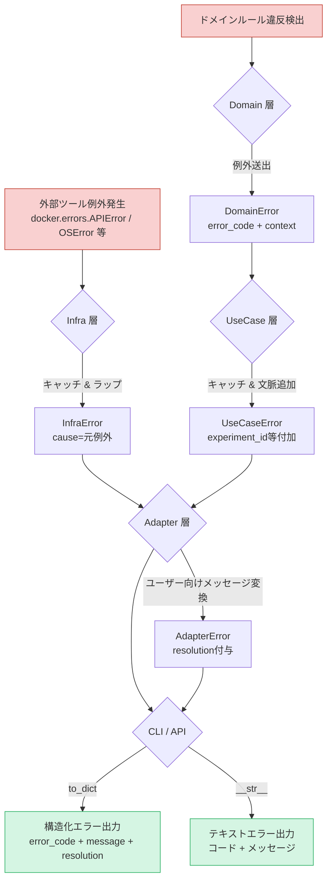

# 第8章 エラー設計

本章では、gridflow の例外クラス階層、エラーコード体系、およびエラーハンドリングの詳細設計を示す。基本設計書 第8章（信頼性設計）の方針を具体化し、レイヤー別の例外クラスとエラーコードを定義する。

## 更新履歴

| 版数 | 日付 | 変更内容 |
|---|---|---|
| 0.1 | 2026-04-03 | 初版作成（8.1〜8.2） |
| 0.2 | 2026-04-03 | 8.3〜8.5追記 |
| 0.3 | 2026-04-04 | ADR: エラー処理方式の設計判断を追加 |
| 0.4 | 2026-04-06 | 8.1.5 具象クラスにサブクラス追加、第3章との例外名統一（DD-REV-102） |
| 0.5 | 2026-04-07 | Phase0 結果レビュー対応: (1) 8.0.5 StepResult を Enum 化＋属性拡張（論点6.4）、(2) 8.1 冒頭にレイヤー配置指針を追記（論点6.3）、(3) PackNotFoundError を Domain 契約として明示。詳細経緯は `review_record.md` 参照 |

---

## 8.0 エラー処理方式の設計判断（ADR）

### 8.0.1 背景と問題

エラー処理の実装方式は、コードベース全体の品質・保守性・安全性に影響する重大な設計判断である。主要な選択肢は以下の通り。

| 方式 | 代表言語・仕組み | 長所 | 短所 |
|---|---|---|---|
| 例外（Exception） | Python, Java, C# | 正常系が簡潔。言語標準との親和性が高い | 制御フローが非局所的。静的検証が困難 |
| 戻り値（Result/Either型） | Rust `Result<T,E>`, Go `(val, err)` | エラー処理が明示的。コンパイル時に処理漏れを検出 | 正常系のコードにエラー処理が混在。Python では型強制力が弱い |
| エラーコード（整数） | C, POSIX, 組み込み | 軽量。リアルタイム制約に適合 | 型安全性なし。意味が不明確。呼び出し側の無視が容易 |

### 8.0.2 ミッションクリティカル分野の慣行

安全性が最優先の分野では、例外を禁止し戻り値ベースを採用するのが一般的である。

| 分野 | 規格・標準 | エラー処理方式 | 根拠 |
|---|---|---|---|
| 航空宇宙 | DO-178C | 例外禁止、戻り値 | スタック巻き戻しの予測不能性がリアルタイム制約と衝突 |
| 自動車 | MISRA C/C++ | 例外禁止、戻り値 | 制御フローの静的解析・認証が不可能 |
| 原子力 | IEC 61513 | 例外禁止、戻り値 | 全実行パスの形式検証が求められる |
| 電力SCADA/EMS | IEC 61850 | 例外最小化、エラーコード | C/C++実装が主流。制御ループのレイテンシ制約 |
| 金融HFT | 各社内規 | 例外最小化、戻り値 | 例外のオーバーヘッドがμs単位のレイテンシに直結 |

**共通の論拠:** 例外は throw 地点と catch 地点が分離するため、「全パスの振る舞いを静的に証明する」要求と根本的に衝突する。

### 8.0.3 gridflow の判断: 例外ベース + 戻り値ハイブリッド

**決定:** gridflow はPython例外を主軸とし、予測される失敗パターンには戻り値を併用するハイブリッド方式を採用する。

#### 判断根拠

| 観点 | ミッションクリティカル系 | gridflow | 判断への影響 |
|---|---|---|---|
| システム分類 | 制御系（リアルタイム） | 研究ワークフローツール（バッチ） | 例外のオーバーヘッドは無視できる |
| 失敗時の影響 | 停電・人命・資産損失 | 実験のやり直し | 安全性認証は不要 |
| 実行時間制約 | ms単位の応答保証 | 秒〜分単位 | スタック巻き戻しコストは問題にならない |
| 言語エコシステム | C/C++（例外はオプション） | Python（例外が言語の基本設計） | 標準ライブラリ・依存ライブラリが全て例外前提 |
| ユーザ層 | 専門エンジニア | 研究者（修士〜）。L2プラグイン開発 | `Result[T,E]` は API 複雑度を不必要に増加させる |
| 静的検証要求 | 全パスの形式証明 | なし（テストで品質保証） | 例外の非局所性は許容範囲 |

#### Python 固有の事情

Python は例外ベースの言語であり、標準ライブラリの全 API が例外を前提としている。

```python
# Python標準: 全て例外を送出する
open("missing.txt")          # FileNotFoundError
json.loads("{invalid}")       # json.JSONDecodeError
config["missing_key"]         # KeyError
int("not_a_number")           # ValueError
```

Python で戻り値ベースを徹底すると、全ての外部呼び出しを `try/except` でラップし `Result` に変換するコストが発生する。gridflow の依存ライブラリ（structlog, typer, pytest, docker SDK, dss-python）も全て例外ベースであり、ラップコストが膨大になる。

### 8.0.4 使い分け基準

| 条件 | 方式 | 理由 | 例 |
|---|---|---|---|
| 回復不能な障害 | **例外** | 呼び出し側に処理継続を許さない | Docker起動失敗、設定ファイル破損、OpenDSS収束不良 |
| 外部システムの予期しない障害 | **例外**（リトライ後） | リトライで回復しなければ中断すべき | Connector接続断、レジストリ通信エラー |
| バリデーション（正常な検査行為） | **戻り値** (`ValidationResult`) | 不正入力は「想定内」であり、検査結果を構造的に返すべき | `ScenarioRegistry.validate()`, `L1Config.validate()` |
| ヘルスチェック（状態問い合わせ） | **戻り値** (`HealthStatus`) | 不健全な状態も「正常な応答」であり、例外にすべきでない | `ConnectorInterface.health_check()` |
| ステップ実行結果 | **戻り値** (`StepResult`) | 成功・警告・エラーの3状態を構造的に返す | `ConnectorInterface.execute()` |
| 重大度 WARNING の検出 | **ログ出力**（処理継続） | 処理を中断するほどではないが記録すべき | 孤立ノード検出(E-10007)、seed未指定(E-20004) |

**原則:** 「呼び出し側がエラーの種類を見て分岐すべきか？」→ Yes なら戻り値。「呼び出し側は中断して上位に伝播すべきか？」→ Yes なら例外。

### 8.0.5 戻り値型の定義

gridflow で使用する戻り値型エラーの一覧。

| 型名 | 用途 | フィールド |
|---|---|---|
| `ValidationResult` | バリデーション結果 | `valid: bool`, `errors: list[ValidationError]`, `warnings: list[str]` |
| `HealthStatus` | コネクタ稼働状態 | `healthy: bool`, `message: str` |
| `StepResult` | ステップ実行結果 | `step_id: str`, `status: StepStatus` (Enum: SUCCESS\|WARNING\|ERROR), `data: tuple[tuple[str, object], ...]`, `elapsed_ms: float`, `timestamp: datetime`, `error: GridflowError \| None` |

これらは全て `dataclass(frozen=True)` で定義し、イミュータブルとする。`StepResult.status == StepStatus.ERROR` の場合、呼び出し側（Orchestrator）がエラー処理を行う責務を持ち、`error` 属性に格納された `GridflowError` を参照する。

> **v0.7 改訂（論点6.4）:** StepResult は当初 status: str / data: dict の3属性のみだったが、Phase 0 結果レビューで属性拡張・型安全化を決定した：
> - `status` を Enum (`StepStatus`) 化（型安全・誤値防止）
> - `data` を `tuple[tuple[str, object], ...]` 化（frozen 不変原則と整合、論点6.1）
> - `step_id` / `timestamp` / `error` を追加（識別・追跡・例外伝搬）
> - 完全なクラス設計は [03e_usecase_results.md §3.11.3](03e_usecase_results.md) 参照
> - 配置レイヤーは UseCase 層 (`gridflow.usecase.result`) に確定（旧 8.0.5 では未指定）

### 8.0.6 将来の方針転換条件（P2: HIL連携）

計画書の P2 機能（REQ-F-017: HIL連携）では、gridflow が実系統のハードウェアと接続する可能性がある。この場合、以下の条件で方針転換を検討する。

| 条件 | 転換内容 |
|---|---|
| 実系統制御パスに gridflow のコードが介在する場合 | 制御パス上のモジュールに限り、戻り値ベースに移行。`Result[T, GridflowError]` 型を導入 |
| IEC 61850 準拠の通信モジュールを実装する場合 | 当該モジュールに限り、例外を禁止。エラーコード（整数）ベースに移行 |
| リアルタイム制約（<100ms応答）が求められる場合 | 当該パスに限り、例外を禁止。事前割当バッファによるエラー報告に移行 |

**重要:** 方針転換は制御パス上のモジュールに限定する。研究ワークフロー（CLI → Orchestrator → Benchmark）の経路は例外ベースを維持する。全面的な戻り値ベースへの移行は、gridflow のユーザ層（研究者）と言語（Python）を考慮すると、得るものより失うものが大きい。

---

## 8.1 例外クラス階層設計

**関連要件**: REQ-Q-008 / DD-ERR-001

> **レイヤー配置の指針（v0.7 追記、論点6.3）:**
> - **Domain ルール違反系のエラー**は Domain 層に配置する。例: `PackNotFoundError`（「Pack は ID で一意に識別され実在する」という Domain 不変条件の違反）。これらは storage backend の実装詳細に依存しない契約として、Domain Protocol（例: `ScenarioRegistry`）の戻り値仕様で送出が宣言される。Infra 層実装はこの契約を満たす責務を負う。
> - **技術的失敗系のエラー**は Infra 層に配置する。例: `ContainerStartError`, `OpenDSSError`, `FileReadError`。これらは具体的な技術スタック・通信・OS 等に起因する。
> - **使い分け基準:** 「ユーザのアクションが原因（"指定したものが存在しない"）」→ Domain 系。「システム側の問題（"接続失敗"）」→ Infra 系。
> - 詳細経緯は `review_record.md` 論点6.3 参照。

### 8.1.1 クラス階層図

すべての gridflow 例外は `GridflowError` 基底クラスを継承する。基本設計書 8.1 の 5 分類（CONF / CONN / EXEC / DATA / SYS）を Clean Architecture の 4 レイヤーに再編成し、各レイヤーに具体的な派生クラスを配置する。

```mermaid
classDiagram
    class GridflowError {
        +error_code: str
        +message: str
        +context: dict
        +cause: Exception | None
        +to_dict() dict
        +__str__() str
    }

    class DomainError {
        +error_code: str
        +message: str
        +context: dict
        +cause: Exception | None
    }

    class UseCaseError {
        +error_code: str
        +message: str
        +context: dict
        +cause: Exception | None
    }

    class AdapterError {
        +error_code: str
        +message: str
        +context: dict
        +cause: Exception | None
    }

    class InfraError {
        +error_code: str
        +message: str
        +context: dict
        +cause: Exception | None
    }

    %% Domain 層
    class ScenarioPackError {
        +pack_id: str
    }
    class CDLValidationError {
        +field_path: str
        +expected_type: str
    }
    class MetricCalculationError {
        +metric_name: str
        +step_name: str
    }

    %% UseCase 層
    class SimulationError {
        +experiment_id: str
        +step_name: str
    }
    class BenchmarkError {
        +experiment_ids: list~str~
        +metric_name: str
    }

    %% Adapter 層
    class ConnectorError {
        +connector_name: str
        +endpoint: str
    }
    class OpenDSSError {
        +dss_command: str
        +dss_error_text: str
    }
    class CLIError {
        +command: str
        +exit_code: int
    }
    class PluginError {
        +plugin_name: str
        +plugin_version: str
    }

    %% Infra 層
    class OrchestratorError {
        +workflow_id: str
        +step_index: int
    }
    class ContainerError {
        +container_id: str
        +image_ref: str
    }
    class RegistryError {
        +registry_url: str
        +resource_key: str
    }
    class ConfigError {
        +config_path: str
        +key: str
    }

    GridflowError <|-- DomainError
    GridflowError <|-- UseCaseError
    GridflowError <|-- AdapterError
    GridflowError <|-- InfraError

    DomainError <|-- ScenarioPackError
    DomainError <|-- CDLValidationError
    DomainError <|-- MetricCalculationError

    UseCaseError <|-- SimulationError
    UseCaseError <|-- BenchmarkError

    AdapterError <|-- ConnectorError
    AdapterError <|-- OpenDSSError
    AdapterError <|-- CLIError
    AdapterError <|-- PluginError

    InfraError <|-- OrchestratorError
    InfraError <|-- ContainerError
    InfraError <|-- RegistryError
    InfraError <|-- ConfigError
```



### 8.1.2 基底クラス属性定義

`GridflowError` およびすべての派生クラスは以下の共通属性を持つ。

| 属性 | 型 | 必須 | 説明 |
|---|---|---|---|
| `error_code` | `str` | Yes | エラーコード（E-xxxx 体系、8.2 節参照） |
| `message` | `str` | Yes | 人間可読なエラーメッセージ。テンプレートに `context` を埋め込んで生成する |
| `context` | `dict` | Yes | エラー発生時の文脈情報。キー・値はサブクラスごとに定義する。空辞書を許容する |
| `cause` | `Exception \| None` | No | 元例外への参照。例外チェーンにより根本原因のトレーサビリティを確保する |

### 8.1.3 基底クラスメソッド定義

| メソッド | 戻り値 | 説明 |
|---|---|---|
| `to_dict()` | `dict` | `error_code`, `message`, `context` を辞書化して返す。ログ出力・API レスポンスで使用する |
| `__str__()` | `str` | `[{error_code}] {message}` 形式の文字列を返す。CLI 出力で使用する |

### 8.1.4 レイヤー別中間クラス定義

| 中間クラス | レイヤー | 説明 |
|---|---|---|
| `DomainError` | Domain | ビジネスルール違反に起因するエラー。Scenario Pack 構造不正、CDL バリデーション失敗、メトリクス計算異常を包含する |
| `UseCaseError` | UseCase | アプリケーションロジックの実行失敗。シミュレーション実行エラー、ベンチマーク比較エラーを包含する |
| `AdapterError` | Adapter | 外部システムとの連携失敗。コネクタ接続エラー、OpenDSS 実行エラー、CLI パースエラー、プラグインエラーを包含する |
| `InfraError` | Infra | 基盤レイヤーの障害。オーケストレータエラー、コンテナエラー、レジストリエラー、設定読込エラーを包含する |

### 8.1.5 具象クラス定義

各カテゴリベース親クラスの下に、第3章のクラス設計で使用される操作固有のサブクラスを定義する。

#### Domain 層

| 親クラス | サブクラス | 固有属性 | 説明 |
|---|---|---|---|
| `ScenarioPackError` | — | `pack_id: str` | Scenario Pack のスキーマ不正、ハッシュ不一致、バージョン非互換など |
| | `PackNotFoundError` | `pack_id: str` | 指定された pack_id の Pack が Registry に存在しない。**Domain 契約**として `ScenarioRegistry` Protocol（[03a §3.2.4](03a_domain_classes.md)）の `get()` 戻り値仕様で送出が宣言される。Infra 層実装（FileScenarioRegistry 等）はこの契約を満たす責務を負う（v0.7 論点6.3） |
| `CDLValidationError` | — | `field_path: str`, `expected_type: str` | CDL データモデルのバリデーション失敗 |
| `MetricCalculationError` | — | `metric_name: str`, `step_name: str` | メトリクス計算中の異常 |

#### UseCase 層

| 親クラス | サブクラス | 固有属性 | 説明 |
|---|---|---|---|
| `SimulationError` | — | `experiment_id: str`, `step_name: str` | シミュレーション実行中の失敗 |
| | `ExecutionError` | `experiment_id: str`, `step_name: str` | ステップ実行の汎用エラー |
| `BenchmarkError` | — | `experiment_ids: list[str]`, `metric_name: str` | ベンチマーク比較処理の失敗 |
| | `NoComparableMetricsError` | `experiment_ids: list[str]` | 比較対象メトリクスが実験に存在しない |

#### Adapter 層

| 親クラス | サブクラス | 固有属性 | 説明 |
|---|---|---|---|
| `ConnectorError` | — | `connector_name: str`, `endpoint: str` | 外部シミュレータへの接続失敗 |
| | `ConnectorInitError` | `connector_name: str` | Connector 初期化失敗（E-30001） |
| | `ConnectorExecuteError` | `connector_name: str`, `step: int` | ステップ実行エラー（E-30002） |
| | `ConnectorTeardownError` | `connector_name: str` | 終了処理失敗（E-30003） |
| `OpenDSSError` | — | `dss_command: str`, `dss_error_text: str` | OpenDSS 固有のエラー |
| `CLIError` | — | `command: str`, `exit_code: int` | CLI コマンドのパースエラー |
| | `CLIArgumentError` | `command: str`, `argument: str` | CLI 引数の不正 |
| `PluginError` | — | `plugin_name: str`, `plugin_version: str` | プラグイン関連エラー |
| | `PluginAlreadyRegisteredError` | `plugin_name: str` | 同名プラグインの重複登録（E-30010） |
| | `PluginNotFoundError` | `plugin_name: str` | プラグインが見つからない（E-30011） |
| | `PluginLoadError` | `plugin_name: str`, `reason: str` | プラグインロード失敗（E-30012） |
| `ExportError` | — | `format: str`, `output_path: str` | エクスポート処理の失敗（E-30013） |
| `UnsupportedFormatError` | — | `format: str`, `supported: list[str]` | 未対応出力フォーマット（E-30014） |

#### Infra 層

| 親クラス | サブクラス | 固有属性 | 説明 |
|---|---|---|---|
| `OrchestratorError` | — | `workflow_id: str`, `step_index: int` | ワークフロー実行制御の異常 |
| | `ExperimentNotFoundError` | `experiment_id: str` | 指定実験 ID が存在しない |
| | `ServiceNotFoundError` | `service_name: str` | Docker サービスが起動していない |
| `ContainerError` | — | `container_id: str`, `image_ref: str` | Docker コンテナの操作失敗 |
| | `ContainerStartError` | `container_id: str`, `image_ref: str` | コンテナ起動失敗 |
| | `ContainerStopError` | `container_id: str` | コンテナ停止失敗 |
| `RegistryError` | — | `registry_url: str`, `resource_key: str` | Registry アクセス失敗 |
| | `TemplateNotFoundError` | `template_name: str` | テンプレートが見つからない |
| `ConfigError` | — | `config_path: str`, `key: str` | 設定ファイル関連エラー |
| | `ConfigValidationError` | `key: str`, `reason: str` | 設定バリデーション失敗（E-40008） |
| | `ConfigKeyNotFoundError` | `key: str` | 必須キー欠損（E-40009） |
| | `ConfigTypeError` | `key: str`, `expected: str`, `actual: str` | 設定値の型不正（E-40010） |
| | `ConfigFileNotFoundError` | `config_path: str` | 設定ファイル読込失敗（E-40011） |
| | `ConfigParseError` | `config_path: str`, `reason: str` | 設定ファイルパース失敗 |

### 8.1.6 例外チェーンポリシー

- レイヤー境界を跨ぐ際は、下位レイヤーの例外を `cause` に格納し、上位レイヤーの例外でラップする
- 例: OpenDSS の `RuntimeError` → `OpenDSSError(cause=e)` → `SimulationError(cause=opendss_err)`
- `cause` チェーンは `to_dict()` で再帰的に展開し、ログへ全階層を記録する

---

## 8.2 エラーコード一覧（E-xxxx 体系）

**関連要件**: REQ-Q-008 / DD-ERR-002

### 8.2.1 コード体系

エラーコードは `E-{レイヤー2桁}{連番3桁}` の形式で付番する。

| レイヤー接頭辞 | レイヤー | 範囲 |
|---|---|---|
| `E-10` | Domain 層 | E-10001 〜 E-10999 |
| `E-20` | UseCase 層 | E-20001 〜 E-20999 |
| `E-30` | Adapter 層 | E-30001 〜 E-30999 |
| `E-40` | Infrastructure 層 | E-40001 〜 E-40999 |

### 8.2.2 重大度定義

| 重大度 | ラベル | 説明 |
|---|---|---|
| CRITICAL | 致命的 | システム全体の継続実行が不可能。即時停止が必要 |
| ERROR | 重大 | 当該処理は失敗するが、他の処理への影響は限定的 |
| WARNING | 警告 | 処理は継続可能だが、結果の正確性に影響する可能性がある |

### 8.2.3 エラーコード一覧

#### Domain 層（E-10xxx）

| コード | 例外クラス | メッセージテンプレート | 重大度 | 対処方針 |
|---|---|---|---|---|
| E-10001 | ScenarioPackError | Scenario Pack '{pack_id}' のスキーマが不正です | ERROR | pack.yaml のスキーマバージョンを確認し、必要に応じて `gridflow migrate` を実行する |
| E-10002 | ScenarioPackError | Scenario Pack '{pack_id}' のハッシュが一致しません（期待: {expected}, 実際: {actual}） | ERROR | Scenario Pack ファイルが改変されていないか確認する。再ダウンロードまたは再作成を行う |
| E-10003 | ScenarioPackError | Scenario Pack '{pack_id}' のバージョン '{version}' は非対応です | ERROR | `gridflow migrate` でスキーマを最新バージョンへ移行する |
| E-10004 | ScenarioPackError | Scenario Pack '{pack_id}' に必須フィールド '{field}' が存在しません | ERROR | pack.yaml に必須フィールドを追加する。スキーマ定義を参照のこと |
| E-10005 | CDLValidationError | CDL フィールド '{field_path}' の型が不正です（期待: {expected_type}, 実際: {actual_type}） | ERROR | 入力データの型を修正する。CDL スキーマ定義を参照のこと |
| E-10006 | CDLValidationError | CDL フィールド '{field_path}' の値が許容範囲外です（値: {value}, 範囲: {range}） | ERROR | 入力値を許容範囲内に修正する |
| E-10007 | CDLValidationError | CDL トポロジの接続グラフに孤立ノードが検出されました（ノード: {node_ids}） | WARNING | トポロジ定義を確認し、孤立ノードを接続するか削除する |
| E-10008 | CDLValidationError | CDL 時系列データの時刻インデックスに重複があります（フィールド: {field_path}） | ERROR | 入力時系列データの重複タイムスタンプを除去する |
| E-10009 | MetricCalculationError | メトリクス '{metric_name}' の計算でゼロ除算が発生しました（ステップ: {step_name}） | ERROR | 入力データを確認し、分母がゼロにならない条件を検証する |
| E-10010 | MetricCalculationError | メトリクス '{metric_name}' の計算結果が NaN です（ステップ: {step_name}） | ERROR | 入力データに欠損値・無効値がないか確認する |
| E-10011 | MetricCalculationError | メトリクス '{metric_name}' の計算結果が閾値を超過しました（値: {value}, 閾値: {threshold}） | WARNING | 入力データおよびシミュレーション設定を見直す |

#### UseCase 層（E-20xxx）

| コード | 例外クラス | メッセージテンプレート | 重大度 | 対処方針 |
|---|---|---|---|---|
| E-20001 | SimulationError | シミュレーション '{experiment_id}' のステップ '{step_name}' がタイムアウトしました | ERROR | タイムアウト値を延長するか、シミュレーション規模を縮小する |
| E-20002 | SimulationError | シミュレーション '{experiment_id}' の依存ステップ '{step_name}' が未完了です | ERROR | 依存ステップを先に実行するか、`--from-step` で再開する |
| E-20003 | SimulationError | シミュレーション '{experiment_id}' のステップ '{step_name}' で予期しないエラーが発生しました | CRITICAL | ログを確認し、`cause` チェーンから根本原因を特定する |
| E-20004 | SimulationError | シミュレーション '{experiment_id}' の seed が未指定です。自動生成された seed: {seed} | WARNING | 再現性が必要な場合は Scenario Pack に seed を明示指定する |
| E-20005 | BenchmarkError | ベンチマーク比較に必要な実験数が不足しています（必要: {required}, 現在: {actual}） | ERROR | 比較対象の実験を追加実行する |
| E-20006 | BenchmarkError | ベンチマーク比較でメトリクス '{metric_name}' が実験 '{experiment_id}' に存在しません | ERROR | 対象実験で当該メトリクスが算出されているか確認する |
| E-20007 | BenchmarkError | ベンチマーク比較で実験間のスキーマバージョンが一致しません | ERROR | 同一スキーマバージョンの実験同士で比較する |
| E-20008 | SimulationError | シミュレーション '{experiment_id}' の中間結果の復元に失敗しました | ERROR | 中間ファイルの破損を確認し、最初のステップから再実行する |

#### Adapter 層（E-30xxx）

| コード | 例外クラス | メッセージテンプレート | 重大度 | 対処方針 |
|---|---|---|---|---|
| E-30001 | ConnectorError | コネクタ '{connector_name}' がエンドポイント '{endpoint}' への接続に失敗しました | ERROR | ネットワーク接続およびエンドポイントの稼働状態を確認する |
| E-30002 | ConnectorError | コネクタ '{connector_name}' の認証に失敗しました（エンドポイント: {endpoint}） | ERROR | 認証情報（API キー・トークン）を確認・更新する |
| E-30003 | ConnectorError | コネクタ '{connector_name}' のレスポンスが不正です（ステータス: {status_code}） | ERROR | コネクタのバージョン互換性を確認する。サーバー側ログも参照する |
| E-30004 | OpenDSSError | OpenDSS コマンド '{dss_command}' の実行に失敗しました: {dss_error_text} | ERROR | DSS コマンドの構文および入力モデルを確認する |
| E-30005 | OpenDSSError | OpenDSS の潮流計算が収束しませんでした（コマンド: {dss_command}） | ERROR | ネットワークモデルのパラメータを見直す。収束条件の緩和を検討する |
| E-30006 | OpenDSSError | OpenDSS のバージョンが非対応です（検出: {detected}, 要求: {required}） | ERROR | 対応バージョンの OpenDSS をインストールする |
| E-30007 | CLIError | CLI コマンド '{command}' の引数が不正です | ERROR | `gridflow {command} --help` でヘルプを参照する |
| E-30008 | CLIError | CLI コマンド '{command}' の実行に権限が不足しています | ERROR | 適切な権限でコマンドを再実行する |
| E-30009 | PluginError | プラグイン '{plugin_name}' のロードに失敗しました | ERROR | プラグインのインストール状態とバージョン互換性を確認する |
| E-30010 | PluginError | プラグイン '{plugin_name}' ({plugin_version}) のインターフェースが不一致です | ERROR | プラグインを対応バージョンに更新する |

#### Infrastructure 層（E-40xxx）

| コード | 例外クラス | メッセージテンプレート | 重大度 | 対処方針 |
|---|---|---|---|---|
| E-40001 | OrchestratorError | ワークフロー '{workflow_id}' の DAG 構築に失敗しました（循環依存を検出） | CRITICAL | ワークフロー定義のステップ依存関係を見直し、循環を解消する |
| E-40002 | OrchestratorError | ワークフロー '{workflow_id}' のステップ {step_index} のスケジューリングに失敗しました | ERROR | リソース制約およびステップ定義を確認する |
| E-40003 | ContainerError | Docker コンテナの起動に失敗しました（イメージ: {image_ref}） | CRITICAL | Docker デーモンの稼働状態とイメージの存在を確認する |
| E-40004 | ContainerError | Docker イメージ '{image_ref}' の取得に失敗しました | ERROR | レジストリへの接続およびイメージ名・タグを確認する |
| E-40005 | ContainerError | コンテナ '{container_id}' がリソース制限を超過しました（メモリ上限超過） | ERROR | コンテナのリソース制限値を引き上げるか、処理規模を縮小する |
| E-40006 | RegistryError | Scenario Pack レジストリ '{registry_url}' への接続に失敗しました | ERROR | レジストリの URL およびネットワーク接続を確認する |
| E-40007 | RegistryError | リソース '{resource_key}' がレジストリ '{registry_url}' に見つかりません | ERROR | リソースキーの綴りおよびレジストリの内容を確認する |
| E-40008 | ConfigError | 設定ファイル '{config_path}' の読込に失敗しました | CRITICAL | ファイルの存在およびアクセス権限を確認する |
| E-40009 | ConfigError | 設定ファイル '{config_path}' の必須キー '{key}' が未定義です | ERROR | 設定ファイルに必須キーを追加する。設定スキーマを参照のこと |
| E-40010 | ConfigError | 設定ファイル '{config_path}' のキー '{key}' の値が不正です（期待型: {expected_type}） | ERROR | 設定値を正しい型に修正する |
| E-40011 | ConfigError | 環境変数 '{env_var}' が未定義です | ERROR | 必要な環境変数を設定する。`.env.example` を参照のこと |

### 8.2.4 基本設計エラーコードとの対応

基本設計書 8.1 節のエラーコード体系（CONF / CONN / EXEC / DATA / SYS）と詳細設計の E-xxxx 体系の対応を以下に示す。

| 基本設計コード | 基本設計分類 | 詳細設計コード範囲 | 対応例外クラス群 |
|---|---|---|---|
| CONF-xxx | 設定エラー | E-10001〜E-10004, E-40008〜E-40011 | ScenarioPackError, ConfigError |
| CONN-xxx | コネクタエラー | E-30001〜E-30006 | ConnectorError, OpenDSSError |
| EXEC-xxx | 実行エラー | E-20001〜E-20008, E-40001〜E-40002 | SimulationError, BenchmarkError, OrchestratorError |
| DATA-xxx | データエラー | E-10005〜E-10011 | CDLValidationError, MetricCalculationError |
| SYS-xxx | システムエラー | E-40003〜E-40007 | ContainerError, RegistryError |

---

## 8.3 エラーハンドリングポリシー（層別）

**関連要件**: REQ-Q-008 / DD-ERR-003

基本設計書 8.1 節の「例外チェーン」「resolution 必須」方針を具体化し、Clean Architecture の各レイヤーにおける例外の捕捉・再送出ルールを定義する。

### 8.3.1 レイヤー別ハンドリングルール

| レイヤー | 例外捕捉ルール | 再送出ルール | 責務 |
|---|---|---|---|
| Domain 層 | 例外をキャッチしない | ビジネスルール違反を検出した場合、`DomainError` 派生クラスを送出する | ドメインロジックの不整合を検知し、エラーコード・コンテキストを付与して即座に送出する |
| UseCase 層 | `DomainError` をキャッチする | 文脈情報（`experiment_id`, `step_name` 等）を追加し、`UseCaseError` 派生クラスでラップして再送出する | ユースケース実行中のドメインエラーに実行文脈を付加し、上位層が原因を特定可能にする |
| Adapter 層 | `UseCaseError` をキャッチする | ユーザー向けメッセージ（`resolution`）を付与し、`AdapterError` 派生クラスに変換して送出する。CLI 出力・API レスポンス用に `to_dict()` で構造化する | エラーをユーザー可読な形式に変換し、対処手順を提示する |
| Infra 層 | 外部ツール例外（`docker.errors.APIError`, `FileNotFoundError`, `OSError` 等）をキャッチする | `InfraError` 派生クラスでラップし、元例外を `cause` に格納して Adapter 層へ送出する | 外部依存の生例外をアプリケーション例外に正規化し、例外チェーンを構成する |

### 8.3.2 ハンドリングフロー



### 8.3.3 禁止事項

| 項目 | 説明 |
|---|---|
| 例外の握りつぶし | `except: pass` や空の `except` ブロックは禁止する。すべての例外はログ記録または再送出しなければならない |
| レイヤーの飛び越え | Infra 層の例外を UseCase 層で直接キャッチしてはならない。必ず Adapter 層を経由する |
| 生例外の露出 | 外部ライブラリの例外をそのまま上位レイヤーへ伝播させてはならない。必ず gridflow 例外でラップする |
| `cause` チェーンの省略 | レイヤー境界での例外ラップ時に `cause` を省略してはならない。根本原因のトレーサビリティを維持する |

---

## 8.4 リトライ・フォールバック設計

**関連要件**: REQ-Q-008 / DD-ERR-004

基本設計書 8.4 節の障害復旧方針を具体化し、一時的障害に対するリトライ戦略とフォールバック動作を定義する。

### 8.4.1 リトライ対象操作一覧

| 操作名 | 対象例外 | 最大リトライ回数 | バックオフ戦略 | タイムアウト（1回あたり） | タイムアウト（全体） | フォールバック動作 |
|---|---|---|---|---|---|---|
| Connector 実行 | `ConnectorError` (E-30001, E-30003) | 3 | 指数バックオフ（1s, 2s, 4s） + ジッター（0〜500ms） | 30s | 120s | エラーログ出力後、`ConnectorError` を送出して当該ステップを失敗とする |
| Docker コンテナ起動 | `ContainerError` (E-40003) | 2 | 固定間隔（5s） | 60s | 180s | Docker デーモンの状態をヘルスチェックし、応答なしの場合は `CRITICAL` ログを出力して処理を中断する |
| Docker イメージ取得 | `ContainerError` (E-40004) | 3 | 指数バックオフ（2s, 4s, 8s） + ジッター（0〜1000ms） | 120s | 600s | ローカルキャッシュにイメージが存在する場合はキャッシュを使用する。存在しない場合は `ContainerError` を送出する |
| ファイル I/O（読込） | `OSError`, `IOError` | 2 | 固定間隔（1s） | 10s | 30s | 読込失敗時に対象パスのアクセス権限と存在を検証し、具体的な `resolution` を含む `ConfigError` を送出する |
| ファイル I/O（書込） | `OSError`, `IOError` | 2 | 固定間隔（1s） | 10s | 30s | 書込失敗時に一時ディレクトリへのフォールバック書込を試行する。それも失敗した場合は `ConfigError` を送出する |
| Scenario Pack レジストリ通信 | `RegistryError` (E-40006) | 3 | 指数バックオフ（1s, 2s, 4s） + ジッター（0〜500ms） | 30s | 120s | ローカルレジストリキャッシュが利用可能な場合はキャッシュから応答する。キャッシュなしの場合は `RegistryError` を送出する |
| OpenDSS コマンド実行 | `OpenDSSError` (E-30004) | 1 | なし（即時リトライ） | 300s | 600s | リトライ失敗時は中間結果を保存し、`--from-step` による再開を `resolution` に含めて `OpenDSSError` を送出する |

### 8.4.2 リトライ実装方針

- リトライロジックは `gridflow.infra.retry` モジュールにデコレータとして実装する
- デコレータ `@with_retry(max_retries, backoff, timeout)` を対象操作に適用する
- リトライの各試行はログレベル `WARNING` で記録する（試行回数、待機時間、エラー内容）
- 最大リトライ到達時はログレベル `ERROR` で記録し、フォールバック動作に移行する
- バックオフのジッターは `random.uniform(0, jitter_max)` で算出する（seed 管理対象外）

### 8.4.3 サーキットブレーカー

連続障害が発生する外部依存に対して、サーキットブレーカーパターンを適用する。

| パラメータ | 値 | 説明 |
|---|---|---|
| 障害閾値 | 5回 | この回数連続で失敗するとサーキットを OPEN にする |
| OPEN 期間 | 60s | サーキット OPEN 中はリクエストを即座に拒否する |
| HALF-OPEN 試行数 | 1回 | OPEN 期間経過後に試行し、成功すれば CLOSED に復帰する |
| 適用対象 | Connector 実行、レジストリ通信 | ネットワーク依存の操作に限定して適用する |

---

## 8.5 ログ出力仕様（structlog フォーマット・レベル）

**関連要件**: REQ-Q-008, REQ-Q-009 / DD-ERR-005

基本設計書 8.3 節の StructuredLogger インターフェースおよび JSON 構造化ログ方針を具体化し、structlog を用いたログ出力仕様を定義する。

### 8.5.1 structlog 設定方針

| 項目 | 設定値 | 説明 |
|---|---|---|
| ライブラリ | `structlog` >= 24.1.0 | 構造化ログの基盤ライブラリ |
| レンダラー（コンソール） | `structlog.dev.ConsoleRenderer` | 開発・CLI 使用時は人間可読なカラー出力を採用する |
| レンダラー（ファイル） | `structlog.processors.JSONRenderer` | ファイル出力は JSON 形式で機械処理に適した形式とする |
| プロセッサチェーン | `add_log_level` -> `TimeStamper(fmt="iso")` -> `StackInfoRenderer` -> `format_exc_info` -> `JSONRenderer` / `ConsoleRenderer` | プロセッサを順次適用し、最終レンダラーで出力する |
| コンテキスト変数 | `structlog.contextvars` | 非同期処理・スレッド間で実行コンテキスト（`experiment_id` 等）を共有する |
| ラッパークラス | `structlog.stdlib.BoundLogger` | 標準ライブラリ `logging` との互換性を確保する |
| 非同期出力 | `QueueHandler` + バックグラウンドスレッド | メインスレッドのブロックを回避する（REQ-Q-010 準拠） |

### 8.5.2 ログレベル定義

| レベル | 用途 | 出力先 | 出力条件 |
|---|---|---|---|
| `DEBUG` | 内部変数値、CDL 中間データ、詳細なフロー追跡 | ファイルのみ（`~/.gridflow/logs/`） | `--verbose` フラグ指定時、または設定ファイルで `log_level: DEBUG` 指定時 |
| `INFO` | ステップ開始・完了、Scenario Pack ロード、メトリクス算出完了 | コンソール + ファイル | デフォルト出力レベル |
| `WARNING` | リトライ発生、seed 未指定の自動生成、非推奨機能の使用、閾値超過 | コンソール + ファイル | 常時出力 |
| `ERROR` | 処理失敗（当該ステップは中断、他ステップへの影響は限定的） | コンソール + ファイル + 結果ディレクトリ | 常時出力 |
| `CRITICAL` | システム全体の継続不可（Docker デーモン応答なし、DAG 循環検出等） | コンソール + ファイル + 結果ディレクトリ | 常時出力 |

### 8.5.3 構造化ログフィールド定義

| フィールド名 | 型 | 必須 | 説明 | 例 |
|---|---|---|---|---|
| `timestamp` | `str` (ISO 8601) | Yes | ログ出力時刻（UTC） | `"2026-04-03T10:30:00.123Z"` |
| `level` | `str` | Yes | ログレベル | `"INFO"` |
| `event` | `str` | Yes | イベント名（人間可読なメッセージ） | `"Simulation step completed"` |
| `module` | `str` | Yes | ログ出力元モジュールパス | `"gridflow.usecase.simulation"` |
| `error_code` | `str` | No | エラーコード（ERROR / CRITICAL 時に付与） | `"E-20001"` |
| `context` | `dict` | No | 追加のコンテキスト情報 | `{"network": "ieee13", "variant": 3}` |
| `experiment_id` | `str` | No | 実験 ID（実験実行中のみ） | `"exp-20260403-001"` |
| `step_name` | `str` | No | ステップ名（ステップ実行中のみ） | `"opendss_simulation"` |
| `duration_ms` | `int` | No | 処理所要時間（ミリ秒、`timed()` 使用時に自動付与） | `4523` |
| `retry_count` | `int` | No | リトライ回数（リトライ発生時のみ） | `2` |
| `cause` | `str` | No | 元例外の文字列表現（エラー時のみ） | `"FileNotFoundError: config.yaml"` |
| `resolution` | `str` | No | ユーザー向け対処手順（ERROR / CRITICAL 時に付与） | `"設定ファイルの存在を確認してください"` |

### 8.5.4 ログ出力先

| 出力先 | パス | 対象レベル | 形式 | 説明 |
|---|---|---|---|---|
| コンソール（stderr） | - | INFO 以上（`--verbose` 時は DEBUG 以上） | `ConsoleRenderer`（カラー付きテキスト） | CLI 使用時のリアルタイムフィードバック |
| アプリケーションログ | `~/.gridflow/logs/gridflow.log` | DEBUG 以上 | JSON（1行1レコード） | アプリケーション全体のログを集約する |
| 実験ログ | `~/.gridflow/logs/experiments/{experiment_id}.log` | DEBUG 以上 | JSON（1行1レコード） | 実験単位のログを分離し、`gridflow logs --experiment` で抽出可能にする |
| 結果ディレクトリログ | `{scenario_pack}/results/{experiment_id}/error.log` | ERROR 以上 | JSON（1行1レコード） | Scenario Pack 結果ディレクトリにエラーログを保存し、再現性検証に使用する |

### 8.5.5 ログローテーション設定

| パラメータ | アプリケーションログ | 実験ログ |
|---|---|---|
| ローテーション契機 | ファイルサイズ 10 MB | ファイルサイズ 5 MB |
| 保持世代数 | 5 世代 | 3 世代 |
| 保持期間 | 30 日 | 実験完了後 90 日 |
| 圧縮 | gzip（ローテーション済みファイルを圧縮） | gzip |
| 実装 | `logging.handlers.RotatingFileHandler` + カスタム期間チェック | `logging.handlers.RotatingFileHandler` + カスタム期間チェック |

### 8.5.6 ログ出力例

```json
{
  "timestamp": "2026-04-03T10:30:00.123Z",
  "level": "ERROR",
  "event": "Simulation step failed",
  "module": "gridflow.usecase.simulation",
  "error_code": "E-20001",
  "experiment_id": "exp-20260403-001",
  "step_name": "opendss_simulation",
  "duration_ms": 30000,
  "retry_count": 3,
  "cause": "ConnectorError: コネクタ 'opendss' がエンドポイント 'localhost:5000' への接続に失敗しました",
  "resolution": "タイムアウト値を延長するか、シミュレーション規模を縮小する",
  "context": {
    "network": "ieee13",
    "variant": 3,
    "timeout_seconds": 30
  }
}
