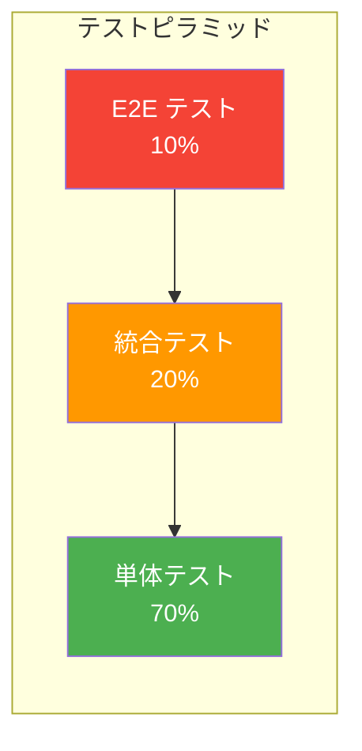
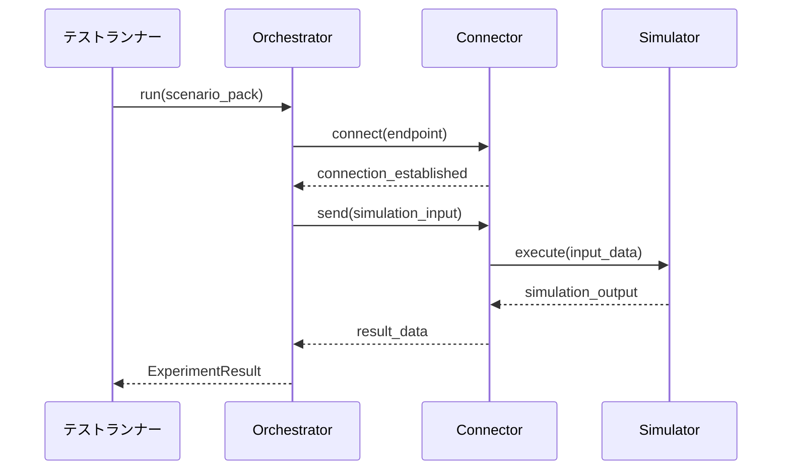
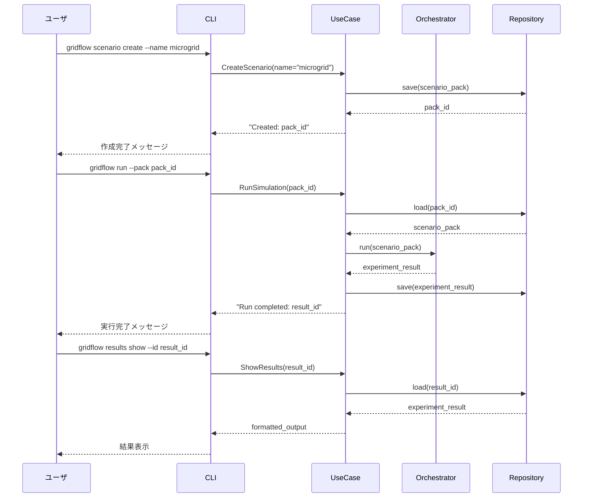
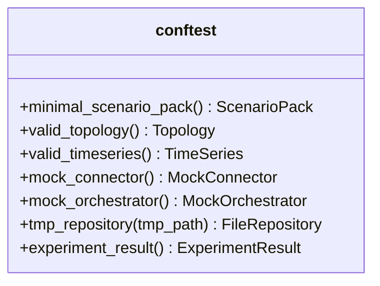

# 第10章 テスト詳細設計
## 更新履歴
| 版数 | 日付 | 変更内容 |
|---|---|---|
| 0.1 | 2026-04-03 | 初版作成 |
| 0.2 | 2026-04-04 | DD-TST ID追加、REQトレーサビリティ表追加、用語統一（統合→結合） |

---

## 10.1 テストケース設計方針

**関連要件**: REQ-Q-001〜REQ-Q-011（品質要求全般）

### DD-TST ID 体系

| DD-TST | テスト区分 | 対応テストID | 説明 |
|---|---|---|---|
| DD-TST-001 | 単体テスト | UT-001〜UT-005 | Domain層（ScenarioPack, CDL）の正確性検証 |
| DD-TST-002 | 単体テスト | UT-006〜UT-010 | UseCase層の正確性検証 |
| DD-TST-003 | 単体テスト | UT-011〜UT-015 | Adapter層（CLI, Connector, Exporter）の正確性検証 |
| DD-TST-004 | 単体テスト | UT-016〜UT-020 | Infra層（Repository, Orchestrator）の正確性検証 |
| DD-TST-005 | 結合テスト | IT-001〜IT-005 | モジュール間連携の正確性検証 |
| DD-TST-006 | E2Eテスト | E2E-001〜E2E-003 | ユーザシナリオに沿った端到端の動作検証 |
| DD-TST-007 | 品質属性テスト | QA-1〜QA-11 | 非機能要件（性能、再現性、ポータビリティ等）の検証 |

### REQ → テストケース トレーサビリティ

| 要件 ID | 要件名 | 検証テストID | 検証方法 |
|---|---|---|---|
| REQ-F-001 | Scenario Pack + Registry | UT-001, UT-002, UT-005, UT-016〜018, IT-004, E2E-003 | Pack生成・保存・読込・バリデーションの各段階で検証 |
| REQ-F-002 | Orchestrator | UT-019, UT-020, IT-001, IT-005, E2E-001 | 起動・停止・Connector連携・Docker連携で検証 |
| REQ-F-003 | CDL | UT-003, UT-004, UT-015, IT-003, QA-7 | CDL生成・バリデーション・エクスポート・スキーマ準拠で検証 |
| REQ-F-004 | Benchmark Harness | UT-008, E2E-002 | 実験比較・ベンチマークレポート生成で検証 |
| REQ-F-005 | CLI | UT-011, UT-012, IT-002, E2E-001〜003 | コマンドパース・UseCase連携・E2Eフローで検証 |
| REQ-F-007 | Connectors | UT-013, UT-014, IT-001, IT-005 | Connector初期化・接続・Orchestrator連携で検証 |
| REQ-Q-001 | 導入容易性 | QA-1 | クリーン環境セットアップ < 30分 |
| REQ-Q-003 | 再現性 | QA-3 | 同一seed 2回実行で結果完全一致 |
| REQ-Q-007 | ポータビリティ | QA-5, DD-TST-007 | AMD64 + ARM64 でのDockerビルド・実行テスト |
| REQ-Q-010 | 性能効率 | QA-5 | 標準ベンチマークPackで実行時間計測 |

### テストピラミッド



| 区分 | IPA用語 | 比率 | DD-TST | 目的 |
|---|---|---|---|---|
| 単体テスト（Unit Test） | 単体テスト | 70% | DD-TST-001〜004 | 個々のクラス・関数の正確性を検証 |
| 結合テスト（Integration Test） | 結合テスト | 20% | DD-TST-005 | モジュール間連携の正確性を検証 |
| E2Eテスト（End-to-End Test） | 総合テスト | 10% | DD-TST-006 | ユーザシナリオに沿った端到端の動作を検証 |

### カバレッジ目標

- **ラインカバレッジ**: 80%以上
- **ブランチカバレッジ**: 75%以上（推奨）

### テストフレームワーク・ツール

| ツール | 用途 |
|---|---|
| pytest | テストランナー |
| pytest-asyncio | 非同期テストサポート |
| pytest-cov | カバレッジ計測 |
| unittest.mock | モック・スタブ生成 |
| pytest-mock | pytest向けモックヘルパー |
| testcontainers-python | Docker統合テスト |

---

## 10.2 単体テスト設計（モジュール別）

**関連要件**: REQ-Q-003

### テストケース一覧

#### Domain層（UT-001 〜 UT-005）

| テストID | 対象モジュール | テスト内容 | 入力 | 期待結果 |
|---|---|---|---|---|
| UT-001 | domain.scenario | ScenarioPack生成 正常系 | 有効なpack.yaml | ScenarioPackオブジェクトが生成される |
| UT-002 | domain.scenario | PackMetadataバリデーション 異常系 | 不正なバージョン文字列 | CDLValidationError送出 |
| UT-003 | domain.cdl | Topology生成 正常系 | ノード・エッジリスト | Topologyオブジェクトが生成される |
| UT-004 | domain.cdl | TimeSeries範囲検証 異常系 | 空のtimestamps | CDLValidationError送出 |
| UT-005 | domain.scenario | ScenarioPack更新 正常系 | 既存Pack + 差分パラメータ | 更新されたScenarioPackオブジェクト |

#### UseCase層（UT-006 〜 UT-010）

| テストID | 対象モジュール | テスト内容 | 入力 | 期待結果 |
|---|---|---|---|---|
| UT-006 | usecase.run_simulation | RunSimulation正常系 | 有効なScenarioPack | ExperimentResultオブジェクト |
| UT-007 | usecase.run_simulation | RunSimulation異常系 | 不正なScenarioPack | ValidationError送出 |
| UT-008 | usecase.compare_experiments | 実験比較 正常系 | 2つのExperimentResult | ComparisonReportオブジェクト |
| UT-009 | usecase.validate_pack | Packバリデーション 正常系 | 有効なScenarioPack | ValidationResult(valid=True) |
| UT-010 | usecase.validate_pack | Packバリデーション 異常系 | スキーマ不整合Pack | ValidationResult(valid=False, errors=[...]) |

#### Adapter層（UT-011 〜 UT-015）

| テストID | 対象モジュール | テスト内容 | 入力 | 期待結果 |
|---|---|---|---|---|
| UT-011 | adapter.cli | CLIコマンドパース 正常系 | "scenario create --name test" | 正しいコマンドオブジェクト |
| UT-012 | adapter.cli | CLIコマンドパース 異常系 | 不正なサブコマンド | UsageError送出 |
| UT-013 | adapter.connector | Connector初期化 正常系 | 有効なConnector設定 | Connectorインスタンス |
| UT-014 | adapter.connector | Connector接続失敗 | 到達不能なエンドポイント | ConnectionError送出 |
| UT-015 | adapter.exporter | CDLエクスポート 正常系 | ExperimentResult | 正しいフォーマットのCDLファイル出力 |

#### Infra層（UT-016 〜 UT-020）

| テストID | 対象モジュール | テスト内容 | 入力 | 期待結果 |
|---|---|---|---|---|
| UT-016 | infra.repository | ScenarioPack保存 正常系 | ScenarioPackオブジェクト | ファイルシステムに永続化される |
| UT-017 | infra.repository | ScenarioPack読込 正常系 | 有効なPack ID | ScenarioPackオブジェクト |
| UT-018 | infra.repository | ScenarioPack読込 異常系 | 存在しないPack ID | PackNotFoundError送出 |
| UT-019 | infra.orchestrator | Orchestrator起動 正常系 | 有効な実行設定 | Orchestratorインスタンス(running状態) |
| UT-020 | infra.orchestrator | Orchestrator停止 正常系 | 実行中Orchestrator | Orchestratorインスタンス(stopped状態) |

### IPO詳細（代表テストケース）

#### UT-001: ScenarioPack生成 正常系

- **Input**: 有効なpack.yaml（name, version, description, components含む） / 型: `dict`
- **Process**: ScenarioPack.from_yaml() を呼び出し、YAMLデータからドメインオブジェクトを構築する
- **Output**: ScenarioPackオブジェクト / 型: `ScenarioPack` / 例外: なし

#### UT-006: RunSimulation正常系

- **Input**: 有効なScenarioPack / 型: `ScenarioPack`
- **Process**: RunSimulationユースケースを実行し、Orchestrator経由でシミュレーションを実行する（Orchestratorはモック）
- **Output**: ExperimentResultオブジェクト / 型: `ExperimentResult` / 例外: なし

#### UT-011: CLIコマンドパース 正常系

- **Input**: コマンドライン引数 `"scenario create --name test"` / 型: `list[str]`
- **Process**: CLIパーサーが引数を解析し、対応するコマンドオブジェクトを生成する
- **Output**: コマンドオブジェクト / 型: `CreateScenarioCommand` / 例外: なし

#### UT-016: ScenarioPack保存 正常系

- **Input**: ScenarioPackオブジェクト / 型: `ScenarioPack`
- **Process**: リポジトリがScenarioPackをファイルシステム上にシリアライズ・永続化する
- **Output**: なし（副作用: ファイルが生成される） / 型: `None` / 例外: なし

---

## 10.3 結合テスト設計（DD-TST-005）

**関連要件**: REQ-Q-003

> **用語注**: 本書では IPA「結合テスト」= 英語 "Integration Test" として統一する。モジュール間の連携動作を検証する。

### 結合テストケース一覧（IT-001 〜 IT-005）

| テストID | テスト内容 | 対象連携 | 入力 | 期待結果 |
|---|---|---|---|---|
| IT-001 | Orchestrator + Connector連携 | Orchestratorがシミュレーション実行時にConnectorへ正しくデータを送受信する | ScenarioPack + Connector設定 | シミュレーション結果がExperimentResultに格納される |
| IT-002 | CLI → UseCase連携 | CLIコマンドがUseCaseを正しく呼び出す | CLIコマンド引数 | UseCase実行結果がCLI出力に反映される |
| IT-003 | CDL → エクスポート連携 | CDLデータの生成からエクスポートまで一連のパイプラインが動作する | シミュレーション結果 | 正しいフォーマットのCDLファイルが出力される |
| IT-004 | Repository → UseCase連携 | Pack保存・読込がUseCase経由で正しく動作する | ScenarioPack | 保存後に読込で同一オブジェクトが復元される |
| IT-005 | Orchestrator + Docker連携 | testcontainersを用いてDockerコンテナ上でOrchestratorが動作する | Docker設定 + ScenarioPack | コンテナ内でシミュレーションが実行・結果取得される |

### シーケンス図（IT-001: Orchestrator + Connector連携）



### IPO詳細（IT-001）

- **Input**: ScenarioPack + Connector設定 / 型: `ScenarioPack`, `ConnectorConfig`
- **Process**: Orchestratorを起動し、実際のConnector経由でシミュレーション実行。Docker上のシミュレータコンテナと通信する
- **Output**: ExperimentResultオブジェクト / 型: `ExperimentResult` / 例外: ConnectionError（接続失敗時）

---

## 10.4 シナリオテスト設計（E2E）

**関連要件**: REQ-Q-003

### E2Eテストケース一覧

| テストID | テスト内容 | シナリオ手順 | 期待結果 |
|---|---|---|---|
| E2E-001 | Microgrid実行 | `scenario create` → `run` → `results show` | シミュレーション結果が正しく表示される |
| E2E-002 | Benchmark比較 | 2つの実験を実行 → `compare` → レポート生成 | 比較レポートが正しいフォーマットで生成される |
| E2E-003 | Scenario Pack管理 | `create` → `validate` → `register` → `clone` | Packがクローンされ、元Packと同一内容を持つ |

### シーケンス図（E2E-001: Microgrid実行）



### IPO詳細（E2E-001）

- **Input**: CLIコマンド一連（create, run, results show） / 型: `list[str]`（各コマンド引数）
- **Process**: CLIからUseCase、Orchestrator、Repositoryまで全レイヤーを通過し、シナリオ作成→実行→結果表示の一連のフローを検証する
- **Output**: 各ステップの正常完了 + 最終結果の表示内容 / 型: CLI標準出力文字列 / 例外: 各ステップでの失敗時に対応するエラー

---

## 10.5 品質属性テスト設計

**関連要件**: REQ-Q-003

### 品質属性検証方法一覧（QA-1 〜 QA-11）

| QA | 品質属性 | 検証方法 | 合否基準 |
|---|---|---|---|
| QA-1 | 導入容易性 | クリーン環境（新規Python venv）でセットアップスクリプト実行 | 30分以内に全依存解決・起動完了 |
| QA-2 | 初回利用効率 | チュートリアルドキュメントに従い初回シミュレーション実行 | 1時間以内に初回シミュレーション完了 |
| QA-3 | 再現性 | 同一ScenarioPack・同一seedで2回実行し結果を比較 | 2回の実行結果が完全一致 |
| QA-4 | 拡張性 | 新規Connectorプラグインを追加し動作確認 | 既存コード変更なしでConnector追加・実行可能 |
| QA-5 | 性能 | 標準ベンチマークPackで実行時間を計測 | 規定サイズのシミュレーションが目標時間内に完了 |
| QA-6 | スケーラビリティ | 複数シナリオ並列実行で負荷試験 | リソース使用量がリニアに増加し、エラー率1%未満 |
| QA-7 | データ整合性 | シミュレーション結果のCDLスキーマバリデーション | 全出力がCDLスキーマに準拠 |
| QA-8 | エラー回復性 | シミュレーション途中でConnector切断後に再接続 | 自動リトライにより実行が正常完了、またはエラーメッセージが適切 |
| QA-9 | 操作性 | CLIヘルプ・エラーメッセージの可読性を評価 | ヘルプが明確で、エラー時に次のアクションが示される |
| QA-10 | 保守性 | 新機能追加時の変更影響範囲を計測 | 変更ファイル数が3以下（単一機能追加時） |
| QA-11 | セキュリティ | 入力値インジェクション・パストラバーサル試行 | 不正入力が全て拒否され、エラーログに記録される |

### IPO詳細（QA-3: 再現性）

- **Input**: 同一ScenarioPack + 同一seed値（2回） / 型: `ScenarioPack`, `int`
- **Process**: RunSimulationを同一条件で2回実行し、ExperimentResult同士をフィールドレベルで比較する
- **Output**: 比較結果（一致/不一致） / 型: `bool` / 例外: なし

---

## 10.6 テストデータ・フィクスチャ設計

**関連要件**: REQ-Q-003

### ディレクトリ構成

```
tests/
├── conftest.py                    # 共有フィクスチャ定義
├── fixtures/
│   ├── packs/
│   │   └── minimal-pack/          # テスト用最小ScenarioPack
│   │       ├── pack.yaml
│   │       ├── topology.yaml
│   │       └── timeseries.csv
│   ├── mock_connector.py          # モックConnector実装
│   └── cdl_samples/               # テスト用CDLデータ
│       ├── valid_topology.json
│       ├── valid_timeseries.json
│       └── invalid_schema.json
├── unit/
│   ├── domain/
│   │   ├── test_scenario.py       # UT-001, UT-002, UT-005
│   │   └── test_cdl.py            # UT-003, UT-004
│   ├── usecase/
│   │   ├── test_run_simulation.py # UT-006, UT-007
│   │   ├── test_compare.py        # UT-008
│   │   └── test_validate_pack.py  # UT-009, UT-010
│   ├── adapter/
│   │   ├── test_cli.py            # UT-011, UT-012
│   │   ├── test_connector.py      # UT-013, UT-014
│   │   └── test_exporter.py       # UT-015
│   └── infra/
│       ├── test_repository.py     # UT-016, UT-017, UT-018
│       └── test_orchestrator.py   # UT-019, UT-020
├── integration/
│   ├── test_orchestrator_connector.py  # IT-001
│   ├── test_cli_usecase.py             # IT-002
│   ├── test_cdl_export.py              # IT-003
│   ├── test_repository_usecase.py      # IT-004
│   └── test_docker_orchestrator.py     # IT-005
└── e2e/
    ├── test_microgrid_run.py           # E2E-001
    ├── test_benchmark_compare.py       # E2E-002
    └── test_pack_management.py         # E2E-003
```

### 共有フィクスチャ設計（conftest.py）



| フィクスチャ名 | スコープ | 説明 |
|---|---|---|
| `minimal_scenario_pack` | function | テスト用最小構成のScenarioPackを生成 |
| `valid_topology` | function | 有効なTopologyオブジェクトを生成 |
| `valid_timeseries` | function | 有効なTimeSeriesオブジェクトを生成 |
| `mock_connector` | function | MockConnectorインスタンスを生成 |
| `mock_orchestrator` | function | MockOrchestratorインスタンスを生成 |
| `tmp_repository` | function | 一時ディレクトリを使用するFileRepositoryを生成 |
| `experiment_result` | function | テスト用ExperimentResultを生成 |

### テスト用Scenario Pack（minimal-pack）

- **pack.yaml**: name, version, description の最小構成
- **topology.yaml**: ノード2個、エッジ1本の最小トポロジ
- **timeseries.csv**: タイムステップ3行の最小時系列データ

### モックConnector（mock_connector.py）

- **Input**: 任意のシミュレーション入力データ / 型: `dict`
- **Process**: 事前定義された固定結果を即座に返却する（外部接続なし）
- **Output**: 固定のシミュレーション結果 / 型: `dict` / 例外: `raise_on_connect=True` 時に ConnectionError
