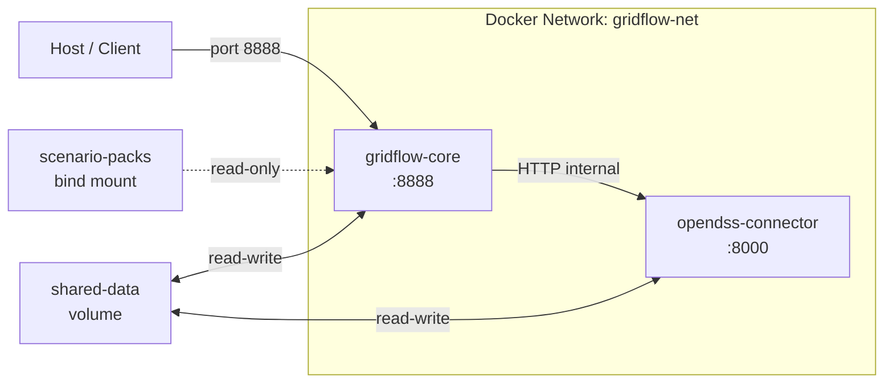
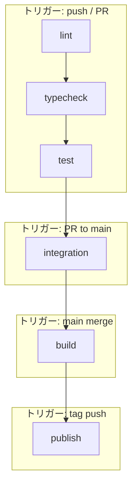
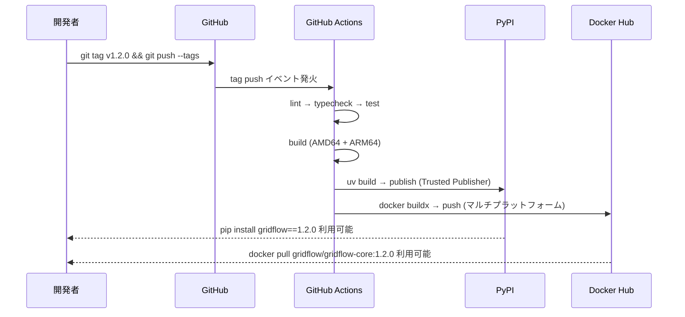
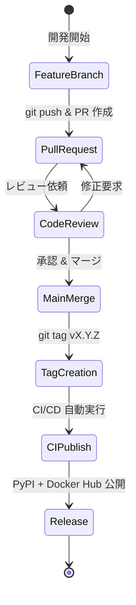

# 第11章 ビルド・デプロイ詳細設計

## 更新履歴
| 版数 | 日付 | 変更内容 |
|---|---|---|
| 0.1 | 2026-04-03 | 初版作成 |

---

## 11.1 Dockerfile 設計（REQ-C-001, REQ-C-002）

マルチステージビルドにより、ビルド時依存と実行時依存を分離し、最小限のイメージサイズとセキュリティを実現する。

### 11.1.1 gridflow-core

```dockerfile
# ==============================================================
# gridflow-core Dockerfile
# マルチステージビルド: builder → runtime
# ==============================================================

# ---- builder ステージ ----
FROM python:3.11-slim AS builder

WORKDIR /build

# uv をインストール（高速パッケージマネージャ）
COPY --from=ghcr.io/astral-sh/uv:latest /uv /usr/local/bin/uv

# 依存定義ファイルをコピーし、依存のみ先にインストール（キャッシュ活用）
COPY pyproject.toml uv.lock ./
RUN uv sync --frozen --no-dev --no-install-project

# アプリケーションソースをコピーしインストール
COPY . .
RUN uv sync --frozen --no-dev

# ---- runtime ステージ ----
FROM python:3.11-slim AS runtime

# セキュリティ: 非rootユーザー作成
RUN groupadd -g 1000 gridflow && \
    useradd -u 1000 -g gridflow -m -s /bin/bash gridflow

# 不要パッケージの削除・キャッシュクリア
RUN apt-get purge -y --auto-remove && \
    rm -rf /var/lib/apt/lists/* /tmp/* /root/.cache

WORKDIR /app

# builder から仮想環境とアプリケーションをコピー
COPY --from=builder /build/.venv /app/.venv
COPY --from=builder /build/src /app/src

# PATHに仮想環境を追加
ENV PATH="/app/.venv/bin:$PATH"

# 非rootユーザーで実行
USER gridflow

# ヘルスチェック用エンドポイント
HEALTHCHECK --interval=30s --timeout=5s --retries=3 \
    CMD python -c "import urllib.request; urllib.request.urlopen('http://localhost:8888/health')" || exit 1

EXPOSE 8888

ENTRYPOINT ["python", "-m", "gridflow.main"]
```

### 11.1.2 opendss-connector

```dockerfile
# ==============================================================
# opendss-connector Dockerfile
# マルチステージビルド: builder → runtime
# OpenDSSDirect.py を含む専用コネクタイメージ
# ==============================================================

# ---- builder ステージ ----
FROM python:3.11-slim AS builder

WORKDIR /build

# ビルドに必要なシステム依存をインストール
RUN apt-get update && \
    apt-get install -y --no-install-recommends build-essential && \
    rm -rf /var/lib/apt/lists/*

# uv をインストール
COPY --from=ghcr.io/astral-sh/uv:latest /uv /usr/local/bin/uv

# 依存定義ファイルをコピーし、依存のみ先にインストール（キャッシュ活用）
COPY pyproject.toml uv.lock ./
RUN uv sync --frozen --no-dev --no-install-project

# OpenDSSDirect.py のインストール
RUN uv pip install OpenDSSDirect.py

# アプリケーションソースをコピーしインストール
COPY . .
RUN uv sync --frozen --no-dev

# ---- runtime ステージ ----
FROM python:3.11-slim AS runtime

# OpenDSS実行に必要なランタイムライブラリのみインストール
RUN apt-get update && \
    apt-get install -y --no-install-recommends libgomp1 && \
    apt-get purge -y --auto-remove && \
    rm -rf /var/lib/apt/lists/* /tmp/* /root/.cache

# セキュリティ: 非rootユーザー作成
RUN groupadd -g 1000 gridflow && \
    useradd -u 1000 -g gridflow -m -s /bin/bash gridflow

WORKDIR /app

# builder から仮想環境とアプリケーションをコピー
COPY --from=builder /build/.venv /app/.venv
COPY --from=builder /build/src /app/src

# PATHに仮想環境を追加
ENV PATH="/app/.venv/bin:$PATH"

# 非rootユーザーで実行
USER gridflow

# ヘルスチェック用エンドポイント
HEALTHCHECK --interval=30s --timeout=5s --retries=3 \
    CMD python -c "import urllib.request; urllib.request.urlopen('http://localhost:8000/health')" || exit 1

ENTRYPOINT ["python", "-m", "gridflow.connectors.opendss"]
```

### 11.1.3 .dockerignore

```text
# .dockerignore
.git/
.github/
__pycache__/
*.pyc
*.pyo
.mypy_cache/
.ruff_cache/
.pytest_cache/
.venv/
dist/
build/
*.egg-info/
docs/
tests/
*.md
.env
.env.*
```

### 11.1.4 セキュリティ方針

| 項目 | 対策 |
|---|---|
| 実行ユーザー | 非root（gridflow:1000） |
| 不要パッケージ | builder ステージに閉じ込め、runtime にはコピーしない |
| キャッシュ | apt/pip キャッシュをビルド時に削除 |
| .dockerignore | .git, .env, テスト等をコンテキストから除外 |
| ベースイメージ | python:3.11-slim（最小限のDebian） |

---

## 11.2 Docker Compose 構成詳細（REQ-C-002）

```yaml
# ==============================================================
# docker-compose.yml
# gridflow 開発・ステージング用構成
# ==============================================================
version: "3.9"

services:
  # ---- gridflow-core: メインアプリケーション ----
  gridflow-core:
    build:
      context: .
      dockerfile: docker/gridflow-core/Dockerfile
    image: gridflow/gridflow-core:latest
    container_name: gridflow-core
    ports:
      - "8888:8888"                      # ホスト公開ポート
    networks:
      - gridflow-net
    volumes:
      - shared-data:/app/data            # コンテナ間共有データ
      - ./scenario-packs:/app/scenarios:ro  # シナリオパック（bind mount, 読取専用）
    environment:
      - GRIDFLOW_ENV=development
      - GRIDFLOW_LOG_LEVEL=INFO
    healthcheck:
      test: ["CMD", "python", "-c",
             "import urllib.request; urllib.request.urlopen('http://localhost:8888/health')"]
      interval: 30s
      timeout: 5s
      retries: 3
      start_period: 10s
    depends_on:
      opendss-connector:
        condition: service_healthy
    restart: unless-stopped

  # ---- opendss-connector: OpenDSS連携サービス ----
  opendss-connector:
    build:
      context: .
      dockerfile: docker/opendss-connector/Dockerfile
    image: gridflow/opendss-connector:latest
    container_name: opendss-connector
    # ポートは公開しない（内部ネットワークのみ）
    networks:
      - gridflow-net
    volumes:
      - shared-data:/app/data            # コンテナ間共有データ
    environment:
      - GRIDFLOW_ENV=development
      - GRIDFLOW_LOG_LEVEL=INFO
    healthcheck:
      test: ["CMD", "python", "-c",
             "import urllib.request; urllib.request.urlopen('http://localhost:8000/health')"]
      interval: 30s
      timeout: 5s
      retries: 3
      start_period: 15s
    restart: unless-stopped

# ---- ネットワーク定義 ----
networks:
  gridflow-net:
    driver: bridge                       # ブリッジネットワーク（サービス間通信）

# ---- ボリューム定義 ----
volumes:
  shared-data:                           # Docker管理ボリューム（コンテナ間データ共有）
    driver: local
  # scenario-packs は bind mount のためここには定義しない
```

### サービス間通信図



---

## 11.3 CI/CD パイプライン詳細（M-06）

### 11.3.1 パイプライン概要



### 11.3.2 GitHub Actions Workflow

```yaml
# ==============================================================
# .github/workflows/ci.yml
# gridflow CI/CD パイプライン
# ==============================================================
name: CI/CD

on:
  push:
    branches: ["**"]
    tags: ["v*"]
  pull_request:
    branches: [main]

# 同一ブランチでの重複実行をキャンセル
concurrency:
  group: ${{ github.workflow }}-${{ github.ref }}
  cancel-in-progress: true

jobs:
  # ================================================================
  # ステージ1: lint（ruff によるコード品質チェック）
  # トリガー: すべての push / PR
  # ================================================================
  lint:
    runs-on: ubuntu-latest
    steps:
      - uses: actions/checkout@v4

      - name: Install uv
        uses: astral-sh/setup-uv@v3

      - name: Set up Python
        run: uv python install 3.11

      - name: Install dependencies
        run: uv sync --frozen --dev

      - name: Ruff check（リンタ）
        run: uv run ruff check src/ tests/

      - name: Ruff format check（フォーマッタ）
        run: uv run ruff format --check src/ tests/

  # ================================================================
  # ステージ2: typecheck（mypy による型チェック）
  # トリガー: すべての push / PR
  # ================================================================
  typecheck:
    runs-on: ubuntu-latest
    needs: [lint]
    steps:
      - uses: actions/checkout@v4

      - name: Install uv
        uses: astral-sh/setup-uv@v3

      - name: Set up Python
        run: uv python install 3.11

      - name: Install dependencies
        run: uv sync --frozen --dev

      - name: mypy strict モード
        run: uv run mypy --strict src/

  # ================================================================
  # ステージ3: test（pytest によるユニットテスト + カバレッジ）
  # トリガー: すべての push / PR
  # ================================================================
  test:
    runs-on: ubuntu-latest
    needs: [typecheck]
    steps:
      - uses: actions/checkout@v4

      - name: Install uv
        uses: astral-sh/setup-uv@v3

      - name: Set up Python
        run: uv python install 3.11

      - name: Install dependencies
        run: uv sync --frozen --dev

      - name: Run tests with coverage
        run: uv run pytest --cov=src --cov-report=xml --cov-report=term-missing tests/

      - name: Upload coverage report
        uses: actions/upload-artifact@v4
        with:
          name: coverage-report
          path: coverage.xml

  # ================================================================
  # ステージ4: integration（Docker Compose による統合テスト）
  # トリガー: main ブランチへの PR のみ
  # ================================================================
  integration:
    runs-on: ubuntu-latest
    needs: [test]
    if: github.event_name == 'pull_request' && github.base_ref == 'main'
    steps:
      - uses: actions/checkout@v4

      - name: Start services
        run: docker compose -f docker-compose.test.yml up --build --abort-on-container-exit

      - name: Tear down
        if: always()
        run: docker compose -f docker-compose.test.yml down -v

  # ================================================================
  # ステージ5: build（マルチプラットフォーム Docker ビルド）
  # トリガー: main ブランチへのマージ
  # ================================================================
  build:
    runs-on: ubuntu-latest
    needs: [test]
    if: github.ref == 'refs/heads/main' && github.event_name == 'push'
    steps:
      - uses: actions/checkout@v4

      - name: Set up Docker Buildx
        uses: docker/setup-buildx-action@v3

      - name: Set up QEMU（ARM64 クロスビルド用）
        uses: docker/setup-qemu-action@v3

      - name: Build gridflow-core (AMD64 + ARM64)
        uses: docker/build-push-action@v5
        with:
          context: .
          file: docker/gridflow-core/Dockerfile
          platforms: linux/amd64,linux/arm64
          push: false
          tags: gridflow/gridflow-core:latest

      - name: Build opendss-connector (AMD64 + ARM64)
        uses: docker/build-push-action@v5
        with:
          context: .
          file: docker/opendss-connector/Dockerfile
          platforms: linux/amd64,linux/arm64
          push: false
          tags: gridflow/opendss-connector:latest

  # ================================================================
  # ステージ6: publish（PyPI + Docker Hub への公開）
  # トリガー: タグ付与時（v* パターン）のみ
  # ================================================================
  publish:
    runs-on: ubuntu-latest
    needs: [build]
    if: startsWith(github.ref, 'refs/tags/v')
    permissions:
      id-token: write               # PyPI Trusted Publisher 用
    steps:
      - uses: actions/checkout@v4

      - name: Install uv
        uses: astral-sh/setup-uv@v3

      - name: Set up Python
        run: uv python install 3.11

      # ---- PyPI 公開 ----
      - name: Build package
        run: uv build

      - name: Publish to PyPI
        uses: pypa/gh-action-pypi-publish@release/v1

      # ---- Docker Hub 公開 ----
      - name: Set up Docker Buildx
        uses: docker/setup-buildx-action@v3

      - name: Set up QEMU
        uses: docker/setup-qemu-action@v3

      - name: Login to Docker Hub
        uses: docker/login-action@v3
        with:
          username: ${{ secrets.DOCKERHUB_USERNAME }}
          password: ${{ secrets.DOCKERHUB_TOKEN }}

      - name: Extract version from tag
        id: version
        run: echo "VERSION=${GITHUB_REF_NAME#v}" >> "$GITHUB_OUTPUT"

      - name: Push gridflow-core
        uses: docker/build-push-action@v5
        with:
          context: .
          file: docker/gridflow-core/Dockerfile
          platforms: linux/amd64,linux/arm64
          push: true
          tags: |
            gridflow/gridflow-core:${{ steps.version.outputs.VERSION }}
            gridflow/gridflow-core:latest

      - name: Push opendss-connector
        uses: docker/build-push-action@v5
        with:
          context: .
          file: docker/opendss-connector/Dockerfile
          platforms: linux/amd64,linux/arm64
          push: true
          tags: |
            gridflow/opendss-connector:${{ steps.version.outputs.VERSION }}
            gridflow/opendss-connector:latest
```

### 11.3.3 トリガーマトリクス

| ステージ | push (feature) | PR to main | main merge | tag (v*) |
|---|:---:|:---:|:---:|:---:|
| 1. lint | o | o | o | o |
| 2. typecheck | o | o | o | o |
| 3. test | o | o | o | o |
| 4. integration | - | o | - | - |
| 5. build | - | - | o | o |
| 6. publish | - | - | - | o |

---

## 11.4 パッケージング・配布設計

### 11.4.1 pyproject.toml 構成

```toml
# ==============================================================
# pyproject.toml
# gridflow パッケージ定義
# ==============================================================

[project]
name = "gridflow"
version = "0.1.0"
description = "Grid simulation and power flow analysis framework"
readme = "README.md"
license = { text = "MIT" }
requires-python = ">=3.11"
authors = [
    { name = "gridflow team" },
]
dependencies = [
    "pydantic>=2.0,<3.0",
    "numpy>=1.26,<2.0",
    "httpx>=0.27,<1.0",
    "structlog>=24.0,<25.0",
    "typer>=0.12,<1.0",
]

[project.optional-dependencies]
dev = [
    "pytest>=8.0,<9.0",
    "pytest-cov>=5.0,<6.0",
    "pytest-asyncio>=0.23,<1.0",
    "mypy>=1.10,<2.0",
    "ruff>=0.4,<1.0",
]

[build-system]
requires = ["hatchling"]
build-backend = "hatchling.build"

[tool.hatch.build.targets.wheel]
packages = ["src/gridflow"]

# ---- Ruff 設定 ----
[tool.ruff]
target-version = "py311"
line-length = 120
src = ["src", "tests"]

[tool.ruff.lint]
select = [
    "E",    # pycodestyle errors
    "W",    # pycodestyle warnings
    "F",    # pyflakes
    "I",    # isort
    "UP",   # pyupgrade
    "B",    # flake8-bugbear
    "SIM",  # flake8-simplify
    "RUF",  # ruff-specific rules
]

[tool.ruff.lint.isort]
known-first-party = ["gridflow"]

# ---- mypy 設定 ----
[tool.mypy]
python_version = "3.11"
strict = true
warn_return_any = true
warn_unused_configs = true
disallow_untyped_defs = true

# ---- pytest 設定 ----
[tool.pytest.ini_options]
testpaths = ["tests"]
addopts = "-v --strict-markers --tb=short"
markers = [
    "slow: marks tests as slow (deselect with '-m \"not slow\"')",
    "integration: marks integration tests",
]
```

### 11.4.2 配布フロー



---

## 11.5 バージョニング戦略（M-07）

### 11.5.1 Semantic Versioning 2.0.0

gridflow は [SemVer 2.0.0](https://semver.org/) に準拠したバージョニングを採用する。

| バージョン要素 | 形式 | 変更条件 | 例 |
|---|---|---|---|
| PATCH | x.x.**X** | バグ修正、後方互換あり | 1.2.0 → 1.2.1 |
| MINOR | x.**X**.0 | 機能追加、後方互換あり | 1.2.1 → 1.3.0 |
| MAJOR | **X**.0.0 | 破壊的変更、移行ツール必須 | 1.3.0 → 2.0.0 |

### 11.5.2 バージョン管理ルール

- **Input**: 変更内容（バグ修正 / 機能追加 / 破壊的変更）
- **Process**:
  1. 変更種別に応じて PATCH / MINOR / MAJOR を判定
  2. MAJOR バージョンアップ時は移行ガイドおよび移行ツールを必ず提供する
  3. プレリリース版は `-alpha.N`, `-beta.N`, `-rc.N` のサフィックスを付与
- **Output**: 新バージョン番号（SemVer 2.0.0 準拠文字列）

### 11.5.3 リリースフロー



### 11.5.4 ブランチ戦略との対応

| ブランチ | バージョン | 用途 |
|---|---|---|
| `feature/*` | 未付与 | 機能開発 |
| `main` | 開発中（-dev） | 統合ブランチ |
| `vX.Y.Z` タグ | 確定版 | リリース |
| `hotfix/*` | PATCH 候補 | 緊急修正 |
