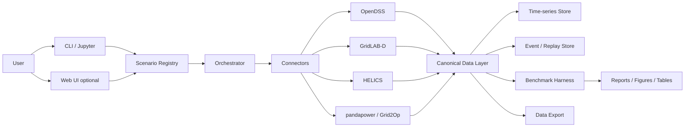

# gridflow 計画書

## 0. 目的

本計画の目的は、**電力系研究室における E2E 研究ループ** を回しやすくする **ソフトウェア** を設計・実装・普及・収益化することである。

対象ループは以下の通り。

1. 環境セットアップ
2. シミュレーション実行
3. 結果取得
4. 分析
5. 改善

主眼は、**研究室が毎回払っている実験運用コストを圧縮するワークフローエンジンを作ること**である。

---

## 1. 基本方針

### 1.1 プロダクト定義
作るべきものは次である。

**gridflow**
*Power System Workflow Engine*

以下を支援する **研究・実験基盤** である。

- シナリオ定義
- シミュレータ統合
- 実験再現性確保
- 評価指標の固定
- 実験比較
- 教育用演習化

### 1.2 なぜ今これをやるのか
電力系研究の現場では、理論より前に以下の運用コストが重い。

- co-simulation の接続と時間同期
- ツール間のデータ変換
- CLI中心の使いづらさ
- 実験条件の再現性崩壊
- 比較評価の不統一
- 結果整理の手作業

既存公開資料でも、HELICS はマルチドメイン co-simulation と時間同期の難しさを前提に設計され、GridLAB-D 系では CLI 中心の導入障壁が明示されている。OpenDSS は広く使われる一方、周辺運用基盤を別途必要とする構造であり、Grid2Op は逐次運用評価の環境を提供している。
したがって、差別化ポイントは solver ではなく **研究ワークフロー統合** である。

### 1.3 開発体制
- **1人開発 + Claude（AI コーディング支援）** を前提とする
- プロダクションコードで 1日約1万行のペースを想定
- テスト・CI・ドキュメントは別途積み上がる
- この体制を前提に、ロードマップと行数目安を設計している

---

## 2. 製品コンセプト

### 2.1 コア価値
gridflow の価値は一言でいうと次である。

> **研究テーマではなく、研究の回し方を高速化する**

研究室は本来、
- 新しい制御法
- DER / microgrid / BESS / data center load の研究
- 論文執筆
- 学生教育

に時間を使いたい。
しかし実際には、
- 環境構築
- 連携コード作成
- 入出力整形
- 実験再実行
- グラフ生成
- 表整理

に多くの時間が消える。
gridflow はそこを削る。

### 2.2 想定ユーザ
- マイクログリッド研究室
- 配電系統研究室
- DER / VPP 研究室
- 電力市場・運用研究室
- 修士・博士演習科目を持つ研究室

### 2.3 初期の主戦場
初期導入先は本番運用者ではなく以下。

1. 大学研究室（国内外）
2. 共同研究の再現実験基盤
3. BESS / DER / campus energy の PoC 環境

教育利用（授業演習・grading 等）は gridflow の直接の責務としない。研究者が自分の研究室の学生に使わせる形で自然に広がることを想定し、教員パートナーが教材化できる拡張性を確保するに留める。

---

## 3. 機能要件

### 3.1 P0: 最小必須機能
最初に必要なのは以下。

#### A. Scenario Pack
実験1件をコードではなく **パッケージ** として扱う。

含むもの:
- 対象ネットワーク
- 時系列データ
- シミュレータ設定
- 評価指標
- seed
- expected outputs
- 可視化テンプレ

狙い:
- 卒業と同時に実験が失われる問題を防ぐ
- 再現性を担保する
- 教材として再利用できる

#### B. Orchestrator
各シミュレータ・解析系を統合実行するランタイム。
**Docker ベース** で動作し、環境差異を排除する。

役割:
- 実行順序管理
- container 起動・管理
- 時間同期
- batch 実行
- result 収集
- error 収集

#### C. Canonical Data Layer
ツールごとの独自フォーマットを吸収する共通表現。

最低限必要な要素:
- topology
- asset
- timeseries
- event
- metric
- experiment metadata

データエクスポート（CSV / JSON / Parquet）を充実させ、下流の分析・論文化はユーザーが自由に行える設計とする。

#### D. Benchmark Harness
「動いた」ではなく「比較できる」にする採点機構。

例:
- 電圧逸脱率
- thermal overload 時間
- ENS
- dispatch cost
- CO2
- curtailment
- restoration time
- runtime

#### E. CLI + Notebook Bridge
- CLI で全操作が完結する
- notebook/script で深掘れる
- Web UI は補助的な可視化手段として提供（必須ではない）

CLI ファーストにすることで、自動化・CI 連携・再現性が担保しやすくなる。

#### F. 段階的カスタムレイヤー
研究者がスキルレベルに応じて gridflow を拡張し、論文の新規性に繋げられる構造にする。

| レベル | 対象 | やること | 論文での新規性 |
|---|---|---|---|
| L1: 設定変更 | 初心者・学部生 | YAML/JSON のパラメータ変更（負荷、DER 容量、期間等） | 新しいシナリオ定義 + 既存手法の比較分析 |
| L2: Plugin API | 修士・標準的な研究者 | 定義済みインターフェースに Python 関数/クラスを実装 | 新アルゴリズムの提案・比較評価 |
| L3: モジュール拡張 | 上級研究者 | 新しい connector やモジュールを追加 | 新シミュレータ統合手法、独自データソース |
| L4: ソース改変 | 開発者・共同研究者 | OSS フォークして自由に改変 | 基盤アーキテクチャ・データモデルの研究 |

設計原則:
- L1 だけでも論文が書ける（シナリオ比較論文）
- L2 で大半の研究をカバーする（アルゴリズム提案論文）
- L3-L4 はソースが公開されているので制約なくカスタム可能
- 上位レベルが下位レベルの仕組みを壊さない

gridflow が提供するもの（実験基盤・ベースライン・ベンチマーク）と、研究者が持ち込むもの（新手法・新シナリオ・新分析）の役割分担を明確にすることで、論文化を支援する。

---

### 3.2 P1: 実用性を高める機能
- record / replay
- experiment diff
- result lineage
- cache / resume
- profiling
- leaderboard
- team workspace
- grading support
- fault injection
- sensitivity sweep

---

### 3.3 P2: 高度化機能
- HIL 連携
- cyber/communication co-simulation
- IEC 61850 / DNP3 / IEC 104 fixtures
- standards-aware validation
- operator-style HMI

---

### 3.4 将来の拡張
LLM 連携（scenario 雛形生成、失敗原因要約、結果要約等）は将来的な拡張として検討し得るが、初期スコープには含めない。

---

## 4. 最初の研究テーマ

初期テーマは広げすぎない。
以下の3本が適切。

### Track 1: マイクログリッド運用
対象:
- PV
- BESS
- diesel / grid import
- load profile
- dispatch / MPC 比較

評価:
- cost
- ENS
- curtailment
- SoC violations
- CO2

### Track 2: DER hosting / distribution planning
対象:
- feeder
- DER penetration
- voltage / thermal violations
- hosting capacity

評価:
- voltage violation ratio
- overload duration
- hosting capacity
- losses

### Track 3: 逐次運用 / decision-making
対象:
- contingencies
- switching
- overload recovery
- operator policy comparison

評価:
- safe termination ratio
- score
- recovery time
- number of unsafe actions

この3本で、
- 計画
- 運用
- AI評価
を一製品で扱える。

---

## 5. 技術アーキテクチャ

### 5.1 動作環境

#### コンテナ内ランタイム
- **OS**: Ubuntu ベースの Linux コンテナ
- **Python**: 3.11+
- **アーキテクチャ**: AMD64 + ARM64 マルチアーチビルド（Apple Silicon 対応必須）

#### ホスト OS
Windows / macOS / Linux いずれも Docker Desktop 経由でサポート。
ホスト OS に直接依存する機能は持たない。

#### ツール別の環境戦略

| ツール | 戦略 | 理由 |
|---|---|---|
| OpenDSS | DSS-Extensions (DSS-Python) を使用 | 公式 COM は Windows 専用。DSS-Extensions はクロスプラットフォーム・ARM64 対応 |
| GridLAB-D | Docker コンテナ内で実行 | Apple Silicon ネイティブビルドが不安定。公式 Docker イメージあり |
| HELICS | pip install + Docker | 全 OS・全アーキテクチャで安定。公式 Docker イメージあり |
| pandapower | pip install | Pure Python。環境制約なし |
| Grid2Op | Docker コンテナ内で実行 | Windows ではマルチプロセスが動作しないため Linux コンテナが必須 |

#### 言語方針: Python 統一、MATLAB/Simulink/Octave 非依存

gridflow は **Python を唯一のアプリケーション言語** とする。MATLAB / Simulink / GNU Octave には依存しない。

| 従来 MATLAB が担っていた領域 | gridflow での代替 |
|---|---|
| 潮流計算・OPF (MATPOWER) | pandapower, PyPSA |
| 時系列シミュレーション | OpenDSS (dss-python), pandapower |
| 最適化 (fmincon 等) | cvxpy, scipy.optimize |
| 制御設計 | python-control |
| ブロックダイアグラム (Simulink) | 初期スコープ外。将来必要なら OpenModelica を検討 |

Octave は Simulink を代替できず、pandapower が MATPOWER の機能を Python ネイティブでカバーしているため、導入する利点がない。
共同研究先から `.m` スクリプトを受け取った場合は、コネクタレベルで Octave Docker コンテナを呼ぶ対応で十分であり、コア依存にはしない。

#### セットアップ
**Docker Compose** を標準とし、`docker compose up` で全スタックが起動する設計を目指す。
初回セットアップ目標: **30分以内**。

---

## 6. 責務分割

### Core Runtime
- orchestrator
- scheduler
- execution state
- cache
- retry
- experiment registry

### Simulator Connectors
- OpenDSS adapter
- GridLAB-D adapter
- HELICS adapter
- pandapower adapter
- Grid2Op adapter

### Data Model
- canonical schema
- import/export (CSV / JSON / Parquet)
- provenance
- versioning
- validation

### Evaluation
- benchmark engine
- metric library
- regression checker
- leaderboard backend

### UX
- CLI interface
- notebook bridge
- result comparison
- visualization
- web frontend（補助）

---

## 7. コード規模の目安

### 7.1 結論
**初期の適正規模は 6万〜10万行**（プロダクションコード）。
その後の事業拡張を見込む **中期目標は 12万〜18万行**。
さらに既存 OSS を吸収し、上位互換として成立させるなら **20万〜35万行級** を視野に入れる。

1人 + Claude 開発で1日約1万行のペースを前提とすると、Phase 0 は **数週間〜1か月** で到達可能。

### 7.2 行数目安テーブル

| フェーズ | 目標 | 想定行数 | 目安期間 |
|---|---|---:|---|
| Phase 0 | 技術検証版 | 2万〜4万 LOC | 2〜4週間 |
| Phase 1 | 研究導入可能な MVP | 6万〜10万 LOC | 1〜2か月 |
| Phase 2 | 複数研究室導入 | 10万〜15万 LOC | 3〜4か月 |
| Phase 3 | ワークフローエンジンとして定着 | 12万〜18万 LOC | 5〜6か月 |
| Phase 4 | 上位互換統合プラットフォーム | 20万〜35万 LOC | 8〜12か月 |

### 7.3 判断基準
以下のうち 3つ以上が成立したら、10万 LOC を超えて統合路線に進む価値がある。

- Connector が増えるたびに glue code が破綻する
- 既存 OSS の UX が授業導入の主要障壁である
- データモデル差異が繰り返しボトルネックになる
- ベンチマーク共通化のため独自抽象化が必要
- 研究室ごとに同じ変換層を毎回作っている

---

## 8. 既存 OSS を使いづらい場合の分岐

### 8.1 方針
既存 OSS が使いづらいなら、**単なるラッパー** で終わらず、
**すべての主要機能を取り込んだ上位互換ソフトウェア** を自作する道を最初から用意してよい。

ただし初手から全面再実装は避ける。
段階的に進む。

### 8.2 3つの選択肢

#### 選択肢A: Wrapper-first
既存 OSS をそのまま使い、上にワークフローエンジンを載せる。

長所:
- 速い
- 初期コストが低い
- OSS コミュニティと接続しやすい

短所:
- UX・データモデル・性能が既存側に引きずられる
- 導入体験が安定しない
- connector 地獄になりやすい

#### 選択肢B: Hybrid absorption
外部 solver は使うが、周辺機能は自社の標準層に吸収する。

自前化対象:
- canonical data model
- scenario pack
- benchmark
- orchestration
- CLI / notebook interface
- result store

これは最も現実的。

#### 選択肢C: Full superseding platform
主要 OSS の機能を段階的に取り込み、
**上位互換の統合プラットフォーム** を自作する。

狙う状態:
- 既存 OSS の主要ワークフローを全部実行できる
- しかも UX / 再現性 / benchmark で優る

これは重いが、標準化を狙うなら強い。

### 8.3 上位互換自作の対象候補

#### 取り込むべき機能層
1. **配電解析コア**
   - power flow
   - timeseries simulation
   - DER integration
   - hosting capacity

2. **co-simulation コア**
   - time management
   - scheduler
   - federation / orchestration
   - replay

3. **逐次運用評価**
   - gym-like API
   - action space
   - contingency engine
   - scoring

4. **研究運用基盤**
   - scenario registry
   - benchmark
   - dataset management

5. **教育基盤**（パートナー責務 — gridflow は拡張性のみ提供）
   - course pack
   - assignment
   - grading

#### 自作優先度
- 高: orchestrator, canonical model, benchmark, CLI
- 中: replay, scenario compiler, result store
- 低: 物理 solver 本体, 標準プロトコル完全実装, HIL kernel

### 8.4 上位互換路線に進む条件
次の条件が揃ったら、本格自作に踏み込む価値がある。

1. 既存 OSS の導入性が研究室への展開の障害になっている
2. 研究室ごとに同じ前処理・変換・採点コードを量産している
3. 既存 OSS を跨ぐことで結果の再現性が崩れる
4. 共通ベンチマークのための抽象化が既存 OSS では難しい
5. 外部依存の更新に振り回される

このとき、上位互換化は単なる技術趣味ではなく、**事業戦略** になる。

---

## 9. 普及戦略

### 9.1 基本方針
**まずユーザー数を最大化し、収益化はその後に考える。**
初心者にとっての使いやすさを最優先する。

### 9.2 OSS で普及する層
公開すべきもの:
- Scenario Pack format
- benchmark format
- canonical schema
- connector SDK
- 基本教材パック
- Docker ベースの reproducible setup

ここを閉じると教育導入が鈍る。

### 9.3 教材として入る（パートナー戦略）
gridflow 自体は教育教材を直接提供しない。ただし、教員パートナーが Scenario Pack を授業用に加工・共有できる拡張性を確保する。

教員パートナーが作成可能な教材例:
- 90分演習
- 3週ミニプロジェクト
- 修士向け比較実験セット
- course-ready notebook + grading

### 9.4 共同研究基盤として入る
営業文句は
「新しいツール使いませんか」
ではなく、

> **既存論文の再現パックを一緒に作りませんか**

で入る。

### 9.5 標準化
最終的には、研究手法を標準化するのではなく
**研究フローと評価方法** を標準化する。

---

## 10. ユーザー指標と収益化

### 10.1 ユーザビリティ KPI

#### 環境の使いやすさ

| KPI | 目標値 | 計測方法 |
|---|---|---|
| セットアップ完了時間 | < 30分 | CLI タイムスタンプログ |
| Time to First Simulation | < 1時間 | CLI ログ |
| 1実験あたりの CLI コマンド数 | < 5 | コマンド履歴 |
| セットアップ成功率 | > 90% | GitHub Issues + アンケート |
| 7日リテンション率 | > 50% | opt-in 匿名テレメトリ |

#### 論文の書きやすさ

| KPI | 目標値 | 計測方法 |
|---|---|---|
| ベースライン再現に必要な時間 | < 1時間 | ユーザーアンケート |
| アイデアから比較実験結果までの時間 | < 1日 | ユーザーアンケート |
| カスタムアルゴリズム統合（L2）に必要なコード行数 | < 100行 | サンプル計測 |
| データエクスポート → 論文図表の変換ステップ数 | < 3 | ユーザーアンケート |
| gridflow を引用した論文数 | 年間 10本（初期） | 引用追跡・自己申告 |

### 10.2 成長指標
gridflow の成長を以下の複合指標で測定する。

| 指標 | 重み | 理由 |
|---|---|---|
| 導入研究室数（国内外） | 高 | 継続利用・口コミの単位。1研究室 = 複数学生の導入 |
| Scenario Pack ダウンロード数 | 中 | プロダクトの実利用を直接反映 |
| 月間アクティブユーザー（個人） | 中 | 規模感の指標 |
| GitHub stars | 低 | 認知度の目安だが実利用と乖離しやすい |

#### マイルストーン

| マイルストーン | 導入研究室数 | MAU | 意味 |
|---|---:|---:|---|
| 初期牽引力 | 10 | 100 | 教材・口コミが回り始める |
| コミュニティ形成 | 50 | 500 | 外部 contributor が現れ、Scenario Pack の共有が活発化 |
| 収益化検討開始 | 100+ | 1,000+ | ユーザー基盤が十分に成長し、収益モデルを具体化できる段階 |

世界の電力系研究室は数千規模で存在するため、海外展開は初期から視野に入れる。
ドキュメント・CLI の英語対応を標準とする。

### 10.3 収益化方針
**初期は全機能無料。収益化はユーザー基盤が十分に成長してから考える。**

ニッチ市場（電力系研究室）のため、Marketplace のような仕組みは母数が小さく成立しにくい。
また学術コミュニティは無料共有の文化が強いため、初期から有料化すると普及を妨げる。

#### Phase 1（ユーザー獲得期）
全機能無料の OSS として提供。
- core engine
- 全 connector
- benchmark engine
- 教材・Scenario Pack

#### Phase 2（収益化検討）
導入研究室 100件・MAU 1,000 到達後、実際のニーズに基づいて判断。
候補（人手・メンテコストが低いものに限定）:
- GitHub Sponsors / 寄付
- 企業向けサポート契約
- Premium Scenario Pack（需要が見えた場合）
- Enterprise ライセンス（需要が見えた場合）

---

## 11. 18か月ロードマップ

### 0–3か月
- Scenario Pack v0
- OpenDSS connector
- batch runner
- benchmark runner
- CLI ツール
- notebook bridge
- Docker Compose 環境
- 教材 3本

目標:
- `docker compose up` で起動
- 初回セットアップ < 30分
- 同一実験3回再現

### 4–6か月
- HELICS connector
- canonical data layer
- experiment comparison UI
- データエクスポート（CSV / JSON / Parquet）

目標:
- 2 simulator 連成が安定
- scenario import/export 安定
- 導入研究室 5件

### 7–12か月
- Scenario Pack 共有基盤（GitHub ベース）
- research lab pilot（国内外）
- benchmark leaderboard
- 英語ドキュメント整備
- Scenario Pack のメタデータ拡張（教員パートナーが教材化できる基盤）

目標:
- 導入研究室 30件
- MAU 300
- scenario 再利用 50件

### 13–18か月
- connector 追加（pandapower / Grid2Op）
- 外部 contributor 育成
- 収益化モデルの検討・検証

目標:
- 導入研究室 100件
- MAU 1,000
- 収益化の方向性を決定

---

## 12. 最終判断

### 12.1 初期の正解
初期は **10万 LOC 以下のワークフローエンジン** として成立させるのが正しい。

理由:
- 研究フロー圧縮が主価値
- solver 再実装は初手では不要
- 速く検証できる
- 教育導入まで持っていきやすい

### 12.2 中期の勝ち筋
中期は **12万〜18万 LOC の統合基盤** として、
- benchmark
- scenario
- orchestration
を磨く。

### 12.3 全面統合路線
既存 OSS が本当に使いづらく、教育導入・研究再現性の障害になるなら、
**20万〜35万 LOC 級の上位互換統合プラットフォーム** を自作する分岐を切る。

この場合のビジョンは次。

> **solver を売るのではなく、
> 研究室が電力研究を回す標準ワークフローエンジンを売る**

---

## 13. 一言でまとめると

**電力系統の E2E ループを圧縮するワークフローエンジン** である。

- 初期は 6万〜10万 LOC
- 中期は 12万〜18万 LOC
- 上位互換統合路線なら 20万〜35万 LOC

そして分岐はこう。

- 既存 OSS が十分使えるなら **wrapper + orchestration**
- 既存 OSS が足を引っ張るなら **hybrid absorption**
- 既存 OSS の制約が事業障害なら **full superseding platform**

つまり、最初は軽く入り、
必要なら最後に **電力研究室の VS Code + Jupyter + Simulink + benchmark pipeline を一つに飲み込む**。
